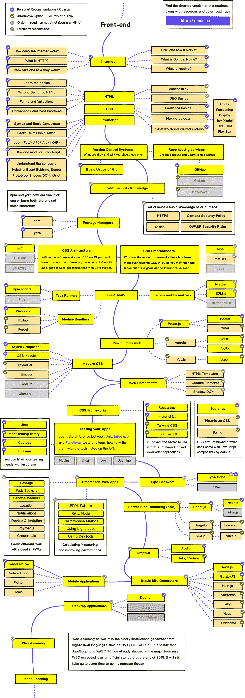
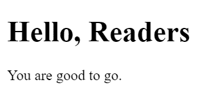
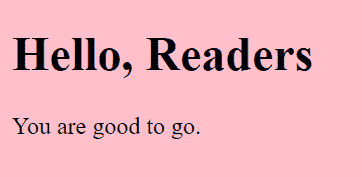
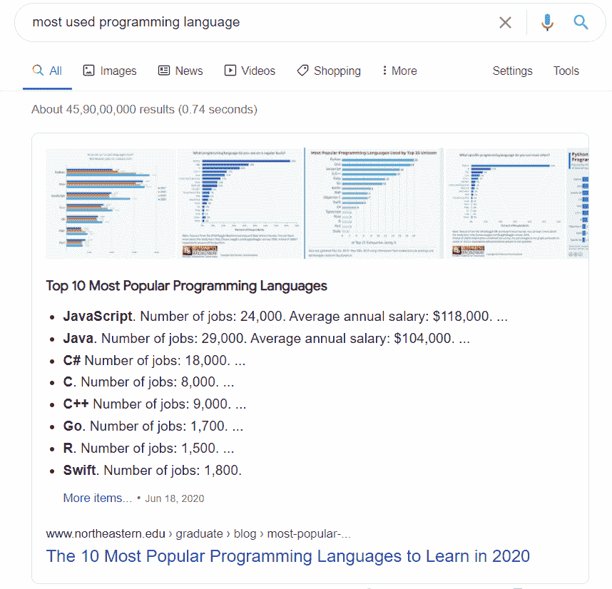
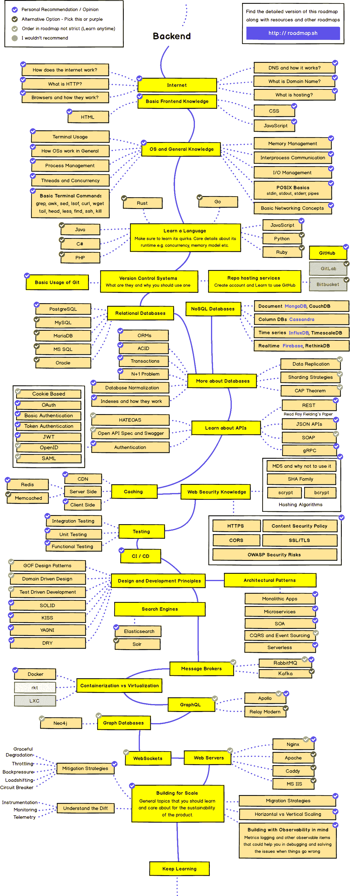
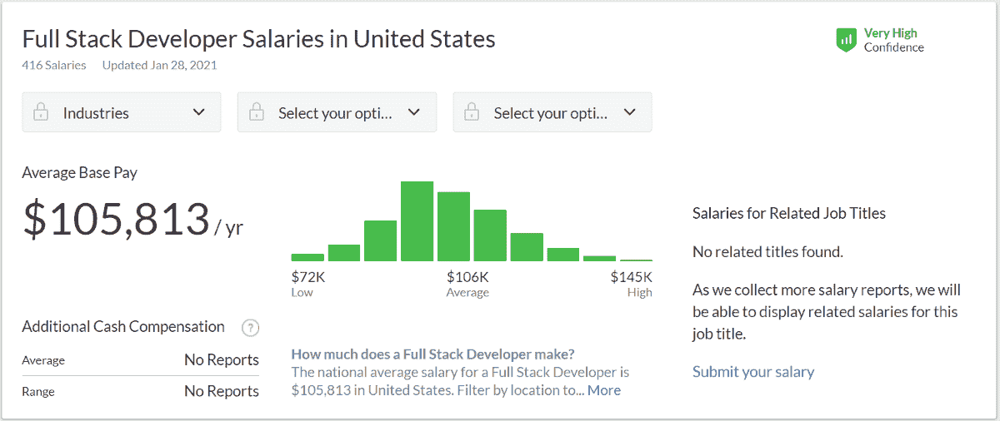

# 如何利用免费资源学习 Web 开发

> 原文：<https://www.freecodecamp.org/news/learn-web-development-for-free/>

在本文中，我将通过尽可能最短的路径来帮助您学习 Web 开发。为了从这个指南中获得最大的收获，我强烈建议你在 10 分钟内抛开一切杂念，集中注意力。

为了帮助任何人和每个人开始，我将为您提供一组优秀的免费资源来学习 Web 开发。

所以让我们开始吧。

## 我如何开始学习 Web 开发

我当时是工科一年级，学的是电子和电信工程。我对编码和所有那些技术类的东西一点也不感兴趣。

直到有一天。

一次偶然的机会，我的一个朋友向我推荐了一个关于 Web 开发的 Udemy 课程。在此之前，我甚至不知道 Web 开发，因为我没有技术背景，我也没有试图学习新的技能。

所以我不知道 HTML、CSS 和所有这些技术是关于什么的。我的朋友让我自费观看这个课程。

因为我喜欢这门课程，所以我最终每天看了两个小时。但那时我不像你们中的许多人那样在我的笔记本电脑上练习编码。

几天之内，我学会了 HTML 和 CSS 的基础知识。在那之后，我启动了我的笔记本电脑，试着根据课程中所教授的内容创建网站。

通过这种方式，我开始了解网络开发。

## 如何开始成为一名前端 Web 开发人员



Source: [GitHub](https://github.com/kamranahmedse/developer-roadmap)

在这里，您可以看到前端 Web 开发人员的大致路线图。如果您以前没有看过，请通读一下，了解一下整体路径。

有很多东西需要学习——但是在这篇文章中，我将帮助你创建一条学习 Web 开发的捷径。

在我们深入学习成为一名 web 开发人员所需的技能之前，您应该知道 web 开发不是一个单一的概念或主题。它有许多子字段。

你可以专注于前端开发，后端开发，图形设计等等。我们现在从前端开始。

对于前端开发，你需要学习 HTML、CSS、JavaScript，以及 React、Angular 或 Vue.js 这样的库或框架。

那么现在让我们更详细地谈谈什么是前端开发，你需要学习什么。

### 什么是前端开发？

> 应用程序的前端通常是指表示 UI(用户界面)的层。这可以包括任何东西，从 HTML 和 CSS 的静态站点到支持 UI 的完整的 [React](https://reactjs.org/) 应用。- [科尔比·法约克](https://www.freecodecamp.org/news/front-end-developer-vs-back-end-developer-definition-and-meaning-in-practice/)

对于前端 Web 开发来说，你需要了解一些基础知识。它们是:

1.  超文本标记语言
2.  半铸钢ˌ钢性铸铁(Cast Semi-Steel)
3.  Java Script 语言

HTML 和 CSS 用来创建静态网站。

### 什么是 HTML？

HTML 代表超文本标记语言。它用于向网站添加内容。你在特定网站上看到的信息仅仅是因为 HTML 才可见的。您可以在 Visual Studio、Sublime Text、Atom 等 IDE 中运行 HTML 代码。

HTML 由类似于`<h1>`(用于标题)和`<p>`(用于段落)的标签组成。

例如:

```
<!DOCTYPE html> 
<html>
<body>
  <h1>Hello, Readers</h1>
  <p>You are good to go.</p> 
</body>
</html>
```

这是 HTML 的一些基本语法。我们必须在 body 标签中编写代码来显示在网页上。这里我们显示一个 h1 标签和一个段落标签。

这段代码的输出如下所示:



### 什么是 CSS？

CSS 是级联样式表的缩写。你用它来创建一个网站的样式，使它看起来很有吸引力。

再次检查上面的 HTML 代码。它不显示背景色或阴影。这是因为我们还没有对它应用 CSS。

因此，CSS 增强了 HTML 并告诉元素如何在网页上显示。

CSS 主要由 3 种类型组成:

1.  内联 CSS。
2.  内部 CSS。
3.  外部 CSS。

为了帮助你更好地理解，我们将使用内联 CSS。内联 CSS 是一种可以在 HTML 标签中添加样式属性的 CSS。

例如，我们在 body 标签中添加了一个样式属性。我们只是把身体的背景色改成了粉色:

```
<!DOCTYPE html> 
<html>
<body style="background-color:pink;">
  <h1>Hello, Readers</h1>
  <p>You are good to go.</p>
</body>
</html>
```

这是输出结果:



是不是很酷？

### JavaScript 是什么？

那么动态网站呢？这一切都归功于 JavaScript。

甚至谷歌也提到 JavaScript 是目前最流行的编程语言。



Source: Google

JavaScript 是一种编程语言，主要用于客户端，以帮助网页更具交互性。

HTML 和 CSS 是赋予网页结构和风格的语言，而 JavaScript 为网页提供了吸引用户的交互式元素。

让我们用一个例子来解释它是如何工作的。

想想你的房子。用砖块和水泥建造你家的基础和框架都是 HTML 的一部分。粉刷和装饰你的房子是 CSS 的工作。集成技术——像物联网——是 JavaScript 的一部分。

就是这样。前端 Web 开发由 HTML、CSS 和 JavaScript 组成。

一旦你掌握了基础知识，你就可以将 React、Angular 或 Vue.js 等框架和库添加到你的技能组合中。

这些是你作为一名前端 Web 开发人员需要掌握的基本技能。

## 如何学习后端开发



Source: [GitHub](https://github.com/kamranahmedse/developer-roadmap)

现在我们来谈谈后端开发。

对于后端开发，您需要学习 Node.js、Express、MongoDB 和 Mongoose。

### 但是什么是后端开发呢？

> 后端开发也称为服务器端开发。它是数据库和浏览器之间通信的实践。

后端开发语言和工具包括:

1.  节点. js
2.  表达
3.  MongoDB(包括猫鼬)

如果你想成为一名后端开发人员，这三项技能非常重要。

### Node.js 是什么？

根据 [Node 的文档](https://nodejs.dev/learn)，Node.js 是一个开源的跨平台的 JavaScript 运行时环境。这是一个很受欢迎的工具，基本上可以用于任何类型的项目。

Node.js 在浏览器之外运行 V8 JavaScript 引擎，这是谷歌 Chrome 的核心。这有助于 Node.js 非常高效。

### 现在，什么是快递？

> Express 是一个最小且灵活的 Node.js web 应用程序框架，为 web 和移动应用程序提供了一组强大的功能。- [快递单据](https://expressjs.com/)

您可以将 Express 视为帮助 Node.js 应用程序的 NPM 包。

让我通过一些代码来解释它是如何工作的。下面的代码是 Express 的基本语法。

```
const express = require('express');
const app = express();
const port = 5000;

app.get('/', (req, res) => {
  res.send("Hello, World")
})

app.listen(port, () => {
  console.log("App is running on port 5000");
})
```

在这里，我们正在安装，然后需要快速。你只需将 app 初始化为`express()`，端口初始化为`5000`。

然后我们请求`'/'`路由响应 Hello，World。

当我们的应用程序运行时，我们记录它运行在端口 5000 上。

### 最后，什么是 MongoDB？

在继续之前，我必须解释一个至关重要的概念:数据库。

要创建网站，你需要一个数据库。我们知道网站需要数据库来存储信息。数据库帮助我们存储用户信息，根据用户请求显示信息，等等。

数据库有两种类型:SQL 和 NoSQL。

SQL 和 NoSQL 的区别是什么？

1.  SQL 是一个关系数据库，而 NoSQL 是一个非关系数据库。
2.  SQL 用表表示，而 NoSQL 用键值对或 JSON 格式表示。
3.  最流行的 SQL 数据库是 MySQL 和 PostgreSQL，而最流行的 NoSQL 数据库是 MongoDB。

现在来说说 MongoDB。据[mongodb.com](https://www.mongodb.com/)，

> MongoDB 是一个通用的、基于文档的分布式数据库，为现代应用程序开发人员和云时代而构建。

当您需要处理数据库时，MongoDB 是一个很好的 NoSQL 选项。

### 还得学猫鼬。

Mongoose 帮助您更轻松地使用 MongoDB。

> [mongose](https://mongoosejs.com/)提供了一个直接的、基于模式的解决方案来为您的应用程序数据建模。它包括内置的类型转换、验证、查询构建、业务逻辑挂钩等等。

这些是成为后端开发人员需要学习的基本技术。

一旦你学会了所有这些技能，你就可以称自己为全栈 Web 开发者了。

顺便说一下，你可能听说过有人提到某些技术栈，比如“MERN”或“卑鄙”。

好吧，如果你选择学习 React.js，你就是一个 MERN (MongoDB，Express，React，Node)栈 Web 开发者。

有了 Angular.js，你将成为一名 MEAN (MongoDB，Express，Angular，Node)栈 Web 开发者。

## 学习 Web 开发的免费资源


Photo by [Brooke Cagle](https://unsplash.com/@brookecagle?utm_source=ghost&utm_medium=referral&utm_campaign=api-credit) / [Unsplash](https://unsplash.com/?utm_source=ghost&utm_medium=referral&utm_campaign=api-credit)

如果你想学习编码，这是钻研的最好时机。

为了激励你，这里有一些事实:

1.  根据 Glassdoor 的数据，美国网络开发人员的平均工资为 68，524 美元/年。比我们在疫情的预期收入要多得多。
2.  那里有大量伟大而高质量的免费资源。是的，你可以免费学习所有与 Web 开发相关的内容。
3.  你可以一分钱不花就开始一个网络开发创业。我已经开始做类似的事情了。
4.  你可以在众多不同的科技相关领域赚钱。

这样的例子不胜枚举。

在我们进入这些资源之前，我想让你知道我专业地使用或曾经使用过所有这些语言、工具和资源。文章中没有附属链接，所以这里没有能帮我赚钱的资源。

我还花了大约 10 天时间来研究这些资源。我咨询了 50 多位顶级网站开发者，所以我可以向我的读者提供免费访问。

但是，请注意，其中一些资源在一定程度上是免费的。所以你可以看看这些，看看你是否想投资更多。

我知道你们中的许多人是初学者，不知道可以尝试的最佳资源。所以我会保持简单。

你可以查看所有这些网站，甚至可以将你最喜欢的网站加入书签，以便反复访问。好吧，让我们来看看。

## 自由代码营

我一生中访问过的最重要的网站是 [freeCodeCamp](https://www.freecodecamp.org/learn/) 。他们有完整的 3000 小时 web 开发课程，最近他们还增加了科学计算、数据分析和 Python 机器学习的证书。

除了课程之外， [freeCodeCamp 还有一个出版物](https://www.freecodecamp.org/news/)(你正在阅读这篇文章的地方)、一个 [YouTube 频道](https://www.youtube.com/channel/UC8butISFwT-Wl7EV0hUK0BQ)和一个[论坛](https://forum.freecodecamp.org/)，在那里你可以获得编程问题的帮助。

你也可以注册成为订阅者，昆西(freeCodeCamp 的创始人)会每周给你发邮件，告诉你 freeCodeCamp 出版物中一些最新的科技相关文章。

**想知道昆西为什么创办 freeCodeCamp？**

昆西·拉森在一次播客采访中总结如下:

> freeCodeCamp 是我为了纠正我学习编码时极其低效和迂回的方式所做的努力。我承诺我的职业生涯和我的余生将尽可能使这个过程高效和无痛。[……]所有那些让我觉得学习编码是一场噩梦的事情，都是我们试图用 freeCodeCamp 解决的。

## 犹达

是的，你仍然可以从 Udemy 获得[免费课程。只需搜索免费的网络开发课程，它就会筛选出你的选项。你会看到付费和免费的课程，但你可以选择免费的课程并享受。](https://www.udemy.com/)

如果你还记得的话，我的第一门编程课程来自 Udemy——我的朋友帮我报了名。所以它帮助我开始了我的人生。

## 参考文件

当我想了解或实现一个新概念时，我会访问谷歌。而且谷歌经常推荐 [MDN](https://developer.mozilla.org/en-US/) 或者一个工具或者语言的官方文档。

当我忘记一个特定主题的细节(比如 Flexbox)是如何工作的时候，这也很有帮助。

W3Schools 提供了许多主题的大量简短参考教程，包括 Java、Python、JavaScript、jQuery、React、Angular、AJAX、SQL、Node.js、Raspberry Pi、人工智能、机器学习、数据科学、NumPy、SciPy、Matplotlib 和 MongoDB。

我学工科的时候，要学 Java。我不想为此读一本 500 页的书。所以我跳到 w3schools 去学习语言。因为我知道 C，逻辑是相同的，只是有一些语法变化和新概念，如封装、继承、多态等等。

信不信由你，我大概两天就学会了 Java 基础。

## 学习 Web 开发的 YouTube 频道。

我个人使用这些渠道已经很多年了，并从中学到了很多。我也咨询了一些正在工作的网站开发者，帮助他们为你提供最好的资源。

### 1.自由代码营

freeCodeCamp 的 YouTube 频道是我在 Udemy 之后尝试学习 Web 开发的第一个频道。

他们发布各种主题的课程，从 Python 和数据科学到游戏开发、JavaScript、设计等等。

这是 YouTube 上最大的节目相关频道之一，他们每周发布几次新的完整视频课程。

### 2.聪明的程序员

技术专家 Rafeh Qazi 曾是一名自由职业者，后来他转向直接教授学生。

他与桑尼·桑加和其他几个人一起创办了他的 YouTube 频道，通过创建流行网站的克隆版来教授程序员。

我已经用这些教程创建了亚马逊、Instagram 等等的克隆版。

我的 YouTube 历史上有大量的 Web 开发和应用程序开发视频。而且 YouTube 也给我推荐了类似的话题。所以有一天，我得到了一个建议，尝试用 React.js 构建一个 Instagram 克隆，于是我去查看了一下。

### 3.旅行媒体

布拉德·特拉弗斯是特拉弗斯媒体公司的创始人。他是一名自由职业者，为公司工作，经营自己的生意。

除此之外，他还经营着一个 YouTube 频道，教授网络开发。

我跟踪他很久了。在他的职业生涯中，他一直非常努力地工作，让自己的健康受到损害。他做了什么-辞职？不，他邀请了其他 YouTubers 用户和他一起教他的学生。

多么伟大的激情。向布拉德·特拉弗斯致敬。

通过布拉德的渠道，我学习了 Chart.js，Pusher，Full Stack React，Django。

### 4.学院

当我还是初学者时，我想了解更多关于 MERN 堆栈的知识。所以我去了 Udemy 上了一门课。

当时我不知道学院和学院，但我从我上的课程中学到了。所以我去看了他的 YouTube 频道，真的很喜欢——所以我订阅了。

### 5.斯特凡·米舒克

我们都会在某个时候陷入困境。我们可能会开始思考，我怎样才能成为一名网络开发人员？我怎样才能加快我的学习？有没有适合我的工作，我该如何申请？

所有这些问题都在敲打我们的心灵之门，我们需要回答。为了帮助你解决这些问题，斯蒂芬·米舒克的《T1》是你的最佳选择。

他回答了程序员和开发人员在学习编码或获得新技能时可能会遇到的许多一般性问题。

### 6.伦敦 App 酿酒厂

安吉拉·于和她的团队运营着这个 YouTube 频道。事实上，我是她的头号粉丝。

为什么？因为[我的 Web 开发之旅](https://medium.com/code-blog/getting-started-and-earning-105-813-yr-as-a-web-developer-for-beginners-19b2cd26fcc2)的开始多亏了她。

除了 Web 开发，她还教授 Flutter、iOS 开发和许多其他主题。

### 7.网络忍者

当我学习 MERN 堆栈时，我发现 [React Native 非常简单](https://medium.com/javascript-in-plain-english/getting-started-with-react-native-for-beginners-958d39fee16a)。当我想开始了解它的时候，[网络忍者](https://www.youtube.com/channel/UCW5YeuERMmlnqo4oq8vwUpg)帮助了我。

这里有大量教程解释 Vue.js、Angular、React、React Native、Flutter、PHP、Firebase、CSS、JavaScript、GraphQL 以及更多主题。

## 面向 Web 开发人员的代码编辑器

作为一名 web 开发人员，你需要一个好的代码编辑器来帮助你的工作。让我们看看现在最受欢迎的几个编辑器。

### Visual Studio 代码

就我个人而言，我所有的项目都使用 [Visual Studio 代码](https://code.visualstudio.com/)(或者 VS 代码)。我真的很喜欢它的许多功能，如实时共享，内置终端，黑暗模式和大量的扩展。

诸如 Prettier、ES7 React/Redux/graph QL/React-Native snippets 和 Live Server 之类的扩展是我生活的一部分。

我也在为我的就业学习 Java。你们中的许多人可能听说过 NetBeans 等等，但是我用 VS 代码来说明。

在 Visual Studio 代码中，可以运行每一种编程语言，也可以运行 React Native 和 Flutter 这样的框架。‌

### 崇高的文本

[崇高的文字](https://www.sublimetext.com/)是另一个受欢迎的编辑器。到目前为止我还没有用过，但是我的很多朋友都用过。

对于初学者来说，在学习 Web 开发时，它有足够多的功能可以使用。

### 想要更多吗？

想要我推荐的资源的完整列表吗？

这里列出了 80 多种网络开发资源。

[80+ Free Resources for Web Designers and Web Developers in 2021.If you want to code, it is the best time to dig into it. There is no better time to start than right now. There are tons of reasons for this and If I explained it, it will be going to be more than…Nitin SharmaJavaScript in Plain English](https://js.plainenglish.io/80-free-resources-for-web-designers-and-web-developers-in-2021-f400be2875ea)

## 为什么你应该成为一个全栈 Web 开发人员？

我知道你们中的一些人在学习了 Web 开发和所有需要学习的不同技能后可能会有点不知所措。

知识无处不在，浩如烟海。

但是学习这些技能完全值得。让我们来谈谈作为一名 web 开发人员的一些好处。

### 成为网页开发者的好处

1.  补偿(挺好的)
2.  该行业短期内不会有任何发展
3.  这项工作很有趣
4.  你可以做自由职业者，也可以为公司工作
5.  你可以在家或任何地方工作

**所以...能赚多少？**



Source: Glassdoor

根据 Glassdoor 的数据，美国全栈网络开发人员的平均工资是 105，813 美元/年。

### app 开发呢？

想成为一名应用开发者？你可以一头扎进去。

假设你学习 React.js 成为了一名 MERN 栈的 Web 开发者。同样的概念也适用于应用程序开发。

例如，React Native，一个移动应用程序框架，使用与 React.js 相同的概念来创建移动应用程序。

要开始，你不需要学习任何其他语言或主要概念。关注 React.js，你将能够创建你的应用程序。

[Getting Started with React Native for BeginnersLearn everything about React Native-- An Introduction.Nitin SharmaJavaScript in Plain English](https://js.plainenglish.io/getting-started-with-react-native-for-beginners-958d39fee16a)

## 包扎

恭喜你完成了这篇长文。

这只是给 Web 开发者的一个简短的指南，帮助你在这个领域起步。你可以把这篇文章收藏起来以备将来使用，或者甚至与你的想开始 Web 开发职业生涯的朋友分享。

祝你好运:)

感谢阅读！

这篇文章是我在[媒体](https://medium.com/@nitinfab)上写的 3 个故事的组合。