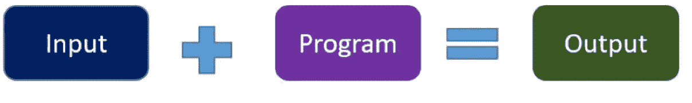
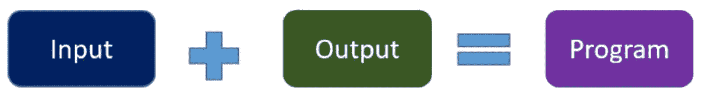

# 面向初学者的数据科学面试问题

> 原文：<https://www.freecodecamp.org/news/23-common-data-science-interview-questions-for-beginners/>

2012 年，《哈佛商业评论》将数据科学评为 21 世纪最性感的工作。但是如果你想得到一份数据科学家的工作，你需要经历一个艰难的面试过程。

在数据科学工作面试中，面试官可能会问不同数据科学主题的问题，如统计、编程、数据分析、数据预处理和建模。

你的技能将受到考验，如果你想顺利通过面试，你需要做好准备。

在本文中，我整理了一个常见数据科学面试问题的列表，并提供了一些如何回答这些问题的技巧。我还分享了一个资源列表，可以帮助你更多地了解每个面试问题中的特定主题。

# 数据科学面试问题

## 什么是逻辑回归？你最近是如何使用逻辑回归的？

逻辑回归是一种用于解决分类问题的流行算法。在这个问题中，你需要解释什么是逻辑回归，它是如何工作的，并给出一个你用逻辑回归解决的数据科学问题的例子。

**这里有一些资源可以帮助你开始构思你的回答:**

*   [逻辑回归:好的部分](https://www.freecodecamp.org/news/logistic-regression-the-good-parts-55efa68e11df/)
*   [最小二乘回归法——如何找到最佳拟合线](https://www.freecodecamp.org/news/the-least-squares-regression-method-explained/)

## 为什么我们需要评估指标？什么是混淆矩阵？

必须对机器学习模型进行评估，以检查其性能。在这个问题中，您需要解释如何使用混淆矩阵来评估模型的性能。您可以进一步提到其他度量来评估回归和分类模型。

**这里有一些资源可以帮助你开始构思你的回答:**

*   [用简单的英语解释 9 个关键的机器学习算法](https://www.freecodecamp.org/news/a-no-code-intro-to-the-9-most-important-machine-learning-algorithms-today/)
*   [我是如何用深度学习对医学图像进行 Fast.ai 分类的](https://www.freecodecamp.org/news/how-i-used-deep-learning-to-classify-medical-images-with-fast-ai-cc4cfd64173c/)

## 数据科学与传统的应用编程有何不同？

回答这个问题的一个好方法是用例子说明在这两种情况下程序是如何创建的。

传统编程方法:

数据科学方法:

**这里有一个很好的资源可以帮助你开始构思你的回答:**

*   [面向初学者的 6 小时免费数据科学课程](https://www.freecodecamp.org/news/data-science-course-for-beginners/)

## 解释监督学习和非监督学习的区别。

监督学习和非监督学习是两种类型的机器学习技术。回答这个问题的最佳方式是解释它们在每种技术中可以使用的数据集类型和算法示例方面的差异。

**这里有一个很好的资源可以帮助你开始构思你的回答:**

*   [何时使用不同的机器学习算法:简单指南](https://www.freecodecamp.org/news/when-to-use-different-machine-learning-algorithms-a-simple-guide-ba615b19fb3b/)
*   [想知道深度学习是如何工作的？这里有一个快速指南](https://www.freecodecamp.org/news/want-to-know-how-deep-learning-works-heres-a-quick-guide-for-everyone-1aedeca88076/)

## 什么是决策树？

决策树是另一种监督学习算法，可用于解决回归或分类问题。

你应该能够解释决策树算法如何从数据中学习，以及使用决策树算法的优点和缺点。

**这里有一些资源可以帮助你开始构思你的回答:**

*   [如何在机器学习中使用基于树的算法](https://www.freecodecamp.org/news/how-to-use-the-tree-based-algorithm-for-machine-learning/)
*   [用简单的英语解释 9 个关键的机器学习算法](https://www.freecodecamp.org/news/a-no-code-intro-to-the-9-most-important-machine-learning-algorithms-today/)

## 什么是交叉验证？

这个问题的目的是确定你是否知道任何用于评估机器学习模型有效性的技术——例如，当你想避免过度拟合时。

回答这个问题时，您应该解释您在任何数据科学项目中应用的任何交叉验证方法。

**这里有一些资源可以帮助你开始构思你的回答:**

*   [掌握机器学习中的交叉验证](https://www.freecodecamp.org/news/how-to-get-a-grip-on-cross-validations-bb0ba779e21c/)
*   [解释关键机器学习概念](https://www.freecodecamp.org/news/key-machine-learning-concepts-explained-dataset-splitting-and-random-forest/)

## 什么是正态分布？

这个术语通常在您解决数据科学问题时使用。在这个问题中，你可以解释正态分布的含义，它的性质，以及为什么检查你的数据是否正态分布很重要。

**这里有一些资源可以帮助你开始构思你的回答:**

*   [用简单的英语解释正态分布](https://www.freecodecamp.org/news/normal-distribution-explained/)
*   [正态分布解释清楚](https://www.youtube.com/watch?v=rzFX5NWojp0)

## 什么是随机森林算法？

随机森林是最流行的机器学习算法之一。在回答这个问题时，你应该解释算法如何从数据中学习，以及你应该在什么时候使用随机森林算法而不是其他机器学习算法。

**这里有一些资源可以帮助你开始构思你的回答:**

*   [随机森林分类器教程](https://www.freecodecamp.org/news/how-to-use-the-tree-based-algorithm-for-machine-learning/)
*   [数据集分割和随机森林算法](https://www.freecodecamp.org/news/key-machine-learning-concepts-explained-dataset-splitting-and-random-forest/)
*   [随机森林算法讲解](https://www.youtube.com/watch?v=eM4uJ6XGnSM)

## 解释单变量、双变量和多变量分析

这三种类型的分析用于汇总数据集中的变量，并帮助您获得一些见解。你也可以谈论它们的不同之处，以及什么时候可以应用它们——只要确保给出一些例子。

**这里有一些资源可以帮助你开始构思你的回答:**

*   [单变量、双变量和多变量分析](https://www.youtube.com/watch?v=JG8GRlMjp3c)
*   [如何为单变量模型选择性能最佳的线性回归](https://www.freecodecamp.org/news/learn-how-to-select-the-best-performing-linear-regression-for-univariate-models-e9d429c40581/)

## 我们如何处理丢失的数据？

一些数据集可能会丢失数据或值，并可能在训练机器学习模型时导致问题。

提到一些可以用来处理缺失数据的技术是很重要的。您还可以分享您在上一个数据科学项目中如何处理缺失数据的经验。

**这里有一些资源可以帮助你开始构思你的回答:**

*   [数据科学中缺失值的惩罚](https://www.freecodecamp.org/news/the-penalty-of-missing-values-in-data-science-91b756f95a32/)
*   [面向初学者的特征工程和特征选择](https://www.freecodecamp.org/news/feature-engineering-and-feature-selection-for-beginners/)
*   [处理缺失数据简单明了](https://www.youtube.com/watch?v=P_iMSYQnqac)

## 降维的好处是什么？

降维是一种减少数据集中特征或变量数量的技术。

在回答这个问题时，你可以解释降维的不同优势。您应该解释为什么以及何时需要应用这种技术。

**这里有一些资源可以帮助你开始构思你的回答:**

*   [如何使用降维](https://www.freecodecamp.org/news/an-illustrative-introduction-to-fishers-linear-discriminant-9484efee15ac/)
*   [逃离维度的诅咒](https://www.freecodecamp.org/news/the-curse-of-dimensionality-how-we-can-save-big-data-from-itself-d9fa0f872335/)
*   [降维的利弊](https://www.youtube.com/watch?v=1eYJKD0TQ8U)

## 我们如何处理异常值？

离群值是指明显偏离其余数据的数据点。在这个问题中，你可以解释如何识别异常值以及用于处理异常值的不同技术。

**这里有一些资源可以帮助你开始构思你的回答:**

*   什么是统计学中的异常值？
*   [处理离群值的三种方法](https://www.kdnuggets.com/2017/01/3-methods-deal-outliers.html)
*   [如何从数据集中移除异常值](https://www.youtube.com/watch?v=DDpym2j_ILY)

## 什么是集成学习？

在机器学习中，集成学习是一种使用多种算法来获得比单独使用任何一种算法都更好的预测性能的过程。

在回答这个问题的时候，你也可以分享一下你上次在一个数据科学项目中实现 ensemble 方法的经验。

**这里有一些资源可以帮助你开始构思你的回答:**

*   [集成学习简介](https://www.analyticsvidhya.com/blog/2015/08/introduction-ensemble-learning/)
*   [机器学习中的集成学习](https://www.youtube.com/watch?v=WtWxOhhZWX0)

## 解释机器学习与深度学习有何不同

解释机器学习和深度学习区别的最佳方式是它们解决问题的方式。

你可以进一步解释一些可以通过机器学习或深度学习技术解决的问题。

**这里有一些资源可以帮助你开始构思你的回答:**

*   [机器学习和深度学习初学者指南](https://www.freecodecamp.org/news/convolutional-neural-network-tutorial-for-beginners/)
*   [AI vs ML——人工智能和机器学习有什么区别？](https://www.freecodecamp.org/news/ai-vs-ml-whats-the-difference/)
*   [机器学习速成班](https://www.freecodecamp.org/news/learn-scikit-learn/)和[深度学习速成班](https://www.freecodecamp.org/news/deep-learning-crash-course-learn-the-key-concepts-and-terms/)

## 过拟合和欠拟合有什么区别？

解释过度拟合和欠拟合之间区别的最佳方式不仅仅是定义，而是通过例子。

您还可以分享您在数据科学项目中面临过度拟合或欠拟合问题时的个人经验。

**这里有一些资源可以帮助你开始构思你的回答:**

*   [如何处理深度学习模型中的过拟合](https://www.freecodecamp.org/news/handling-overfitting-in-deep-learning-models/)
*   [如何建立更好的机器学习模型](https://www.freecodecamp.org/news/how-to-build-better-machine-learning-models/)
*   [深度学习与 PyTorch 课程](https://www.freecodecamp.org/news/free-deep-learning-with-pytorch-live-course/)

## 什么是正规化？为什么有用？

在回答这个问题时，你还可以进一步解释两种常见的正则化技术 L1 范数和 L2 范数。

**这里有一些资源可以帮助你开始构思你的回答:**

*   [如何建立你的第一个神经网络](https://www.freecodecamp.org/news/how-to-build-your-first-neural-network-to-predict-house-prices-with-keras-f8db83049159/)
*   [深度学习速成班](https://www.freecodecamp.org/news/deep-learning-crash-course-learn-the-key-concepts-and-terms/)

## 什么是选择偏差？

仅仅定义选择偏差是不够的。如果可能的话，你应该解释不同类型的偏见，它们的影响，以及如何避免它们。

**这里有一些资源可以帮助你开始构思你的回答:**

*   什么是选择偏差？
*   选择偏见——别忘了我！

## 你能解释一下验证集和测试集的区别吗？

在这个问题中，在解释了它们的区别之后，你可以解释在数据科学项目中拥有验证集和测试集的优势。

**这里有一些资源可以帮助你开始构思你的回答:**

*   [解释关键机器学习概念](https://www.freecodecamp.org/news/key-machine-learning-concepts-explained-dataset-splitting-and-random-forest/)
*   [测试集和验证集之间的差异](https://machinelearningmastery.com/difference-test-validation-datasets/)
*   [当你的训练和测试数据来自不同的分布时该怎么办](https://www.freecodecamp.org/news/what-to-do-when-your-training-and-testing-data-come-from-different-distributions-d89674c6ecd8/)
*   [机器学习–验证与测试](https://www.youtube.com/watch?v=pGlQLMPI46g)

## 回归和分类 ML 技术有什么区别？

我们都知道回归和分类是监督学习，唯一的区别是它们的输出。回答这个问题的时候可以提几个可以用来解决回归问题或者分类问题的算法。还有，试着分享一下他们的模型是如何被评价的。

**这里有一些资源可以帮助你开始构思你的回答:**

*   [如何建立和训练线性和逻辑回归 ML 模型](https://www.freecodecamp.org/news/how-to-build-and-train-linear-and-logistic-regression-ml-models-in-python/)
*   [机器学习中的回归 vs 分类](https://www.javatpoint.com/regression-vs-classification-in-machine-learning)
*   [面向开发者的机器学习基础知识](https://www.freecodecamp.org/news/machine-learning-basics-for-developers/)
*   [机器学习中的分类和回归](https://www.youtube.com/watch?v=TJveOYsK6MY)

## 什么是人工神经网络？

在这个问题中，不要仅仅定义人工神经网络，还要解释它们的优点以及在哪里可以使用它们。

**这里有一些资源可以帮助你开始构思你的回答:**

*   [人工神经网络及其应用概述](https://hackernoon.com/overview-of-artificial-neural-networks-and-its-applications-2525c1addff7)
*   [用通俗易懂的英语解释深度学习神经网络](https://www.freecodecamp.org/news/deep-learning-neural-networks-explained-in-plain-english/)

## 作为数据科学家，您计划使用什么工具和设备？

这个问题很简单，但是你应该提到你以前使用过的工具或者你计划在未来的项目中使用的工具。

您还可以分享各种工具如何帮助您成功实施数据科学项目的经验。

请记住，您将为不同的项目使用不同的工具。例如，一些工具可用于 NLP 项目，而其他工具可用于时序项目。

**这里有一些资源可以帮助你开始构思你的回答:**

*   [每个数据科学家都需要知道的 13 种工具](https://sdacademy.dev/13-tools-every-data-scientist-needs-to-know/)

## 什么是自然语言处理？陈述一些自然语言处理的真实例子。

你必须用简单的方式定义自然语言处理，以及如何用它来解决商业问题。然后分享一些现实生活中的例子。如果可能的话，你也可以分享一些你做过的 NLP 项目，或者与他人合作。

**这里有一些资源可以帮助你开始构思你的回答:**

*   [什么是自然语言处理？初学者教程](https://www.freecodecamp.org/news/what-is-natural-language-processing-an-nlp-definition-and-tutorial-for-beginners/)
*   [用 Python 和 TensorFlow 学习自然语言处理](https://www.freecodecamp.org/news/learn-natural-language-processing-no-experience-required/)
*   [每个开发人员需要了解的 NLP 知识](https://www.freecodecamp.org/news/natural-language-processing-basics-for-developers/)
*   [自然语言处理应用](https://intellipaat.com/blog/applications-of-nlp/)

## 什么是正常化？规范化和标准化的区别？

规范化和标准化是在应用机器学习算法之前用于预处理数据的技术。

这个问题的目的是解释这两种技术之间的区别，以及在什么样的数据集条件下应该应用这两种技术。

**这里有一些资源可以帮助你开始构思你的回答:**

*   [规范化和标准化的区别](https://www.analyticsvidhya.com/blog/2020/04/feature-scaling-machine-learning-normalization-standardization/)
*   [用于自然语言处理和机器学习的文本预处理](https://www.freecodecamp.org/news/all-you-need-to-know-about-text-preprocessing-for-nlp-and-machine-learning-bc1c5765ff67/)
*   [面向初学者的特征工程和特征选择](https://www.freecodecamp.org/news/feature-engineering-and-feature-selection-for-beginners/)
*   [标准化与规范化——功能扩展](https://www.youtube.com/watch?v=mnKm3YP56PY)
*   [深度学习的预处理](https://www.freecodecamp.org/news/https-medium-com-hadrienj-preprocessing-for-deep-learning-9e2b9c75165c/)

## 关于数据科学面试问题的最后思考

复习这些常见的数据科学面试问题，实际上会在面试中提升你的自信。

不要指望面试官会问你本文提到的所有问题。但是大部分的面试问题都会来自同一个话题。

例如，面试官可以让你“**解释一些监督学习算法以及它们如何从数据中学习**，而不是问“**解释监督学习和非监督学习**的区别”。

如果你有兴趣学习和阅读更多的数据科学面试问题，慢慢来，通读[这些](https://www.springboard.com/blog/data-science/data-science-interview-questions/) [附加](https://huyenchip.com/ml-interviews-book/) [资源](https://hackernoon.com/160-data-science-interview-questions-415s3y2a)寻找灵感。

不要忘记练习你的编码技能，因为面试中的一些问题需要你编码解决方案。

我希望这些数据科学面试问题能帮助你准备面试，并祝你在数据科学职业生涯中好运。

如果你学到了新的东西或者喜欢阅读这篇文章，请分享给其他人看。在那之前，下期帖子再见！

你也可以在 Twitter 上找到我 [@Davis_McDavid](https://twitter.com/Davis_McDavid) 。

而且你可以在这里阅读更多类似这样的文章[。](https://hackernoon.com/u/davisdavid)