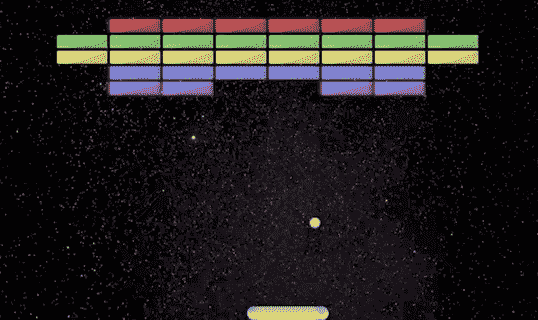

# TypeScript 游戏开发课程-构建您自己的 Arkanoid 游戏

> 原文：<https://www.freecodecamp.org/news/build-an-arkenoid-game-in-typescript-tutorial/>

Arkanoid(类似于 Breakout)是一款经典的电子游戏。有什么比开发一个有趣的游戏更好的方法来提高你的打字技能呢？

This is the game you will build.

我们在 freeCodeCamp.org YouTube 频道上发布了一门课程，将教你如何使用 TypeScript 构建一个基于浏览器的 Arkanoid 游戏。

托马斯·魏本法克开发了这个课程。托马斯是一名经验丰富的程序员和教师。

你将学会在没有任何框架的情况下构建游戏。游戏是使用类型、类、模块和 Typescript 中的现代代码实现的。

此外，您还将学习如何使用包裹捆扎机。代码捆绑器将合并和简化你的代码，使其加载更快。Parcel 使得用 JavaScript 和 TypeScript 开发更加容易。

在[freeCodeCamp.org YouTube 频道](https://www.youtube.com/watch?v=7bejSTim38A)观看完整的课程(95 分钟观看)。