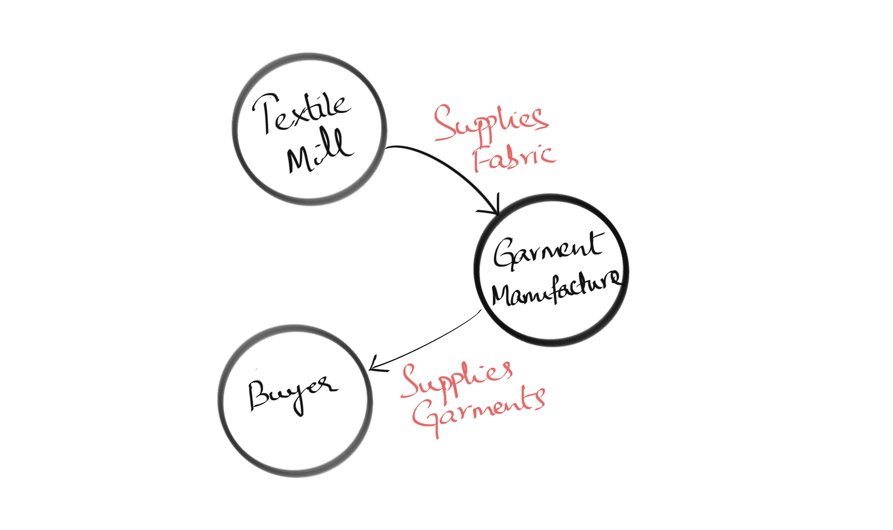
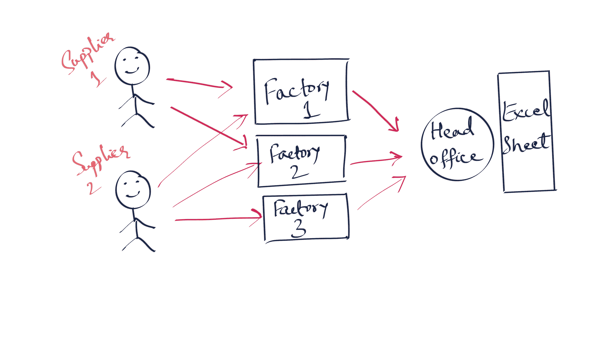
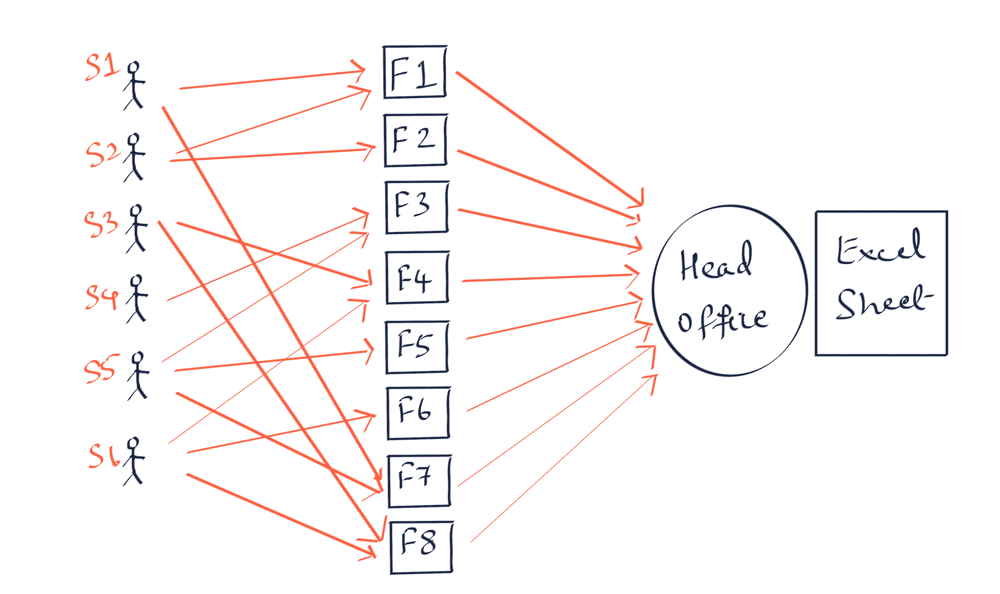
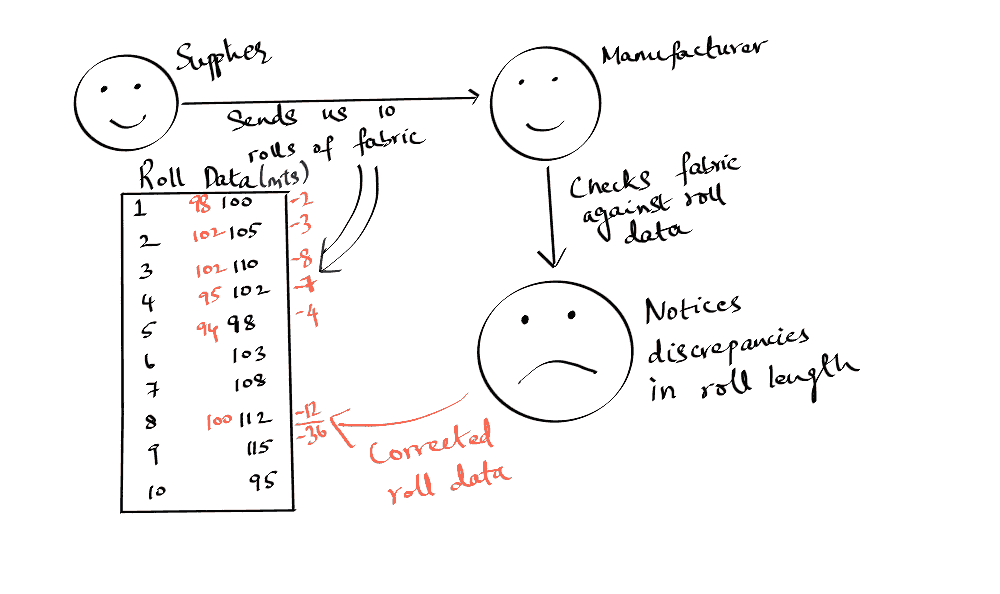
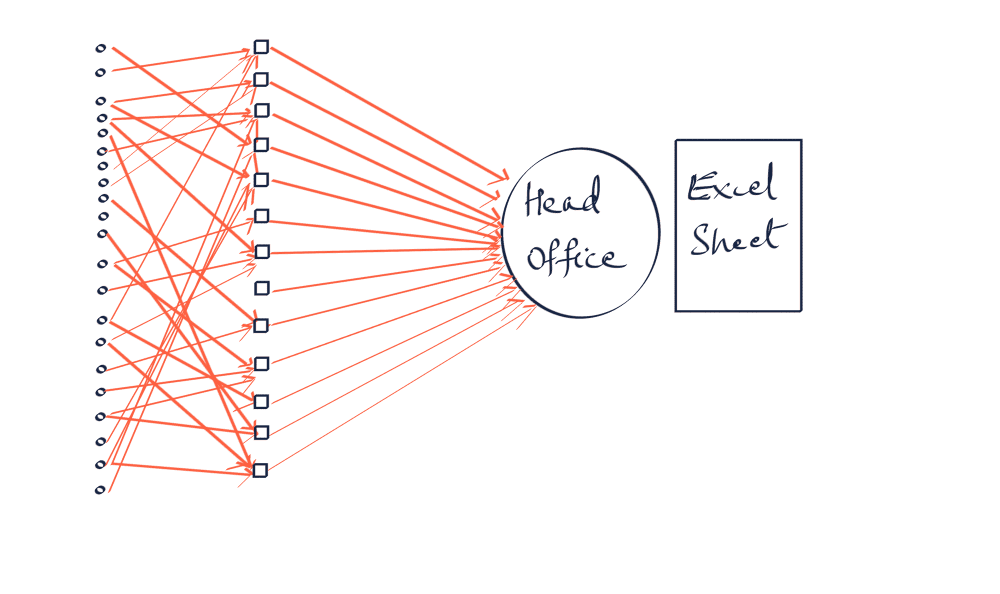
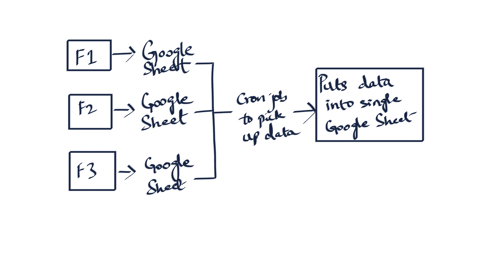
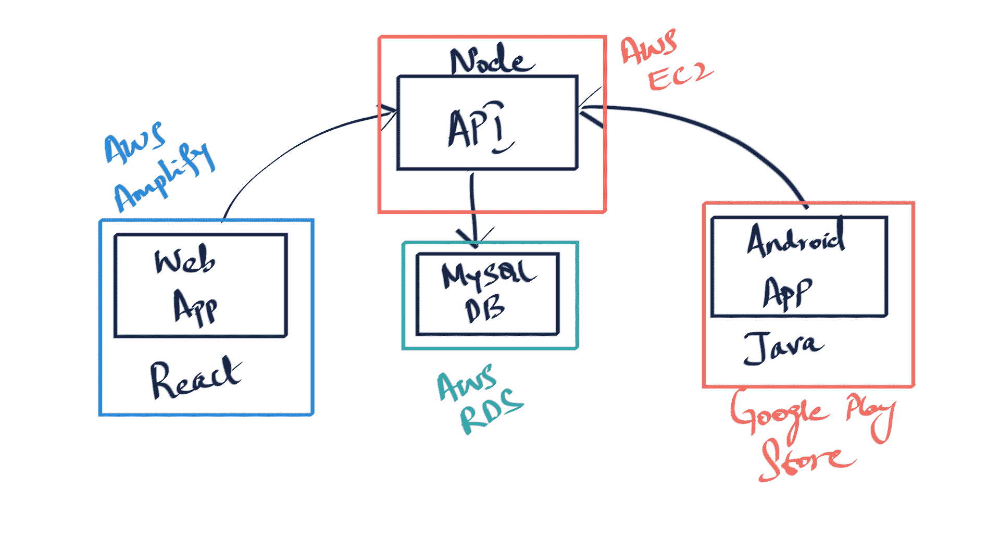

# 我从构建产品中学到了什么——沟通和解决问题的经验

> 原文：<https://www.freecodecamp.org/news/building-products-lessons-in-communication-and-problem-solving/>

我花了一年时间学习如何构建产品。相反，我花了一年的时间来学习制造好的产品有多难。

到目前为止，这是一次过山车之旅，我想分享我的经验。

我将强调我一路走来学到的最重要的教训。

## 从这篇文章中可以期待什么

在我开始之前，我想说明这篇博文并不像你在 freeCodeCamp 上读到的大多数东西那样技术性。

虽然探索这项技术是有价值的，但我相信对程序员来说，着眼于业务方面也是有益的。这部分是因为这不是大多数程序员关注的事情。

随着编程变得越来越流行和商品化，对于程序员来说，确切地了解他们如何为公司增加价值将变得更有价值。

在构建技术解决方案时，回答问题解决的**为什么**是最关键的业务方面。

## 一点背景和上下文

我在一家总部位于印度班加罗尔的服装制造公司工作。不，你没看错。我在印度班加罗尔的一家服装制造公司做技术工作。

这不是最有魅力的工作，但它确实提供了很多尝试的机会。

服装业是印度最无组织的行业之一。对于在技术领域工作的人来说，很难理解它是多么的无组织。

当技术人员想到一个问题时，他们会想到筛选大量数据，以收集可能转化为更有效功能的见解。

但是，当数据仍然用铅笔写在纸上时，你会怎么做呢？你是怎么得到这些信息的？

有时候，感觉就像是世界其他地方猛冲向前，让某些行业远远落在后面。人们常常感觉发明之轮又回来了。

## 公司的运作方式

在我提出问题之前，我需要解释一下服装制造单位是如何工作的。

这里有一个非常简单的服装制造供应链的概述

很简单，对吧？真的是！就像其他行业一样，细节决定成败。

让我们再深入一点。为了简洁起见，让我们只考察纺织厂和服装制造商之间的关系。

它始于买方向服装制造商下订单。买家会告诉服装制造商，他们需要一种特定的面料来制作服装。这叫面料风格。

现在，当我们提到面料的风格时，它可以指许多不同的东西。以下是构成面料风格的几个变量。

现在，为了简单起见，让我们只关注织物的颜色。

然后，服装制造商将向纺织厂订购面料。一旦纺织厂准备好运送织物，复杂性就开始了。

问题在于规模。当你有超过 30 家布料供应商，遍布全国各地时，跟踪你何时收到布料是很困难的。

## 我们如何定义这个问题

以下是关键问题:

*   跟踪您收到面料的时间
*   记录你收到了多少布料
*   记录你从哪个供应商那里收到了布料
*   记录你收到布料的地点
*   面料是否通过质量检验
*   面料是否通过买方指定的实验室测试

我们的问题将只集中在以下三点:

*   我们何时从供应商处收到一批布料？
*   我们在一批货中收到了多少布料？
*   我们在哪收到了布料？

最明显的解决方案是 Excel 表格。

> 第一课:在大型组织中，Excel 就像一个分布式数据库。

Excel 在一段时间内运行良好，但很快就变得难以维护。

为什么？让我们假设一家服装制造公司来回答这个问题。

### 第一相

好的，我们刚刚开始，我们有 2 个供应商，3 个工厂和一个总部。这是一个很好的开始！

假设我们有 1 个买家。只有一个买家意味着我们要处理的不同风格的面料数量很少。

当每个工厂收到布料时，他们通过电子邮件让总部知道他们收到的布料数量和样式。然后总部将这些数据输入 Excel 表格。

每个工厂每天收到一次布料，这意味着总部每天会收到 3 封邮件。不算太差！

即使供应商延迟发货，也相对容易跟踪，因为只有 2 个供应商。

### 第二阶段

事情进展顺利，业务增长，你决定扩张。你又建了 5 家工厂。

你还增加了与你合作的买家数量，这反过来增加了面料的款式。

你也想增加你的营业额，所以其中的 3 家工厂每天收到两次布料:一次在早上，一次在晚上。

事情变得更真实了。

你会注意到每个供应商的脸现在看不见了。这不是巧合。是的，我这样做是为了节省空间，但我这样做也是为了说明随着规模的增加，你与商业伙伴的个人关系如何退居二线。

与 2 家供应商、6 家供应商和 8 家工厂保持同样的个人关系是不可能的！

你可能想知道为什么上述观点是相关的。那是因为它引出了下一课。

> 第二课:商业关系几乎完全建立在信任的基础上，尤其是在没有技术的情况下。

让我们稍微检查一下上面的课程。这很重要，因为大多数技术系统的目标是消除对信任的需求。当然，那也不完全可能。

> 在继续之前，我需要提一件简单的事情。当供应商向生产单位提供织物时，他们通常以一卷织物的形式提供。

让我们设想一个场景，你是一个服装制造商。你有一个供应商为你提供织物卷。

有一次，你收到了 10 卷布料，根据匿名举报，你决定根据供应商告诉你的长度来测量每卷布料的长度。

上面的信息图向你展示了那将会是什么样子。

令你沮丧的是，你发现供应商在欺骗你，你少了 36 米的布料。在像服装制造业这样的低利润行业，这很重要。

此外，这只适用于 10 卷织物。随着公司的发展，你会从供应商那里订购更多的布料。想象一下，你有 100 卷布料要处理，而不是 10 卷。

手动检查每一卷织物不是一项可以扩展的操作，随着您的操作扩展，信任变得更加重要。

现在，回到我们的缩放问题。我们总共有 6 家供应商、8 家工厂和更多买家，因此面料款式也更多。

5 家工厂一天收一次布，3 家工厂一天收两次布，总公司一天收`5*1 + 3*2 = 11 emails`。

事情变得更加困难，不仅因为总部收到了更多的电子邮件，还因为他们收到的面料款式也增加了。这增加了 Excel 表中的行数。

现在，当供应商延迟发货时，事情变得更难跟踪，因为工厂每天从 6 个不同的供应商那里收到 11 批货物。

但是，即使是现在，Excel 也不是一个坏的选择。然而，面料部门在努力跟上工作量方面压力很大，所以总部做了任何好组织都会做的事情，增加了几名员工。

增加两名员工是个坏主意吗？所有回答都是固执己见。

一位技术专家会说:“你为什么要增加两名员工呢？您需要通过添加自动化来简化流程！”

首席执行官会回答:“为什么？自动化的成本不值得。增加两名员工并保持我们的流程不变会更简单。”

> 第三课:不是所有事情都值得自动化。这是我最难接受的一课。

> [相关 XKCD](https://xkcd.com/1205/)

### 第三阶段

时间流逝，生意继续繁荣。作为一个资本主义倾向的首席执行官，你想再次扩大业务规模！

这一次，您将工厂数量增加到 14 个。你也增加了更多的买家，所以这增加了工厂需要处理的面料款式的数量。6 家工厂每天收到两次面料，其余 8 家工厂每天收到一次面料。

你现在还与 20 家供应商合作，因为你需要各种不同风格的面料。

我没有在上面的图片中提到任何供应商或工厂的名字，因为这太费事了。

但是，再一次，这是为了说明你和每个工厂经理的私人关系恶化了。你不可能把每一种关系都维持到同样的程度。

现在，总公司每天都会收到`8*1 + 6*2 = 20`封邮件！每封电子邮件也包含更多的数据，因为我们增加了我们正在处理的风格的数量。

手动维护中央 Excel 表变得越来越困难。简单地增加更多的员工也不一定有帮助，因为你可能最终会在总部得到一个集中的 Excel 表的多个副本。

## 如何解决问题

现在，有多种方法可以解决这个问题。

一种方法是要求每个工厂维护自己的每日 Excel 表，并通过电子邮件将其作为附件发送给总部。

然而，这又需要有人将每个工厂的数据复制并粘贴到一个集中的 Excel 表中。这没什么不对，但可能有更有效的解决方案。

另一个潜在的解决方案是，我们可以要求每个单位维护一个单独的谷歌表单，每天使用[谷歌应用程序脚本](https://developers.google.com/apps-script)运行一个脚本，就像 [cron 作业](https://en.wikipedia.org/wiki/Cron)一样，并获取数据。

然而，如果你想要更多的数据，比如每卷的长度，你就没那么幸运了。你不可能要求在工厂工作的人每天手工输入每卷布料的长度。因为，就像我们之前说的，你可能一天收到 150 卷布料。

### 我们的解决方案

在我的公司，我们最终采用的解决方案并不令人惊讶:我们决定使用条形码。

我们在每卷织物上贴上条形码。条形码与一卷的长度、布料的风格以及买家相关。

我们构建了一个小的 Android 应用程序，允许用户使用设备摄像头扫描条形码，每次扫描都会点击一个 API，指示这个特定的条形码是在特定的位置扫描的(通过 GPS 获取)。

扫描一卷布料可以让我们通过 GPS 定位到它的位置，以及日期和时间。

将在一个地点扫描的所有织物卷加起来，我们就可以知道工厂收到的织物的总长度。

最重要的是，这减少了工厂自身的工作量。他们现在唯一的工作是扫描织物卷。扫描一卷织物需要大约 3 秒，因此扫描 100 卷织物需要大约 5 分钟。

这是我们建造的基本示意图:

*   用于生成条形码的基于网络的应用程序
*   用于扫描条形码的 Android 应用程序
*   web 应用程序和 Android 应用程序都与之通信的 API。API 反过来与 MySQL 数据库进行通信。

整个过程都在 AWS 上进行，Android 应用程序在谷歌 Play 商店上运行。

解决方案似乎很简单，但事实并非如此。

### 我们从解决问题中学到了什么

> 第四课:为人们建造东西是困难的，因为在建造东西的人和为之建造东西的人之间经常存在脱节。

这种脱节就是为什么构建一个产品来满足你长久以来希望存在的需求是一个好主意。

我们在 Android 应用上犯的第一个错误就是给用户太多的选择

上面的草图显示了我们应用程序的早期版本。点击这些按钮会将你带到摄像头屏幕。然而，它们每个都进行了不同的 API 调用，因此返回了不同的结果。

包含输入按钮的基本原理是，如果条形码被划伤，无法被手机摄像头拾取，用户可以输入条形码，这将被视为扫描。

下面是我们的一个条形码号码的样子:`k29_%!s5qG`。任何人都不可能坐下来输入那个字符序列。

Read 按钮的基本原理是，如果有人想要识别某卷特定织物的种类，他们可以在 Read 模式下扫描条形码，条形码将返回关于该卷条形码的信息。

不过，这些工厂已经有了自己存储胶卷信息的方法。他们只是用铅笔和纸把它写下来，然后贴在一个标签上，标签贴在纸卷上。

它是技术最先进的系统吗？见鬼不！但是，这有用吗？太好了。我们应该尊重这样一个事实，即他们已经有了自己做同样手术的方式。

最终的结果是，几乎没有人会去点击阅读或输入按钮。

当建造东西的时候，保持东西最少。除非绝对需要，否则没有理由添加额外的功能。

我们犯的第二个错误是不了解我们的观众。

当我们想出建立一个 web 应用程序供人们用来生成条形码的想法时，这似乎是显而易见的。

不过，我们遇到了一个有趣的问题。

当我们向在工厂工作的人解释他们需要在地址栏中输入地址时，我们得到的回应是一脸茫然。

你看，我们大多数人都来自特权背景，我们往往会忘记有很大一部分人不知道如何与网络浏览器互动。为什么？他们从来没有这个必要。他们主要通过智能手机应用程序与互联网互动。

这似乎有点牵强，但我亲眼看到了证据。这并不是说不知道如何使用浏览器的人无论如何都不聪明。这仅仅意味着我们需要用不同的方式与他们交流。

现在，这个交流的话题把我带到了我学到的最后一课。可能是最来之不易的教训，也绝对是最有见地的。

> 第五课:组织中的所有问题都是沟通问题。

回顾一下我们在这篇文章中所涉及的内容。

我们发现的第一个问题是电子邮件问题。当组织规模较小时，交换的电子邮件会较少。随着组织规模的扩大，电子邮件的数量会增加，跟踪变得更加困难。沟通问题。

我们发现的第二个问题是供应商和制造商之间的信任问题。供应商向制造商传达了错误/虚假的信息。制造商不得不花费宝贵的时间来纠正这些错误信息。沟通问题。

我们发现的第三个问题是如何向从未使用过网络浏览器的人解释如何导航到特定的页面。沟通问题。

我知道这听起来有点像鸽子洞，我试图把每个问题都变成沟通问题，但大多数问题的核心就是:沟通不畅。

## 结论

我忽略了我们构建的解决方案的更多技术方面。然而，我认为这不是有趣的部分。有趣的是我们如何试图解决问题。

如果你认为我正在研究的问题很有趣，看看我们的[工作列表](https://www.id-flo.com/careers)。

如果你在列表中找不到适合你的角色，请发邮件到[zaid@indian-designs.com](mailto:zaid@indian-designs.com)给我。