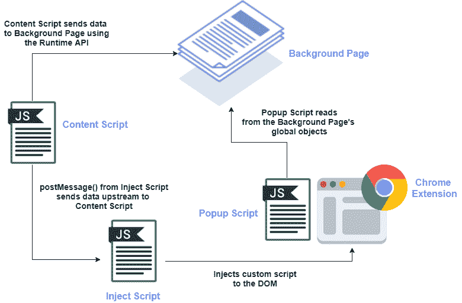
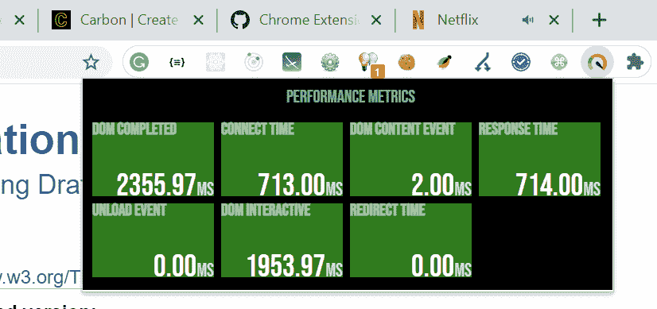
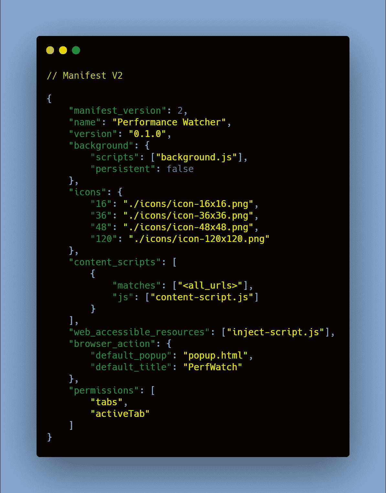
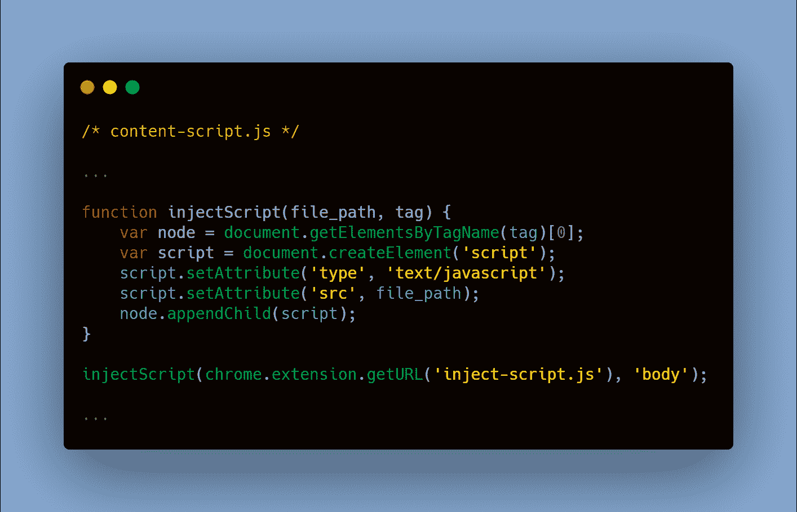
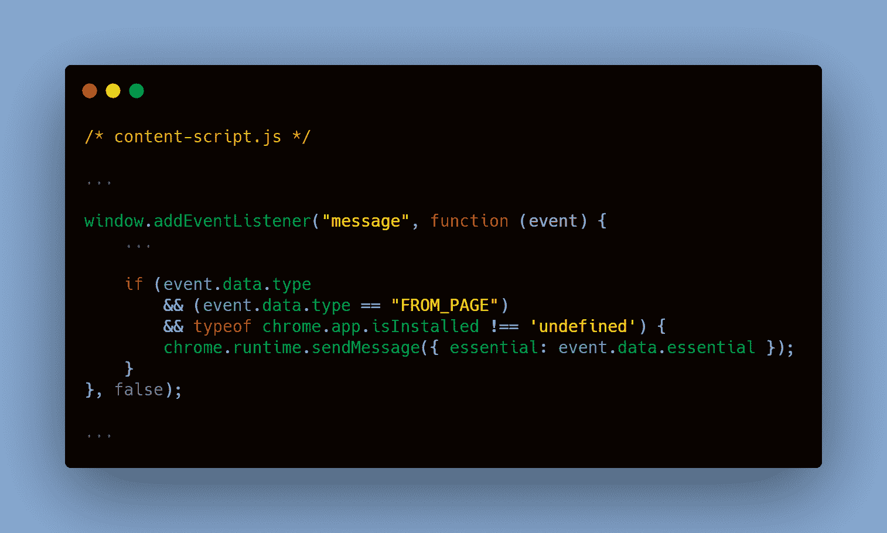
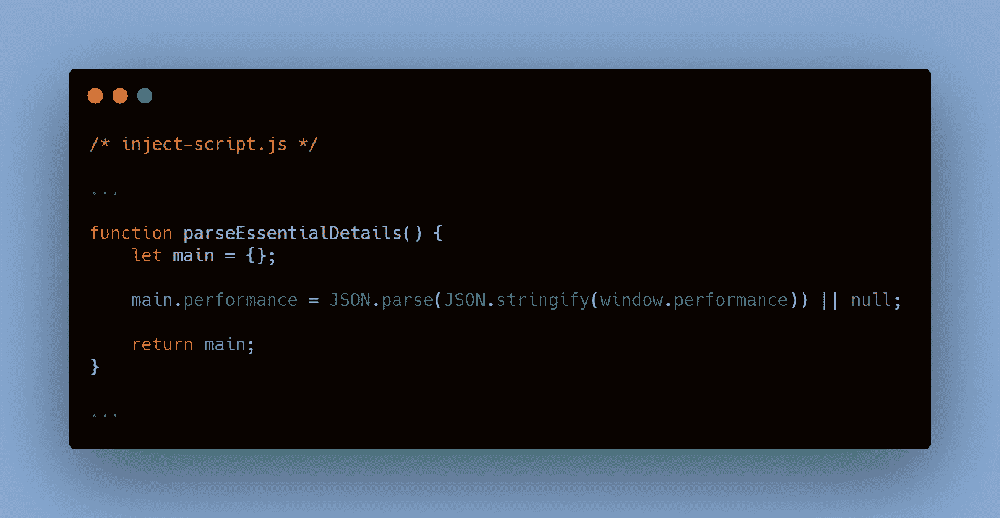
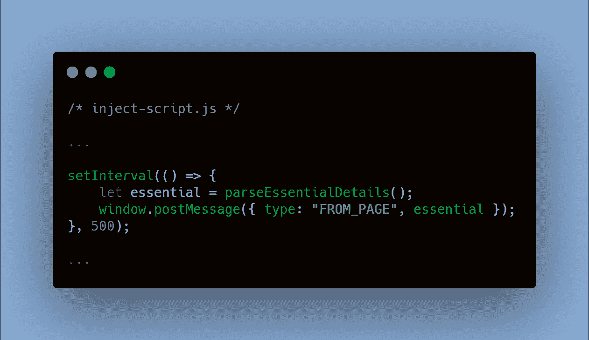
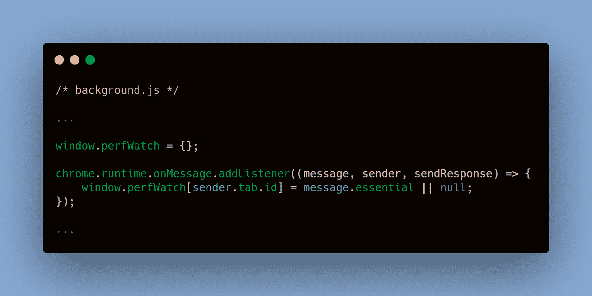
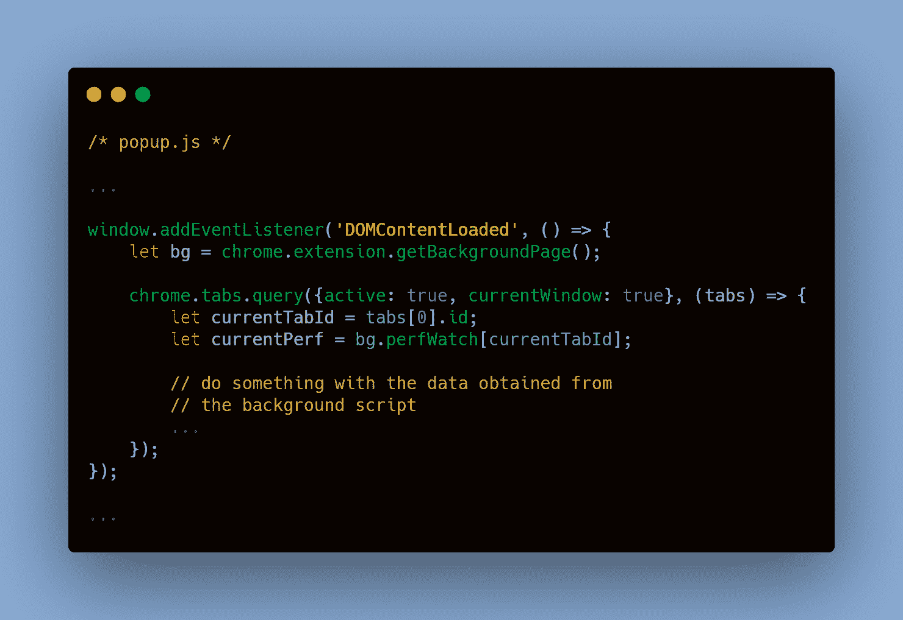

# Chrome 扩展教程:如何从页面上下文传递消息

> 原文：<https://www.freecodecamp.org/news/chrome-extension-message-passing-essentials/>

在 web 开发领域，Chrome 扩展是一套非常方便的工具。

无论是使用它们向简单的请求添加头，还是从 DOM 中抓取重要的数据，扩展都有助于提供额外的功能，使生活变得更加轻松。

我开始尝试为我在工作中想到的用例开发一个 Chrome 扩展。就在那时，我偶然发现了我们将某些数据从网页传递到扩展的方式。缺乏简化的指南促使我写了这篇文章。

我们确实有 Chrome API 文档，它确实非常全面。但是我认为自己更像是一个视觉学习者，能够可视化我们如何在扩展脚本之间传递消息有助于简化整个开发。

> **注意:**本文使用了清单 V2，而不是 V3。两者之间的主要区别是在 V3 中使用服务工作者，而不是后台页面和相关动作。

## 消息传递:脚本之间的交互

顾名思义，扩展就像你试图访问的现有网页上的一个层。浏览器充当容器。

它主要由以下脚本组成:

*   **弹出脚本** -扩展 DOM 的本地 JavaScript 文件
*   **后台脚本** -提供持久性并处理后台事件
*   **内容脚本** -在网页环境中独立运行的脚本
*   **注入脚本** -以编程方式注入到网页中的脚本

通常，如果您只需要处理 DOM 内容，那么开发扩展的方式相对简单。

内容脚本已经可以使用原始 HTML，您需要做的就是将它传递给弹出脚本。

但是，如果您需要访问页面的变量和函数，这个过程就有点棘手了。

页面上下文中可用的变量和函数，比如说在`window`对象中，对于内容脚本是不可访问的，因为它们倾向于在特殊的 JavaScript 环境中运行。他们只能访问页面的 DOM，而不能访问变量和函数。

为了访问页面的变量和函数，我们通过将脚本附加到 DOM 来注入脚本。这使得浏览器假设它运行在网页的上下文中。这反过来提供了注入脚本对局部变量和函数的访问。

由于 Chrome 扩展的架构是事件驱动的，一旦注入的脚本可以访问页面的变量和函数，它们就可以将其传递给内容脚本。

然后，内容脚本将这些对象传递给后台页面。

最后，弹出脚本能够使用扩展 API 调用后台页面，并将其传递给扩展 DOM。

Message Passing Overview

现在，我们将构建一个简单的性能观察器扩展，它从页面的全局窗口对象中读取性能数据，并将基本指标映射给用户。让我们进入代码。

## 说够了，给我看看代码

您可以在这里找到项目[的完整代码库。让我们快速浏览一下主要文件和它们提供的重要功能。](https://github.com/tejazz/article-snippets/tree/master/chrome-extn-message-passing)

### 清单文件

每个 Chrome 扩展都需要一个`manifest`文件。它基本上是一个 JSON 格式的文件，提供了一组元数据，以便浏览器能够识别需要授予的权限以及扩展可能达到的操作范围。

这是我们的应用程序使用的清单。

manifest.json: metadata for your extension

我们需要关注的一些重要属性如下:

*   `background` -获取将在后台页面运行的脚本数组。
*   `content-scripts` -包括我们希望作为网页上下文的一部分运行的一系列内容脚本。
*   `web_accessible_resources` -预期在网页的上下文中使用的打包资源的数组。例如，我们打算嵌入到页面中的图像或我们想要注入的自定义脚本。
*   `permissions` -允许你的扩展访问某些 Chrome APIs，比如这里的[标签](https://developer.chrome.com/docs/extensions/reference/tabs/#type-Tab)。

### 内容脚本

内容脚本可以轻松访问网页的 DOM。我们利用内容脚本将我们的定制脚本–`inject-script.js`–添加到 DOM 中。

content-script.js: inject custom script into the DOM

内容脚本还同时继续监听从自定义脚本向上游发送的任何消息。

一旦我们从注入的脚本中得到消息，我们就对收到的数据进行快速检查，并验证我们的扩展是否已安装。一旦完成，我们只需使用 Chrome 的[运行时 API](https://developer.chrome.com/docs/extensions/reference/runtime/) 将接收到的数据发送到后台页面。

content-script.js: send the required data to the background page

### 注入的脚本

自定义脚本可以访问全局变量和函数，如`window`对象。我们只映射我们需要的属性。

inject-script.js: procure required object from the page's JS context

使用`[window.postMessage](https://developer.mozilla.org/en-US/docs/Web/API/Window/postMessage)`函数将来自自定义脚本的消息安全地传递给内容脚本。在这种情况下，使用一个`setInterval`函数来动态更新我们正在观察的属性。

inject-script.js: send the gathered data to the content-script

### 背景脚本

后台脚本使用运行时 API 监听内容脚本传输的任何消息。背景页面的`window`对象随后被更新，用`tab.id`作为标识符。

background.js: listen for incoming message from the content-script

### 弹出脚本

弹出脚本是我们最终从自定义脚本中读取数据的地方。它也是我们编写任何必要的 JavaScript 操作的地方。

使用扩展 API 的`getBackgroundPage`方法检索背景页面。使用 Tabs API 的`tabs.query`方法查询活动选项卡的 id，以便正确提取相关数据。

popup.js: reading the global object stored in the background page context

通过这种方式，我们最终能够在我们的扩展中有效地接收和映射我们需要的数据。

存储库中提供了 UI 样式和其他修饰代码，以供进一步参考。

## 最后的想法

在开发 Chrome 扩展时，消息传递是一个基本概念。这只是脚本间通信的多种方式之一。

我花了几个小时来弄清楚它如何适用于我的用例。希望这个简单的演练和可视化表示能为您节省一些时间。

我建议稍微摆弄一下代码。如果您有任何问题，请随时通过`[LinkedIn](https://www.linkedin.com/in/tarique-ejaz/)`联系我。

同时，继续编码。