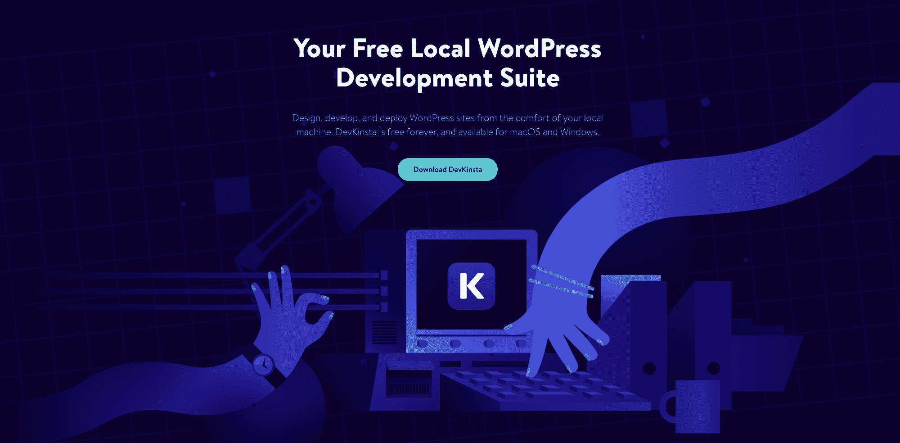
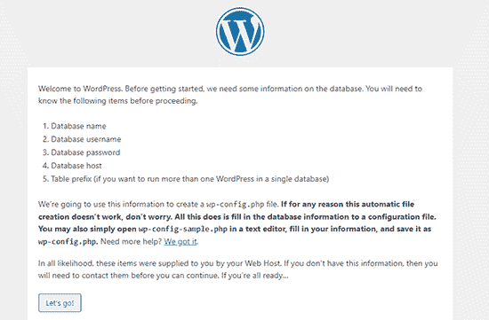
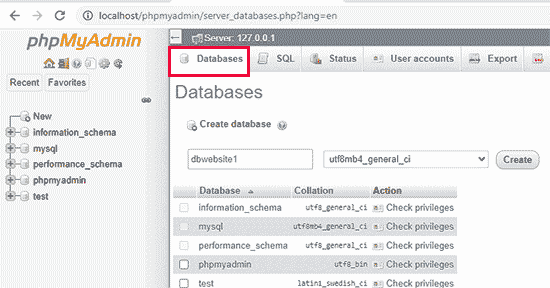
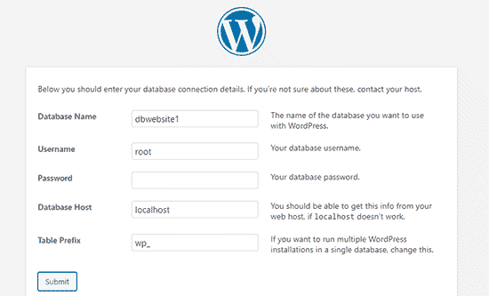

# 如何在本地建立一个 WordPress 网站——你需要知道的

> 原文：<https://www.freecodecamp.org/news/how-to-build-a-wordpress-website-locally/>

WordPress 是世界上最流行的内容管理系统。无论你是一个经验丰富的开发者，使用 38%的网站所使用的技术，还是你刚刚开始使用 WordPress，在你的计算机上本地构建是一个低成本、测试友好、快速的创建 WordPress 网站的方法。

## 本地建设是什么意思？

一个“本地开发环境”或“本地开发”仅仅意味着在你的电脑上托管网站的文件，而不是在网站主机的服务器上。

你可能已经在这么做了。很多程序员[在本地开发后端应用](https://forum.freecodecamp.org/t/developing-backend-applications-locally/147374)。

如果你刚开始从事 web 开发，你可能已经使用文本编辑器建立了一些 HTML 和 CSS 的基本站点，如 [Atom](https://atom.io/) 、 [Sublime](https://www.sublimetext.com/) 或 [Visual Studio Code](https://code.visualstudio.com/) 。这些简单的网站已经在本地托管。

当您开始运行需要利用 PHP、JavaScript 和 SQL 的更高级的代码时，您需要一些更高级的工具，我们将在后面讨论。

## 为什么我应该在本地建立一个 WordPress 站点？

在开始你需要在本地建立一个 WordPress 站点的工具之前，让我们快速地了解一下为什么你应该这样做。

我最近和一位 web 开发伙伴 Daniel 聊过，他在本地建立了所有的站点。他开始构建简单的 HTML 和 CSS 网站，也构建更高级的 WordPress 网站。

我认为他在当地建造房屋的主要原因是:

1.  **快速设置** -无需等待主机提供商或配置域名。我为一些小企业工作，迅速得到一个实体模型设计是当地发展的一个巨大好处。
2.  **低成本** -主机和域名可能很贵。在本地开发是免费的！
3.  **不需要域名** -如果你没有设置域名，你仍然可以在本地开始构建。这提供了很大的灵活性，将会省去你迁移 WordPress 网站的麻烦。
4.  简单测试 -当你在本地开发时，你可以更容易地试验插件、主题和定制开发。没有担心，如果你打破了你的网站。你是唯一可以查看和使用该网站的人，所以动作要快，打破东西！
5.  站点速度 -当你更新你的网站时，你不需要等待服务器来显示页面。这就像用瞬时网速浏览互联网。

## 如何在本地建立一个 WordPress 站点

既然你已经决定在本地建立你的 Wordpress 站点，你需要一个工具的帮助来建立你的站点。

这些工具会在你的电脑上设置一个 **web 服务器软件**、 **PHP** 和 **SQL 数据库管理**。在您的计算机上单独安装所有这些工具可能会令人困惑，因此这些工具将使您的生活更轻松，并允许您更快地开始构建。

这里有两个用于本地开发 WordPress 的工具，以及入门所需的步骤。

### 德夫金斯塔

DevKinsta 是由 Kinsta 提供的免费软件，于 2021 年 1 月推出。我最近用它启动了一个网站，它非常容易使用。

对于初学者来说，它使得本地站点的创建和开发变得又快又容易。DevKinsta 只需轻轻一点就可以安装 Nginx、MariaDB 等等。

安装并开始构建您的本地站点、开发主题、试验插件和进行定制 PHP 开发大约需要 2 分钟。

因为这是一个由主机提供商提供的工具，当你准备好上线的时候，网站会被发送到 Kinsta。因此，如果你选择用 Kinsta 托管你的 WordPress 网站，你应该只使用这个工具。我目前在 Kinsta 上为自己和客户托管了 20 个网站，我认为它们非常棒。

### xampp

[https://www.youtube.com/embed/h6DEDm7C37A?feature=oembed](https://www.youtube.com/embed/h6DEDm7C37A?feature=oembed)

使用 XAMPP 比 DevKinsta 需要更多的步骤，但是会教你很多关于需要运行什么服务和库来支持你的 WordPress 网站。

XAMPP 是一个免费且易于安装的开源软件包。Apache 发行版包含 MariaDB、PHP 和 Perl。下载并安装该软件后，您将可以访问 XAMPP 控制面板应用程序。

使用 XAMPP 控制面板，您可以将 Apache web server 作为本地服务器运行，将 MySQL 作为数据库服务器运行。您需要从这个面板“启动”Apache 和 MySQL 模块，以便有效地将您的计算机变成服务器。瞧，你有一台服务器了！

除了 XAMMP，你还需要从 Wordpress.org 下载 Wordpress。将 zip 文件解压到**.../XAMPP/htdocs/{here}** 。随着 MySQL 和 Apache 的开启，你现在应该可以通过浏览器访问你的网站了，网址是**(https://localhost/WordPress/)。**瞧——你有了 WordPress 的核心文件！

转到上面的 URL 会提示你按照 WordPress 安装向导进行一个更关键的技术安装——数据库。

phpMyAdmin 应用程序预装了 XAMPP。可以在**https://localhost/phpmyadmin/**访问。在这里，您将使用一个您可能已经熟悉的更简单的界面来创建数据库。

点击**数据库**，然后**创建**，快速添加一个新数据库。瞧，您拥有了您需要的数据库！

返回到您的本地网站 https://localhost/WordPress/并输入您的新数据库信息，使用“root”作为您的用户名，不使用密码。

点击提交，下一个屏幕将完成你的 WordPress 安装。您将被要求选择一个网站名称，用户名和密码。之后，你可以在**https://localhost/WordPress/WP-admin 访问你的本地 WordPress 网站的后端。**

使用 XAMPP 可能会很复杂。我对我的一些本地安装感到难以置信的沮丧，但是在网上可以找到很多帮助。

完成设置一个本地 WordPress 安装的练习将教会你服务器配置、数据库管理以及 WordPress 核心文件如何工作的重要方面。

一旦启动并运行，您就可以不受限制地使用服务器进行试验和开发。

## 结论

在本地开发 WordPress 是每个 WordPress 开发者都应该熟悉的事情。

在家工作而不是通勤为我提供了一些额外的时间，我已经分配到建设网站。我已经能够重新审视和评估我的本地开发工具包，以便更容易地创建 WordPress 网站。希望我的想法对你有帮助。

在本文中，我们只介绍了两种工具。CodeInWP 有他们推荐的用于本地开发的附加工具。一旦你选择了一个本地开发栈，建立了一个 WordPress 网站，创造了一个伟大的设计和标志，并选择了一个主机提供商-你的创作将为互联网做好准备。快乐大厦！