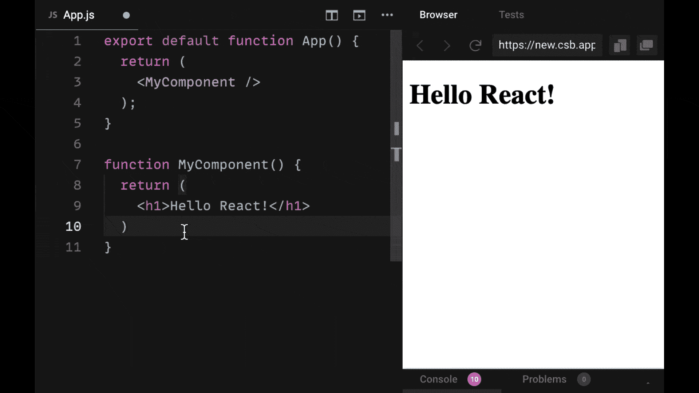
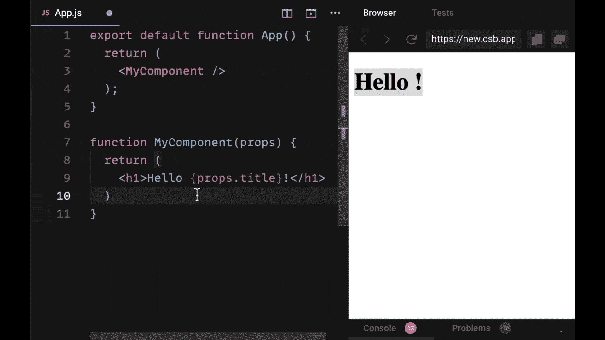
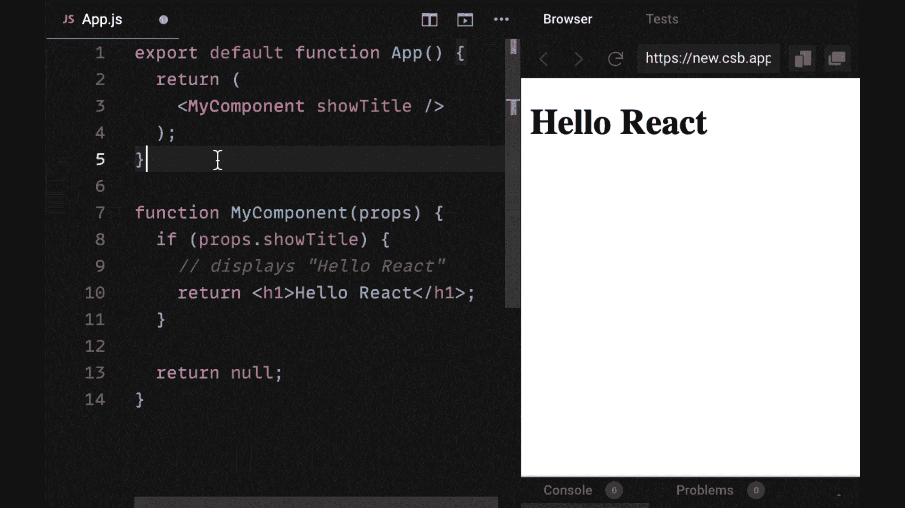
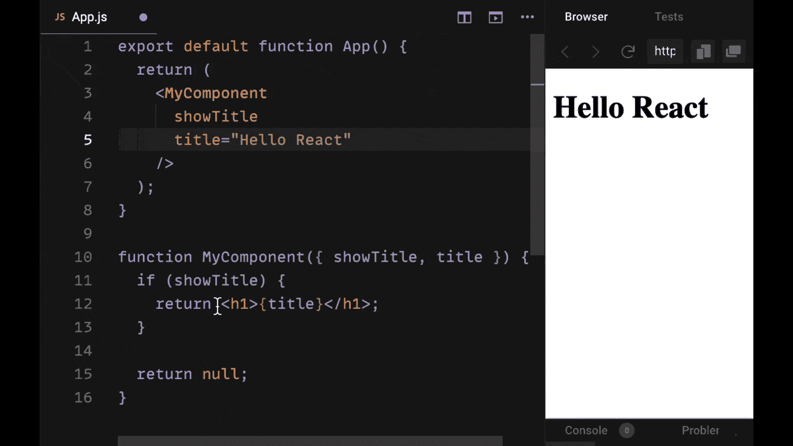
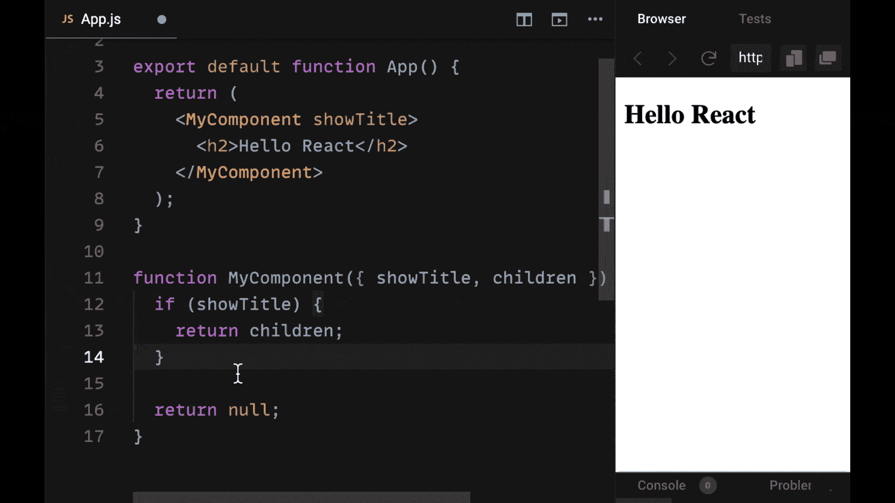
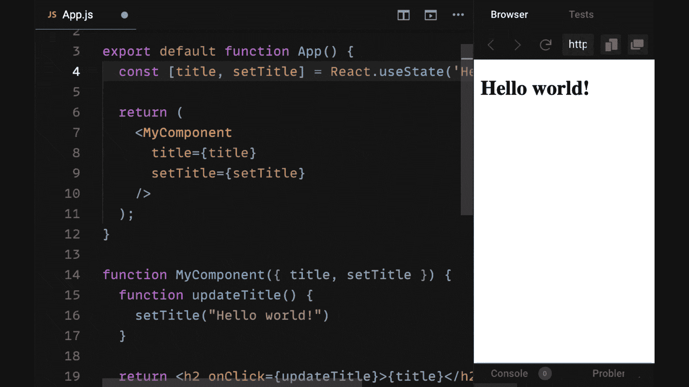
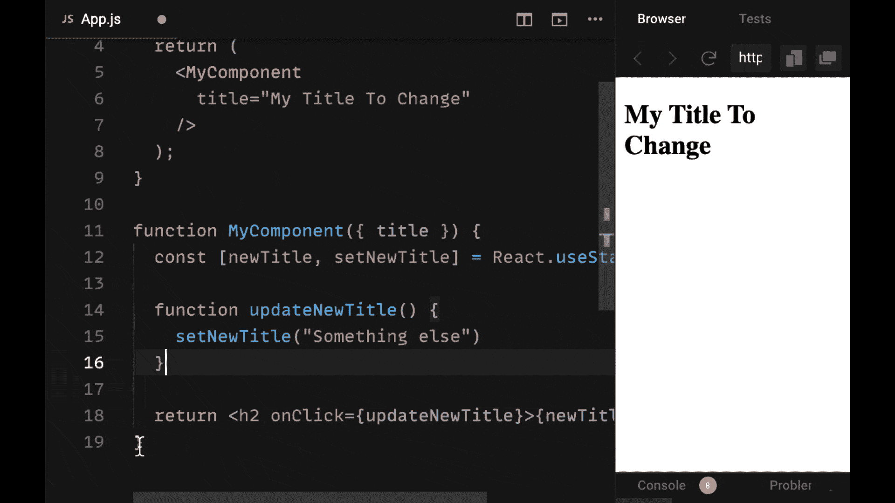
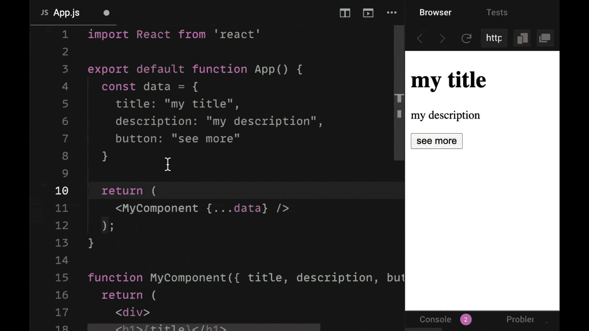
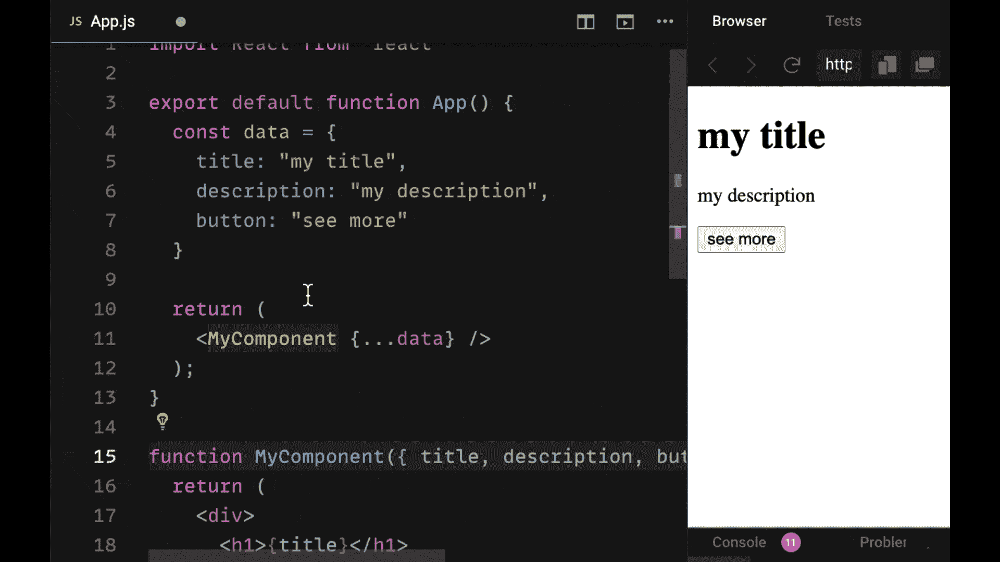
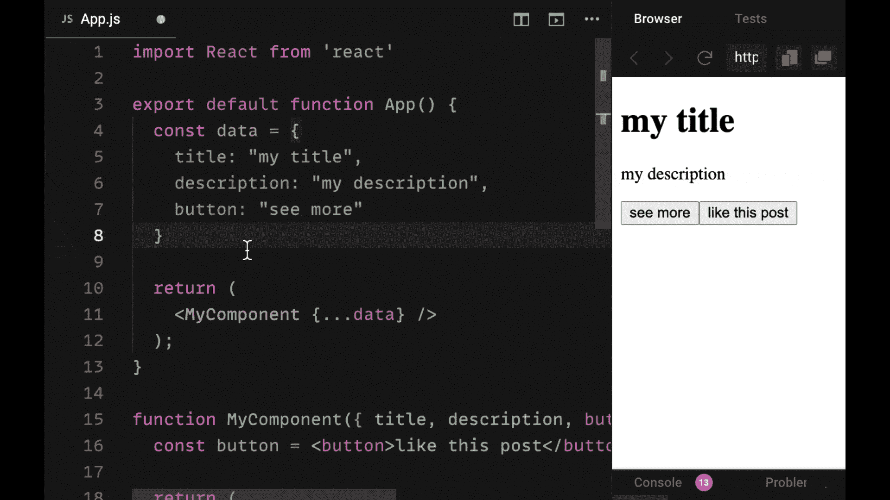

# React Props 备忘单:你应该知道的 10 种模式

> 原文：<https://www.freecodecamp.org/news/react-props-cheatsheet/>

Props 是 React 中使用的强大工具，但是如何有效地使用它们来编写健壮、可靠的 React 组件和应用程序呢？

在本教程中，我们将回顾在 React 中使用道具时应该使用的十种模式。

我们不仅将触及这些模式是什么以及如何使用它们，而且您将通过实际的、真实的例子看到如何自己使用它们。

我们开始吧！

### 想要你自己的副本吗？‬ 📄

**[点击此处下载 PDF 格式的备忘单](http://bit.ly/react-props-2021)** (耗时 5 秒)。

它包括所有的基本信息，作为一个方便的 PDF 指南。

## 1.React 道具可以有条件通过

传递给组件的属性可以看作是传递给函数的参数。

如果没有向某个组件传递适当值，将不会抛出错误。相反，在组件中，prop 将具有值`undefined`。

如果您想在某个值没有作为 prop 传递给组件时得到提醒，可以使用 prop-types 或 TypeScript 之类的工具。

> 使用 prop-types 或 TypeScript，我们可以告诉 React 我们为给定组件传递的属性，它们的值应该是什么，以及它们是否是可选的。

在 plain React 中，要注意传递道具可能是你忘记做的事情。如果你愿意，你也可以不把某个道具传递给一个组件。

## 2.仅使用名称传递的 React 属性的值为 true

每个属性都必须被赋予一个关联值，该值在等号运算符之后提供。

但是，如果我们不提供等于运算符以及值，会发生什么呢？

如果您只为组件提供了正确的名称，而没有其他内容，那么您将为该属性向组件传递一个布尔值 true。没必要写一个道具等于真。

相反，您可以只包含 prop 值，当您在传递给它的组件中使用它时，它将被赋予布尔值 true。

## 3.反应道具可以作为一个对象被访问或者被析构

我们可以使用几种模式来访问组件中的适当值。

道具可以作为一个完整的对象来访问，这个对象通常被称为“道具”。或者它们可以被析构成单独的变量，因为道具总是一个对象。

如果您有许多要传递给组件的道具，最好将它们包含在整个道具对象中，并通过调用`props.propName`来访问它们。

然而，如果你只有几个属性要传递给你的组件，你可以在你的函数组件的参数中直接析构它们。

您可以使用 ES6 对象析构在函数组件的参数中包含一组花括号，并立即获取对象的属性，以及将它们声明为单独的变量。

这减少了我们的代码，并且不需要说`props.propName`来获得每个 props 值。

## 4.React 组件可以作为道具传递(包括子组件)

我们已经看到，道具是非常灵活的，如果我们不把它们传递给一个组件，就不会抛出错误。

这种灵活性也扩展到我们可以作为道具传递的东西。不仅可以将 JSX 元素作为道具传递给组件，还可以将其他组件作为道具传递。

其实道具对象上有一种特殊类型的道具是自动提供的，叫做`children`。

> 如果在给定组件的开始和结束标记之间传递了任何组件或元素，我们将接收该组件的任何子组件。

children prop 允许我们以强大的方式组合我们的组件。

当我们需要将一个组件包装在另一个组件上时，这尤其有用，例如为了样式化，或者为了将更多的组件数据传递给子组件，举两个例子:

1.  当您想要制作一个通用布局组件，并为作为子级传递的所有组件提供相同的布局时，子级属性非常有用。
2.  此外，当您希望将 React context 中的上下文提供程序放置在组件树周围，以便轻松地将上下文提供程序上放置的内容提供给所有子组件，以便它们可以接收相同的数据时，子组件非常有用。

## 5.任何东西都可以在 React 中作为道具传递(尤其是函数)

任何普通的 JavaScript 值也可以作为 props 传递，包括函数。

由于能够将函数作为道具传递，已经出现了一些强大的模式。一个非常常见的模式是将一个函数作为属性传递给子组件，这样可以更新父组件的状态，然后在子组件中调用它。

> 使用这个传递下来的函数来更新父状态和执行一个函数，叫做“提升状态”。

此外，还有其他模式，比如 render props 模式，它也涉及将一个函数向下传递给一个子组件，然后被回调并执行一些跨组件的功能。

## 6.用状态更新反应道具的值

道具不能直接更新。

要将一个属性值传递给一个组件，我们不能在该功能组件中尝试立即更改该属性值。

> 正确值必须是纯值。换句话说，它们不能直接变异或改变。

我们知道，在 React 中，如果我们想随时间改变值，那么适当的方法是使用状态。

如果我们想把一个合适值传递给一个组件，并在以后修改它，我们可以把它交给一个有状态的 React 钩子，把这个值存储为一个变量。然后我们可以使用适当的 setter 函数更新它。例如，我们可以使用`useState`挂钩或`useReducer`挂钩来实现。

## 7.反应道具可以单独展开

如果我们有一个对象，我们想把它的属性作为单独的属性值传递下去，那该怎么办？

然而，这个对象有很多属性。我们是否需要手动创建单个道具并将道具设置为`object.propertyName`？

不——不用对每个属性都这样做，我们可以很容易地获取对象，并使用对象传播操作符`{...myPropObject}`将其属性作为单独的属性值传播到一个组件。

通过使用这种语法(这是 ES7 的一个特性)，我们可以根据对象的属性名自动创建单独的属性，而不必写出所有的属性名。

当处理具有大量属性的大型对象时，这非常方便，我们希望将这些属性作为单独的道具传递给组件。

## 8.如果没有提供任何属性，可以给反应属性一个默认值

如果我们已经知道我们正在把一个属性传递给一个组件的一个实例，但是我们没有把这个属性传递给它的另一个实例，那该怎么办呢？

或者我知道这个道具可能没有价值。如果没有属性值传递给它，我们该如何给它一个默认值而不仅仅是值`undefined`?

如果我们使用析构来访问函数组件中的属性，我们可以使用等号运算符给它一个默认值。因此，如果没有为该属性传递属性值，我们可以使用它旁边的等号运算符，并将其设置为一个更好的默认值。

设置默认值非常重要，因为道具的正常默认值是`undefined`。这可以帮助我们避免由于预期的正确值不存在而导致的错误。

## 9.可以重命名反应道具以避免错误

另外，如果和我们的道具有命名冲突怎么办？

如果我们已经在许多组件中使用了一个适当的名称，但是我们发现在我们的组件中有另一个具有相同变量名的值，该怎么办？

我们不需要在组件的所有实例上重新命名所有的属性值，我们只需要在属性名后面加一个冒号，如果我们要析构它，就给它一个别名。

换句话说，我们给它一个不同的名字。这将避免命名冲突和错误。

## 10.不要试图多次破坏反应道具

如果我们从我们的 props 对象中析构一个对象，请注意有可能将该属性进一步析构为它的组成属性。

但是，通常不建议这样做，除非您非常确信该对象将始终具有这些属性。

如果这些属性中的一个丢失了，并且你试图在多个层次上析构它，当你试图访问一个不存在的属性时，它会给你一个非常严重的错误。

请注意，您可以尽可能多地使用析构，但是在一定程度上很难理解，而且也不可靠。如果你试图访问一个可能不存在的对象的属性，这将导致一个错误。

## 想保留此指南以供将来参考吗？‬

**[点击此处下载有用的 PDF 格式备忘单](http://bit.ly/react-props-2021)。**

当您获得可下载版本时，您将获得 3 个快速胜利:

*   您将获得大量可复制的代码片段，以便在您自己的项目中重用。
*   这是一个很好的参考指南，可以加强你作为 React 开发人员的技能，也可以用于工作面试。
*   你可以在任何你喜欢的地方拿走、使用、打印、阅读和重读这个指南。