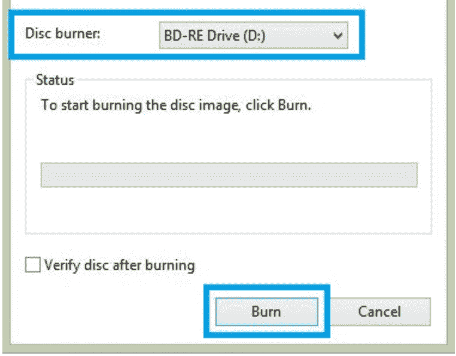

# 什么是 ISO 文件？用简单的英语解释

> 原文：<https://www.freecodecamp.org/news/what-is-an-iso-file-explained-in-plain-english/>

ISO 文件是归档到单个文件中的整个光盘(如 CD、DVD 或蓝光光盘)的精确副本。该文件有时也称为 ISO 映像，是大型数据集的较小副本。

为了执行其功能，需要打开并汇编 ISO 文件，以便可以查看数据。

许多人使用 ISO 文件来备份他们的光盘或以更实用的方式存储他们的数据。

它的实际功能是复制原始光盘并存储它，直到需要刻录一张有相同数据的新盘。例如，当周围没有物理磁盘时，你可以用它将游戏从旧磁盘转移到笔记本电脑上。

然而，当涉及到操作系统时，ISO 文件的用途要大得多。它们可以是大型程序或操作系统本身的优秀容器，因为它们是包含大量数据的单个文件。

通过将它们上传到 ISO 文件中，这些操作系统可以很容易地下载、安装或刻录到光盘上。

Windows 8、8.1 和 10 等操作系统可以 ISO 映像的形式下载。他们甚至会让你挂载一个 ISO 镜像作为虚拟磁盘，以确保计算机硬件或操作系统的正常运行。

在这种情况下，它被所有程序处理，就好像它是放在计算机光盘驱动器中的实际光盘一样。

## 如何创建 ISO 文件

如果您希望对任何物理磁盘进行数字备份，创建一个 ISO 文件是保存数据并在任何需要的时候恢复数据的好方法。

存储在 ISO 文件中的这个副本可以很容易地访问，以便在其他计算机上安装软件、游戏等。您甚至可以创建同一个 ISO 文件的更多副本，而不需要复制它的原始磁盘。那就是说和别人分享是小菜一碟！

您可以使用 MacOS 和 Linux 等操作系统附带的预安装工具轻松创建物理磁盘的 ISO 映像。

然而，Windows 操作系统并非如此，因此您需要使用第三方应用程序。这些应用程序可以在互联网上找到，所以你可以挑选最适合你的。

不过，Windows 操作系统让你可以选择在电脑上安装、刻录或复制 ISO 文件，完全免费，所以它确实有它的好处。你可以用它来备份软件、游戏、电影等等。

## 如何刻录 ISO 文件

### Windows 8/8.1/10

1.  将 ISO 光盘映像下载到您计算机上的文件夹中。我更喜欢把它放在我的桌面上，方便快捷地访问。
2.  打开文件夹。
3.  右键->。iso 文件。
4.  从菜单->刻录光盘映像。

5.Windows 光盘映像刻录将会打开。

6。选择光盘刻录机。
7
。点击“刻录”

您可以使用位于/Applications/Utilities/目录中的“磁盘工具”在 Mac OS X 中装载 ISO 映像。

1.  启动“磁盘工具”后，从“磁盘工具”菜单向下导航到“打开图像文件”
2.  选择您的 ISO 文件。
3.  ISO 现在应该出现在 Mac OS 桌面上。
4.  将出现“选择要刻录的图像”窗口。
5.  选择。要刻录到 CD/DVD 的 iso 文件。
6.  确保您的驱动器中插入了光盘，然后单击刻录。
7.  将出现一个“磁盘工具”窗口，显示录制进度。
8.  录制过程完成后,“磁盘工具”将验证图像是否被正确刻录。
9.  点按“好”以弹出光盘。

刻录 ISO 映像可能不像将一些文档或音乐刻录到磁盘上那么简单，因为它们的性质是如此不同。将 ISO 文件刻录到 CD、DVD 或蓝光光盘意味着将 ISO 文件的内容组装到光盘上。

同样，您可以使用 Windows 操作系统的向导，通过双击 ISO 文件将 ISO 映像刻录到物理磁盘或 USB 设备上。您不需要任何第三方来完成这项工作，只需遵循向导的基本说明即可。

例如，Microsoft Office 是一个只能刻录或挂载的 ISO 文件，因此您肯定需要直接将其刻录到您的计算机上。相反，有些程序需要在操作系统之外刻录 ISO 文件才能使用。

这些程序可以像硬盘诊断工具，您的计算机可以从磁盘或闪存驱动器启动。

## 如何提取 ISO 文件

如果您想确切了解 ISO 文件中的内容，或者如果您想访问 ISO 映像中的某些文件，将 ISO 文件的内容提取到一个文件夹中会非常有帮助。

没错，将 ISO 文件刻录到物理磁盘或 USB 设备上并不是解锁它的唯一选择。

## 把所有的东西放在一起:日常生活中的 ISO 文件

压缩和解压缩软件程序可以将 ISO 文件的内容提取到一个文件夹中，这样您就可以像浏览计算机上的任何其他文件夹一样浏览其内容。

以 Microsoft Office 为例，您可以通过仅提取安装文件来安装程序。

ISO 不仅适用于 Windows，值得一提的是，它可以帮助那些在 MacOS 上工作和构建的人。