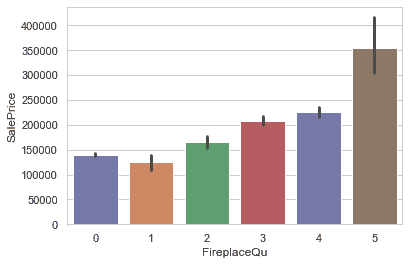
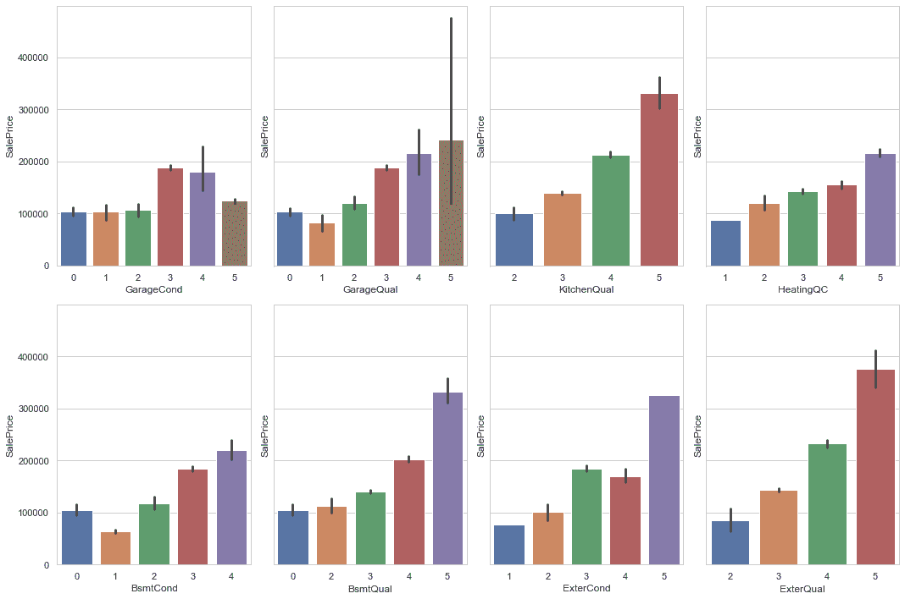
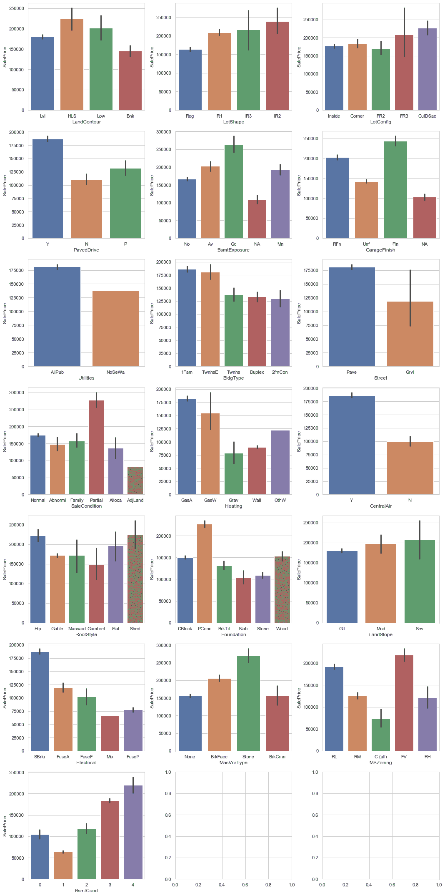
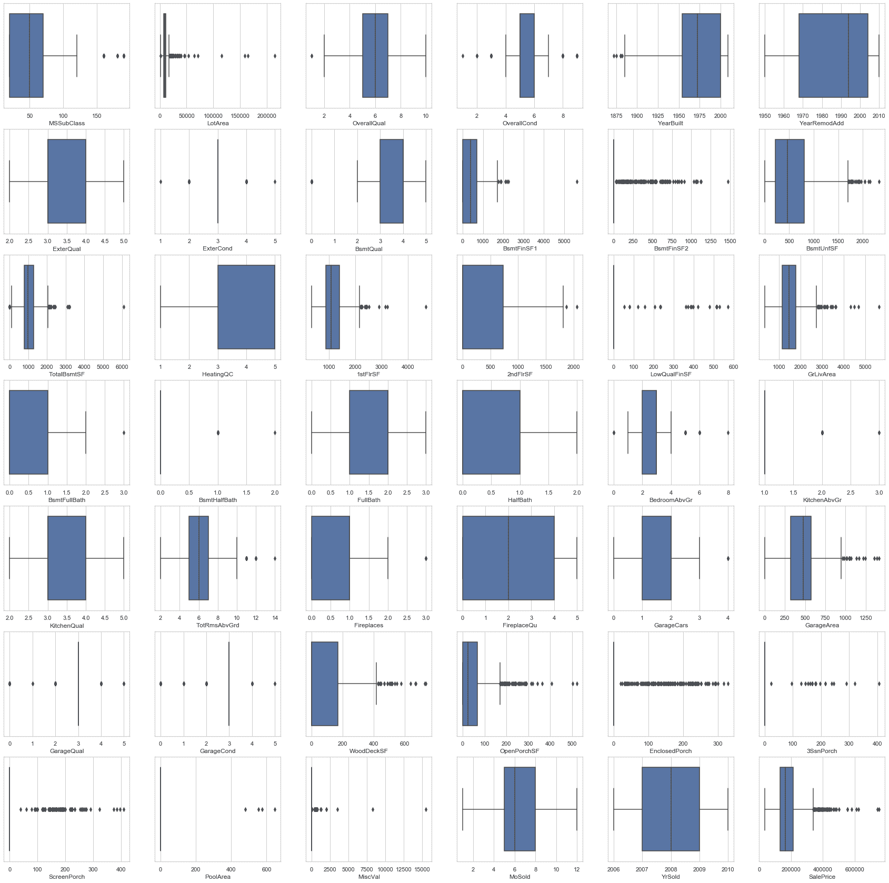

# 机器学习项目-如何分析和清理数据，创建一个 ML 模型，并建立一个 API

> 原文：<https://www.freecodecamp.org/news/data-science-and-machine-learning-project-house-prices/>

在本文中，我们将使用数据科学和机器学习工具来分析房价数据集中的数据。

我们将从对数据进行探索性数据分析开始。我们将创建一个脚本来清理数据，然后我们将使用清理后的数据来创建一个机器学习模型。最后，我们使用机器学习模型来实现我们自己的预测 API。

完整的源代码在 GitHub 存储库中，带有执行这个端到端项目的清晰说明。

快速信息:你可以[下载这个数据科学和机器学习项目的 PDF 版本，在书](https://renanmf.com/book-ds-ml-project-house-prices/)中链接了完整的源代码库。

准备好开始了吗？

## 目录

1.  [Github 库](#githubrepository)
2.  [EDA(探索性数据分析)](#exploratorydataanalysis)
3.  [数据清理脚本](#datacleaningscript)
4.  [机器学习模型](#machinelearningmodel)
5.  [API](#api)
6.  [结论](#conclusion)

## Github 知识库

你可以在 [Github 库](https://github.com/renanmouraf/data-science-house-prices)下载完整的代码。

在存储库中，您可以找到:

*   requirements.txt:您需要使用 pip 安装的包
*   raw_data.csv:我们在这个项目中使用的原始数据
*   ipynb:带有探索性数据分析的 Jupyter 笔记本
*   data_cleaning.py:清理数据的脚本
*   train_model.py:使用清理后的数据训练机器学习模型的脚本
*   py:包含 HousePriceModel 类的文件，我们用它来加载 ML 模型并进行预测
*   api.py:用框架 [Fastapi](https://fastapi.tiangolo.com/) 创建的 API
*   test_api.py:测试 api 的脚本

要使用存储库中的数据和代码，请遵循下一节中的步骤。

### 环境和包

创建一个虚拟环境来隔离您的 Python 项目:

```
python3 -m venv venv 
```

像这样激活虚拟环境:

```
source ./venv/bin/activate 
```

然后安装必要的软件包:

```
pip install -r requirements.txt 
```

您应该会在结尾处看到类似以下内容的消息:

```
Successfully installed Babel-2.9.0 Jinja2-2.11.3 MarkupSafe-1.1.1 Pygments-2.8.0 Send2Trash-1.5.0 anyio-2.1.0 argon2-cffi-20.1.0 async-generator-1.10 attrs-20.3.0 backcall-0.2.0 bleach-3.3.0 certifi-2020.12.5 cffi-1.14.5 chardet-4.0.0 click-7.1.2 decorator-4.4.2 defusedxml-0.6.0 entrypoints-0.3 fastapi-0.63.0 h11-0.12.0 idna-2.10 ipykernel-5.4.3 ipython-7.20.0 ipython-genutils-0.2.0 jedi-0.18.0 joblib-1.0.1 json5-0.9.5 jsonschema-3.2.0 jupyter-client-6.1.11 jupyter-core-4.7.1 jupyter-server-1.3.0 jupyterlab-3.0.7 jupyterlab-pygments-0.1.2 jupyterlab-server-2.2.0 mistune-0.8.4 nbclassic-0.2.6 nbclient-0.5.2 nbconvert-6.0.7 nbformat-5.1.2 nest-asyncio-1.5.1 notebook-6.2.0 numpy-1.20.1 packaging-20.9 pandas-1.2.2 pandocfilters-1.4.3 parso-0.8.1 pexpect-4.8.0 pickleshare-0.7.5 prometheus-client-0.9.0 prompt-toolkit-3.0.16 ptyprocess-0.7.0 pycparser-2.20 pydantic-1.7.3 pyparsing-2.4.7 pyrsistent-0.17.3 python-dateutil-2.8.1 pytz-2021.1 pyzmq-22.0.3 requests-2.25.1 scikit-learn-0.24.1 scipy-1.6.0 six-1.15.0 sniffio-1.2.0 starlette-0.13.6 terminado-0.9.2 testpath-0.4.4 threadpoolctl-2.1.0 tornado-6.1 traitlets-5.0.5 urllib3-1.26.3 uvicorn-0.13.3 wcwidth-0.2.5 webencodings-0.5.1 
```

### 探索性数据分析

要查看 EDA(探索性数据分析):

```
jupyter-notebook Exploratory-Data-Analysis-House-Prices.ipynb 
```

然后，打开 Jupyter 笔记本，进入`Cell > Run All`运行所有命令。

然后依次执行以下步骤。

#### 清理数据

要对原始数据执行清理过程，请键入以下命令:

```
python data_cleaning.py 
```

下面是预期的输出:

```
Original Data: (1168, 81)
Columns with missing values: 0
Series([], dtype: int64)
After Cleaning: (1168, 73) 
```

这将生成“cleaned_data.csv”。

#### 创建机器学习模型

要训练模型，请输入以下命令:

```
python train_model.py 
```

下面是预期的输出:

```
Train data for modeling: (934, 73)
Test data for predictions: (234, 73)
Training the model ...
Testing the model ...
Average Price Test: 175652.0128205128
RMSE: 11098.009355519898
Model saved at model.pkl 
```

这将创建“train.csv”、“test.csv”和“model.pkl”。

#### 运行并测试 API

要运行 API，请键入以下命令:

```
uvicorn api:app 
```

下面是预期的输出:

```
INFO:     Started server process [56652]
INFO:     Waiting for application startup.
INFO:     Application startup complete.
INFO:     Uvicorn running on http://127.0.0.1:8000 (Press CTRL+C to quit) 
```

为了测试 API，在另一个终端上再次激活虚拟环境(这次您已经安装了软件包):

```
source ./venv/bin/activate 
```

然后运行:

```
python test_api.py 
```

下面是预期的输出:

```
The actual Sale Price: 109000
The predicted Sale Price: 109000.01144237864 
```

# 探索性数据分析

让我们从数据集“[房价:高级回归技术](https://www.kaggle.com/c/house-prices-advanced-regression-techniques/data)”的探索性数据分析开始。

我们将:

*   理解问题
*   浏览数据并处理缺失值
*   选择和转换变量，尤其是分类变量

## 问题是

这是 Kaggle 上对问题的描述:

“让购房者描述他们梦想中的房子，他们可能不会从地下室天花板的高度或靠近东西向铁路开始。但是这个游乐场竞赛的数据集证明，影响价格谈判的远不止卧室的数量或白色尖桩栅栏。

有 79 个解释变量描述了(几乎)爱荷华州埃姆斯住宅的每个方面，这个比赛挑战你预测每个家庭的最终价格。"

因此，我们将探索数据集，尝试从中获得一些见解，并使用一些工具将数据转换为更有意义的格式。

## 初步探索和初步见解

在本节中，我们将对数据集进行初步探索。

这个 EDA 是在一个 [Jupyter 笔记本](https://jupyter.org/)上进行的。

### 导入库

我们从导入将要使用的库开始:

*   标准的[数学](https://docs.python.org/3/library/math.html)模块提供了对数学函数的访问。
*   NumPy lib 是使用 Python 进行任何科学计算的基础。
*   [pandas](https://pandas.pydata.org/) 是数据分析和操作的必备工具。
*   matplotlib 是 Python 中最完整的数据可视化包。
*   seaborn 基于 matplotlib，作为一套更高级的可视化工具，虽然没有 matplotlib 强大，但更容易使用，并且可以用更少的工作完成更多的工作。

```
import math
import numpy as np
import pandas as pd
import seaborn as sns
import matplotlib as mpl
import matplotlib.pyplot as plt

%matplotlib inline 
```

### 加载数据

既然我们有表格数据，我们将使用 *pandas* 来加载数据并先看一下。

为了加载数据，由于格式是 CSV(逗号分隔值)，我们使用 pandas 的`read_csv()`函数。

然后我们打印它的形状，即 1168x81，这意味着我们有 1168 行(记录)和 81 列(特征)。

实际上，我们在 CSV 文件中有 1169 行，但是描述列的标题不算。

我们实际上有 79 个特征，因为其中一列是`SalePrice`，这是我们将在模型中尝试预测的列，我们也不会使用列`Id`，稍后会将其删除。

```
train = pd.read_csv('raw_data.csv')
train.shape 
```

```
 (1168, 81) 
```

### 看着这些数据

首先，我推荐你读一下[这个对每个专栏](https://www.kaggle.com/c/house-prices-advanced-regression-techniques/data)的简要描述。

使用参数为 3 的 pandas 的`head()`函数，我们可以查看前 3 条记录。

`.T`的意思是*转置*，这样我们可以把行想象成列，反之亦然。

请注意，它没有显示中间的所有列，只显示了`...`，因为它们太多了。

```
train.head(3).T 
```

|  | Zero | one | Two |
| --- | --- | --- | --- |
| 身份 | Eight hundred and ninety-three | One thousand one hundred and six | Four hundred and fourteen |
| MSSubClass | Twenty | Sixty | Thirty |
| MSZoning | RL | RL | 空间 |
| 地段临街 | Seventy | Ninety-eight | fifty-six |
| 地段面积 | Eight thousand four hundred and fourteen | Twelve thousand two hundred and fifty-six | Eight thousand nine hundred and sixty |
| ... | ... | ... | ... |
| mos old | Two | four | three |
| YrSold | Two thousand and six | Two thousand and ten | Two thousand and ten |
| 标度类型 | 陆军部(War Department) | 陆军部(War Department) | 陆军部(War Department) |
| 销售条件 | 常态 | 常态 | 常态 |
| 销售价格 | One hundred and fifty-four thousand five hundred | Three hundred and twenty-five thousand | One hundred and fifteen thousand |

81 行× 3 列

熊猫的`info()`方法会给你一个数据汇总。

注意`Alley`有 70 个非空值，这意味着它没有 1168 条记录中大多数的值。

我们还可以可视化数据类型。

```
train.info() 
```

```
 <class 'pandas.core.frame.DataFrame'>
    RangeIndex: 1168 entries, 0 to 1167
    Data columns (total 81 columns):
    Id               1168 non-null int64
    MSSubClass       1168 non-null int64
    MSZoning         1168 non-null object
    LotFrontage      964 non-null float64
    LotArea          1168 non-null int64
    Street           1168 non-null object
    Alley            70 non-null object
    LotShape         1168 non-null object
    LandContour      1168 non-null object
    Utilities        1168 non-null object
    LotConfig        1168 non-null object
    LandSlope        1168 non-null object
    Neighborhood     1168 non-null object
    Condition1       1168 non-null object
    Condition2       1168 non-null object
    BldgType         1168 non-null object
    HouseStyle       1168 non-null object
    OverallQual      1168 non-null int64
    OverallCond      1168 non-null int64
    YearBuilt        1168 non-null int64
    YearRemodAdd     1168 non-null int64
    RoofStyle        1168 non-null object
    RoofMatl         1168 non-null object
    Exterior1st      1168 non-null object
    Exterior2nd      1168 non-null object
    MasVnrType       1160 non-null object
    MasVnrArea       1160 non-null float64
    ExterQual        1168 non-null object
    ExterCond        1168 non-null object
    Foundation       1168 non-null object
    BsmtQual         1138 non-null object
    BsmtCond         1138 non-null object
    BsmtExposure     1137 non-null object
    BsmtFinType1     1138 non-null object
    BsmtFinSF1       1168 non-null int64
    BsmtFinType2     1137 non-null object
    BsmtFinSF2       1168 non-null int64
    BsmtUnfSF        1168 non-null int64
    TotalBsmtSF      1168 non-null int64
    Heating          1168 non-null object
    HeatingQC        1168 non-null object
    CentralAir       1168 non-null object
    Electrical       1167 non-null object
    1stFlrSF         1168 non-null int64
    2ndFlrSF         1168 non-null int64
    LowQualFinSF     1168 non-null int64
    GrLivArea        1168 non-null int64
    BsmtFullBath     1168 non-null int64
    BsmtHalfBath     1168 non-null int64
    FullBath         1168 non-null int64
    HalfBath         1168 non-null int64
    BedroomAbvGr     1168 non-null int64
    KitchenAbvGr     1168 non-null int64
    KitchenQual      1168 non-null object
    TotRmsAbvGrd     1168 non-null int64
    Functional       1168 non-null object
    Fireplaces       1168 non-null int64
    FireplaceQu      617 non-null object
    GarageType       1099 non-null object
    GarageYrBlt      1099 non-null float64
    GarageFinish     1099 non-null object
    GarageCars       1168 non-null int64
    GarageArea       1168 non-null int64
    GarageQual       1099 non-null object
    GarageCond       1099 non-null object
    PavedDrive       1168 non-null object
    WoodDeckSF       1168 non-null int64
    OpenPorchSF      1168 non-null int64
    EnclosedPorch    1168 non-null int64
    3SsnPorch        1168 non-null int64
    ScreenPorch      1168 non-null int64
    PoolArea         1168 non-null int64
    PoolQC           4 non-null object
    Fence            217 non-null object
    MiscFeature      39 non-null object
    MiscVal          1168 non-null int64
    MoSold           1168 non-null int64
    YrSold           1168 non-null int64
    SaleType         1168 non-null object
    SaleCondition    1168 non-null object
    SalePrice        1168 non-null int64
    dtypes: float64(3), int64(35), object(43)
    memory usage: 739.2+ KB 
```

`describe()`方法有利于获得数据的第一手见解。

它会自动为您提供每个特征的描述性统计数据:非 NA/null 观测值的数量、*均值*、*标准差*、*最小值*值、*四分位数*和*最大值*值。

注意，计算没有考虑`NaN`值。

例如，对于`LotFrontage`，它仅使用 964 个非空值，并排除其他 204 个空值观察值。

```
train.describe().T 
```

|  | 数数 | 意思是 | 标准 | 部 | 25% | 50% | 75% | 最大 |
| --- | --- | --- | --- | --- | --- | --- | --- | --- |
| 身份 | One thousand one hundred and sixty-eight | 720.240582 | 420.237685 | One | Three hundred and fifty-five point seven five | Seven hundred and sixteen point five | One thousand and eighty point two five | One thousand four hundred and sixty |
| MSSubClass | One thousand one hundred and sixty-eight | 56.699486 | 41.814065 | Twenty | Twenty | Fifty | Seventy | One hundred and ninety |
| 地段临街 | Nine hundred and sixty-four | 70.271784 | 25.019386 | Twenty-one | Fifty-nine | Sixty-nine point five | Eighty | Three hundred and thirteen |
| 地段面积 | One thousand one hundred and sixty-eight | 10597.720890 | 10684.958323 | One thousand four hundred and seventy-seven | Seven thousand five hundred and sixty | Nine thousand four hundred and sixty-three | Eleven thousand six hundred and one point five | Two hundred and fifteen thousand two hundred and forty-five |
| 总体平等 | One thousand one hundred and sixty-eight | 6.095034 | 1.403402 | One | Five | Six | Seven | Ten |
| 总体代码 | One thousand one hundred and sixty-eight | 5.594178 | 1.116842 | One | Five | Five | Six | Nine |
| 年造的 | One thousand one hundred and sixty-eight | 1971.120719 | 30.279560 | One thousand eight hundred and seventy-two | One thousand nine hundred and fifty-four | One thousand nine hundred and seventy-two | Two thousand | Two thousand and nine |
| YearRemodAdd | One thousand one hundred and sixty-eight | 1985.200342 | 20.498566 | One thousand nine hundred and fifty | One thousand nine hundred and sixty-eight | One thousand nine hundred and ninety-four | Two thousand and four | Two thousand and ten |
| 马斯夫纳雷亚 | One thousand one hundred and sixty | 104.620690 | 183.996031 | Zero | Zero | Zero | One hundred and sixty-six point two five | One thousand six hundred |
| BsmtFinSF1 | One thousand one hundred and sixty-eight | 444.345890 | 466.278751 | Zero | Zero | Three hundred and eighty-four | Seven hundred and six point five | Five thousand six hundred and forty-four |
| BsmtFinSF2 | One thousand one hundred and sixty-eight | 46.869863 | 162.324086 | Zero | Zero | Zero | Zero | One thousand four hundred and seventy-four |
| BsmtUnfSF | One thousand one hundred and sixty-eight | 562.949486 | 445.605458 | Zero | Two hundred and sixteen | Four hundred and sixty-four point five | Eight hundred and eight point five | Two thousand three hundred and thirty-six |
| 总计 BsmtSF | One thousand one hundred and sixty-eight | 1054.165240 | 448.848911 | Zero | Seven hundred and ninety-two point seven five | Nine hundred and eighty-four | One thousand two hundred and ninety-nine | Six thousand one hundred and ten |
| 1stFlrSF | One thousand one hundred and sixty-eight | 1161.268836 | 393.541120 | Three hundred and thirty-four | Eight hundred and seventy-three point five | One thousand and seventy-nine point five | One thousand three hundred and ninety-two | Four thousand six hundred and ninety-two |
| 2ndFlrSF | One thousand one hundred and sixty-eight | 351.218322 | 437.334802 | Zero | Zero | Zero | Seven hundred and thirty point five | Two thousand and sixty-five |
| 低质量 FinSF | One thousand one hundred and sixty-eight | 5.653253 | 48.068312 | Zero | Zero | Zero | Zero | Five hundred and seventy-two |
| GrLivArea | One thousand one hundred and sixty-eight | 1518.140411 | 534.904019 | Three hundred and thirty-four | One thousand one hundred and thirty-three point two five | One thousand four hundred and sixty-seven point five | One thousand seven hundred and seventy-five point two five | Five thousand six hundred and forty-two |
| BsmtFullBath | One thousand one hundred and sixty-eight | 0.426370 | 0.523376 | Zero | Zero | Zero | One | Three |
| 半沐浴 | One thousand one hundred and sixty-eight | 0.061644 | 0.244146 | Zero | Zero | Zero | Zero | Two |
| 全浴 | One thousand one hundred and sixty-eight | 1.561644 | 0.555074 | Zero | One | Two | Two | Three |
| 半浴 | One thousand one hundred and sixty-eight | 0.386130 | 0.504356 | Zero | Zero | Zero | One | Two |
| BedroomAbvGr | One thousand one hundred and sixty-eight | 2.865582 | 0.817491 | Zero | Two | Three | Three | Eight |
| KitchenAbvGr | One thousand one hundred and sixty-eight | 1.046233 | 0.218084 | One | One | One | One | Three |
| TotRmsAbvGrd | One thousand one hundred and sixty-eight | 6.532534 | 1.627412 | Two | Five | Six | Seven | Fourteen |
| 壁炉 | One thousand one hundred and sixty-eight | 0.612158 | 0.640872 | Zero | Zero | One | One | Three |
| 车库 | One thousand and ninety-nine | 1978.586897 | 24.608158 | One thousand nine hundred | One thousand nine hundred and sixty-two | One thousand nine hundred and eighty | Two thousand and two | Two thousand and ten |
| 车库汽车 | One thousand one hundred and sixty-eight | 1.761130 | 0.759039 | Zero | One | Two | Two | Four |
| 车库区域 | One thousand one hundred and sixty-eight | 473.000000 | 218.795260 | Zero | Three hundred and eighteen point seven five | Four hundred and seventy-nine point five | Five hundred and seventy-seven | One thousand four hundred and eighteen |
| WoodDeckSF | One thousand one hundred and sixty-eight | 92.618151 | 122.796184 | Zero | Zero | Zero | One hundred and sixty-eight | Seven hundred and thirty-six |
| OpenPorchSF | One thousand one hundred and sixty-eight | 45.256849 | 64.120769 | Zero | Zero | Twenty-four | Sixty-eight | Five hundred and twenty-three |
| 封闭门廊 | One thousand one hundred and sixty-eight | 20.790240 | 58.308987 | Zero | Zero | Zero | Zero | Three hundred and thirty |
| 3SsnPorch | One thousand one hundred and sixty-eight | 3.323630 | 27.261055 | Zero | Zero | Zero | Zero | Four hundred and seven |
| 纱窗门廊 | One thousand one hundred and sixty-eight | 14.023116 | 52.498520 | Zero | Zero | Zero | Zero | Four hundred and ten |
| 游泳池区域 | One thousand one hundred and sixty-eight | 1.934075 | 33.192538 | Zero | Zero | Zero | Zero | Six hundred and forty-eight |
| 米沙尔 | One thousand one hundred and sixty-eight | 42.092466 | 538.941473 | Zero | Zero | Zero | Zero | Fifteen thousand five hundred |
| mos old | One thousand one hundred and sixty-eight | 6.377568 | 2.727010 | One | Five | Six | Eight | Twelve |
| YrSold | One thousand one hundred and sixty-eight | 2007.815068 | 1.327339 | Two thousand and six | Two thousand and seven | Two thousand and eight | Two thousand and nine | Two thousand and ten |
| 销售价格 | One thousand one hundred and sixty-eight | 181081.876712 | 81131.228007 | Thirty-four thousand nine hundred | One hundred and twenty-nine thousand nine hundred and seventy-five | One hundred and sixty-two thousand nine hundred and fifty | Two hundred and fourteen thousand | Seven hundred and fifty-five thousand |

## 数据清理

在本节中，我们将执行一些数据清理。

### `id`栏

`id`列只是一个与`SalePrice`无关的哑标识。

所以让我们去掉`id`:

```
train.drop(columns=['Id'], inplace=True) 
```

### 缺少值

当我们使用`info()`查看数据摘要时，我们可以看到许多列有大量缺失的数据。

让我们看看哪些列有缺失值，以及它们在每一列中所占的比例。

`isna()` from pandas 将返回每一列缺少的值，然后`sum()`函数将它们相加，得出总数。

```
columns_with_miss = train.isna().sum()
#filtering only the columns with at least 1 missing value
columns_with_miss = columns_with_miss[columns_with_miss!=0]
#The number of columns with missing values
print('Columns with missing values:', len(columns_with_miss))
#sorting the columns by the number of missing values descending
columns_with_miss.sort_values(ascending=False) 
```

```
 Columns with missing values: 19 
```

```
 PoolQC          1164
    MiscFeature     1129
    Alley           1098
    Fence            951
    FireplaceQu      551
    LotFrontage      204
    GarageYrBlt       69
    GarageType        69
    GarageFinish      69
    GarageQual        69
    GarageCond        69
    BsmtFinType2      31
    BsmtExposure      31
    BsmtFinType1      30
    BsmtCond          30
    BsmtQual          30
    MasVnrArea         8
    MasVnrType         8
    Electrical         1
    dtype: int64 
```

在 80 列中，有 19 列缺少值。

缺失值本身不是大问题，但是缺失值很多的列可能会导致失真。

以下是这种情况:

*   泳池质量控制:泳池质量
*   杂项功能:其他类别中不包含的杂项功能
*   小巷:通往房产的小巷类型
*   围栏:围栏质量

现在让我们将它们从数据集中删除。

```
# Removing columns
train.drop(columns=['PoolQC', 'MiscFeature', \
 'Alley', 'Fence'], inplace=True) 
```

FireplaceQu 有 551 个缺失值，这也是相当高的。

在这种情况下，缺少的值具有意义，即“没有壁炉”。

壁炉有以下几类:

*   Ex 优秀-卓越的砖石壁炉
*   主楼层中的 Gd 优质砌体壁炉
*   主客厅的预制壁炉或地下室的砖石壁炉
*   Fa Fair -地下室预制壁炉
*   Po Poor - Ben Franklin 炉灶
*   没有壁炉

让我们检查一下 FireplaceQu 和 SalePrice 之间的相关性，看看这个特性对于确定价格有多重要。

首先，我们将替换 0 的缺失值。

然后，我们将类别编码成从 1 到 5 的数字。

```
train['FireplaceQu'].fillna(0, inplace=True)
train['FireplaceQu'].replace({'Po': 1, 'Fa': 2, \
'TA': 3, 'Gd': 4, 'Ex': 5}, inplace=True) 
```

使用柱状图，我们可以看到壁炉的类别是如何增加销售价格的。

同样值得注意的是，当房子有一个很好的壁炉时，它的价值会高多少。

这意味着我们应该保持 FireplaceQu 的特性。

```
sns.set(style="whitegrid")
sns.barplot(x='FireplaceQu', y="SalePrice", data=train) 
```

这将给我们这样的输出:


### 数字列中缺少值

另一个具有大量缺失值的要素是计数为 204 的 LotFrontage。

让我们来看看其余缺失值的要素与销售价格之间的相关性。

```
columns_with_miss = train.isna().sum()
columns_with_miss = columns_with_miss[columns_with_miss!=0]
c = list(columns_with_miss.index)
c.append('SalePrice')
train[c].corr() 
```

|  | 地段临街 | 马斯夫纳雷亚 | 车库 | 销售价格 |
| --- | --- | --- | --- | --- |
| 地段临街 | 1.000000 | 0.196649 | 0.089542 | 0.371839 |
| 马斯夫纳雷亚 | 0.196649 | 1.000000 | 0.253348 | 0.478724 |
| 车库 | 0.089542 | 0.253348 | 1.000000 | 0.496575 |
| 销售价格 | 0.371839 | 0.478724 | 0.496575 | 1.000000 |

请注意，LotFrontage、MasVnrArea 和 GarageYrBlt 与 SalePrice 正相关，但这种相关性不是很强。

为了简化分析，我们现在将删除这些列:

```
cols_to_be_removed = ['LotFrontage', 'GarageYrBlt', \
 'MasVnrArea']
train.drop(columns=cols_to_be_removed, inplace=True) 
```

最后，这些是剩余的缺少值的列:

```
columns_with_miss = train.isna().sum()
columns_with_miss = columns_with_miss[columns_with_miss!=0]
print(f'Columns with missing values: {len(columns_with_miss)}')
columns_with_miss.sort_values(ascending=False) 
```

```
 Columns with missing values: 11 
```

```
 GarageCond      69
    GarageQual      69
    GarageFinish    69
    GarageType      69
    BsmtFinType2    31
    BsmtExposure    31
    BsmtFinType1    30
    BsmtCond        30
    BsmtQual        30
    MasVnrType       8
    Electrical       1
    dtype: int64 
```

### 分类变量

让我们处理数据集的分类变量。

#### 处理缺失值

根据[描述文件](https://www.kaggle.com/c/house-prices-advanced-regression-techniques/data?select=data_description.txt)填充我们知道如何填充的分类 NaN。

```
# Fills NA in place of NaN
for c in ['GarageType', 'GarageFinish', 'BsmtFinType2', \
'BsmtExposure', 'BsmtFinType1']:
    train[c].fillna('NA', inplace=True)

# Fills None in place of NaN
train['MasVnrType'].fillna('None', inplace=True) 
```

这样，我们的数据集中只剩下 5 列缺少值。

```
columns_with_miss = train.isna().sum()
columns_with_miss = columns_with_miss[columns_with_miss!=0]
print(f'Columns with missing values: {len(columns_with_miss)}')
columns_with_miss.sort_values(ascending=False) 
```

```
 Columns with missing values: 5 
```

```
 GarageCond    69
    GarageQual    69
    BsmtCond      30
    BsmtQual      30
    Electrical     1
    dtype: int64 
```

#### 序数

此外，通过读取[描述文件](https://www.kaggle.com/c/house-prices-advanced-regression-techniques/data?select=data_description.txt)，我们可以识别其他变量，这些变量具有与 FireplaceQu 相似的系统来对质量进行分类:差、好、优秀等。

我们将根据以下描述，对这些变量重复我们对 FireplaceQu 的处理:

外部质量:评估外部材料的质量

*   Ex 优秀
*   Gd 好
*   TA 平均值/典型值
*   Fa Fair
*   穷人

外部:评估外部材料的当前状况

*   Ex 优秀
*   Gd 好
*   TA 平均值/典型值
*   Fa Fair
*   穷人

BsmtQual:计算地下室的高度

*   Ex 优秀(100 英寸以上)
*   Gd 良好(90-99 英寸)
*   TA 典型值(80-89 英寸)
*   Fa Fair (70-79 英寸)
*   Po 差(< 70 英寸)
*   没有地下室

评估地下室的总体状况

*   Ex 优秀
*   Gd 好
*   TA 典型-允许轻微潮湿
*   公平-潮湿或一些开裂或沉降
*   Po 差-严重开裂、沉淀或潮湿
*   没有地下室

加热质量控制:加热质量和条件

*   Ex 优秀
*   Gd 好
*   TA 平均值/典型值
*   Fa Fair
*   穷人

厨房质量

*   Ex 优秀
*   Gd 好
*   TA 平均值/典型值
*   Fa Fair
*   穷人

GarageQual:车库质量

*   Ex 优秀
*   Gd 好
*   TA 平均值/典型值
*   Fa Fair
*   穷人
*   没有车库

车库状况

*   Ex 优秀
*   Gd 好
*   TA 平均值/典型值
*   Fa Fair
*   穷人
*   没有车库

```
ord_cols = ['ExterQual', 'ExterCond', 'BsmtQual', 'BsmtCond', \
'HeatingQC', 'KitchenQual', 'GarageQual', 'GarageCond']
for col in ord_cols:
    train[col].fillna(0, inplace=True)
    train[col].replace({'Po': 1, 'Fa': 2, 'TA': 3, 'Gd': 4, \
    'Ex': 5}, inplace=True) 
```

现在让我们画出这些变量与销售价格的相关性。

```
ord_cols = ['ExterQual', 'ExterCond', 'BsmtQual', 'BsmtCond', \
'HeatingQC', 'KitchenQual', 'GarageQual', 'GarageCond']
f, axes = plt.subplots(2, 4, figsize=(15, 10), sharey=True)

for r in range(0, 2):
    for c in range(0, 4):
        sns.barplot(x=ord_cols.pop(), y="SalePrice", \
        data=train, ax=axes[r][c])

plt.tight_layout()
plt.show() 
```



正如您所看到的，变量的类别越好，价格越高，这意味着这些变量对于预测模型将非常重要。

#### 名义上的

其他分类变量似乎没有遵循任何明确的顺序。

让我们看看这些列可以假定多少个值:

```
cols = train.columns
num_cols = train._get_numeric_data().columns
nom_cols = list(set(cols) - set(num_cols))
print(f'Nominal columns: {len(nom_cols)}')

value_counts = {}
for c in nom_cols:
    value_counts[c] = len(train[c].value_counts())

sorted_value_counts = {k: v for k, v in \
sorted(value_counts.items(), key=lambda item: item[1])}
sorted_value_counts 
```

```
 Nominal columns: 31 
```

```
 {'CentralAir': 2,
     'Street': 2,
     'Utilities': 2,
     'LandSlope': 3,
     'PavedDrive': 3,
     'MasVnrType': 4,
     'GarageFinish': 4,
     'LotShape': 4,
     'LandContour': 4,
     'BsmtCond': 5,
     'MSZoning': 5,
     'Electrical': 5,
     'Heating': 5,
     'BldgType': 5,
     'BsmtExposure': 5,
     'LotConfig': 5,
     'Foundation': 6,
     'RoofStyle': 6,
     'SaleCondition': 6,
     'BsmtFinType2': 7,
     'Functional': 7,
     'GarageType': 7,
     'BsmtFinType1': 7,
     'RoofMatl': 7,
     'HouseStyle': 8,
     'Condition2': 8,
     'SaleType': 9,
     'Condition1': 9,
     'Exterior1st': 15,
     'Exterior2nd': 16,
     'Neighborhood': 25} 
```

一些分类变量可以假设几个不同的值，如邻域。

为了简化，我们只分析 6 个不同值或更少的变量。

```
nom_cols_less_than_6 = []
for c in nom_cols:
    n_values = len(train[c].value_counts())
    if n_values < 7:
        nom_cols_less_than_6.append(c)

print(f'Nominal columns with less than 6 values: \
{len(nom_cols_less_than_6)}') 
```

```
 Nominal columns with less than 6 values: 19 
```

密谋反对 SalePrice 以更好地了解他们如何影响它:

```
ncols = 3
nrows = math.ceil(len(nom_cols_less_than_6) / ncols)
f, axes = plt.subplots(nrows, ncols, figsize=(15, 30))

for r in range(0, nrows):
    for c in range(0, ncols):
        if not nom_cols_less_than_6:
            continue
        sns.barplot(x=nom_cols_less_than_6.pop(), \
        y="SalePrice", data=train, ax=axes[r][c])

plt.tight_layout()
plt.show() 
```



我们可以看到许多列与目标变量有很好的相关性。

现在，让我们保留它们。

《电气》还有南。

正如我们在上面的图表中看到的，“SBrkr”是“电气”中最常见的值。

让我们用这个值来代替电气中的 NaN。

```
# Inputs more frequent value in place of NaN

train['Electrical'].fillna('SBrkr', inplace=True) 
```

#### 零值

另一个快速检查是查看有多少列的大量数据等于 0。

```
train.isin([0]).sum().sort_values(ascending=False).head(25) 
```

```
 PoolArea         1164
    LowQualFinSF     1148
    3SsnPorch        1148
    MiscVal          1131
    BsmtHalfBath     1097
    ScreenPorch      1079
    BsmtFinSF2       1033
    EnclosedPorch    1007
    HalfBath          727
    BsmtFullBath      686
    2ndFlrSF          655
    WoodDeckSF        610
    Fireplaces        551
    FireplaceQu       551
    OpenPorchSF       534
    BsmtFinSF1        382
    BsmtUnfSF          98
    GarageCars         69
    GarageArea         69
    GarageCond         69
    GarageQual         69
    TotalBsmtSF        30
    BsmtCond           30
    BsmtQual           30
    FullBath            8
    dtype: int64 
```

在这种情况下，即使有许多 0，它们也有意义。

例如，PoolArea(以平方英尺为单位的公摊面积)等于 0 意味着房子没有任何公摊面积。

这是与房子相关的重要信息，因此，我们将保留它们。

### 极端值

我们还可以看看数值变量中的异常值。

```
# Get only numerical columns
numerical_columns = \
list(train.dtypes[train.dtypes == 'int64'].index)

len(numerical_columns) 
```

```
42 
```

```
# Create the plot grid
rows = 7
columns = 6

fig, axes = plt.subplots(rows,columns, figsize=(30,30))

x, y = 0, 0

for i, column in enumerate(numerical_columns):
    sns.boxplot(x=train[column], ax=axes[x, y])

    if y < columns-1:
        y += 1
    elif y == columns-1:
        x += 1
        y = 0
    else:
        y += 1 
```



数据集中有很多离群值。

但是，如果我们检查数据[描述文件](https://www.kaggle.com/c/house-prices-advanced-regression-techniques/data?select=data_description.txt)，我们会看到，实际上，一些数字变量是被保存(编码)为数字的分类变量。

因此，这些看似异常值的数据点实际上是分类数据，只有某个类别的一个例子。

让我们保留这些异常值。

### 保存清理的数据

让我们看看清理后的数据是什么样的，我们还剩下多少列。

我们不再缺少任何值:

```
columns_with_miss = train.isna().sum()
columns_with_miss = columns_with_miss[columns_with_miss!=0]
print(f'Columns with missing values: {len(columns_with_miss)}')
columns_with_miss.sort_values(ascending=False) 
```

```
 Columns with missing values: 0

    Series([], dtype: int64) 
```

清理完数据后，最初的 81 列中只剩下 73 列。

```
train.shape 
```

```
(1168, 73) 
```

让我们来看看清理数据的前 3 条记录。

```
train.head(3).T 
```

|  | Zero | one | Two |
| --- | --- | --- | --- |
| MSSubClass | Twenty | Sixty | Thirty |
| MSZoning | RL | RL | 空间 |
| 地段面积 | Eight thousand four hundred and fourteen | Twelve thousand two hundred and fifty-six | Eight thousand nine hundred and sixty |
| 街道 | 安排 | 安排 | 安排 |
| LotShape | 车辆注册号 | IR1 | 车辆注册号 |
| ... | ... | ... | ... |
| mos old | Two | four | three |
| YrSold | Two thousand and six | Two thousand and ten | Two thousand and ten |
| 标度类型 | 陆军部(War Department) | 陆军部(War Department) | 陆军部(War Department) |
| 销售条件 | 常态 | 常态 | 常态 |
| 销售价格 | One hundred and fifty-four thousand five hundred | Three hundred and twenty-five thousand | One hundred and fifteen thousand |

73 行× 3 列

我们可以看到一个数据摘要，显示对于所有 1168 条记录，没有一个丢失(null)值。

```
train.info() 
```

```
 <class 'pandas.core.frame.DataFrame'>
    RangeIndex: 1168 entries, 0 to 1167
    Data columns (total 73 columns):
    MSSubClass       1168 non-null int64
    MSZoning         1168 non-null object
    LotArea          1168 non-null int64
    Street           1168 non-null object
    LotShape         1168 non-null object
    LandContour      1168 non-null object
    Utilities        1168 non-null object
    LotConfig        1168 non-null object
    LandSlope        1168 non-null object
    Neighborhood     1168 non-null object
    Condition1       1168 non-null object
    Condition2       1168 non-null object
    BldgType         1168 non-null object
    HouseStyle       1168 non-null object
    OverallQual      1168 non-null int64
    OverallCond      1168 non-null int64
    YearBuilt        1168 non-null int64
    YearRemodAdd     1168 non-null int64
    RoofStyle        1168 non-null object
    RoofMatl         1168 non-null object
    Exterior1st      1168 non-null object
    Exterior2nd      1168 non-null object
    MasVnrType       1168 non-null object
    ExterQual        1168 non-null int64
    ExterCond        1168 non-null int64
    Foundation       1168 non-null object
    BsmtQual         1168 non-null int64
    BsmtCond         1168 non-null object
    BsmtExposure     1168 non-null object
    BsmtFinType1     1168 non-null object
    BsmtFinSF1       1168 non-null int64
    BsmtFinType2     1168 non-null object
    BsmtFinSF2       1168 non-null int64
    BsmtUnfSF        1168 non-null int64
    TotalBsmtSF      1168 non-null int64
    Heating          1168 non-null object
    HeatingQC        1168 non-null int64
    CentralAir       1168 non-null object
    Electrical       1168 non-null object
    1stFlrSF         1168 non-null int64
    2ndFlrSF         1168 non-null int64
    LowQualFinSF     1168 non-null int64
    GrLivArea        1168 non-null int64
    BsmtFullBath     1168 non-null int64
    BsmtHalfBath     1168 non-null int64
    FullBath         1168 non-null int64
    HalfBath         1168 non-null int64
    BedroomAbvGr     1168 non-null int64
    KitchenAbvGr     1168 non-null int64
    KitchenQual      1168 non-null int64
    TotRmsAbvGrd     1168 non-null int64
    Functional       1168 non-null object
    Fireplaces       1168 non-null int64
    FireplaceQu      1168 non-null int64
    GarageType       1168 non-null object
    GarageFinish     1168 non-null object
    GarageCars       1168 non-null int64
    GarageArea       1168 non-null int64
    GarageQual       1168 non-null int64
    GarageCond       1168 non-null int64
    PavedDrive       1168 non-null object
    WoodDeckSF       1168 non-null int64
    OpenPorchSF      1168 non-null int64
    EnclosedPorch    1168 non-null int64
    3SsnPorch        1168 non-null int64
    ScreenPorch      1168 non-null int64
    PoolArea         1168 non-null int64
    MiscVal          1168 non-null int64
    MoSold           1168 non-null int64
    YrSold           1168 non-null int64
    SaleType         1168 non-null object
    SaleCondition    1168 non-null object
    SalePrice        1168 non-null int64
    dtypes: int64(42), object(31)
    memory usage: 666.2+ KB 
```

最后，让我们将清理后的数据保存在一个单独的文件中。

```
train.to_csv('train-cleaned.csv') 
```

### EDA 概述

我们处理了缺失值并删除了以下各列:“Id”、“PoolQC”、“MiscFeature”、“Alley”、“Fence”、“LotFrontage”、“GarageYrBlt”、“MasVnrArea”。

我们还:

*   将以下各列中的 NaN 替换为 NA:“GarageType”、“GarageFinish”、“BsmtFinType2”、“BsmtExposure”、“BsmtFinType1”。
*   将“MasVnrType”中的 NaN 替换为 None。
*   输入最频繁的值代替“电气”中的 nan。

请注意，被删除的列并不是无用的，可能会对最终的模型有所贡献。

在假设的第一轮分析和测试之后，如果您需要进一步改进您的未来模型，您可以考虑重新评估这些列并更好地理解它们，以查看它们如何适应问题。

数据分析和机器学习不是一条笔直的道路。

这是一个你不断重复和测试想法的过程，直到你得到你想要的结果，或者直到发现你需要的结果是不可能的。

我们将在本系列的下一篇文章中使用这些数据来创建我们的机器学习模型并预测房价。

## 数据清理脚本

本章将清理探索性数据分析中的数据的最终决策转换为一个 Python 脚本，该脚本采用 CSV 格式的数据，并将清理后的数据也作为 CSV 格式写入。

### 密码

根据您的安装，您可以将脚本保存在“data_cleaning.py”文件中，并使用`python3 data_cleaning.py`或`python data_cleaning.py`直接执行。

该脚本需要“raw_data.csv”。

输出将是一个名为“cleaned_data.csv”的文件。

它还将打印原始数据的形状和新清理数据的形状。

```
Original Data: (1168, 81)
After Cleaning: (1168, 73) 
```

清理脚本:

```
import os
import pandas as pd

# writes the output on 'cleaned_data.csv' by default
def clean_data(df, output_file='cleaned_data.csv'):

    # Removes columns with missing values issues
    cols_to_be_removed = ['Id', 'PoolQC', 'MiscFeature', \
    'Alley', 'Fence', 'LotFrontage',
    'GarageYrBlt', 'MasVnrArea']
    df.drop(columns=cols_to_be_removed, inplace=True)

    # Transforms ordinal columns to numerical
    ordinal_cols = ['FireplaceQu', 'ExterQual', 'ExterCond', \
     'BsmtQual', 'BsmtCond', 
    'HeatingQC', 'KitchenQual', 'GarageQual', 'GarageCond']
    for col in ordinal_cols:
        df[col].fillna(0, inplace=True)
        df[col].replace({'Po': 1, 'Fa': 2, 'TA': 3, \
        'Gd': 4, 'Ex': 5}, inplace=True)

    # Replace the NaN with NA
    for c in ['GarageType', 'GarageFinish', \
     'BsmtFinType2', 'BsmtExposure', 'BsmtFinType1']:
        df[c].fillna('NA', inplace=True)

    # Replace the NaN with None
    df['MasVnrType'].fillna('None', inplace=True)

    # Imputes with most frequent value
    df['Electrical'].fillna('SBrkr', inplace=True)

    # Saves a copy
    cleaned_data = os.path.join(output_file)
    df.to_csv(cleaned_data)

    return df

if __name__ == "__main__":
    # Reads the file train.csv
    train_file = os.path.join('train.csv')

    if os.path.exists(train_file):
        df = pd.read_csv(train_file)
        print(f'Original Data: {df.shape}')
        cleaned_df = clean_data(df)
        print(f'After Cleaning: {cleaned_df.shape}')
    else:
        print(f'File not found {train_file}') 
```

## 如何建立机器学习模型

现在，我们将使用通过数据清理脚本生成的“cleaned_data.csv”文件来生成机器学习模型。

### 训练机器学习模型

您可以将脚本保存在文件`train_model.py`中，并根据您的安装使用`python3 train_model.py`或`python train_model.py`直接执行。

它希望您有一个名为“cleaned_data.csv”的文件。

该脚本将输出另外三个文件:

*   pkl:pickle 生成的二进制格式的模型，我们可以在以后重用它
*   train.csv:将原始数据拆分为 train 和 test 后的 **train** 数据
*   test.csv:将原始数据拆分为 train 和 test 后的 **test** 数据

终端上的输出如下所示:

```
Train data for modeling: (934, 74)
Test data for predictions: (234, 74)
Training the model ...
Testing the model ...
Average Price Test: 175652.0128205128
RMSE: 10552.188828855931
Model saved at model.pkl 
```

这意味着模型使用 934 个数据点进行训练，使用 234 个数据点进行测试。

测试集中的平均销售价格是 175，000 美元。

RMSE(均方根误差)是理解输出的一个很好的指标，因为您可以使用与因变量相同的尺度来读取它，在本例中是销售价格。

10552 的 RMSE 意味着，平均而言，我们与正确的销售价格相差一万多美元。

考虑到平均 175k，平均缺额 10k 也不算太差。

### 培训脚本

```
import numpy as np
import pandas as pd
from sklearn.preprocessing import OneHotEncoder
from sklearn.metrics import mean_squared_error
from sklearn.linear_model import LinearRegression
from sklearn.pipeline import Pipeline
import pickle

def create_train_test_data(dataset):
    # load and split the data
    data_train = dataset.sample(frac=0.8, \
    random_state=30).reset_index(drop=True)

    data_test = \
    dataset.drop(data_train.index).reset_index(drop=True)

    # save the data
    data_train.to_csv('train.csv', index=False)
    data_test.to_csv('test.csv', index=False)

    print(f"Train data for modeling: {data_train.shape}")
    print(f"Test data for predictions: {data_test.shape}")

def train_model(x_train, y_train):

    print("Training the model ...")

    model = Pipeline(steps=[
        ("label encoding", \
        OneHotEncoder(handle_unknown='ignore')),
        ("tree model", LinearRegression())
    ])
    model.fit(x_train, y_train)

    return model

def accuracy(model, x_test, y_test):
    print("Testing the model ...")
    predictions = model.predict(x_test)
    tree_mse = mean_squared_error(y_test, predictions)
    tree_rmse = np.sqrt(tree_mse)
    return tree_rmse

def export_model(model):
    # Save the model
    pkl_path = 'model.pkl'
    with open(pkl_path, 'wb') as file:
        pickle.dump(model, file)
        print(f"Model saved at {pkl_path}")

def main():
    # Load the whole data
    data = pd.read_csv('cleaned_data.csv', \
    keep_default_na=False, index_col=0)

    # Split train/test
    # Creates train.csv and test.csv
    create_train_test_data(data)

    # Loads the data for the model training
    train = pd.read_csv('train.csv', keep_default_na=False)
    x_train = train.drop(columns=['SalePrice'])
    y_train = train['SalePrice']

    # Loads the data for the model testing
    test = pd.read_csv('test.csv', keep_default_na=False)
    x_test = test.drop(columns=['SalePrice'])
    y_test = test['SalePrice']

    # Train and Test
    model = train_model(x_train, y_train)
    rmse_test = accuracy(model, x_test, y_test)

    print(f"Average Price Test: {y_test.mean()}")
    print(f"RMSE: {rmse_test}")

    # Save the model
    export_model(model)

if __name__ == '__main__':
    main() 
```

## API

最后一章的输出是我们将在 API 中使用的机器学习模型。

### 类别房价模型

将该脚本保存在名为`predict.py`的文件中。

这个文件包含类`HousePriceModel`，用于加载机器学习模型并进行预测。

```
# the pickle lib is used to load the machine learning model
import pickle
import pandas as pd

class HousePriceModel():

    def __init__(self):
        self.model = self.load_model()
        self.preds = None

    def load_model(self):
        # uses the file model.pkl
        pkl_filename = 'model.pkl'

        try:
            with open(pkl_filename, 'rb') as file:
                pickle_model = pickle.load(file)
        except:
            print(f'Error loading the model at {pkl_filename}')
            return None

        return pickle_model

    def predict(self, data):

        if not isinstance(data, pd.DataFrame):
            data = pd.DataFrame(data, index=[0])

        # makes the predictions using the loaded model
        self.preds = self.model.predict(data)
        return self.preds 
```

### 用 FastAPI 创建 API

要运行 API:

```
uvicorn api:app 
```

以下是预期的输出:

```
INFO:     Started server process [56652]
INFO:     Waiting for application startup.
INFO:     Application startup complete.
INFO:     Uvicorn running on http://127.0.0.1:8000 (Press CTRL+C to quit) 
```

API 是用框架 [FastAPI](https://fastapi.tiangolo.com/) 创建的。

“/predict”端点将为您提供基于样本的预测。

```
from fastapi import FastAPI
from datetime import datetime
from predict import HousePriceModel

app = FastAPI()

@app.get("/")
def root():
    return {"status": "online"}

@app.post("/predict")
def predict(inputs: dict):

    model = HousePriceModel()

    start = datetime.today()
    pred = model.predict(inputs)[0]
    dur = (datetime.today() - start).total_seconds()

    return pred 
```

### 测试 API

您可以将脚本保存在文件`test_api.py`中，并根据您的安装使用`python3 test_api.py`或`python test_api.py`直接执行。

记住在第二个终端上执行这个测试，同时第一个终端为实际的 API 运行服务器。

下面是预期的输出:

```
The actual Sale Price: 109000
The predicted Sale Price: 109000.01144237864 
```

下面是测试 API 的代码:

```
# import requests library to make API calls
import requests
from predict import HousePriceModel

# a sample input with all the features we 
# used to train the model
sample_input = {'MSSubClass': 20, 'MSZoning': 'RL', 
'LotArea': 7922, 'Street': 'Pave', 
'LotShape': 'Reg', 'LandContour': 'Lvl', 
'Utilities': 'AllPub', 'LotConfig': 'Inside', 
'LandSlope': 'Gtl', 'Neighborhood': 'NAmes', 
'Condition1': 'Norm', 'Condition2': 'Norm', 
'BldgType': '1Fam', 'HouseStyle': '1Story', 
'OverallQual': 5, 'OverallCond': 7, 
'YearBuilt': 1953, 'YearRemodAdd': 2007, 
'RoofStyle': 'Gable', 'RoofMatl': 'CompShg', 
'Exterior1st': 'VinylSd', 'Exterior2nd': 'VinylSd', 
'MasVnrType': 'None', 'ExterQual': 3,
'ExterCond': 4, 'Foundation': 'CBlock', 
'BsmtQual': 3, 'BsmtCond': 3, 
'BsmtExposure': 'No', 'BsmtFinType1': 'GLQ', 
'BsmtFinSF1': 731, 'BsmtFinType2': 'Unf', 
'BsmtFinSF2': 0, 'BsmtUnfSF': 326, 
'TotalBsmtSF': 1057, 'Heating': 'GasA', 
'HeatingQC': 3, 'CentralAir': 'Y', 
'Electrical': 'SBrkr', '1stFlrSF': 1057, 
'2ndFlrSF': 0, 'LowQualFinSF': 0, 
'GrLivArea': 1057, 'BsmtFullBath': 1, 
'BsmtHalfBath': 0, 'FullBath': 1, 
'HalfBath': 0, 'BedroomAbvGr': 3, 
'KitchenAbvGr': 1, 'KitchenQual': 4, 
'TotRmsAbvGrd': 5, 'Functional': 'Typ', 
'Fireplaces': 0, 'FireplaceQu': 0, 
'GarageType': 'Detchd', 'GarageFinish': 'Unf',
'GarageCars': 1, 'GarageArea': 246, 
'GarageQual': 3, 'GarageCond': 3, 
'PavedDrive': 'Y', 'WoodDeckSF': 0, 
'OpenPorchSF': 52, 'EnclosedPorch': 0, 
'3SsnPorch': 0, 'ScreenPorch': 0, 
'PoolArea': 0, 'MiscVal': 0, 'MoSold': 1,
'YrSold': 2010, 'SaleType': 'WD', 
'SaleCondition': 'Abnorml'}

def run_prediction_from_sample():

    url="http://127.0.0.1:8000/predict"
    headers = {"Content-Type": "application/json", \
    "Accept":"text/plain"}

    response = requests.post(url, headers=headers, \
    json=sample_input)
    print("The actual Sale Price: 109000")
    print(f"The predicted Sale Price: {response.text}")

if __name__ == "__main__":
    run_prediction_from_sample() 
```

## 结论

就是这样！

祝贺你到达终点。

我想感谢你阅读这篇文章。

如果你想了解更多，请查看我的博客[renanmf.com](https://renanmf.com/)。

记得[下载这个数据科学和机器学习项目的 PDF 版本，在书](https://renanmf.com/book-ds-ml-project-house-prices/)中链接了完整的源代码库。

也可以在推特上找我: [@renanmouraf](https://twitter.com/renanmouraf) 。