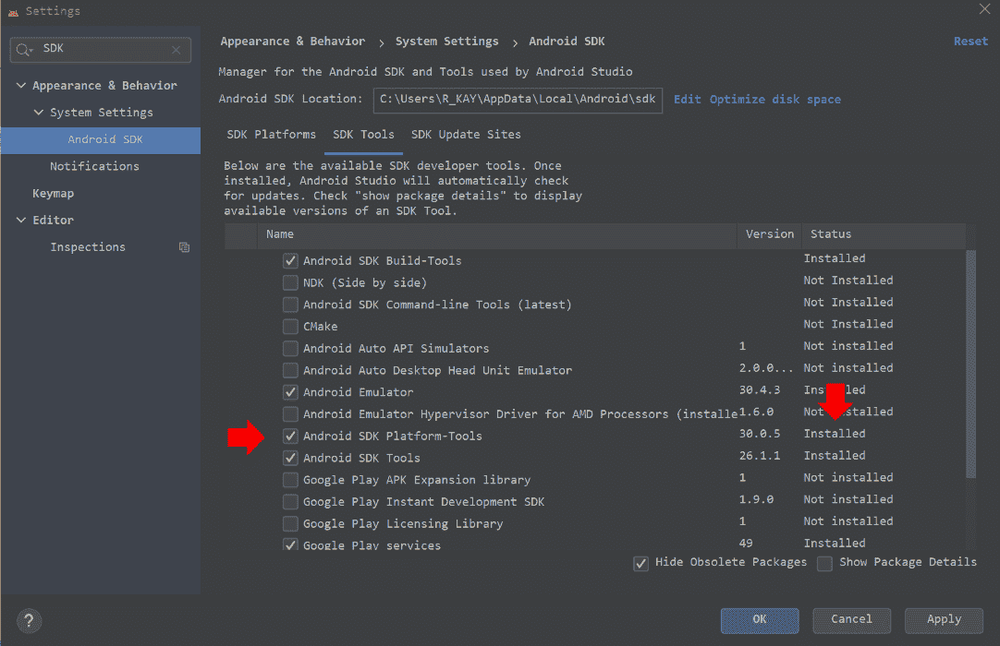
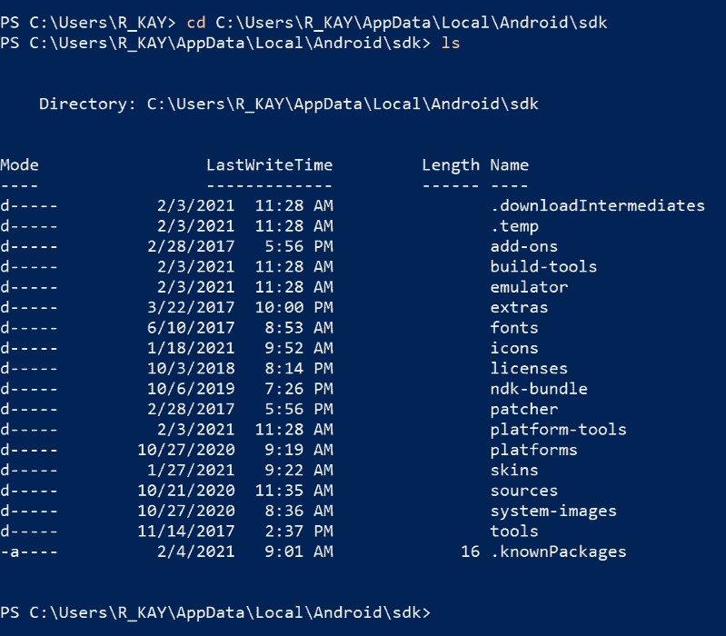
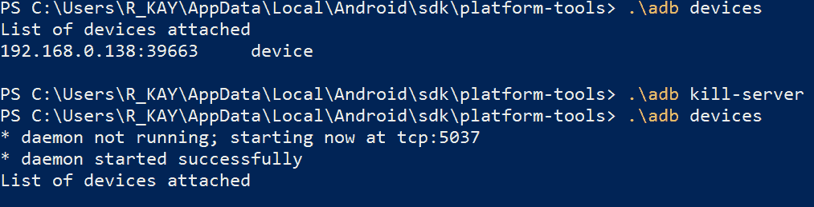
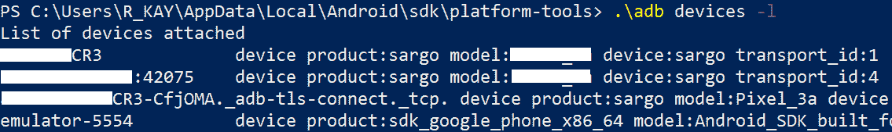
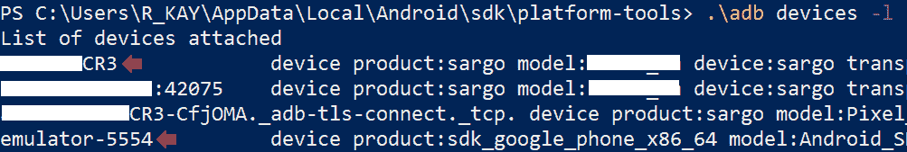
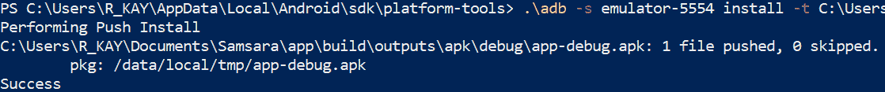
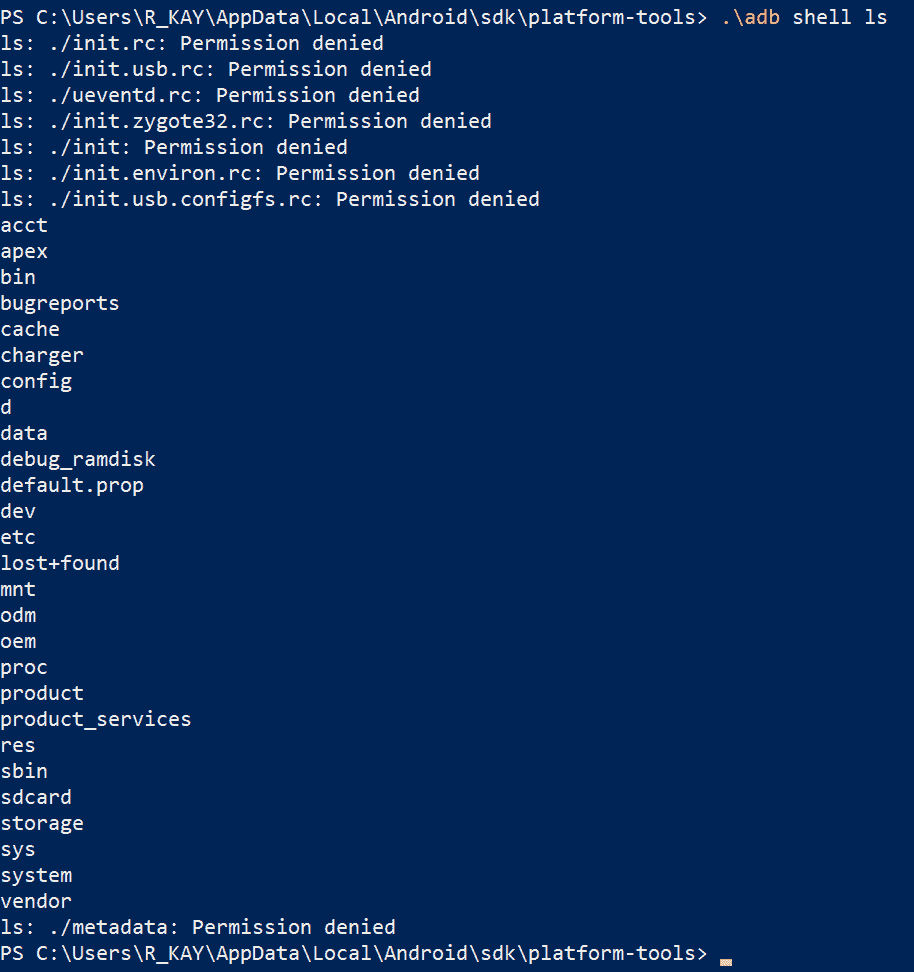
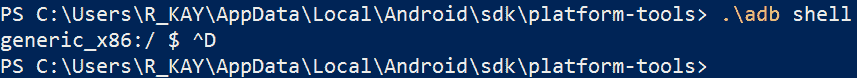
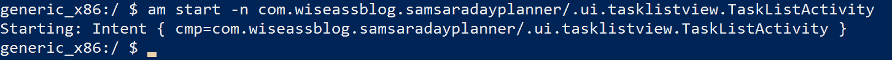

# ADB Android 安装指南:驱动程序和命令

> 原文：<https://www.freecodecamp.org/news/adb-android-install-guide-drivers-and-commands/>

在本文中，我们将探讨在安装、测试、诊断和管理一个或多个设备和仿真器时，如何使用 ADB 获得一些细粒度的控制。

在我作为软件开发人员的最初几年，主要是与 Android SDK 一起工作，我不知道 Android Debug Bridge (ADB/adb)是什么，它做什么，或者何时使用它。

有趣的是，最初促使我学习它的并不是一些专业目标。相反，这是我的引导循环 Nexus 6，我拼命想复活。对于这样的问题，Android Studio 和 Gradle 就像防水茶包一样有用。

我还想提一下，这篇文章是针对两种人写的**:**

*   **熟悉 CLI、Shell、流程和客户机-服务器模型的人**
*   **不熟悉 CLI、Shell、流程和客户机-服务器模型的人**

**对于第一类人，您可能希望跳过标题为:“**如何与亚行**合作”的部分**

**对于第二类人，我假设你和我一样是初级开发人员，对 CLI、Shells 和 ADB 知之甚少。第一部分是一些基本术语和概念的软介绍和词汇表，用我能做到的最简单的方式解释。**

## **预赛**

**在这里，我们将学习一些重要的话题，如果你想了解亚行是如何工作和使用的。**

**过去，由于嘲笑 Vim 爱好者或武断的 Unix 系统管理员，你们中的一些人可能害怕学习命令行工具。正如您将看到的，我坦率地承认 CLI 对我的大脑工作方式并不理想，所以我想您可能会喜欢我对这个主题的看法。**

### **命令行**

**简单地说，命令行是一个到计算机的接口(发送/接收信息的方式)，它只使用文本行。**

**了解命令行界面(CLI)本身并不是一个程序，而是一些程序会提供 CLI(或许还有其他界面，如 GUI)，这一点很重要。**

**在某些时候，你可能已经在 Windows 命令提示符(或者 MS-DOS，如果你是一个像我一样的 90 年代的孩子)，Mac 终端，或者像 GNOME 终端一样在许多 Linux 发行版上常见的东西。所有这些都主要通过 CLI 使用。**

**使用 CLI 的好处和不足很大程度上取决于使用它的个人，以及他们试图解决什么样的问题。我个人不喜欢使用 CLI，除非是为了我几乎每天都要做的事情。**

**我的大脑根本不适合记忆晦涩的速记文本命令(出于同样的原因，我小时候在学习阅读方面有困难)，所以我必须依赖大量基于重复的隐性记忆(肌肉记忆)和备忘单。**

**对于那些愿意花时间即使这是一场斗争的人(像我一样)，或者那些真的很擅长记住这些事情的人来说，**你可能会学会欣赏在 CLI 中比在 GUI 中更有效率。****

**许多操作只需点击各种菜单和屏幕的一小部分时间就可以完成。还可以编写脚本，脚本是包含一系列文本命令的文件，可以进一步提高效率。**

### **如何使用 ABD Shell**

**我必须假设您熟悉术语操作系统(OS ),它包括 Android、iOS、Windows、Mac、Linux 和任何其他类似 Unix 的系统。**

**为什么这个术语与亚行相关？为了解释清楚比精确更重要，Android 操作系统是基于 Linux 的，而 Linux 是基于 Unix 的。**

**因此，我们可以使用 ADB 来获得我们正在使用的设备或仿真器的 Unix Shell。这使得我们可以通过直接与外壳交互来获得很大的灵活性、功能和对设备或仿真器的控制。**

**shell 是用于与操作系统交互的程序的总称。正如龟壳为海龟提供保护和访问(也是最外层)，操作系统的外壳既保护也提供对操作系统内部工作的访问。就我个人而言，我很惊讶地得知“Shell”并不是什么深奥的缩写词。**

**不要觉得有必要过度思考这个术语。如果你正在某种计算机上阅读这篇文章，你使用了一个 shell 来帮助你到达这里。**

**shell 可以提供 CLI 或 GUI 中的一种或两种。在这两种情况下，您将使用它来创建/更新/删除/移动文件，启动其他程序，以及访问通过 shell 提供的操作系统的各种服务。**

### **如何使用 ABD 客户端和 ABD 服务器**

**再一次，让我们从一个稍微不精确的解释开始，希望更容易理解。不过，我很快会纠正这个定义。**

**客户端和服务器都是计算机。我们之所以这样区分他们，是基于他们的**角色**。例如，你的电脑(无论是台式机、笔记本电脑、手机还是其他什么)是 freeCodeCamp 服务器的客户端，该服务器**为你提供**这个 HTML 页面。**

**一般来说，客户端是使用其他东西的东西，而服务器是正在被使用的东西。不要过多考虑这个术语，因为客户机-服务器模型可以描述大量计算内外的事情。**

**现在，当我说客户机和服务器都是“计算机”时，这在我们稍后将使用这些术语的上下文中是不正确的。**

**作为程序员和工程师，我们通常应该将客户机和服务器视为进程(**进程就是一个运行的程序**)。**

**这意味着，虽然客户端进程和服务器进程经常运行在不同的计算机上，但是如果它们运行在同一台计算机上也没问题。**

**它们将在所述计算机的存储空间中占据不同的位置，因此实际上唯一的区别是它们将使用 IPC(进程间通信)进行通信，而不是通过网络连接相互发送消息。**

**我们很快就会看到，ADB 利用了一个服务器进程，它允许多个开发人员(多个客户端)管理多个 Android 设备和/或仿真器。**

**在企业设置中，这个服务器进程可能位于一台远程(通过网络连接进行通信)计算机上，但是我们将在客户端本地设置一台服务器。这样做可能比你想象的要简单得多。**

### **什么是 ABD 守护进程？**

**如果您跳过前面的内容，我已经解释过进程只是一个运行的程序。守护进程是一个在后台运行的进程，也就是说用户不直接与它交互。**

**例如，如果您打开一个 web 浏览器，那么管理连接到 Internet 所需的网络连接的实际工作很可能将由类似 NetworkManager 守护程序的东西来执行(与浏览器进程本身相反)。**

**假设配置正确，每个 Android 设备(物理的或仿真的)都有一个 ADB 守护进程(adbd ),它执行服务器进程给它的命令。**

**简而言之，当我们的客户端向服务器发出命令时，服务器会将该命令转发给 ADBD，后者会在设备上执行该命令。**

## **如何使用 ADB 进行 Android 开发**

**在本文的剩余部分，我们将探讨以下主题:**

*   **在您的系统上使用 ADB 所需的驱动程序和配置**
*   **将 ADB 与物理设备和仿真器一起使用**
*   **使用 ADB 命令行界面的基本命令**
*   **通过 ADB 使用 Android 设备外壳的更复杂用法一览**

**在继续之前，您需要确定将使用何种 CLI 工具与 ADB 进行交互。在 Windows 上，我更喜欢使用 PowerShell，但是命令提示符也可以。对于 Linux 和 Mac，默认终端应该可以工作。**

**随便用能完成工作的东西。**

**这篇文章包含了整个过程的非常详细的解释，但是我准备了一个视频教程，在这里简要地介绍了它:**

 **[https://www.youtube.com/embed/g___gGA9jn8?feature=oembed](https://www.youtube.com/embed/g___gGA9jn8?feature=oembed)

Video tutorial for the adb.** 

### **如何理解 CLI 示例**

**本文包含许多可以输入到您首选的 CLI 工具中的命令。给定命令中随情况变化的任何部分都将写在尖括号内。**

**不要在您编写的 CLI 命令中包含尖括号。**

**例如，如果我写道...：**

**`adb pair <ip-address>:<port>`**

**...您可以用尖括号和名称代替实际值，例如:**

**`adb pair 192.168.0.1:5554`**

### **ABD 驱动程序和配置**

**首先，确保你有最新版本的 Android SDK 平台工具。如果出于某种原因，您不使用 Android Studio (AS ),请单击该链接并下载适用于您各自操作系统的独立软件包。**

**如果你有 Android Studio，你可以使用 SDK 管理器下载或更新这个包。**

**在 AS 中通常有一个工具栏图标来打开 SDK 管理器，但他们喜欢改变几乎每个修补程序的外观。**

**如果你没有找到，进入**文件- >设置**，在搜索栏输入“SDK”，搜索“Android SDK”菜单项。**

**

Systems setting showing that Android SDK Platform Tools are installed** 

**下一步的变化取决于许多变量。正如在**准备工作**部分中所讨论的，ADB 使用客户端-服务器模型，在如何使用该工具方面允许很大的灵活性。**

**更具体地说，您可能有:**

*   **多个客户端与远程服务器交互**
*   **一台客户机的本地服务器(同一台计算机)**
*   **各种物理设备和仿真器连接到同一个服务器**

**使用 ADB 可以对多个客户端和大量设备进行高级配置，但这超出了本文的范围。**

**一台服务器可以管理多达 16 个仿真器和您想要的任意多的物理设备(在合理的范围内)，而不需要高级配置。**

**在本文的剩余部分，我们将最多使用一个物理设备和一个用于单个 ADB 服务器进程的仿真器。**

#### **如何配置 ABD 模拟器**

**很可能您不需要做任何进一步的配置，但是您可能需要在您的仿真器上启用**开发者选项**。当我们使用前几个 ADB 命令时，您很快就会知道它是否正常工作。**

**如果你想在你的模拟器上启用这个特性，你需要[研究](https://developer.android.com/studio/debug/dev-options)如何为你的特定版本的 Android 实现这个功能。**

### **USB 调试–如何配置物理设备**

**如果你不打算使用实体 Android 设备，你可以跳过这一节。但是，值得注意的是，您可能仍然需要启用开发人员选项**

**为了继续，您需要在您的 Android 设备和开发机器上配置 USB 调试或 WiFi 调试。**

**无论是哪种情况，首先都要在你的设备上启用**开发者选项**。你将需要[研究](https://developer.android.com/studio/debug/dev-options)如何为你的特定版本的 Android 做到这一点。**

#### **USB 调试**

**确保您已经通过开发人员选项在 Android 设备上启用了 USB 调试。我上面分享的链接将描述这个过程，这个过程在不同版本的 Android 操作系统之间会有所变化。**

**在继续之前，Windows 用户需要[下载一个 USB 驱动程序](https://developer.android.com/studio/run/oem-usb)。Ubuntu 用户也[需要一些额外的步骤](https://developer.android.com/studio/run/device)。对于 Mac 和 Chrome OS，您应该已经准备好了。**

**一旦通过开发者选项启用了 USB 调试，通过 USB 电缆连接您的 Android 设备。**

#### **WiFi 调试**

**如果您碰巧有多个物理设备或缺少 USB 电缆，那么您可能希望选择 WiFi 调试。**

**同样，访问 Android 设备上的开发者选项并启用无线调试。它应该提示您允许在设备当前连接的网络上进行调试，您应该允许(假设是适当的网络)。**

****开始使用您的 CLI 的时间**。首先，您需要在 Android SDK 安装目录中找到平台工具目录(或文件夹——同样的东西)。**

**假设你已经安装了 Android Studio，通过应用程序找到它的一个快速方法是再次进入文件->设置，然后在搜索栏中键入“SDK”。“Android SDK”菜单将显示 SDK 的安装位置，这将是包含平台工具的目录。**

**在下面的例子中，**我复制了我的 Android SDK 目录**的路径，然后打开了一个 Windows PowerShell 的实例。然后，我输入了以下命令:**

****更改目录:****

```
`cd <path-to-SDK-directory>`
```

****列出文件和目录:****

```
`ls`
```

****

**接下来，我输入`cd platform-tools`导航到那个目录。请注意，以下步骤假设您使用的是运行 Android OS 11 或更高版本的设备。**

**如果你使用的是运行 Android 10 或更低版本的设备，详细的说明可以在这里找到。**

**一旦进入平台工具目录，您就可以使用以下步骤将 Android 设备与开发机器配对了。在设置- >系统- >开发者选项的无线调试子菜单中，选择**用配对代码**配对设备。**

**2.在应设置为平台工具目录的 CLI 工具中，输入以下命令:**

**`adb pair <IP address>:<Port>`**

**其中 IP 地址和端口都来自您的 Android 设备上的对话，该对话在选择**将设备与配对代码**配对后弹出(不包括尖括号)。**

****注意:根据您使用的 CLI 工具、您的操作系统和您的访问控制，您可能需要在对 adb 的调用前添加一些其他符号或命令。例如，我必须打字。\adb 对< IP 地址> : <端口>使用 Windows 上的 PowerShell。****

**3.假设您的 CLI 一切顺利，您将被提示输入配对代码，该代码在 Android 设备上的同一个对话框中显示，并为您提供了 IP 地址和端口号。**

**4.输入配对代码后，如果您收到以下信息，您将知道此操作成功:**

**`Successfully paired to <IP Address>:<Port> [guid=<Some GUID>]`**

**5.如果您使用的是 Windows 或 Linux，您还需要使用 IP 地址和端口运行以下命令，IP 地址和端口可在无线调试首选项菜单中看到(不是在选择使用配对代码配对设备后弹出的对话框):**

**`adb connect <IP Address>:<Port>`**

**之后，您应该会在电话上收到通知，表明您已连接。**

### **如何使用 ADB:命令**

**假设您成功地正确配置了您的 Android 设备和开发机器，现在您可以使用 ADB 工具了。**

**在继续之前，使用 CLI 工具导航到包含 adb 的目录(除非您只是按照上一节中设置 WiFi 调试的步骤操作)。**

**否则，现在就这样做，或者查看该部分，了解如何找到该文件夹的说明。**

#### **如何查看哪些设备当前连接到服务器**

**现在，您可以通过在 adb 上调用除`adb kill-server`之外的任何命令来启动 ADB 服务器。无论您的服务器进程是否正在运行，请键入以下命令:**

**`adb devices`**

****

**在上面的截图中，当我的 Android 手机连接到服务器时，我第一次调用了`adb devices`。通过`adb kill-server`命令杀死服务器后，我再次调用重启服务器的设备。**

**同样，如果 ADB 服务器当前没有运行，**或多或少调用任何 ADB 命令都会启动服务器备份**(当然除了`adb kill-server`)。有一个显式的`adb start-server`命令，但实际上我从未需要使用它。**

**由于服务器被重置，设备没有返回任何项目。因此，在进入下一个例子之前，我必须再次使用前面部分描述的`adb pair`和`adb connect`(如果在 Windows 或 Linux 上)命令。**

**现在，我已经使用 PowerShell 和模拟器程序启动了一个模拟器，该模拟器程序也位于平台工具的子目录“模拟器”中**

**当然，如果你愿意，你可以使用 AVD 管理器或 Android Studio 来启动一个仿真器，并按照示例进行操作。**

**如果您有许多连接的设备，`adb devices`命令的一个有用的选项是`-l`，它给你关于设备的更多信息。**

**下面你会看到几个条目，涉及我的物理 Android 设备，以及一个连接到特定端口的仿真器:**

****

#### **如何向特定设备发送命令**

**为了避免意外阻塞我的手机，我想改为向模拟器发送命令。为此，在输入命令之前，我必须在前面加上`-s`选项，后面跟着目标设备的序列号。**

**序列号是使用 devices 命令后描述所连接设备的第一组字符。**

**例如，在这种情况下，仿真器的序列号就是单词 emulator，后跟仿真器当前连接的端口。**

****

**另一个红色箭头指向我手机的序列号(由于明显的原因被屏蔽了)。**

**当然，如果您只连接了一个设备(无论是哪种设备)，您不需要使用`-s`选项。**

#### **在设备上安装 APK(应用程序)**

**我现在将使用`adb install`命令在运行的仿真器上安装一个测试 APK。**

**这基本上相当于让 Android Studio 和 Gradle 安装一个调试 APK。正如您将看到的，测试 apk 要求在 install 命令后有`-t`选项:**

**`adb -s <device-serial-number> install -t <path-to-APK>`**

****

****注意:Android OS 要求任何 APK 必须签名后才能安装**(即使只是测试/调试 APK)。**

**一种解决方案是构建并运行要安装在 Android Studio 中的应用程序，Android Studio 将使用生成的调试证书对其进行签名。您可以通过访问此[链接](https://developer.android.com/studio/publish/app-signing#debug-mode)探索签署 APK 的其他几种方式。**

#### **亚行还能做什么？**

**在我们了解 ADB 的一些更高级的用法之前，我强烈建议您尝试一下`adb --help`命令。与大多数基于 CLI 的程序一样，help 命令将打印出描述该工具的各种命令和选项的文档。

我很高兴地说，亚洲开发银行的文档非常易读和有用，而在 CLI 程序中并非总是如此。**

## **先进的亚行使用技巧**

**在本文中讨论 ADB 的每一种用法和命令对我们来说都是浪费时间。**

**如果有任何困惑，使用 ADB 来安装 apk 并做 Android Studio 和 Gradle 为您做的许多事情，这不是我推荐的事情(除非您有一个好的理由这样做)。**

**话虽如此，但如果没有亚行，它能做的很多事情要么很难做，要么不可能做。**

**在预备部分，我提到 ADB 可以用来钩住设备外壳。作为本文的结尾，我们将看看如何使用 shell 命令，以及在哪里可以找到关于它们的更多信息。**

**如果您不知道什么是 shell，那么您可能跳过了上面我解释的部分。**

### **如何使用 ABD Shell**

**使用 ADB 向设备外壳发送命令相当简单。请记住，如果您连接了多个设备，请在其后跟随`-s <device-serial-number>`将命令指向特定设备。**

**要创建一个 shell 命令，我们必须使用`adb shell`命令(大惊喜，嗯？)，后面是我们想要在设备外壳上发出的实际命令:**

**`adb shell ls`**

**输出:**

****

**如前所述，`ls`命令显示 CLI 当前目录下的文件和目录列表。这恰好是 Android 设备的根目录，直到我们移动到一个不同的目录。**

**如果您计划通过 Shell 执行许多命令，您还可以启动一个交互式 Shell 会话。这可以通过简单的命令来完成:**

**`adb shell`**

**在交互式 Shell 会话中，您可以直接键入 Shell 命令，而无需进一步使用`adb shell <command>`。**

**请注意，当您想要退出交互式 Shell 会话时，可以通过键入`exit`或按 Ctrl + D 来完成。**

****

**您可以通过 Shell 使用各种不同的命令和实用程序。Android 设备的 ActivityManager ( `am`)对于在不同环境下测试 Android 应用程序的不同组件(活动、服务、广播接收器等)特别有用。**

**假设我们想直接启动一个特定的活动，但是这个活动在清单中没有被指定为启动器活动。**

**您仍然需要将`android:exported=”true”`属性添加到您想要启动的清单中的每个`<activity/>`条目中(假设它还不是启动器活动)。**

**之后，您可以使用以下命令直接转到它:**

**`am start -n <app-package-id>/<activity-name>`**

**请注意，`<activity-name>`必须包含相对于 package-id 的、它所在的任何包。关于启动位于几个包中的活动的示例，请参见下面的输出。**

****

### **进一步阅读**

**我在这篇文章中的目标是尽我所能用我自己的话(在可能的范围内)介绍、解释和指导你 ABD 的用法。**

**在这一点上，我需要开始制作一些非常做作的例子或者简单地复制文档，这两者都不是我感兴趣的事情。**

**相反，我想鼓励您访问[文档](https://developer.android.com/studio/command-line/adb#shellcommands)，并简要了解一下您可以使用活动管理器、包管理器、策略管理器等工具做的一些很酷的事情。**

#### ****你可以在社交媒体上联系我:****

**[https://www.instagram.com/rkay301/](https://www.instagram.com/wiseassbrand/)
https://www.facebook.com/wiseassblog/https://twitter.com/wiseass301http://wiseassblog.com/**