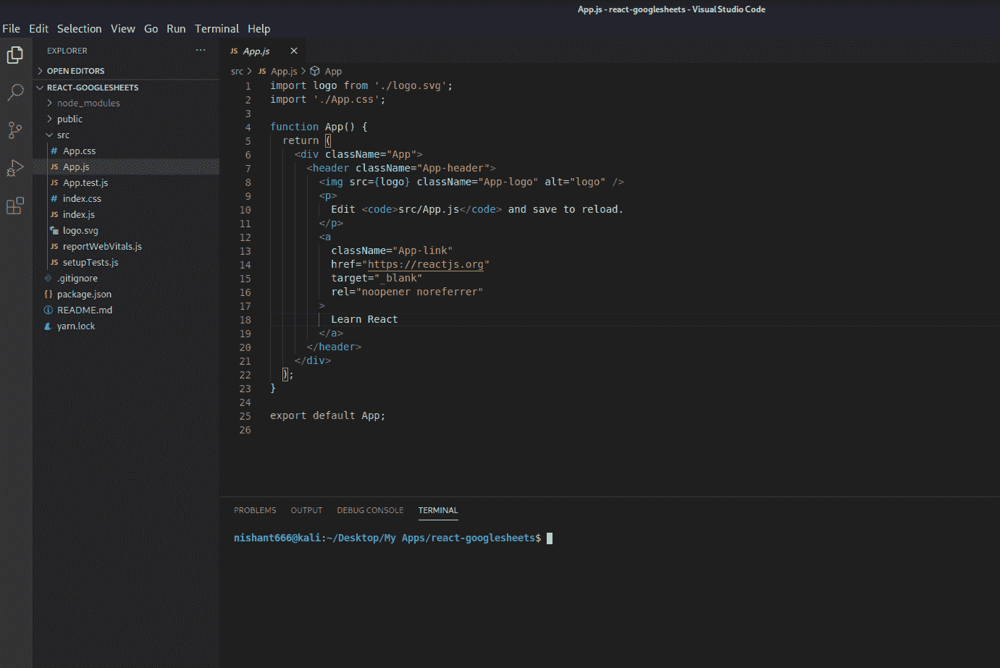
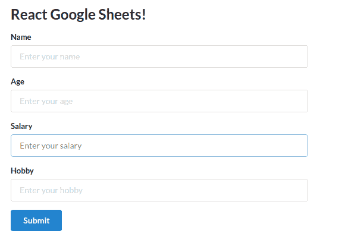
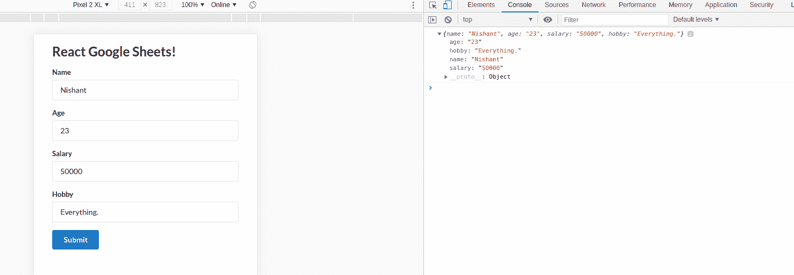
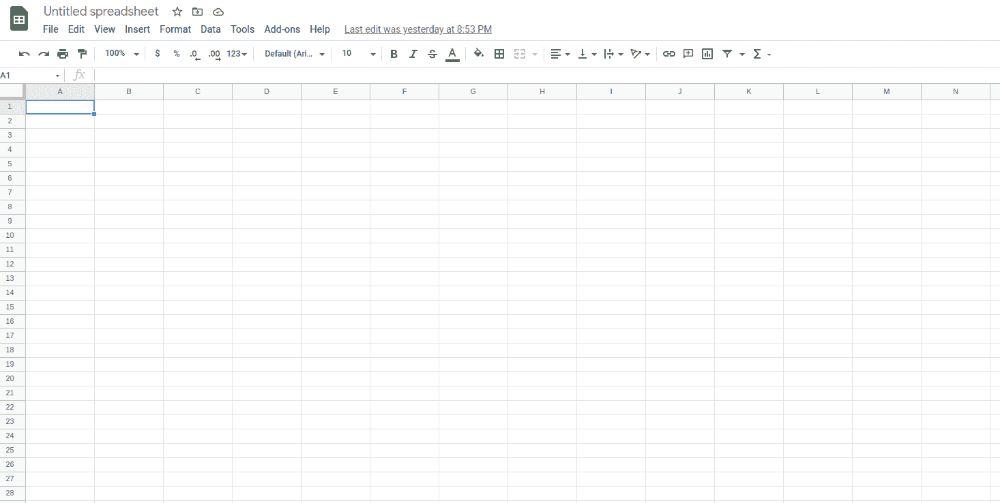
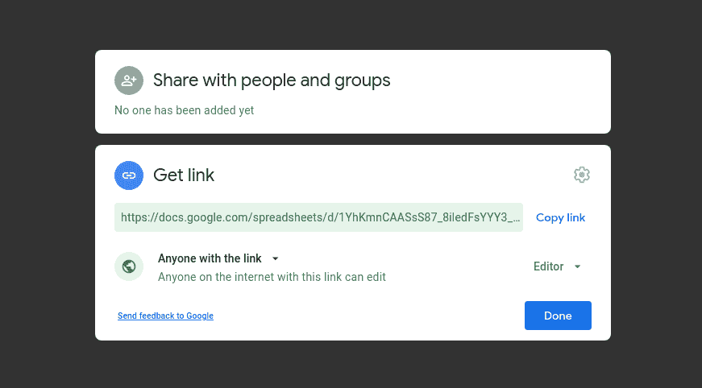
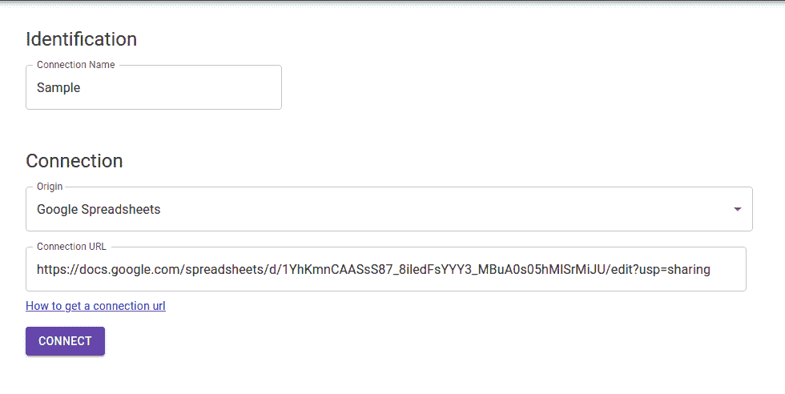
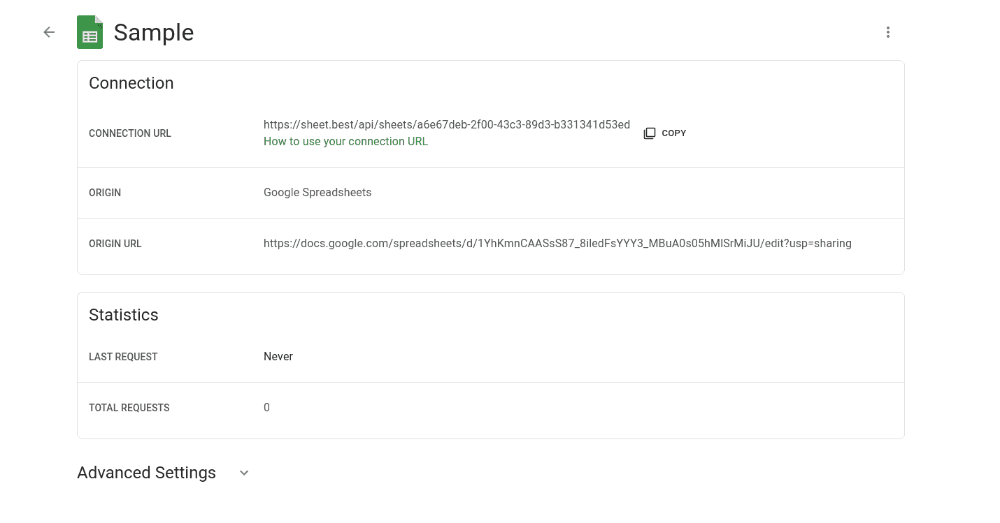
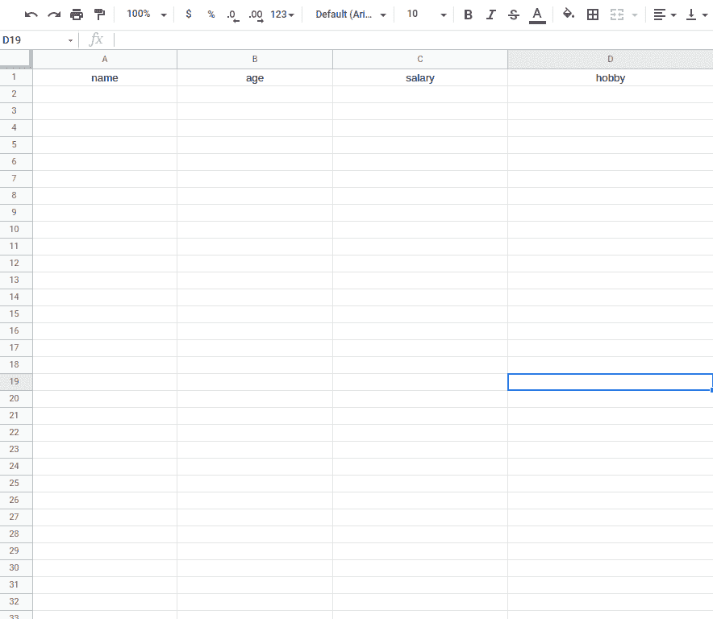
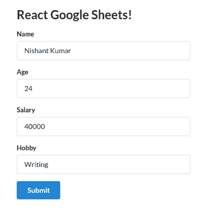

# 如何将 Google Sheets 转换成 REST API 并与 React 应用程序一起使用

> 原文：<https://www.freecodecamp.org/news/react-and-googlesheets/>

向 API 发布数据从来都不容易。但是您使用过 React 将表单数据发布到 Google Sheets 吗？如果没有，那么这个教程是给你的。

今天，我们将讨论如何像 REST APIs 一样将表单数据从 React 发布到 Google Sheets。

## 首先，创建您的 React 应用程序。

首先，您可以使用 create-react-app 来设置 react 应用程序。

只需键入`npx create-react-app react-googlesheets`来设置项目目录。



The folder structure

## 如何安装语义 UI

语义 UI 是一个框架，用于设计和开发美观且响应迅速的布局。它有按钮、容器、列表、输入等组件。

要在 React 应用程序中安装语义 UI，请使用以下命令:

```
npm install semantic-ui-react semantic-ui-css
```

安装完成后，打开 index.js 文件并在顶部导入以下内容:

```
import 'semantic-ui-css/semantic.min.css'
```

现在，使用命令 **`npm start`** 运行应用程序。

## 让我们创建一些输入框

让我们创建一个表单和输入框，从 React 应用程序中获取姓名、年龄、工资和爱好等信息。

这里，我们从 *semantic-ui-react* 库中导入按钮、表单、容器和标题，并创建表单字段。

```
import React, { Component } from 'react'
import { Button, Form, Container, Header } from 'semantic-ui-react'
import './App.css';

export default class App extends Component {
  render() {
    return (
      <Container fluid className="container">
        <Header as='h2'>React Google Sheets!</Header>
        <Form className="form">
          <Form.Field>
            <label>Name</label>
            <input placeholder='Enter your name' />
          </Form.Field>
          <Form.Field>
            <label>Age</label>
            <input placeholder='Enter your age' />
          </Form.Field>
          <Form.Field>
            <label>Salary</label>
            <input placeholder='Enter your salary' />
          </Form.Field>
          <Form.Field>
            <label>Hobby</label>
            <input placeholder='Enter your hobby' />
          </Form.Field>

          <Button color="blue" type='submit'>Submit</Button>
        </Form>
      </Container>
    )
  }
} 
```

App.js

```
.form{
  width: 500px;
}

.container{
  padding:20px
}
```

App.css

这是它看起来的样子:



Output form

现在，我们完成了用户界面。让我们添加一些功能。

首先，让我们在构造函数中为我们的四个表单字段创建状态。

```
import React, { Component } from 'react'
import { Button, Form, Container, Header } from 'semantic-ui-react'
import './App.css';

export default class App extends Component {
  constructor(props) {
    super(props)

    this.state = {
       name: '',
       age: '',
       salary: '',
       hobby: ''
    }
  }

  changeHandler = (e) => {
    this.setState({[e.target.name] : e.target.value})
  }

  submitHandler = e => {
    e.preventDefault();
    console.log(this.state);
  }

  render() {
    const { name, age, salary, hobby } = this.state;    (*)
    return (
      <Container fluid className="container">
        <Header as='h2'>React Google Sheets!</Header>
        <Form className="form" onSubmit={this.submitHandler}>
          <Form.Field>
            <label>Name</label>
            <input placeholder='Enter your name' type="text" name = "name" value = {name} onChange={this.changeHandler}/>
          </Form.Field>
          <Form.Field>
            <label>Age</label>
            <input placeholder='Enter your age' type="number" name = "age" value = {age} onChange={this.changeHandler}/>
          </Form.Field>
          <Form.Field>
            <label>Salary</label>
            <input placeholder='Enter your salary' type="number" name = "salary" value = {salary} onChange={this.changeHandler}/>
          </Form.Field>
          <Form.Field>
            <label>Hobby</label>
            <input placeholder='Enter your hobby' type="text" name = "hobby" value = {hobby} onChange={this.changeHandler}/>
          </Form.Field>

          <Button color="blue" type='submit'>Submit</Button>
        </Form>
      </Container>
    )
  }
} 
```

这里，我们有四个表单域和它们各自的状态。我们还有一个 changeHandler 方法来跟踪输入值的变化。

让我们在 render 方法中析构状态，并将它们的值添加到输入的 value 属性中(行*)。

我们最不需要的是 onSubmit 处理程序。在 form 标记上，添加 onSubmit 事件并分配 submitHandler 方法。

填写表单并单击提交。你将在控制台中输入数据。

就是这样——我们有一个表格，将姓名、年龄、工资和爱好记录到控制台中。



## 
如何将数据发布到 Google Sheets

让我们把 Google sheets 改成 REST API。

我们将把数据作为 REST API 发布到 Google Sheets，为此，我们需要安装 Axios。它是一个可以用来向 API 发送请求的库，就像 *fetch 一样。*

单击文件，新建，电子表格，打开一个新的电子表格。



将工作表命名为您选择的名称，然后保存。

单击屏幕右上角的共享按钮，并将权限编辑为公开。



复制链接并前往[https://sheet.best/](https://sheet.best/)创建您的免费账户。

创建一个新的连接，并将从 Google Sheets 复制的 URL 粘贴到 connection URL 框中。



点击连接。您将被重定向到您的连接页面。在这里，你可以看到你所有的连接。单击新连接的详细信息。



复制连接 URL。此 URL 将用作发送 POST 请求的端点。

现在，让我们安装 Axios。在您的终端中键入`npm install axios`来安装该软件包。

安装完成后，将其导入到文件的顶部。我们将在 submitHandler 函数中发出 POST 请求。

```
submitHandler = e => {
    e.preventDefault();
    console.log(this.state);

    axios.post('url', this.state)
    .then(response => {
      console.log(response);
    })
  }
```

submitHandler Method

用上面的代码替换 submitHandler 函数。这里，我们使用 Axios 将数据发送到 URL，并使用**在控制台中获取响应。然后**关键词。

粘贴从 **sheet.best** 复制的连接 URL 端点，替换为 axios . post(‘URL’)*中的 URL。*

```
submitHandler = e => {
    e.preventDefault();
    console.log(this.state);

    axios.post('https://sheet.best/api/sheets/a6e67deb-2f00-43c3-89d3-b331341d53ed', this.state)
    .then(response => {
      console.log(response);
    })
  }
```

submitHandler function

现在，打开谷歌表单，填写第一列，即姓名、年龄、工资和爱好。请仔细填写，否则无法使用。它应该区分大小写。



Add name, age, salary and hobby fields

现在，运行 React 应用程序并填写输入字段。你会看到数据一个接一个地被填充到你的谷歌表单中。



React form


Sample Fields

这是所有的乡亲。现在您知道如何将 Google Sheets 转换成 REST API 了。现在，您使用 React 应用程序将数据存储在 Google Sheets 中。

或者，你可以[在 Github](https://github.com/nishant-666/React-GoogleSheets) 上找到代码进行实验。

如果你愿意，你也可以在我的 YouTube 频道观看这个教程。

> *快乐学习。*