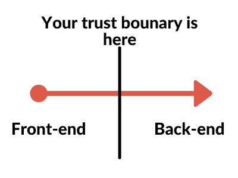

# 什么是起毛？用例子解释模糊测试

> 原文：<https://www.freecodecamp.org/news/whats-fuzzing-fuzz-testing-explained/>

我最近浏览了谷歌 GitHub 上的一些开源库。我看到他们有一个持续模糊化的仓库。我甚至不知道什么是模糊，更不用说连续模糊了。

# 那么什么是模糊呢？

模糊化(Fuzzing)是一种自动测试软件的方法，有时也被称为 T2。一般来说，**模糊器**向程序提供大量无效或随机的输入。该测试试图导致崩溃、错误、内存泄漏等等。

通常， **fuzzing** 在需要输入的程序上效果最好，比如可能会要求输入你的姓名和年龄的网站。

我们可以尝试各种不同的字符串来引起问题，比如:“Powerلُلُصّبُلُلصّبُررً ॣ ॣh ॣ ॣ冗”(这个 iOS 过去崩溃了)，“ṯ̤͍̥͇͈h̲́e͏͓̼̗̙̼̣͔͇̜̱̠͓͍ͅn͕͠e̗̱z̘̝̜̺͙p̤̺̹͍̯͚e̠̻̠͜r̨̤͍̺̖͔̖̖d̠̟̭̬̝͟i̦͖̩͓͔̤a̠̗̬͉̙n͚̻̞̰͚͜ͅh̵͉i̳̞v̢͇ḙ͎͟-҉̭̩̼͔m̤̭̫i͕͇̝̦n̗͙ḍ̟̯̲͕͞ǫ̟̯̰̲͙̻̝f ̪̰̰̗̖̭̘͘c̦͍̲̞͍̩̙ḥ͚a̮͎̟̙͜ơ̩̹͎s̤.̝̝҉z̡̖̜͖̰̣͉̜a͖̰͙̬͡l̲̫̳͍̩g̡̟̼̱͚̞̬ͅo̗͜.̟”😍”或“未定义”。

**模糊化**背后的整个想法是试图在代码库中找到边缘案例。您使用它来确保您所做的所有解析、数据接受、数据存储和数据读取都不会导致错误。

这也是一个相当完整的测试，因为您可以测试在您的站点中存储类似于零宽度空格(Unicode 中的 U+200B)的内容的完整流程，以检查问题。

有些人试图将代码注入输入字段(这是 **fuzzing** 的一部分，简称**代码注入**)像``一样作为名称输入。

恶意黑客不希望你测试非标准输入，因为你可能有应用程序破坏错误-他们可以利用这一点来窃取数据或反复崩溃你的应用程序/服务器。

看看[这个](https://github.com/minimaxir/big-list-of-naughty-strings) GitHub 叫做**淘气字符串大名单**。这是一个很有可能导致问题的字符串列表。

您可以查看一些`.json`和`.txt`文件，看看过去是什么导致了问题，并阅读一些评论，了解*确切地说*它们为什么会有问题。

例如，有些字符串是倒写的“uʍopǝpᴉsd∩”，你可以在这里做。有些字符串可能被标记为亵渎或不适当，但实际上是无辜的(这被称为 [S](https://en.wikipedia.org/wiki/Scunthorpe_problem) [cunt](https://en.wikipedia.org/wiki/Scunthorpe_problem) horpe 问题)。或者甚至是可以暴露系统文件的字符串，如果它们被配置不良的 XML 解析器解析的话。

# 谁使用 Fuzzing？

正如我已经提到的，Fuzzing 在**软件测试**中可以用来发现你的程序中的错误。但它在网络安全和黑客攻击方面也有应用。

在其网络安全应用中，黑客希望跨越信任的界限。一个**信任边界**是计算机系统中的一个地方，在这里数据从一个区域传递到另一个区域，来自一个可信的来源。

作为一个例子，假设在您的前端，您接收一个用户名，确保它是有效的，然后将它传递到您的后端。你的**信任边界**这里是数据从前端传递到后端的假想线。

如果您的后端只是信任数据而不验证它(因为前端已经验证了它！)这可能是个问题。只要黑客能够通过你的前端检查，他们就被**信任**输入，并可以尝试插入恶意字符串作为输入。

这就是 **fuzzing** 可以帮助抽查以确保您捕捉到这些类型的问题的地方。

比方说，有人要对谷歌 Chrome 浏览器进行模糊处理。一种方法是在调试工具中运行浏览器，这样他们就可以跟踪 Chrome 执行的命令，并分析其内存管理。

然后，黑客会将他们正在观察的 Chrome 程序指向他们的一台服务器。然后，黑客的服务器会创建数百万个不同的网页，Chrome 会加载这些网页，所有网页中的 JS、CSS 和 HTML 都略有不同，以试图破坏黑客正在分析的 Chrome。

这些黑客可以合理地持续运行这些自动化测试几个月，收集大量 Chrome 日志(如崩溃、内存溢出等)，并试图找出导致崩溃的原因。

只是让它崩溃不是这里的最终目标。一旦这些黑客知道什么样的输入导致崩溃，他们就可以调查这些东西导致崩溃的原因，看看他们是否可以利用这些漏洞做一些邪恶的事情，或者访问他们不应该访问的东西。你可以在这里阅读更多关于上面的例子[。](https://www.wired.com/2016/06/hacker-lexicon-fuzzing/)

谷歌[目前](https://google.github.io/clusterfuzz/) **在 30，000 台虚拟机上模糊**他们自己的应用程序！所以你不太可能有任何进展，因为他们已经广泛地**模糊**。

谷歌的[OSS-模糊](https://github.com/google/oss-fuzz)在谷歌 Chrome 代码中发现了超过 25，000 个错误，在其他使用 OSS-模糊的开源代码库中发现了大约 22，500 个错误。

回到我的主题。谁用**模糊**？我敢打赌，任何必须保护其数字资产或信息的公司要么雇佣测试人员来**模糊他们的产品，要么自己动手。**

# **结论**

我希望这已经解释了什么是**模糊化**以及它的一些应用。

如果你想更深入地研究这个话题，你可以在 GitHub 的这里找到大量的资源。从课程、文章、视频到工具，一切都可以帮助你学习如何**模糊化**。

如果你喜欢这篇文章并想看更多，我在 Twitter 上分享我的文章。