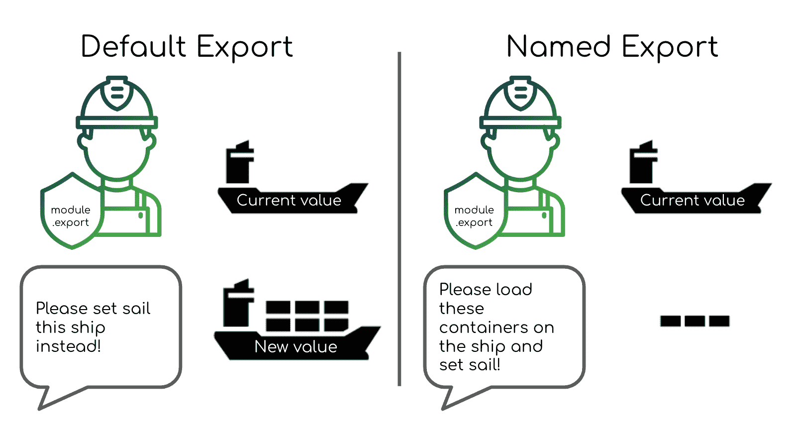

# 解释节点模块导出——带有 JavaScript 导出函数示例

> 原文：<https://www.freecodecamp.org/news/node-module-exports-explained-with-javascript-export-function-examples/>

软件开发最强大的一点是重用和建立在他人基础上的能力。这种代码共享帮助软件以惊人的速度发展。

这种奇妙的机制在微观层面上对单个项目和团队都是至关重要的。

对于 Node.js 来说，这个代码共享过程——无论是在单个项目中还是在外部 npm 依赖关系中——都是通过使用`module.exports`或`exports`来实现的。

# 节点模块如何工作

我们如何使用模块导出来插入一个外部模块，或者明智地将我们的项目分解成多个文件(模块)？

之所以创建 Node.js 模块系统，是因为它的设计者不希望它像它的浏览器对手一样，遭受同样的全局范围中断的问题。他们实现了 [CommonJS 规范](https://en.wikipedia.org/wiki/CommonJS)来实现这一点。

这个难题的两个重要部分是`module.exports`和`require`函数。

## 模块导出的工作原理

`module.exports`实际上是`module`对象的一个属性。这是`module`物体的样子，当我们`console.log(module)`:

```
Module {
  id: '.',
  path: '/Users/stanleynguyen/Documents/Projects/blog.stanleynguyen.me',
  exports: {},
  parent: null,
  filename: '/Users/stanleynguyen/Documents/Projects/blog.stanleynguyen.me/index.js',
  loaded: false,
  children: [],
  paths: [
    '/Users/stanleynguyen/Documents/Projects/blog.stanleynguyen.me/node_modules',
    '/Users/stanleynguyen/Documents/Projects/node_modules',
    '/Users/stanleynguyen/Documents/node_modules',
    '/Users/stanleynguyen/node_modules',
    '/Users/node_modules',
    '/node_modules'
  ]
} 
```

上面的对象基本上描述了一个来自 JS 文件的封装模块，其中`module.exports`是任何类型的导出组件——对象、函数、字符串等等。Node.js 模块中的默认导出非常简单:

```
module.exports = function anExportedFunc() {
  return "yup simple as that";
}; 
```

还有另一种从 Node.js 模块导出的方法，称为“命名导出”。我们不是将整个`module.exports`赋值，而是将默认`module.exports`对象的单个属性赋值。大概是这样的:

```
module.exports.anExportedFunc = () => {};
module.exports.anExportedString = "this string is exported";

// or bundled together in an object
module.exports = {
  anExportedFunc,
  anExportedString,
}; 
```

命名导出也可以用模块范围的`exports`预定义变量更简洁地完成，如下所示:

```
exports.anExportedFunc = () => {};
exports.anExportedString = "this string is exported"; 
```

然而，将整个`exports`变量赋给一个新值是行不通的(我们将在后面的章节中讨论原因)，并且经常让 Node.js 开发人员感到困惑。

```
// This wont work as we would expect
exports = {
  anExportedFunc,
  anExportedString,
}; 
```

假设 Node.js 模块导出是运输容器，用`module.exports`和`exports`作为港口人员，我们将告诉他们我们想要哪艘“船”(即值)到达“外国港口”(项目中的另一个模块)。

“默认出口”会告诉`module.exports`哪艘“船”要起航，而“指定出口”会将不同的集装箱装载到`module.exports`要起航的船上。



My "flagship" analogy for Node.js module.exports' role

现在我们已经把船开走了，我们的“外国港口”如何把出口的船收进来呢？

## Node.js require 关键字的工作原理

在接收端，Node.js 模块可以通过`require`导入导出的值。

假设这是在`ship.js`中写的:

```
...
module.exports = {
  containerA,
  containerB,
}; 
```

我们可以很容易地将“船”导入我们的`receiving-port.js`:

```
// importing the whole ship as a single variable
const ship = require("./ship.js");
console.log(ship.containerA);
console.log(ship.containerB);
// or directly importing containers through object destructuring
const { containerA, containerB } = require("./ship.js");
console.log(containerA);
console.log(containerB); 
```

关于这个外国港口运营商——`require`——需要注意的重要一点是，这个人坚持接收由`module.exports`从海的另一边送来的**船只。这将我们带到下一节，我们将解决一个常见的混淆点。**

## `module.exports`vs`exports`–有什么区别，什么时候用哪个？

既然我们已经学习了模块导出和请求的基础知识，那么是时候解决 Node.js 模块中常见的混淆来源之一了。

这是刚开始使用 Node.js 的人经常犯的一个常见的模块导出错误。他们将`exports`赋给一个新值，认为这与通过`module.exports`的“默认导出”是一样的。

然而，这是行不通的，因为:

*   `require`将仅使用来自`module.exports`的值
*   `exports`是一个模块范围的变量，最初指的是`module.exports`

因此，通过将`exports`赋给一个新值，我们有效地将`exports`的值指向另一个引用，而不是最初对与`module.exports`相同的对象的引用。

如果你想进一步了解这个技术解释，[node . js 官方文档](https://nodejs.org/api/modules.html#modules_exports_shortcut)是一个很好的起点。

回到我们之前使用船只和操作员进行的类比:`exports`是另一个港口人员，我们可以向其通知离港船只。开始时，`module.exports`和`exports`都有相同的关于即将离开的“船”的信息。

但是如果我们告诉`exports`这艘即将离开的船将会是一艘不同的船(也就是给`exports`赋予一个全新的值)会怎么样呢？然后，无论我们后来告诉他们什么(比如给`exports`的属性赋值)，都不会出现在`module.exports`实际上要起航被`require`接收的船上。

另一方面，如果我们只告诉`exports`将一些容器装载到即将启航的船上(将`exports`的属性分配给 value)，我们实际上会将“容器”(也就是属性值)装载到正在启航的船上。

基于上面解释的常见错误，我们肯定可以围绕在 Node.js 中使用 CommonJS 模块开发一些好的约定。

## Node.js 导出最佳实践——明智的策略

当然，下面提供的约定完全来自我自己的评估和推理。如果你有更强有力的替代方案，请不要犹豫，发微博给我。

我想通过这次会议实现的主要目标是:

*   消除围绕`exports`与`module.exports`的混淆
*   关于模块导出的易读性和更高的可浏览性

因此，我建议将导出的值合并到文件底部，如下所示:

```
// default export
module.exports = function defaultExportedFunction() {};
// named export
module.exports = {
  something,
  anotherThing,
}; 
```

这样做将消除`module.exports`相对于速记`exports`在简洁性方面的任何缺点。这将消除我们使用令人困惑和潜在有害的`exports`的所有动机。

这种做法还会使代码读者很容易浏览和了解特定模块的导出值。

## 超越共性

还有新的，更好的(当然！)最近引入 Node.js 的标准，名为`ECMAScript modules`。 [ECMAScript 模块](https://nodejs.org/api/esm.html)过去只在最终需要从 [Babel](https://babeljs.io/) 进行编译的代码中可用，或者作为 Node.js 版本 12 或更早版本中实验性特性的一部分。

这是处理模块导出的一种非常简单而优雅的方式。它的要点可以用默认导出来概括:

```
export default function exportedFunction() {} 
```

命名的导出看起来像这样:

```
// named exports on separate LOC
export const constantString = "CONSTANT_STRING";
export const constantNumber = 5;
// consolidated named exports
export default {
  constantString,
  constantNumber,
}; 
```

这些值可以很容易地在接收端导入，如下所示:

```
// default exported value
import exportedFunction from "exporting-module.js";
// import named exported values through object destructuring
import { constantString, constantNumber } from "exporting-module.js"; 
```

这使得`module.exports`和`exports`不再混淆，语法听起来很好，很人性化！

肯定有项目尚未迁移到 Node.js 版本 14 及更高版本，因此不能使用这种新语法。

然而，如果你有机会(因为你正在开始一个新项目，或者你的项目已经成功迁移到 Node.js 14 和更高版本)，没有理由不切换到这种令人敬畏的未来主义的做事方式。

### 感谢您的阅读！

最后但同样重要的是，如果你喜欢我的作品，请前往[我的博客](https://blog.stanleynguyen.me/)获取类似的评论，并在 Twitter 上关注[我。🎉](https://twitter.com/stanley_ngn)