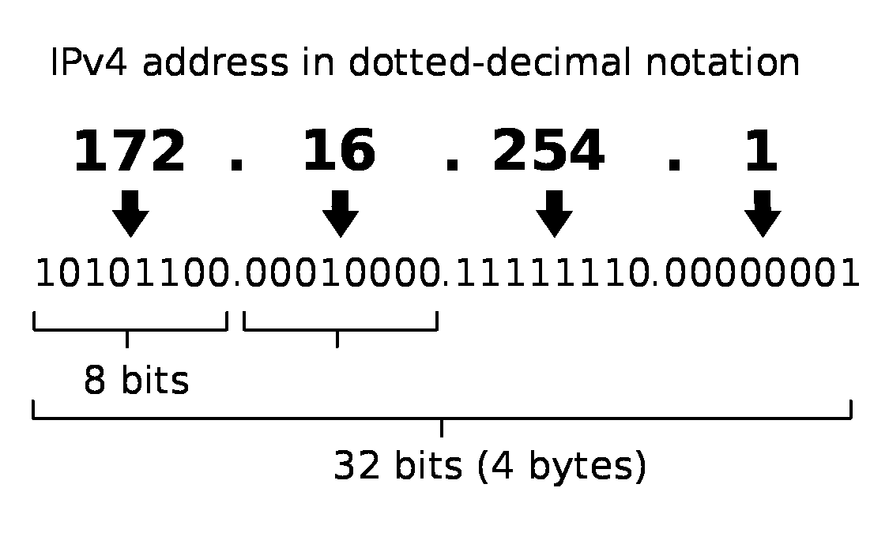
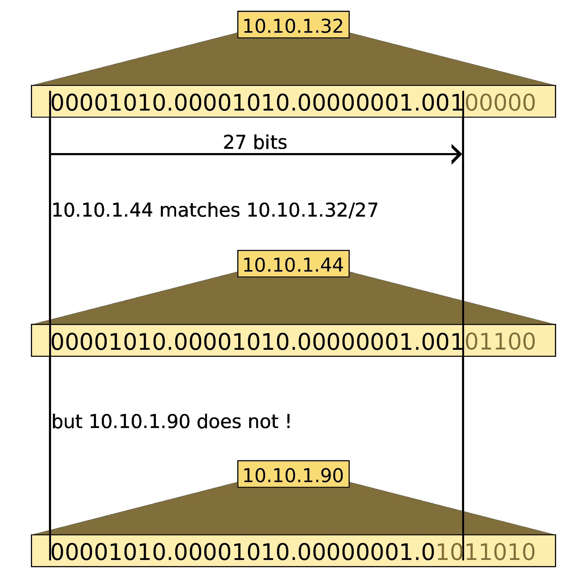
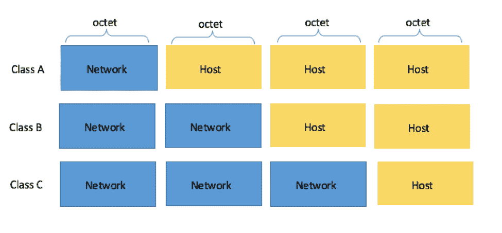

# 子网备忘单–24 子网掩码、30、26、27、29 和其他 IP 地址 CIDR 网络参考

> 原文：<https://www.freecodecamp.org/news/subnet-cheat-sheet-24-subnet-mask-30-26-27-29-and-other-ip-address-cidr-network-references/>

作为开发人员或网络工程师，您可能需要偶尔查找子网掩码值，并弄清楚它们的含义。

为了让你的生活更容易，freeCodeCamp 社区制作了这个简单的备忘单。只需滚动或使用 Ctrl/Cmd + f 找到您想要的值。

这是图表，后面是对它们含义的一些解释。

| 无类域内路由选择(Classless Inter-Domain Routing) | 子网掩码 | 通配符掩码 | IP 地址数量 | 可用 IP 地址的数量 |
| --- | --- | --- | --- | --- |
| /32 | 255.255.255.255 | 0.0.0.0 | one | one |
| /31 | 255.255.255.254 | 0.0.0.1 | Two | 2* |
| /30 | 255.255.255.252 | 0.0.0.3 | four | Two |
| /29 | 255.255.255.248 | 0.0.0.7 | eight | six |
| /28 | 255.255.255.240 | 0.0.0.15 | Sixteen | Fourteen |
| /27 | 255.255.255.224 | 0.0.0.31 | Thirty-two | Thirty |
| /26 | 255.255.255.192 | 0.0.0.63 | Sixty-four | Sixty-two |
| /25 | 255.255.255.128 | 0.0.0.127 | One hundred and twenty-eight | One hundred and twenty-six |
| /24 | 255.255.255.0 | 0.0.0.255 | Two hundred and fifty-six | Two hundred and fifty-four |
| /23 | 255.255.254.0 | 0.0.1.255 | Five hundred and twelve | Five hundred and ten |
| /22 | 255.255.252.0 | 0.0.3.255 | One thousand and twenty-four | One thousand and twenty-two |
| /21 | 255.255.248.0 | 0.0.7.255 | Two thousand and forty-eight | Two thousand and forty-six |
| /20 | 255.255.240.0 | 0.0.15.255 | Four thousand and ninety-six | Four thousand and ninety-four |
| /19 | 255.255.224.0 | 0.0.31.255 | Eight thousand one hundred and ninety-two | Eight thousand one hundred and ninety |
| /18 | 255.255.192.0 | 0.0.63.255 | Sixteen thousand three hundred and eighty-four | Sixteen thousand three hundred and eighty-two |
| /17 | 255.255.128.0 | 0.0.127.255 | Thirty-two thousand seven hundred and sixty-eight | Thirty-two thousand seven hundred and sixty-six |
| /16 | 255.255.0.0 | 0.0.255.255 | Sixty-five thousand five hundred and thirty-six | Sixty-five thousand five hundred and thirty-four |
| /15 | 255.254.0.0 | 0.1.255.255 | One hundred and thirty-one thousand and seventy-two | One hundred and thirty-one thousand and seventy |
| /14 | 255.252.0.0 | 0.3.255.255 | Two hundred and sixty-two thousand one hundred and forty-four | Two hundred and sixty-two thousand one hundred and forty-two |
| /13 | 255.248.0.0 | 0.7.255.255 | Five hundred and twenty-four thousand two hundred and eighty-eight | Five hundred and twenty-four thousand two hundred and eighty-six |
| /12 | 255.240.0.0 | 0.15.255.255 | One million forty-eight thousand five hundred and seventy-six | One million forty-eight thousand five hundred and seventy-four |
| /11 | 255.224.0.0 | 0.31.255.255 | Two million ninety-seven thousand one hundred and fifty-two | Two million ninety-seven thousand one hundred and fifty |
| /10 | 255.192.0.0 | 0.63.255.255 | Four million one hundred and ninety-four thousand three hundred and four | Four million one hundred and ninety-four thousand three hundred and two |
| /9 | 255.128.0.0 | 0.127.255.255 | Eight million three hundred and eighty-eight thousand six hundred and eight | Eight million three hundred and eighty-eight thousand six hundred and six |
| /8 | 255.0.0.0 | 0.255.255.255 | Sixteen million seven hundred and seventy-seven thousand two hundred and sixteen | Sixteen million seven hundred and seventy-seven thousand two hundred and fourteen |
| /7 | 254.0.0.0 | 1.255.255.255 | Thirty-three million five hundred and fifty-four thousand four hundred and thirty-two | Thirty-three million five hundred and fifty-four thousand four hundred and thirty |
| /6 | 252.0.0.0 | 3.255.255.255 | Sixty-seven million one hundred and eight thousand eight hundred and sixty-four | Sixty-seven million one hundred and eight thousand eight hundred and sixty-two |
| /5 | 248.0.0.0 | 7.255.255.255 | One hundred and thirty-four million two hundred and seventeen thousand seven hundred and twenty-eight | One hundred and thirty-four million two hundred and seventeen thousand seven hundred and twenty-six |
| /4 | 240.0.0.0 | 15.255.255.255 | Two hundred and sixty-eight million four hundred and thirty-five thousand four hundred and fifty-six | Two hundred and sixty-eight million four hundred and thirty-five thousand four hundred and fifty-four |
| /3 | 224.0.0.0 | 31.255.255.255 | Five hundred and thirty-six million eight hundred and seventy thousand nine hundred and twelve | Five hundred and thirty-six million eight hundred and seventy thousand nine hundred and ten |
| /2 | 192.0.0.0 | 63.255.255.255 | One billion seventy-three million seven hundred and forty-one thousand eight hundred and twenty-four | One billion seventy-three million seven hundred and forty-one thousand eight hundred and twenty-two |
| /1 | 128.0.0.0 | 127.255.255.255 | Two billion one hundred and forty-seven million four hundred and eighty-three thousand six hundred and forty-eight | Two billion one hundred and forty-seven million four hundred and eighty-three thousand six hundred and forty-six |
| /0 | 0.0.0.0 | 255.255.255.255 | Four billion two hundred and ninety-four million nine hundred and sixty-seven thousand two hundred and ninety-six | Four billion two hundred and ninety-four million nine hundred and sixty-seven thousand two hundred and ninety-four |

* /31 是一种特殊情况，详见 [RFC 3021](https://tools.ietf.org/html/rfc3021) ，使用这种子网掩码的网络可以分配两个 IP 地址作为点对点链路。

下面是子网掩码和通配符二进制八位数的十进制到二进制转换表:

|  | 子网掩码 |  | 通配符 |
| --- | --- | --- | --- |
| Zero | 00000000 | Two hundred and fifty-five | Eleven million one hundred and eleven thousand one hundred and eleven |
| One hundred and twenty-eight | Ten million | One hundred and twenty-seven | 01111111 |
| One hundred and ninety-two | Eleven million | Sixty-three | 00111111 |
| Two hundred and twenty-four | Eleven million one hundred thousand | Thirty-one | 00011111 |
| Two hundred and forty | Eleven million one hundred and ten thousand | Fifteen | 00001111 |
| Two hundred and forty-eight | Eleven million one hundred and eleven thousand | seven | 00000111 |
| Two hundred and fifty-two | Eleven million one hundred and eleven thousand one hundred | three | 00000011 |
| Two hundred and fifty-four | Eleven million one hundred and eleven thousand one hundred and ten | one | 00000001 |
| Two hundred and fifty-five | Eleven million one hundred and eleven thousand one hundred and eleven | Zero | 00000000 |

请注意，通配符正好是子网掩码的倒数。

如果你是网络工程的新手，你可以[在这里](https://www.freecodecamp.org/news/computer-networks-and-how-to-actually-understand-them-c1401908172d/)更好地了解计算机网络是如何工作的。

最后，这份备忘单和本文的其余部分主要关注 IPv4 地址，而不是较新的 IPv6 协议。如果你想了解更多关于 IPv6 的知识，请查阅上面关于计算机网络的文章。

## IP 地址块是如何工作的？

像`192.168.0.1`这样的 IPv4 地址实际上只是四个二进制块的十进制表示。

每个块是 8 位，代表从 0-255 的数字。因为块是 8 位的组，每个块被称为一个**八位字节**。因为有四个 8 位的块，所以每个 IPv4 地址都是 32 位。

例如，以下是 IP 地址`172.16.254.1`的二进制格式:

Source: [IPv4](https://en.wikipedia.org/wiki/IPv4)

要在十进制和二进制形式之间转换 IP 地址，您可以使用以下图表:

| One hundred and twenty-eight | Sixty-four | Thirty-two | Sixteen | eight | four | Two | one |
| --- | --- | --- | --- | --- | --- | --- | --- |
| x | x | x | x | x | x | x | x |

上图代表一个 8 位八进制数。

现在假设您想要转换 IP 地址`168.210.225.206`。你所需要做的就是将地址分成四个块(`168`、`210`、`225`和`206`，并使用上面的图表将每个块转换成二进制。

请记住，在二进制中，1 相当于“开”，0 相当于“关”。因此，要将第一个块`168`转换为二进制，只需从图表的开头开始，在该单元格中放置 1 或 0，直到得到总和`168`。

例如:

| One hundred and twenty-eight | Sixty-four | Thirty-two | Sixteen | eight | four | Two | one |
| --- | --- | --- | --- | --- | --- | --- | --- |
| one | Zero | one | Zero | one | Zero | Zero | Zero |

128 + 32 + 8 = 168，在二进制中是`10101000`。

如果你对其余的块也这样做，你会得到`10101000.11010010.11100001.11001110`。

## 什么是子网划分？

如果你看上面的表格，你会发现 IP 地址的数量实际上是无限的。毕竟，几乎有 42 亿个可能的 IPv4 地址可用。

但是如果你想一想互联网已经发展了多少，现在又有多少设备连接在一起，那么听到 IPv4 地址已经短缺的消息，你可能不会感到惊讶。

因为几年前就认识到了这种不足，开发人员想出了一种方法，将一个 IP 地址分割成更小的网络，称为子网。

这一过程称为子网划分，它使用 IP 地址的主机部分将其划分为更小的网络或子网。

通常，IP 地址由网络位和主机位组成:

Source: [What is IPv4](https://support.huawei.com/enterprise/en/doc/EDOC1100145159)

一般来说，子网划分有两个作用:它为我们提供了一种将网络划分为子网的方法，并允许设备确定另一个设备/IP 地址是否在同一个本地网络中。

考虑子网划分的一个好方法是想象您家中的无线网络。

如果没有子网划分，每台连接互联网的设备都需要自己唯一的 IP 地址。

但是因为你有无线路由器，你只需要一个 IP 地址给你的路由器。此公共或外部 IP 地址通常会自动处理，并由您的互联网服务提供商(ISP)分配。

那么连接到该路由器的每台设备都有自己的私有或内部 IP 地址:

Source: [What Is My IP Address?](https://www.popularmechanics.com/technology/a32729384/how-to-find-ip-address/)

现在，如果具有内部 IP 地址`192.168.1.101`的设备想要与另一台设备通信，它将使用另一台设备的 IP 地址和子网掩码。

IP 地址和子网掩码的组合允许`192.168.1.101`处的设备判断出另一个设备是在同一网络上(如`192.168.1.103`处的设备)，还是在另一个完全不同的网络上。

有趣的是，ISP 分配给路由器的外部 IP 地址很可能是子网的一部分，其中可能包含附近家庭或企业的许多其他 IP 地址。就像内部 IP 地址一样，它也需要子网掩码才能工作。

### 子网掩码的工作原理

子网掩码的功能类似于 IP 地址的过滤器。有了子网掩码，设备可以查看 IP 地址，并确定哪些部分是网络位，哪些是主机位。

然后使用这些东西，它可以找出这些设备通信的最佳方式。

如果你查看过路由器或电脑的网络设置，你可能会看到这个号码:`255.255.255.0`。

如果是这样，那么您已经看到了简单家庭网络中非常常见的子网掩码。

与 IPv4 地址一样，子网掩码也是 32 位。就像把 IP 地址转换成二进制一样，你可以用子网掩码做同样的事情。

例如，这是我们之前的图表:

| One hundred and twenty-eight | Sixty-four | Thirty-two | Sixteen | eight | four | Two | one |
| --- | --- | --- | --- | --- | --- | --- | --- |
| x | x | x | x | x | x | x | x |

现在我们来转换第一个二进制八位数 255:

| One hundred and twenty-eight | Sixty-four | Thirty-two | Sixteen | eight | four | Two | one |
| --- | --- | --- | --- | --- | --- | --- | --- |
| one | one | one | one | one | one | one | one |

很简单，对吧？所以任何一个八位字节都是二进制的。这意味着`255.255.255.0`真的是二进制的`11111111.11111111.11111111.00000000`。

现在让我们一起来看看子网掩码和 IP 地址，并计算 IP 地址的哪些部分是网络位和主机位。

以下是十进制和二进制的两种格式:

| 类型 | 小数 | 二进制的 |
| --- | --- | --- |
| 国际电脑互联网地址 | 192.168.0.101 | 11000000.10101000.00000000.01100101 |
| 子网掩码 | 255.255.255.0 | 11111111.11111111.11111111.00000000 |

有了这样的布局，很容易将`192.168.0.101`分成网络位和主机位。

每当二进制子网掩码中的位为 1 时，二进制 IP 地址中的相同位就是网络的一部分，而不是主机的一部分。

因为二进制中的八位位组`255`是`11111111`，所以 IP 地址中的整个八位位组是网络的一部分。因此，前三个二进制八位数`192.168.0`是 IP 地址的网络部分，`101`是主机部分。

换句话说，如果在`192.168.0.101`的设备想要与另一个设备通信，使用子网掩码，它知道 IP 地址为`192.168.0.xxx`的任何东西都在同一个本地网络上。

另一种表达方式是使用网络 ID，它只是 IP 地址的网络部分。所以子网掩码为`255.255.255.0`的地址`192.168.0.101`的网络 ID 是`192.168.0.0`。

本地网络上的其他设备也是如此(`192.168.0.102`、`192.168.0.103`等等)。

### CIDR 是什么意思，CIDR 符号是什么？

**CIDR** 代表无类域间路由，用于 IPv4 以及最近的 IPv6 路由。

Source: [Classless Inter-Domain Routing](https://en.wikipedia.org/wiki/Classless_Inter-Domain_Routing)

CIDR 于 1993 年引入，以减缓 IPv4 地址的使用，在互联网最初建立的旧的有类 IP 寻址系统下，IP v4 地址很快就会耗尽。

CIDR 包含几个主要概念。

第一个是可变长度子掩码(VLSM)，它基本上允许网络工程师在子网内创建子网。这些子网可以是不同的大小，因此未使用的 IP 地址会更少。

CIDR 引入的第二个重要概念是 CIDR 符号。

CIDR 符号实际上是子网掩码的简写，代表 IP 地址可用的位数。例如，`192.168.0.101/24`中的`/24`相当于 IP 地址`192.168.0.101`和子网掩码`255.255.255.0`。

### 如何计算 cidr 符号

要找出给定子网掩码的 CIDR 表示法，您需要做的就是将子网掩码转换为二进制，然后计算 1 或“开”数字的数量。例如:

| 类型 | 小数 | 二进制的 |
| --- | --- | --- |
| 子网掩码 | 255.255.255.0 | 11111111.11111111.11111111.00000000 |

因为有三个 1 的八位字节，所以有 24 个“开”位，意味着 CIDR 符号是`/24`。

你可以用任何一种方式来写，但是我肯定你会同意`/24`比`255.255.255.0`更容易写。

这通常是通过 IP 地址来实现的，所以让我们来看一下带有 IP 地址的相同子网掩码:

| 类型 | 小数 | 二进制的 |
| --- | --- | --- |
| 国际电脑互联网地址 | 192.168.0.101 | 11000000.10101000.00000000.01100101 |
| 子网掩码 | 255.255.255.0 | 11111111.11111111.11111111.00000000 |

子网掩码的前三个二进制八位数都是“开”位，这意味着 IP 地址中相同的三个二进制八位数都是网络位。

让我们更详细地看看最后第四个二进制八位数:

| 类型 | 小数 | 二进制的 |
| --- | --- | --- |
| 国际电脑互联网地址 | One hundred and one | 01100101 |
| 子网掩码 | Zero | 00000000 |

在这种情况下，因为子网掩码中该二进制八位数的所有位都是“off”，所以我们可以确定 IP 地址中该二进制八位数的所有对应位都是主机的一部分。

当你写 CIDR 符号时，通常是用网络 ID。因此，子网掩码为`255.255.255.0`的 IP 地址`192.168.0.101`的 CIDR 符号是`192.168.0.0/24`。

要查看如何计算给定 IP 地址和子网掩码的 CIDR 符号和网络 ID 的更多示例，请观看此视频:

[https://www.youtube.com/embed/XQ3T14SIlV4?feature=oembed](https://www.youtube.com/embed/XQ3T14SIlV4?feature=oembed)

## 有类 IP 寻址

我们已经学习了子网划分和 CIDR 的一些基本示例，现在让我们缩小范围，看看什么是有类 IP 寻址。

在子网划分出现之前，所有的 IP 地址都属于一个特定的类别:

Source: [Subnetting for dummies](https://community.spiceworks.com/networking/articles/2489-subnetting-for-dummies)

请注意，这里有 D 类和 E 类 IP 地址，但我们稍后会更详细地讨论这些地址。

有类 IP 地址为网络工程师提供了一种为不同组织提供一系列有效 IP 地址的方法。

这种方法有很多问题，最终会导致子网划分。但是在我们进入这些之前，让我们仔细看看不同的类。

### A 类 IP 地址

对于 A 类 IP 地址，第一个二进制八位数(8 位/ 1 字节)代表网络 ID，其余三个二进制八位数(24 位/ 3 字节)代表主机 ID。

A 类 IP 地址范围从`1.0.0.0`到`127.255.255.255`，默认掩码为`255.0.0.0`(或 CIDR 的`/8`)。

这意味着 A 类寻址总共有 128 (2 ⁷ )个网络，每个网络有 16，777，214 (2 ^(24) -2)个可用地址。

另外，请注意，A 类范围内的范围`127.0.0.0`到`127.255.255.255`是为主机环回地址保留的(参见 [RFC5735](https://tools.ietf.org/html/rfc5735) )。

### B 类 IP 地址

对于 B 类 IP 地址，前两个二进制八位数(16 位/ 2 字节)代表网络 ID，其余两个二进制八位数(16 位/ 2 字节)代表主机 ID。

B 类 IP 地址范围从`128.0.0.0`到`191.255.255.255`，默认子网掩码为`255.255.0.0`(或 CIDR 的`/16`)。

B 类寻址每个网络可以有 16，384 (2 ^(14) 个)网络地址和 65，534 (2 ^(16) 个)可用地址。

### C 类 IP 地址

对于 C 类 IP 地址，前三个二进制八位数(24 位/ 3 字节)代表网络 ID，最后一个二进制八位数(8 位/ 1 字节)代表主机 ID。

C 类 IP 地址范围从`192.0.0.0`到`223.255.255.255`，默认子网掩码为`255.255.255.0`(或 CIDR 的`/24`)。

C 类相当于 2，097，152 (2 ^(21) 个)网络和每个网络 254 (2 ⁸ -2)个可用地址。

### D 类和 E 类 IP 地址

后两个班是 D 班和 e 班。

D 类 IP 地址是为多播保留的。它们占据了从`224.0.0.0`到`239.255.255.255`的范围。

E 类 IP 地址是实验性的，是超过`240.0.0.0`的任何东西。

### 有类 IP 地址的问题

有类 IP 地址的主要问题是效率不高，可能会导致大量 IP 地址的浪费。

例如，想象你是当时一个大型组织的一部分。你的公司有 1000 名员工，这意味着它属于 b 类

但是如果你看上面，你会看到一个 B 类网络可以支持多达 65，534 个可用地址。这远远超过了您的组织可能需要的数量，即使每个员工都有多个具有唯一地址的设备。

您的组织不可能退回到 C 类，因为没有足够的可用 IP 地址。

因此，当有类 IP 地址在 IPv4 地址广泛使用的时候，我们很快发现需要一个更好的系统来确保我们不会用完所有的 42 亿个可用地址。

自从 1993 年被 CIDR 取代后，有类 IP 地址就再也没有被使用过，人们主要研究有类 IP 地址来理解早期的互联网架构，以及为什么子网划分很重要。

## 我希望这个备忘单对你来说是一个有用的参考

如果你觉得这很有帮助，请与你的朋友分享，这样更多的人可以从中受益。

此外，请随时在 [Twitter](https://twitter.com/kriskoishigawa) 上联系我，告诉我你的想法。