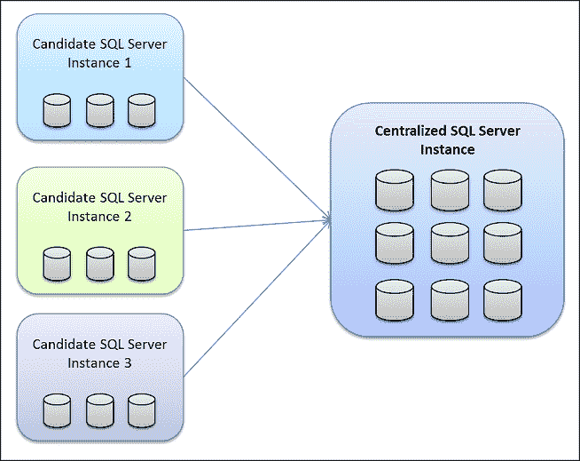

# 为什么您应该学习 SQL——即使您不是开发人员

> 原文：<https://www.freecodecamp.org/news/why-learn-sql/>

如今，几乎每个人都必须以某种形式处理数据。通常是通过电子表格或数据库，但如果你能学会一点 SQL，你会在工作中变得更加强大。

数据分析涵盖业务的方方面面，从研发到营销、会计等等。没有对保存数据的大规模数据库的有效查询，数据分析将是不可能的。

当今最常见的数据库结构之一是关系数据库。与关系数据库齐头并进的是结构化查询语言或 SQL(发音为 S-Q-L 或 sequel)。

SQL [是一个强大而健壮的工具](https://www.freecodecamp.org/news/best-sql-database-tutorial/)，用于从大型数据集中提取相关且有用的数据。虽然 SQL 传统上是训练有素的数据分析师和程序员的专长，但它在非技术人员中获得了更大的认可。这有很多很好的理由。

[Image Source](https://www.sqlshack.com/wp-content/uploads/2019/03/sql-case-statement.png)

学习 SQL 比你想象的要容易，这样做的好处远远超过了时间投入。如果你进行这项投资，它将增加你对你的团队的价值，同时也增加你在你的组织和更广阔的市场中的可销售性。

## 如何克服学习计算机编程的恐惧

说服“非技术用户”学习“技术”主题可能是一个挑战，因为他们经常认为它太复杂或太令人困惑。

许多用户被学习编程语言的想法吓倒，或者实际上被他们日常处理的图形界面之外的任何东西吓倒。

具有讽刺意味的是，非技术团队成员通常无法理解关系数据库的概念。告诉一个非技术人员，SQL 是一种用于查询和维护关系数据库的特定领域语言，他们的眼睛可能会变得呆滞。

但是这个[不一定是](https://www.freecodecamp.org/news/sql-and-databases-full-course/)的情况。相反，如果团队领导告诉团队，SQL 是一种快速轻松地识别数据的方法，有助于简化他们的日常工作，他们可能会引起团队的注意。

一旦你克服了第一个障碍，下一步就是让你的团队成员相信学习 SQL 不像学习一门不同字母表的外语。相反，他们需要知道他们将能够使用日常英语单词，如 SELECT、CREATE、ADD 和 JOIN 来使用 SQL。

现在，团队不仅理解了他们为什么想要学习 SQL，而且确信他们能够做到。

## 学习 SQL 的具体好处

您应该学习 SQL 的原因有很多，包括:

### SQL 和关系数据库无处不在

学习 SQL 不仅可以提高您的技能，还可以让您更好地理解您日常使用的应用程序。

你不仅要处理关系数据库中的公司数据，还要处理从云存储到社交媒体账户再到电子商务应用的所有数据。各种各样的开源数据库也是可用的，可以帮助你练习构建 SQL 查询。

SQL 和关系数据库的普及性和易用性的一个不利方面是，网络罪犯已经开发出非常有效的方法来入侵使用 SQL 的系统。

据[云防御](https://www.clouddefense.ai/blog/web-application-security)的网络安全专家马克·普雷斯顿称，

> “SQL 注入是指网络犯罪分子利用主机数据库执行的搜索查询中的漏洞进行攻击。这使得攻击者能够访问敏感信息，甚至更改授权或用户权限。他们还可以破坏或操纵数据库中的敏感数据。”

但这应该只会让你更想学 SQL。你对 SQL 了解得越多，[也就越容易理解](https://www.freecodecamp.org/news/learn-the-basics-of-sql-injection-and-how-to-protect-your-web-apps/)如何击败 SQL 注入攻击。

### SQL 很容易学

正如我们上面讨论的，与学习外语或核心编程语言不同，SQL 学习起来非常简单。

因为 SQL 查询语法依赖于常见的英语单词，所以即使你没有编程经验，你也能很容易地理解如何使用它。但是，如果你有一些编程经验，可能需要更长的时间才能熟练掌握。

[Image Source](https://techcommunity.microsoft.com/t5/image/serverpage/image-id/97939i863FB9B88B565793)

网上有很多学习各级 SQL 的资源，很多入门级的课程都是免费的。

开发对 SQL 的基本熟悉应该不会花费你超过几个小时的时间。虽然您可以投入尽可能多的时间成为 SQL 专家，但是对于大多数团队来说，对 SQL 有一个基本的了解就足够了。

### SQL 轻松处理大数据

如今，即使是最小的组织也要维护和使用大量的数据。有效挖掘数据并以易于理解的格式呈现出来的能力是必不可少的。

如果您曾经尝试在 Excel 等应用程序中获取大型数据集并对其进行分析，您可能很快就会了解到处理大型数据集的程序局限性。

没有什么比在执行关键工作时程序崩溃更令人沮丧的了。SQL 是处理大型数据集的一种更健壮、更快速的方法，也更严格地确保了数据集的完整性。

### 了解 SQL 可以培养更多有价值的团队成员

组织中的每个团队都有自己的数据需求。营销团队需要了解客户的需求，以及营销活动的有效性。制造和工程部门需要关于生产率的数据。

会计团队可以使用大数据来了解市场动向，首席管理人员需要来自每个部门的数据来制定长期的组织战略。但是相关数据可能包含在整个组织的各种数据集中。

我不能夸大能够生成最相关的数据以满足您团队需求的重要性。学习 SQL 使您能够整合来自多个数据源的数据，并将复杂的数据集转化为可操作的情报。

[Image Source](https://www.sqlshack.com/wp-content/uploads/2016/12/1word-image.png) 

更广泛地说，学习构建好的 SQL 查询有助于开发团队成员的逻辑思维技能。优化 SQL 查询有助于您更好地理解您的团队应该询问哪些问题，以及这些问题应该如何措辞。

### 了解 SQL 给团队成员带来了新的机会

SQL 知识[是一项非常抢手的技能](https://www.freecodecamp.org/news/sql-interview-questions/)，无论是在组织内部还是对其他组织而言。因此，学习 SQL 是对时间的有效利用，并且具有很高的潜在投资回报。

通过快速地在简历中加入你想要的技能，你可以在组织中创造晋升的机会。如果你的公司不需要这种特殊的技能，请放心，其他人会的。

从本质上讲，基本的 SQL 知识使您能够完成以前可能被分派到其他部门的任务。跳过中间人，你会变得更有效率，减少完成项目的潜在延迟。

## 结论

在企业[依赖大数据](https://www.freecodecamp.org/news/is-data-important-to-your-business/)的世界里，了解哪些数据可用，哪些数据是你真正需要的(以及如何区分这些数据)是一项无价的技能。

如果你能从你拥有的数据中快速提取出你需要的信息，你对你的团队来说会变得越来越有价值。学习 SQL 是实现这一目标的简单而快速的方法。