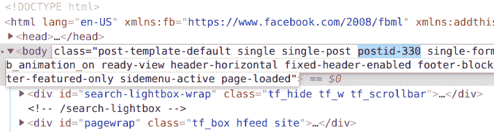

# 每个 Web 开发人员都应该知道的 10 个 CSS 技巧

> 原文：<https://www.freecodecamp.org/news/10-css-hacks-every-web-developer-should-know/>

根据 Redmonk 的说法，虽然 CSS 不像 JavaScript 那样被广泛使用，但它仍然是 T2 十大编码语言之一。由于 CSS 非常健壮，相当容易学习，并且在不同的浏览器中通用，所以它在网站开发者中很受欢迎。

正如每一种编码语言一样，CSS 有几个捷径或窍门，可以让你编写更简洁的代码，改进设计元素，并节省宝贵的时间。此外，您可以使用[代码编辑器](https://www.freecodecamp.org/news/source-code-editors-explained/)将这些代码片段直接插入到您的站点中。

同样重要的是，要知道使用 CSS 并不一定要成为高级 web 开发人员。来自 W3Techs 的数据显示，96%的网站使用 CSS，能够使用 CSS 来改善网站的布局和外观是 WordPress 等主要开源 CMS 功能的一部分。

事实上，大多数最大的网站构建工具(通常以推广“所见即所得”或所见即所得方法而闻名)现在都允许用户插入定制的 CSS 代码。

如果你是 CSS 新手，freeCodeCamp 在 Youtube 上有一个极好的[教程视频，你可以在那里学习基础知识。如果你已经知道了基本的方面，那么让我们从这十个 CSS 技巧开始吧。](https://www.youtube.com/watch?v=kMT54MPz9oE)

## 1.如何用 CSS 将内容定位在中央

将内容放在屏幕中间可能有些棘手。但是，您可以使用`position: absolute`来覆盖动态放置，并始终将内容放置在中央。

它也适用于各种分辨率的设备。然而，总是要仔细检查是否所有的东西都按照你想要的方式放置，并且即使在较小的屏幕上元素看起来也很自然。

示例片段:

```
section {
  position: absolute;
  left: 50%;
  top: 50%;
  transform: translate(-50%, -50%);
  padding: 30px;
}
```

## 2.如何确定元素在 CSS 中的位置

尽管网站是动态的，但你可能会在某些位置需要修复一些元素。您可以通过使用`position:absolute`脚本来实现。

但是，请小心使用这种方法，并在每种屏幕尺寸和分辨率下进行测试，这样就不会破坏网站的设计。

按照这个带有特定位置节点的脚本，可以确保元素对于所有用户都保持在相同的位置。

示例片段:

```
/* suppose you want to fix your sidebar’s position and size */
.sidebar {
  position: absolute;
  top: 15px;
  right: 15px;
  width: 300px;
  height: 150px;
}
```

## 3.如何在 CSS 中使图像适合页面

没有什么比你的图片溢出网站访问者的屏幕更糟糕的了。它绝对会破坏你的网站设计，让用户望而却步。

然而，通过这个简单的技巧，你可以确保你的图片总是适合访问者的屏幕，不管他们使用的是什么设备。

示例片段:

```
img {
  max-width: 100%;
  height: auto;
}
```

## 4.如何在 CSS 中编辑单个页面的样式

如果你有一个 CMS 并且想要你的一些文章看起来不同于其他的，你可以使用一个自定义类来覆盖站点的 CSS 样式。这确保您只调整一个帖子页面，并将其他页面保留为默认页面。

当你在 WordPress 博客上创建一篇文章时，它将文章的 id 作为一个类包含在`body`中，例如:



然后，您可以做类似这样的事情来更改文章页面的样式:

```
.postid-330 {
  font-size: 24px;
  font-weight: 750;
  color: red;
}
```

其他流行的 CMS 允许你添加自定义类到单独的文章中。比如 Ghost 让你把一个帖子标记为特色帖子，并添加一个`.featured`类。

但是，如果您发现自己经常使用这种方法，最好修改主 CSS 样式表，以避免编写不必要的代码。

这不仅仅适用于 CMSs——如果你有一个包含多个 HTML 文件的简单网站，你可以在整个项目中对元素应用自定义样式，并通过同一个 CSS 文件调整它们。

例如，如果您有一个带有类`.landing`的页面:

```
<!DOCTYPE html>
<html lang="en">
  <meta charset="UTF-8" />
  <title>Landing Page</title>
  <meta name="viewport" content="width=device-width,initial-scale=1" />
  <link href="css/style.css" rel="stylesheet" />
  <body class="landing">
    <h1>Landing Page</h1>
    <p>My landing page.</p>
  </body>
</html> 
```

index.html

和另一个类`.about`:

```
<!DOCTYPE html>
<html lang="en">
  <meta charset="UTF-8" />
  <title>About Page</title>
  <meta name="viewport" content="width=device-width,initial-scale=1" />
  <link href="css/style.css" rel="stylesheet" />
  <body class="landing">
    <h1>About Page</h1>
    <p>My about page.</p>
  </body>
</html> 
```

about.html

您可以将它添加到主样式表中，以便只调整 about 页面上的样式:

```
.about {
  font-size: 24px;
  font-weight: 750;
  color: red;
}
```

css/style.css

## 5.如何在 CSS 中巩固样式

如果您知道您想要将 CSS 样式添加到多个项目中，那么一个接一个地写出这些代码片段需要时间。但是，当您用逗号分隔项目并在其中写入 CSS 样式时，该样式会添加到所有项目中。

这有助于您节省时间并降低代码的重量，因为您不必多次编写类似的代码行。

示例片段:

```
/* suppose you want to add a solid border around your caption element, image, and paragraph element */
.caption, img, p {
  border: 2px solid #000000;
}

/* you can also limit the selection using selectors */
p.white-text, div > p.unique {
  color: white;
  font-size: 24px;
}
```

## 6.CSS 中的已访问链接样式

用户点击的已访问链接的默认风格可能不太适合你当前的网站风格。您可以使用 CSS 代码来调整链接在访问者点击之前和之后的外观。

然后，您可以将这些与您网站的整体风格相匹配，以创造独特的体验。

示例片段:

```
a:link {
  color: #ff0000; /* the unvisited link is red */
}
a:visited {
  color: #ee82ee; /* the visited link turns violet */
}
```

## 7.CSS 中的悬停效果延迟

选择器是一个 CSS 伪类，它允许你创建一个悬停效果。但是，您可以通过添加一个`transition`元素来延迟悬停效果，从而使其更具风格。

虽然它看起来很整洁，但它也在用户的眼中创造了一种运动感，进一步吸引了对该元素的注意。

示例片段:

```
.entry h2 {
  font-size: 48px;
  color: #000000;
  font-weight: 750;
}

/* Next, add a delay to the hover effect */
.entry h2:hover{
  color: #f00;
  transition: all 0.5s ease;
}
```

## 8.如何在 CSS 中禁用文本换行并添加省略号

如果您的文本空间紧张，您可能需要将其剪短以适应其他元素。当然，您可以手动调整每个文本元素，但这需要时间和一些尝试和错误。

相反，你可以将`overflow`、`white-space`和`text-overflow`组合起来，在文本中创造一个自然的间隔，这样看起来很舒服。

下面的示例设置文本宽度限制，隐藏溢出部分，禁用文本换行，并添加省略号(...)来表示有更多的文本提供给用户。

示例片段:

```
.product-description {
max-width: 150px;
  overflow: hidden;
  white-space: nowrap;
  text-overflow: ellipsis;
}
```

## 9.CSS 中的首字母样式

风格化的首字母或首字下沉已经在书籍和杂志设计中使用了很长时间。它的工作原理是抓住读者的注意力，让他们对阅读第一行产生兴趣。

虽然你可能认为这种风格已经过时了，但你也可以把它设计得看起来很现代，并利用它为你的访问者创造的心理效应。此外，首字下沉选项也被写入 CSS 语言中，因此您可以毫不费力地使用它，并赋予您的段落新的外观。

示例片段:

```
p:first-letter {
  display: block;
  float: left;
  margin: 5px;
  color: #000000;
  font-size: 60px;
}
```

## 10.如何重置 CSS 样式

最后但同样重要的是，您可能需要覆盖不同浏览器的所有默认样式属性，以便您的设计能够完美地工作。

每个浏览器都有自己的样式表，带有内置的默认样式，当您试图使您的网站在所有浏览器上看起来一致时，这有时会是一个问题。

你可以使用一个全面的 CSS 重置从[埃里克迈耶](https://meyerweb.com/eric/tools/css/reset/)覆盖几乎所有的基地。然而，你也可以获得最小的重置结果，这可以从[杰夫·斯塔尔](https://perishablepress.com/a-killer-collection-of-global-css-reset-styles/)那里借用:

```
* {
  vertical-align: baseline;
  font-weight: inherit;
  font-family: inherit;
  font-style: inherit;
  font-size: 100%;
  border: 0;
  outline: 0;
  padding: 0;
  margin: 0;
}
```

现在你有了 10 个技巧，让你的 CSS 代码看起来更整洁，减少你的编码时间，并增加对访问者友好的元素。

### 感谢阅读！

我是一名对数字营销、网络开发和网络安全充满热情的作家。你可以通过 [LinkedIn 这里](https://www.linkedin.com/in/gert-svaiko/)联系到我。

你可能也会喜欢我写的其他一些文章:

*   [每个 Web 开发人员都应该知道的 10 个 JavaScript 技巧](https://www.freecodecamp.org/news/javascript-hacks/)
*   [如何优化渐进式网络应用:超越基础](https://www.smashingmagazine.com/2020/12/progressive-web-apps/)
*   [10 种最常见的网站安全攻击(以及如何保护自己)](https://www.tripwire.com/state-of-security/featured/most-common-website-security-attacks-and-how-to-protect-yourself/)

*[形象功劳](https://www.hippopx.com/en/code-coder-coding-computer-conceptual-css-data-355989)*