# UI / UX 设计教程-从零到英雄，线框+原型 Figma 中的设计

> 原文：<https://www.freecodecamp.org/news/ui-ux-design-tutorial-from-zero-to-hero-with-wireframe-prototype-figma/>

本文将介绍如何按照用户体验和用户界面的流程从头开始构建一个完整的网站设计。这将分三个阶段完成:

1.  **线框**
    勾画布局
2.  **原型**
    从线框准备用户界面
3.  **图玛设计**
    从原型开始，用颜色、图像等完成设计

免费观看 YouTube embed 中的完整视频课程，一步一步地学习:

[https://www.youtube.com/embed/c9Wg6Cb_YlU?feature=oembed](https://www.youtube.com/embed/c9Wg6Cb_YlU?feature=oembed)

## 步骤 1:如何制作一个线框

设计一个网站的第一步:画一个线框。

一个好的线框可以让你对网站的整体布局和功能有所了解。它也可以作为设计的第一阶段。

线框让你对页面的整体结构和导航流程有一个概念。

如果你正在考虑建立一个网站，你可以快速简单地做一个线框。你甚至不需要成为一个平面设计师来做到这一点。

开始时，你只需要一支铅笔和一些纸。(或者你想弄个 iPad 和 iPencil。)

我们将创建一个线框，并展示它如何允许快速，迭代的设计过程。这将创建一个活的文档，你可以为自己和客户使用。你可以用它来推理你的计划——所有这些都在你投入时间实际编码之前。

以下是我们将在本文(以及附带的视频教程)中介绍的一些步骤:

1.  网站地图规划
2.  创建主页线框
3.  在线框中使用标记
4.  线框组件(页眉、菜单、页脚)
5.  给你的特征页和联系页画线框
6.  移动响应线框

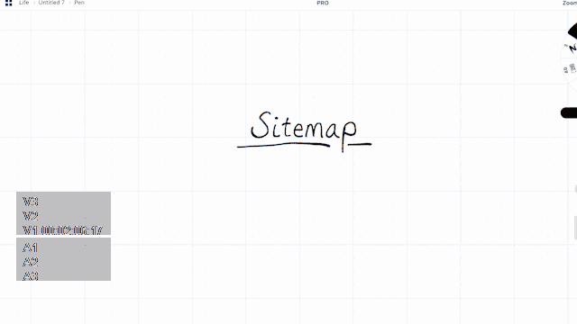

Sketching out a sitemap

### 线框#1:网站地图规划

开始使用线框图从一个好的网站地图开始。在你创建一个页面线框之前，一个网站地图会给你一些结构。通过这种方式，您将了解要构建哪些页面，以及它们将如何相互连接。

大多数小网站可能不需要网站地图。他们通常只有一个登录页面，或者几个普通页面，如功能、关于和联系我们。

也就是说，一旦你的网站或应用变得更大更复杂，你就会想要一个网站地图。

网站地图为你提供了一个项目存在的位置以及它们如何相互连接的简要概述。

在我们的例子中，我们将创建一个简单的站点地图，它只包含主页、功能页面和联系我们页面。

你不必在这上面花太多时间。只需添加几个框来显示每个页面，下面的线来显示子页面，就这样。

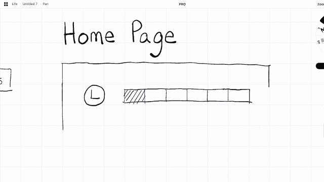

Creating a homepage wireframe

### 线框#2:创建主页线框

我们将创建我们的第一个线框页面。如果你以前没有线框，这个过程很简单。网站的每个方面都用一个形状或简单的图形来表示，例如:

*   用斜线穿过的盒子来代表图像
*   代表文本段落的水平线
*   还有一个带 L 的圆圈代表你的标志。

对于主页，我们将建立一个滑块图像，菜单和标志。我们还会给它一些标签来显示每个项目是什么。

这也有助于将每个部分组织成矩形，以便我们稍后复制粘贴到其他页面上(尤其是页眉和页脚)。

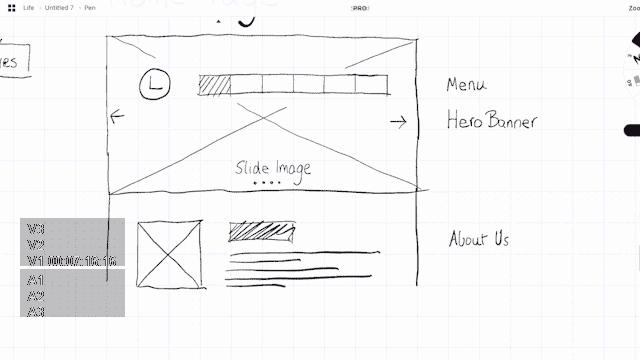

Creating a wireframe for the body of our home page

让我们再创建一个介绍公司的部分(关于我们)和一个赞助商部分(有我们赞助商的标志和图片)。

随着设计的进展，我们还可以在主页中实现其他项目，比如在适当的区域设置行动号召按钮。

我们最终确定了页脚部分的设计，我们添加了常见的元素，如联系方式，联系信息，并再次重用标志。

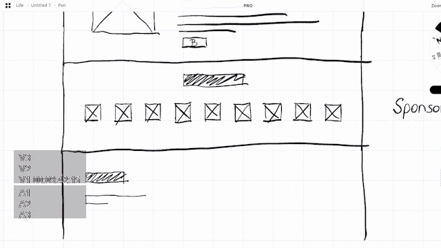

Creating additional page elements in our wireframe

### 线框#3:在线框中使用标记

线框不仅经常被设计师看到，也经常被开发人员、客户和管理层看到。所以在内容的每个部分添加一些标记是很有用的。这可以帮助引导人们第一次查看你的线框。我通常在完成一页后这样做。

在我们的示例中，让我们标记主页，并用红色文本标记内容的每个部分。

您想要标记的方面包括诸如部分、标题、联系表单和可能的图像之类的项目。

请注意，标记不必逐字解释内容最终会是什么——只需解释它代表什么。因此，你可以将标题标记为“介绍标题”，而不是放入实际的“介绍标题示例”

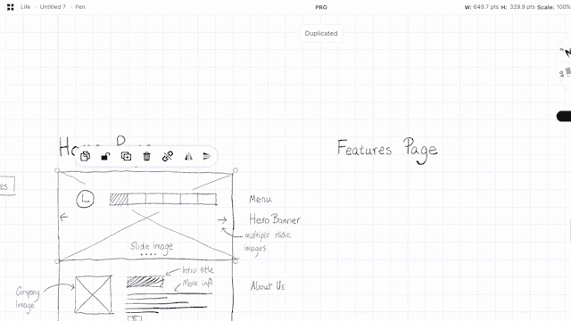

How to Markup a wireframe

### 线框#4:添加其他线框组件，如页眉、菜单和页脚

既然我们已经创建了页眉和页脚，我们可以在其他页面中重用它们。如果您正在以数字方式工作，您可以将页眉、页脚和其他重复元素复制粘贴到新的页面线框中。(而如果你只是用纸和笔，你总是可以用剃须刀和复印机来达到同样的效果。)

这使得你的线框设计保持一致。像 Figma 这样的工具将允许您创建资产组件，您还可以在整个设计中复制粘贴这些资产组件。当你改变你的根组件时，你甚至可以配置它们来动态更新你的线框的其他部分。

在我们的例子中，我们将重用组件来构建一个功能页面。通过创建我们的第一个功能部分组件，我们可以将它复制并粘贴到下面几次，在几分钟内构建出我们的整个功能页面。

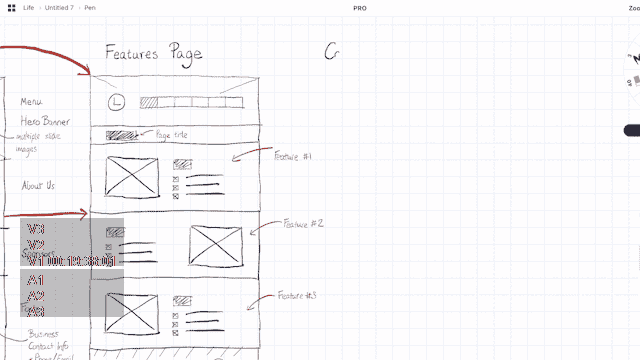

Adding wireframe components and reusing them on different pages

### 线框#5:功能页面和联系页面

一旦你开始使用线框图和构建一些组件，构建额外的页面会变得越来越容易。完成功能页面后，我们可以创建一个联系我们页面。我们真正要做的只是添加一些常见的元素，比如谷歌地图、联系我们表单和一些基本的联系信息，比如电话号码和电子邮件地址。

在这个例子中，我用小图标代表电话和电子邮件，用大块图标代表它们在页面上的位置。

联系方式将位于下面(没有方框轮廓)，以及在右手边的谷歌地图。

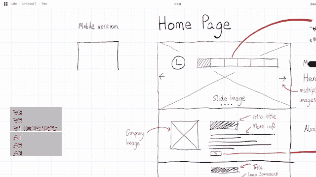

Wireframing the Contact Us Page

### 线框#6:制作一个移动响应线框

没有手机版，现在就没有好的线框了。这是因为今天的大部分网络是在移动设备上浏览的。

了解设计如何收缩到更小的视口是有好处的。如果你有更多的时间，你也可以构建一个响应线框的平板版本。

在我们的例子中，我们一节一节地构建主页设计线框。大多数行和列都是折叠的。由于我们在移动视窗中，许多图像、文本和区块的尺寸都减小了。

因此，某些部分可能仍然与它们各自的桌面版本具有相同的高度。另一方面，一些有很多图片的部分(比如赞助商部分)可能会有更多的滚动高度。

因此，我还经常添加额外的标记来显示哪些桌面版本部分对应于哪些移动版本的相应部分。

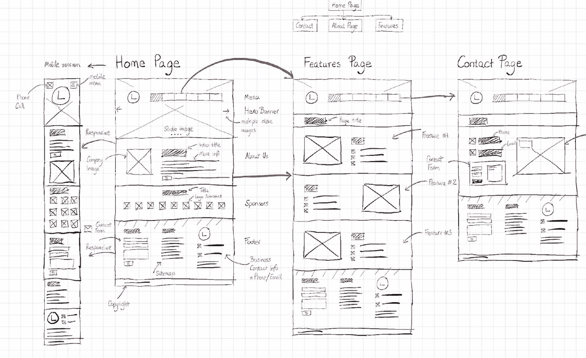

The final wireframe with several pages designed, the sitemap, and mark-up

### 线框结论

线框图是一种快速的方法，可以让你对你的网站或应用程序有一个更好的视觉概念。我建议您在下一个项目中尝试使用它，以帮助您规划它的功能和外观。

线框是实现这一点的理想方法，因为它比让设计师做一个完整的用户界面原型花费的时间要少得多。

## 第二步。如何制作一个网站原型

你可能听过一句老话:“量两次，切一次。”这就是为什么你应该在建立网站之前就计划好。这就是原型的用武之地。

当我们设计我们的网站时，我们从[线框图](https://www.freecodecamp.org/news/what-is-a-wireframe-ux-design-tutorial-website/)发展到原型设计，最后是完整的设计。

我想通过带你经历整个过程来探索和扩展原型的实际含义。

在这一部分，我们将讨论:

1.  早期的原型是什么
2.  创建结构:框架、行、列
3.  添加内容:标题，滑块，关于
4.  设计部分
5.  结论:我们从原型制作过程中学到了什么

### 原型#1:什么是早期原型？

原型通常是设计的二次迭代，因为它建立在线框图的顶部。

线框通常包括通过纸、笔或在线工具绘制的简单草图。接下来，我们建立原型，这是我们的网站或应用程序更完善的样机。

让我们来看看我们到目前为止构建的早期线框。

The wireframe we created in [my previous wireframing course](https://www.freecodecamp.org/news/what-is-a-wireframe-ux-design-tutorial-website/).

它有许多页面、部分和区域，稍后将在这些地方添加文本和图像。

那么，原型的目标是在视觉上构建它，但不添加颜色或图像。

在这个例子中，我将使用 [Figma](https://www.figma.com/) 来做原型。你可以[在这里](https://www.figma.com/file/mh52sQHBF8Bq2pIZhLKVuh/freeCodeCamp-Website-Ui?node-id=0%3A1)查看整个 Figma 原型。

### 原型#2:如何创建一个网站原型结构:框架，行，列

当我们创建线框时，我们考虑了网格——但它们是手绘的。

当做一个早期的原型时，我们必须正确地定义它们，以便整个设计遵循网格结构。

在本例中，我将使用 12 列设计，常规宽度为 1140px，这是自举设计中常用的设计。这使我们在网格单元之间有 15-30px 的余量。

稍后，当我们将列折叠为行以获得移动响应时，这将非常有用。

您可以在 Figma 中创建自己的网格结构。但是请注意，您(或其他人)稍后将需要实际编码这些设计。

无论何时你在设计什么东西，一定要考虑到开发者。

### 原型#3:如何添加内容到网站原型:标题，滑块，部分

与线框不同，我们不再用线条来表示文本，用块来表示标题。相反，我们需要填写样机的内容。

这并不意味着添加颜色或图像。但这意味着我们必须展示真实的文本。

在这个阶段，最好确保页眉和各节显示出它们想要包含的实际内容。这将允许在设计的后期更好地选择颜色和图像。

在示例的这一部分，我构建了带有英雄文本的滑块，并在下面添加了描述。在原型流程的这个阶段，需要注意一些事情:

*   字体大小和位置
*   内容位置和间距
*   段落和内容之间的边距和填充

### 原型#4:如何设计网站原型的各个部分

对于原型和最终模型，重要的是开始对你的组和部分进行分层。部分可以包括标题、“关于我们”部分和赞助商部分。

您可以在您的 UI 工具中创建组(Figma 通过 Ctrl+G 来实现)。给你的部分贴上标签，并设置不同的背景颜色。这将使识别它们变得容易，并允许你轻松地移动它们。

太多次了，我被要求在分组中上下移动网站的某些部分。通过将你所有的组件分成几个部分，在设计工作的原型阶段，你将会更加轻松。

### 原型结论:我们从原型过程中学到了什么

当我们构建设计的其余部分时，确保这个早期原型不会成为网站设计的完整模型是很重要的。

很容易忘乎所以。但是做一个线框图之后做一个原型的目标是确保我们可以继续规划网站的发展。

在早期规划阶段识别问题并在开始创建完整的设计之前更新它们要容易得多。这种原型制作可能只花你几个小时，但是在以后的过程中可以节省几天的时间。

## 第三步。如何在 Figma 中建立网站设计

我们的最后一步将把所有的元素放在一起，并填充它们之间的空间。这包括用真实图像替换空白框，用内容替换占位符，用颜色替换灰色。

对你将要建立的产品或网站做一些调查是很重要的。大多数事情往往可以从标志中推断出来，例如将使用什么样的设计和颜色。

### 设计#1:介绍标志

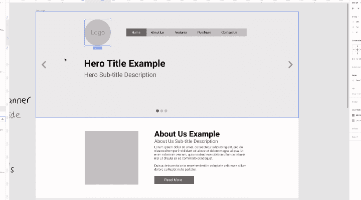

这个标志的介绍将显示这个设计的颜色，这将包括黑色和蓝色，以及设计美学，这有一个更简单的盒子一样的模型。

标志不应该太大和压倒性的，因为主要的重点应该是英雄的内容，和菜单，但它应该足够突出自己时，放在网站的顶部。

### 设计#1:英雄部分

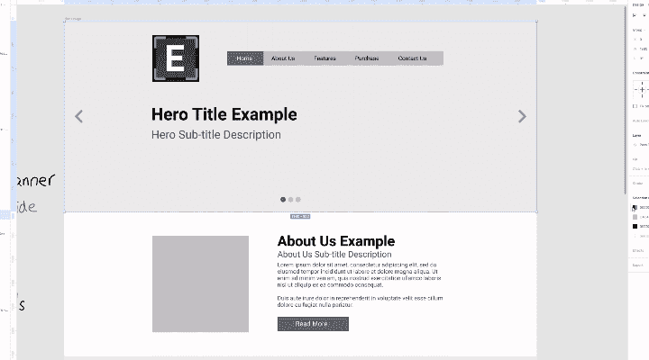

使用徽标的阴影，我们可以将相同的颜色应用到英雄图像的背景上。在这种情况下，它是黑底白字。这直接使得这一部分的徽标、菜单和文本有了更好的对比。

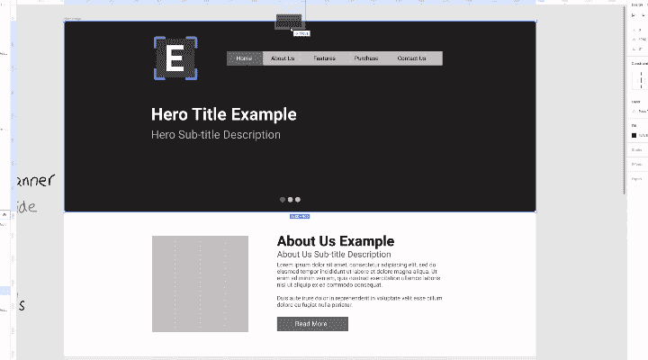

英雄部分可以通过添加背景图像来进一步改进，背景图像本质上是微妙的，不会将焦点从我们的文本上转移开，并且图像可以透视我们试图提供的产品、服务或内容。

### 设计#2:内容

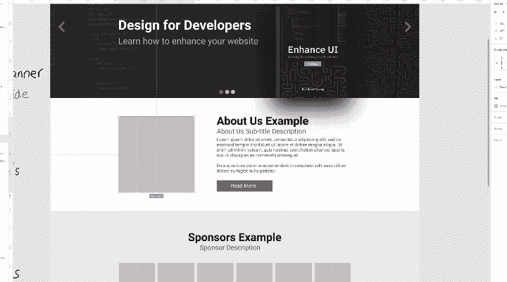

设计的内容可以通过应用好的摄影或图像来进一步改进。

虽然库存照片有助于带来更多的生活，但如果你有产品或服务的好照片，当与描述搭配时，这些照片总是能提供更多的背景，例如关于我们的部分。

### 设计#3:评价

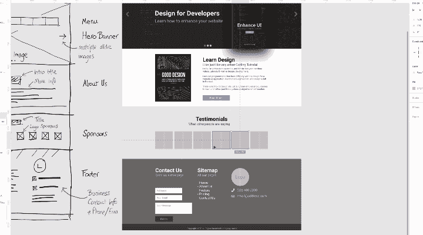

给你的网站带来声誉和权威总是一个好主意，所以无论何时设计一个页面，一个好的推荐部分正好提供了这一点。

我们定制了这一部分的设计，让它以另一种颜色突出，在这种情况下是蓝色。这种蓝色也使这一部分与它上面的部分分离开来。

然后白色被用于每一个证明本身。如果你只有一两个，那也行，可以分箱子。然而，如果你有很多，把这个部分变成滑动滑块也是有用的。

### 设计#4:页脚

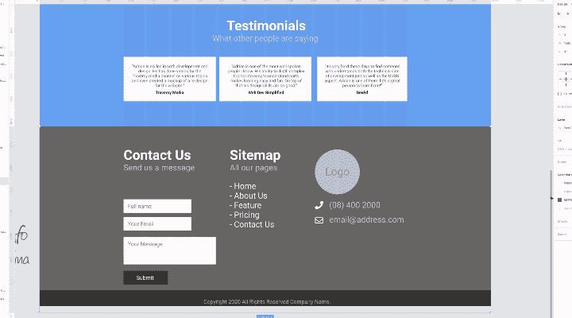

最后是页脚。这部分设计通常是最简单的，不需要太多的改变。

首先，我们匹配到目前为止一直使用的深色。调整联系方式，使其更符合网站的内容，同时在底部再一次加入徽标。我们确保从底部和顶部应用相同的间距，这样我们就完成了！

## 结论:网站完成后的样子

What the finished website will look like

我希望你喜欢这个开发线框，原型和完整设计的旅程。

你可以通过这个链接在 YouTube 上实时查看**整个过程**，这个链接将涵盖更多的元素，例如移动和响应设计，以及每个阶段的额外思考过程。

您也可以[访问 Figma 设计文件](https://www.figma.com/file/MDgTUV17WQghQzYd9hYtU2/freeCodeCamp-Mockup?node-id=0%3A1)进行查看或使用，如果您想亲自尝试该示例，或者以此为参考创建您自己的个人版本。

这整个过程是我试图在自己的频道上教授的内容的一部分，也是我正在写的关于设计的课程/书的一部分，名为**增强 UI** 。目标是**帮助开发者理解设计的基础**。查看下面我的增强用户界面的书:

[Enhance UI - Design for DevelopersLearn Design for Developers wanting to know UI, UX and more.Design for Developers](https://www.enhanceui.com/)

我希望你喜欢这篇文章。如果你不知道我是谁，我是澳大利亚的阿德里安。我在 Twitter & YouTube 上有一个小频道，所以如果你想了解我更多或者喜欢我的内容，有空可以来看看我。😉

*   ****************尤********T********宇部:****************[https://youtube.com/adriantwarog](https://youtube.com/adriantwarog?sub_confirmation=1)
*   ****************碎碎念:****************[https://twitter.com/adrian_twarog](https://twitter.com/adrian_twarog)