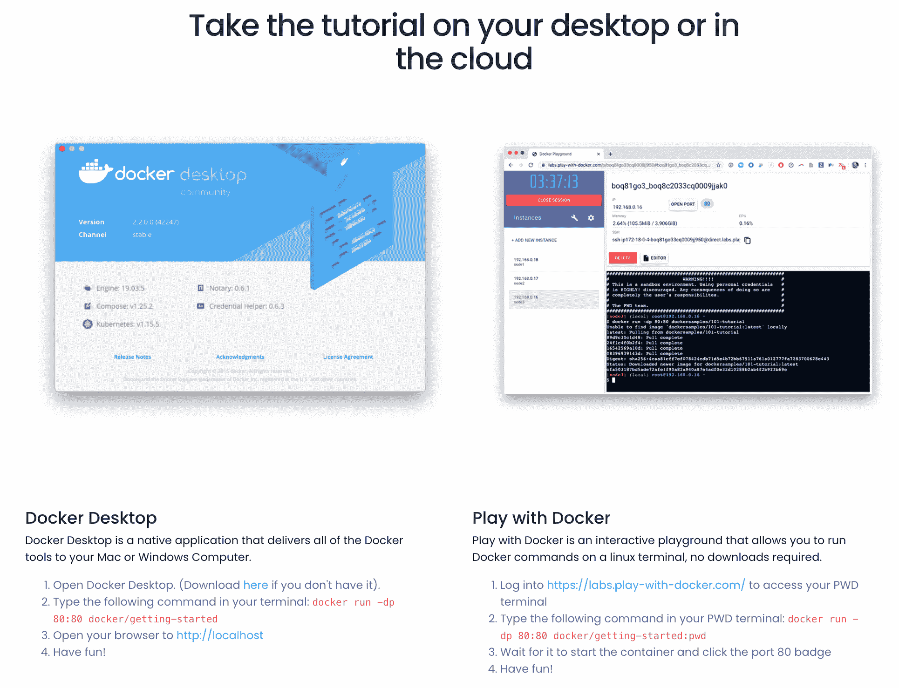
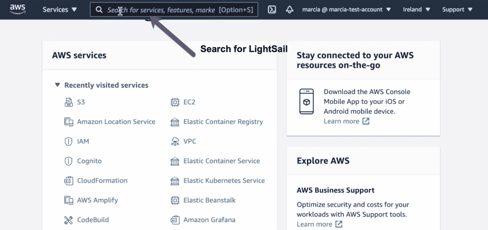
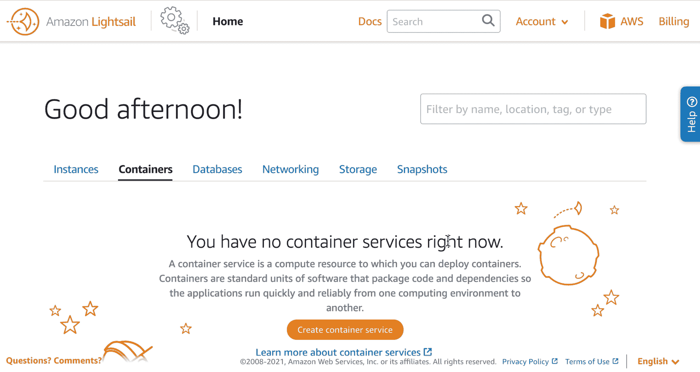
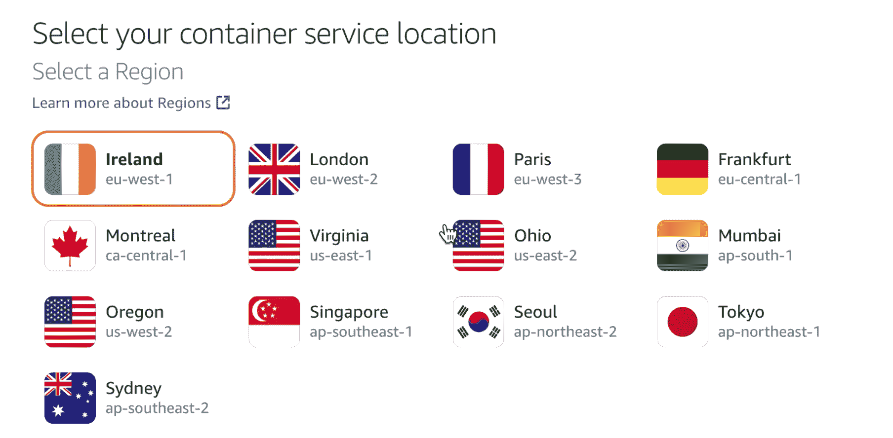
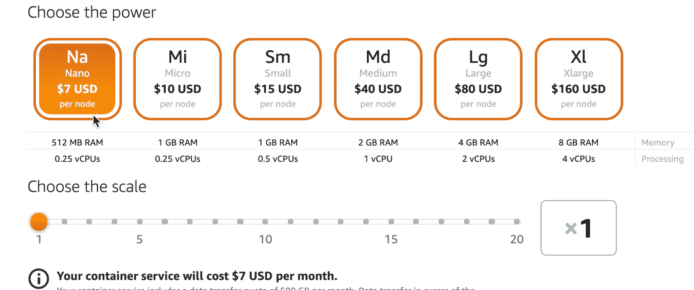
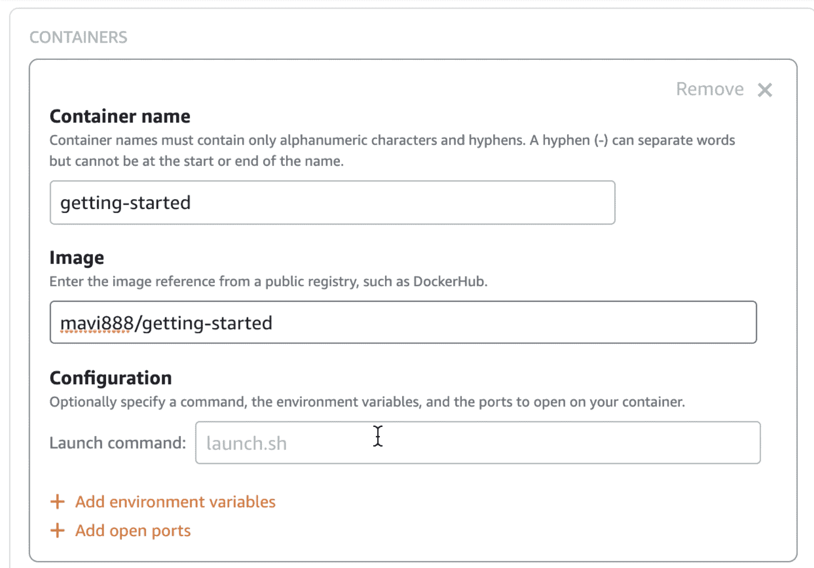
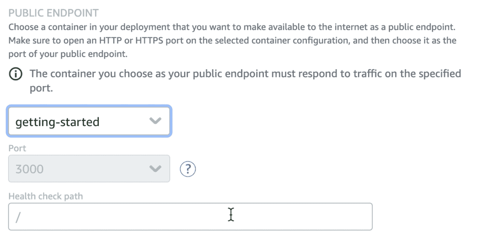
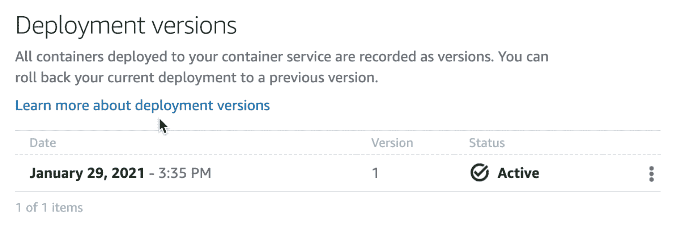
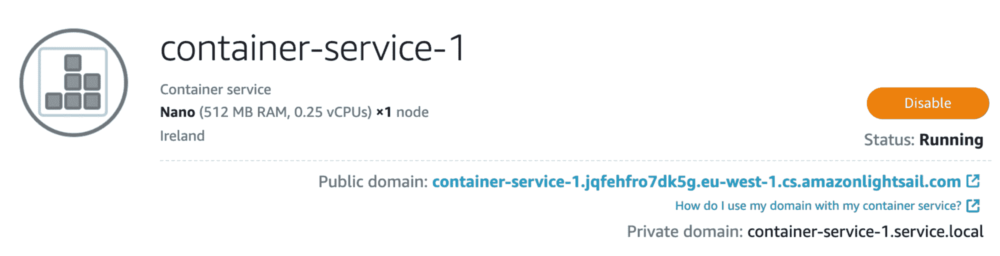

# Docker 部署指南——如何使用 AWS Lightsail 将容器部署到云中

> 原文：<https://www.freecodecamp.org/news/how-do-deploy-docker-containers-to-the-cloud-with-aws-lightsail/>

如今，容器已经成为开发应用程序的事实方式。它们提供了一种标准的方法来打包应用程序需要的所有依赖项。

但是如何将容器化的应用程序部署到云中呢？云提供了可伸缩性、弹性和“按使用付费”的模式，这在现代应用程序中是非常理想的。

让我们假设您已经开发了您的应用程序，并将其打包在 Docker 容器中。这个应用程序可以是你的网站，你为你的公司开发的软件，或者任何东西。

这是大多数基本容器和 Docker 教程结束的地方。但是您希望将您的应用程序部署在某个地方，以便其他人可以使用它。现在你必须开始学习 Kubernetes 和所有复杂的编排系统。对于仅仅部署一个简单的应用程序来说，它们似乎太复杂了。

您知道云是部署应用程序的最佳场所。然而，大多数云服务都很复杂。

要使用它们，您需要了解特定的云概念，如网络、实例类型等。如此多的挑战，而您只想部署一个简单的 web 应用程序。

如果我告诉你有一种云服务可以用来以简单的方式部署你的容器，那会怎么样？该服务提供了云的所有优势，并且您不需要使用任何复杂的编排系统来管理容器工作负载。

如果这听起来很有趣，请继续阅读。在这篇文章中，我将向你介绍亚马逊 Lightsail。然后我将展示一个演示，展示如何使用 Lightsail 将容器应用程序部署到 AWS。

## 什么是 AWS？

AWS 代表亚马逊网络服务，是最广泛采用的云平台。它有许多不同的服务，可以帮助你开发和托管你的应用程序。

与使用自己的本地服务器相比，将云用于您的应用程序有很多好处。例如，它帮助您降低应用程序的成本，变得更加敏捷，并更快地创新。

## 亚马逊 Lightsail 是什么？

亚马逊 Lightsail 是 AWS 基于云的产品的一部分。这是一项服务，它以简单且经济高效的方式提供了将应用程序和网站部署到云中所需的一切。

甚至定价也变得更简单了——你每个月都知道你要付多少钱。Amazon Lightsail 是部署简单应用程序和网站以及开始使用 AWS 的理想方式。

Lightsail 由 AWS 服务提供支持，如虚拟机( [Amazon EC2](https://aws.amazon.com/ec2/) )、关系数据库( [Amazon RDS](https://aws.amazon.com/rds/) )和其他服务。它提供了与任何其他 AWS 服务相同的可伸缩性、可靠性和安全性。

2020 年底， [Lightsail 增加了向云](https://aws.amazon.com/blogs/aws/lightsail-containers-an-easy-way-to-run-your-containers-in-the-cloud/)部署容器的支持。为此，您只需要为您的容器提供一个 Docker 映像，Lightsail 就会自动为您部署它。

Lightsail 提供了一个随时为您的应用服务的 HTTPS 端点。它还负责负载平衡和编排应用程序。

## 如何使用 Lightsail 部署应用程序

让我们通过部署一个打包成容器映像的简单 NodeJS 应用程序来看看 Lightsail 是如何工作的。这张图片是 [Docker Desktop 提供给](https://www.docker.com/101-tutorial)用于学习他们平台的图片。

我们将从大多数教程结束的地方开始演示——当您的应用程序映像托管在 [Docker Hub](https://hub.docker.com/) 中时。

### 步骤 1 -设置您的 AWS 帐户

本教程的第一步是获得一个 [AWS 账户](https://portal.aws.amazon.com/billing/signup)。在这个 AWS 帐户中，您将部署您的容器。

如果你只是创建你的账户，这个项目的自由层应该足够了。免费层将让您在前 12 个月免费访问大量 AWS 服务。你将免费获得一个月的亚马逊 Lightsail。

请记住，如果您不使用任何服务，拥有 AWS 帐户是免费的。创建帐户不会向您收费，如果您不使用该帐户，也不会收取任何费用。

要创建 AWS 帐户，您可以按照本视频中的步骤操作:

[https://www.youtube.com/embed/9_wo0FHtVmY?feature=oembed](https://www.youtube.com/embed/9_wo0FHtVmY?feature=oembed)

### 步骤 2 -创建您的容器服务

现在你应该在 Docker Hub 中有一个 AWS 帐户和你的应用程序——正如这个 [Docker 桌面](https://www.docker.com/101-tutorial)教程所示。

登录你的 AWS 账户，进入亚马逊 Lightsail。

亚马逊的 Lightsail 界面与常规的 AWS 界面截然不同。您可以看到这个界面有许多可用的选项卡。我们对这篇文章感兴趣的是**容器。**但是以类似的方式，您可以使用 Lightsail 创建虚拟实例、数据库和其他云组件。

现在我们可以**创建一个容器服务**，这将把我们带到一个表单，在那里我们需要做出一些简单的决定。

第一个问题是我们希望在哪个区域部署容器映像。Amazon Lightsail 在所有这些地区都有售，因此您可以选择最适合您的应用程序的产品。

之后，我们需要选择为运行我们的容器化应用程序的机器提供多少功率。我们需要决定机器的大小，以及我们需要多少台。

你可以看到每台机器要花多少钱，每台机器有多少内存和 CPU。此外，在您选择了规模之后，您可以准确地看到这项服务的费用。

谈到成本，Lightsail 非常清楚。我们可以在屏幕上看到最终成本。这包括存储、负载平衡、网络以及这个容器需要运行的任何东西。

然后我们需要设置我们的部署。我们正在创建的容器服务可以容纳多达 10 个容器的图像。

对于每个容器，我们需要定义一个名称，图像在哪里(来自 Docker Hub 的 URL)以及我们将如何运行和访问这个应用程序。

在我们的例子中，我们将使用 HTTP 协议打开端口 3000，以便可以通过该 URL 访问应用程序。

我们需要配置的最后一件事是一个**公共端点**。您可以从您的部署中选择要使哪个容器成为 internet 上的公共端点。

之后，您就可以开始部署了。这需要几分钟时间。完成后，您可以访问该服务的公共端点。

在容器服务页面的顶部，可以看到**公共域**。当您单击该 URL 时，您将访问您在公共端点中定义的应用程序。

如果你需要你的容器在不公开的情况下互相交流，使用**私有域**。

## **结论**

现在，您已经在云中部署了一个容器应用程序。这个应用程序是可伸缩的。您可以在**指标**选项卡中监控您之前定义的电源使用情况。如果你发现你需要更多或更少的能量，你可以随时修改这些规格。

此外，如果您的应用程序需要一个域，您可以从[亚马逊 Lightsail 控制台](https://lightsail.aws.amazon.com/ls/docs/en_us/articles/understanding-dns-in-amazon-lightsail)获得一个。

如果你想看这篇博文的视频，你可以看看这里，我们一起做同样的事情。[如果你喜欢](https://www.youtube.com/watch?v=V-C_ZJi6-o0&t=432s)，这个视频也有西班牙语版本。

[https://www.youtube.com/embed/xMudAoq-vmI?feature=oembed](https://www.youtube.com/embed/xMudAoq-vmI?feature=oembed)

**感谢阅读。**

我是 Marcia Villalba，AWS 的开发者倡导者，也是 YouTube 频道 FooBar 的主持人。在那里，我发表了 300 多个关于无服务器、AWS 和软件工程师实践的视频教程。

*   推特:[https://twitter.com/mavi888uy](https://twitter.com/mavi888uy)
*   YouTube:[https://youtube.com/foobar_codes](https://youtube.com/foobar_codes)
*   西班牙语 Youtube 频道:[https://bit.ly/aws-esp-yt](https://bit.ly/aws-esp-yt)