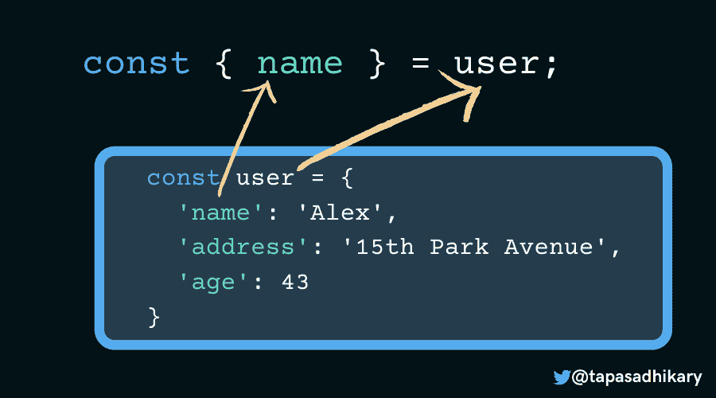
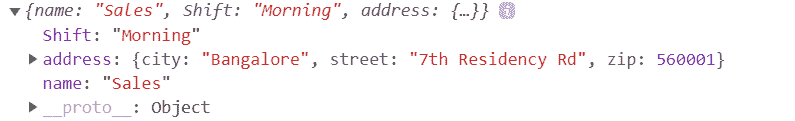
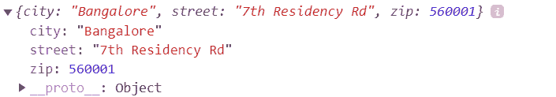
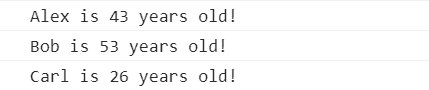
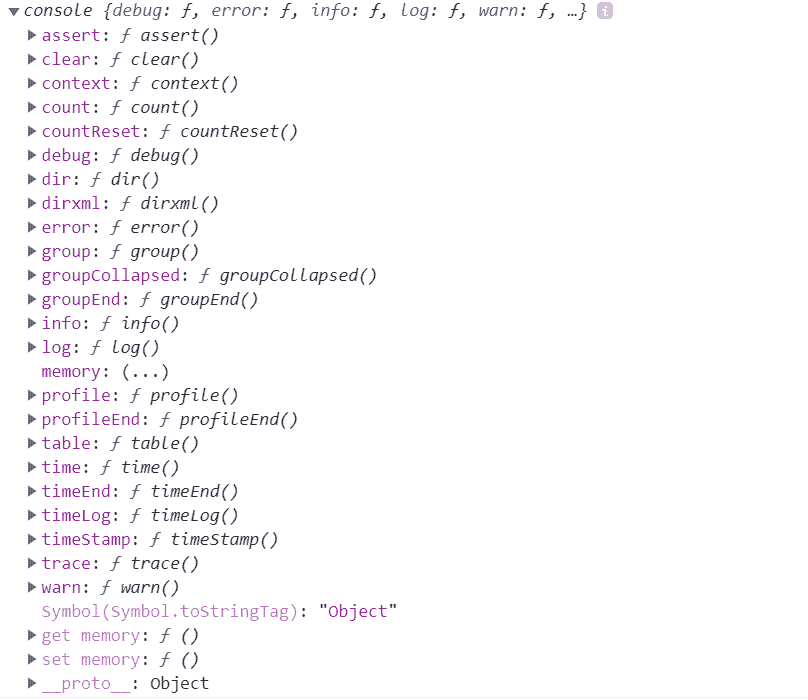
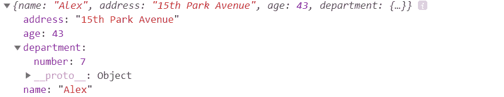

# JavaScript 对象析构、扩展语法和 Rest 参数——实用指南

> 原文：<https://www.freecodecamp.org/news/javascript-object-destructuring-spread-operator-rest-parameter/>

在 JavaScript 中，我们使用对象将多个值存储为一个复杂的数据结构。几乎没有不处理对象的 JavaScript 应用程序。

Web 开发人员通常从对象属性中提取值，以便在编程逻辑中进一步使用。在 ES6 中，JavaScript 引入了`object destructuring`来简化从对象属性创建变量的过程。

在本文中，我们将通过许多实际例子来了解`object destructuring`。我们还将学习如何使用`spread syntax`和`rest parameter`。我希望你喜欢它。

# JavaScript 中的对象析构

我们用花括号`{…}`和属性列表创建对象。属性是键-值对，其中键必须是字符串或符号，值可以是任何类型，包括另一个对象。

```
const user = { 
    'name': 'Alex',
    'address': '15th Park Avenue',
    'age': 43
}
```

这里，我们创建了一个具有三个属性的用户对象:姓名、地址和年龄。编程中真正需要的是提取这些属性值并将它们赋给一个变量。

例如，如果我们想从`user`对象中获取`name`和`age`属性的值，我们可以这样做:

```
let name = user.name;
let age = user.age;
console.log(name, age);
```

这无疑是有点多打字了。我们必须用 dot(.)符号，然后相应地声明变量并给它们赋值。

我们可以使用 ES6 中引入的新的`object destructuring`语法来简化这个过程。

> JavaScript 对象析构是从对象属性中提取值并将它们赋给变量的语法。对于 JavaScript 数组，析构也是可能的。

默认情况下，对象键名成为保存相应值的变量。所以不需要额外的代码来为赋值创建另一个变量。让我们通过例子来看看这是如何工作的。

## 基本对象析构示例

让我们以上面提到的同一个`user`对象为例。

```
const user = { 
    'name': 'Alex',
    'address': '15th Park Avenue',
    'age': 43
} 
```

使用对象析构来提取`name`属性值的表达式如下:

```
const { name } = user;

console.log(name); // Output, Alex
```

如您所见，在表达式的左侧，我们选择了对象属性键(在本例中为`name`)并将其放在`{}`中。它也成为保存属性值的变量名。

表达式的右边是提取值的实际对象。我们还提到了关键字，`const`，`let`等等来指定变量的范围。



那么，我们如何从多个对象属性中提取值呢？简单——我们一直在`{}`中添加对象键，用逗号分隔它们。在下面的例子中，我们从`user`对象中析构了`name`和`age`属性。

```
const user = { 
    'name': 'Alex',
    'address': '15th Park Avenue',
    'age': 43
}

const { name, age } = user;

console.log(name, age); // Output, Alex 43 
```

## 变量声明规则

关键字 let 和 const 在对象析构语法中很重要。考虑下面的例子，我们省略了 let 或 const 关键字。最后会出现错误`Uncaught SyntaxError: Unexpected token '='`。

```
const user = { 
    'name': 'Alex',
    'address': '15th Park Avenue',
    'age': 43
}

{ name  } = user // Uncaught SyntaxError: Unexpected token '='
```

如果我们预先声明变量，然后试图从对象中析构同名的键，会怎么样？不，这里运气也不好。它仍然是语法不正确的。

```
let name;

{ name  } = user; // Uncaught SyntaxError: Unexpected token '='
```

在这种情况下，正确的语法是将析构表达式放在括号(`(...)`)内。

> 请注意，当您想在析构表达式本身中省略 let 或 const 关键字时，括号是必需的。

```
let name;

({ name  } = user);

console.log(name); // Output, Alex
```

## 添加新变量和默认值

我们可以在析构的同时添加一个新的变量，并给它添加一个默认值。在下面的例子中，`user`对象中不存在`salary`变量。但是我们可以在析构表达式中添加它，并给它添加一个默认值。

```
const user = { 
    'name': 'Alex',
    'address': '15th Park Avenue',
    'age': 43
}
const { name, age, salary=123455 } = user;

console.log(name, age, salary); // Output, Alex 43 123455
```

完成上述操作的另一种方法是:

```
let salary = user.salary ? user.salary : 123455;
```

添加带有默认值的变量的灵活性有相当大的优势。这个新变量的默认值不一定总是任何常量。我们可以从其他析构的属性值中计算出它的值。

让我们拿一个有两个属性的`user`对象，`first_name`和`last_name`。我们现在可以使用这两个属性来计算一个不存在的`full_name`的值。

```
const user = { 
    'first_name': 'Alex',
    'last_name': 'Brandos',
}
const { first_name, last_name, full_name=`${first_name} ${last_name}` } = user;

console.log(full_name); // Output, Alex Brandos
```

那不是很优雅很有用吗！

## 添加别名

你可以给你的析构变量一个别名。如果您想减少变量名冲突的机会，这非常方便。

在下面的例子中，我们将属性`address`的别名指定为`permanentAddress`。

```
const user = { 
    'name': 'Alex',
    'address': '15th Park Avenue',
    'age': 43
}

const { address: permanentAddress } = user;

console.log(permanentAddress); // 15th Park Avenue
```

请注意，试图访问此处的变量`address`将导致以下错误:


## 嵌套对象析构

对象可以嵌套。这意味着一个对象属性的值可以是另一个对象，依此类推。

下面我们来考虑一下`user`这个物体。它有一个名为`department`的属性，其值作为另一个对象。但是我们不要就此打住！`department`有一个带有键`address`的属性，其值是另一个对象。很真实的场景，不是吗？

```
const user = { 
        'name': 'Alex',
        'address': '15th Park Avenue',
        'age': 43,
        'department':{
            'name': 'Sales',
            'Shift': 'Morning',
            'address': {
                'city': 'Bangalore',
                'street': '7th Residency Rd',
                'zip': 560001
            }
        }
}
```

我们如何提取`department`属性的值？好了，现在应该很简单了。

```
const { department } = user;
```

下面是您登录`department`时的输出:



但是，让我们再往下嵌套一层。我们如何提取`department`的`address`属性的值？现在，这听起来可能有点棘手。然而，如果你应用同样的`object destructuring`原理，你会发现它是相似的。

```
const { department: { address } } = user;
```

以下是您登录`address`时的输出:



在这种情况下，`department`是我们关注的键，我们从中析构`address`值。注意你想要破坏的键周围的`{}`。

现在是时候更上一层楼了。我们如何从部门地址中提取出`city`的值？又是同样的原理！

```
const { department: { address: { city } } } = user; 
```

登录`city`时的输出是“Bangalore”。

它可以向下嵌套到任何级别。

> 经验法则是从顶层开始，在层次结构中向下，直到达到您想要提取的值。

## 动态名称属性

很多时候，在析构一个对象时，你可能不知道它的属性名(键)。考虑这个例子。我们有一个`user`对象:

```
 const user = { 
    'name': 'Alex',
    'address': '15th Park Avenue',
    'age': 43
} 
```

现在，方法`getValue(key)`接受一个属性键名，并应该返回它的值。

```
getValue('name') // Should return Alex
getValue('age') // Should return 43
```

那么，我们如何使用析构语法编写`getValue(key)`方法的定义呢？

语法与创建别名非常相似。由于我们不知道要在析构语法中硬编码的`key`名称，我们必须用方括号(`[...]`)将它括起来。

```
const getValue = key => {
    const { [key]: returnValue } = user;   
    return returnValue;
}
```

## 函数参数的析构

这是我的最爱，它实际上减少了许多不必要的代码。您可能只想将几个特定的属性值作为参数传递给函数定义，而不是整个对象。在这种情况下，对函数参数使用对象析构。

让我们再次以`user`对象为例。

```
 const user = { 
    'name': 'Alex',
    'address': '15th Park Avenue',
    'age': 43
}
```

假设我们需要一个函数来返回一个使用用户名和年龄的字符串。比如说`Alex is 43 year(s) old!`是我们调用这个函数时的返回值:

```
logDetails(user); 
```

在这里，我们可以简单地使用析构分别将`name`和`age`值传递给函数定义。没有必要传递整个`user`对象，然后一个一个地从中提取值。请看一看:

```
function logDetails({name, age}) {
    console.log(`${name} is ${age} year(s) old!`)
} 
```

## 析构函数返回值

当一个函数返回一个对象并且你对特定的属性值感兴趣时，直接使用析构。这里有一个例子:

```
 const getUser = () => {
    return{ 
        'name': 'Alex',
        'address': '15th Park Avenue',
        'age': 43
    }
}

const { name, age } = getUser();

console.log(name, age); // Alex 43 
```

这类似于我们在开始时看到的基本对象析构。

## 循环析构

你可以在`for-of`循环中使用对象析构。让我们以这样一组用户对象为例:

```
 const users = [
    { 
        'name': 'Alex',
        'address': '15th Park Avenue',
        'age': 43
    },
    { 
        'name': 'Bob',
        'address': 'Canada',
        'age': 53
    },
    { 
        'name': 'Carl',
        'address': 'Bangalore',
        'age': 26
    }
];
```

我们可以使用`for-of`循环提取对象析构的属性值。

```
for(let { name, age } of users) {
    console.log(`${name} is ${age} years old!`);
}
```

这是输出:



## `Console`物体

在 JavaScript 中，`console`是所有浏览器都支持的内置对象。如果你已经注意到了，`console`对象有许多属性和方法，有些非常流行，比如`console.log()`。



使用析构对象语法，我们可以简化代码中这些方法和属性的使用。这个怎么样？

```
const { log, warn, error } = console;

log('I log into the browser console');
warn('I am a warning');
error('I am an error');
```

# JavaScript 中的扩展语法

扩展语法(也称为扩展操作符)是 ES6 的另一个优秀特性。顾名思义，它接受一个 iterable(就像一个数组)并将它扩展(展开)成单独的元素。

我们还可以使用 spread 语法扩展对象，并将其`enumerable`属性复制到一个新对象中。

Spread 语法使用花括号和三个点`{...}`帮助我们用最简单的语法克隆一个对象。

```
const clone_some_object = {...some_object}
```

使用 spread 语法，我们可以用一种`immutable`的方式克隆、更新和合并对象。不变性有助于减少对原始(源)对象的任何意外或无意的更改。

> JavaScript 中的对象析构和展开语法不是一回事。

## 创建对象的克隆

我们可以使用扩展语法创建对象的克隆实例，如下所示:

```
 const user = { 
    'name': 'Alex',
    'address': '15th Park Avenue',
    'age': 43
}

const clone = {...user} // Output, {name: "Alex", address: "15th Park Avenue", age: 43}

clone === user; // Output, false 
```

您也可以使用`object.assign()`创建一个对象的克隆。然而，扩展语法要精确得多，也短得多。

> 扩展语法执行对象的浅层复制。这意味着不会克隆任何嵌套对象实例。

## 向对象添加属性

我们可以使用`spread syntax`向对象添加一个新的属性(键值对)。请注意，实际的对象永远不会改变。新属性被添加到克隆的对象中。

在下面的例子中，我们使用 spread 语法添加了一个新的属性(`salary`)。

```
 const user = { 
    'name': 'Alex',
    'address': '15th Park Avenue',
    'age': 43
}

// Add a new property salary
const updatedUser = {...user, salary:12345}; // {name: "Alex", address: "15th Park Avenue", age: 43, salary: 12345}

// Original object is unchanged
console.log(user); // {name: "Alex", address: "15th Park Avenue", age: 43} 
```

## 更新属性

我们还可以使用 spread 语法更新现有的属性值。与添加操作一样，更新发生在对象的克隆实例上，而不是实际对象上。

在下面的例子中，我们正在更新属性`age`的值:

```
 const user = { 
    'name': 'Alex',
    'address': '15th Park Avenue',
    'age': 43
}

const updatedUser = {...user, age:56}; // {name: "Alex", address: "15th Park Avenue", age: 56}

console.log(user); // {name: "Alex", address: "15th Park Avenue", age: 43} 
```

## 更新嵌套对象

正如我们所看到的，用 spread 语法更新对象很容易，并且不会改变原始对象。但是，当您尝试使用 spread 语法更新嵌套对象时，可能会有点棘手。我们用一个例子来理解一下。

我们有一个属性为`department`的`user`对象。`department`属性的值是一个对象，该对象包含另一个带有其`address`属性的嵌套对象。

```
 const user = { 
    'name': 'Alex',
    'address': '15th Park Avenue',
    'age': 43,
    'department':{
        'name': 'Sales',
        'Shift': 'Morning',
        'address': {
            'city': 'Bangalore',
            'street': '7th Residency Rd',
            'zip': 560001
        }
    }
} 
```

现在，我们如何为`department`对象添加一个名为`number`的新属性，比如说值为`7`？好吧，我们可以尝试下面的代码来实现它(但这将是一个错误):

```
const updated = {
    ...user, 
    department: {'number': 7}
}

console.log(updated);
```

当您执行它时，您将意识到代码将用新值替换整个 department 对象，如`{'number': 7}`。这不是我们想要的！



我们如何解决这个问题？我们需要扩展嵌套对象的属性以及添加/更新它。下面是将带有值`7`的新属性`number`添加到`department`对象而不替换其值的正确语法:

```
const updated = {
    ...user, 
    department: {
        ...user.department, 
        'number': 7
    }
};

console.log(updated);
```

输出如下所示:


## 组合(或合并)两个对象

JavaScript 对象中 spread 语法的最后一个实际应用是组合或合并两个对象。可以使用以下语法将 obj_1 和 obj_2 合并在一起:

```
const merged = {...obj_1, ...obj_2};
```

注意，这种合并方式执行一个`shallow merge`。这意味着如果两个对象之间有共同的属性，obj_2 的属性值将替换合并对象中 obj_1 的属性值。

让我们将`user`和`department`对象组合(或合并)在一起。

```
 const user = { 
    'name': 'Alex',
    'address': '15th Park Avenue',
    'age': 43
}

const department = {
    'id': '001',
    'Shift': 'Morning'
} 
```

使用扩展语法合并对象，如下所示:

```
const completeDetails = {...user, ...department};

console.log(completeDetails);
```

输出如下所示:


如果我们像这样改变`department`对象:

```
const department = {
    'name': 'Sales',
    'Shift': 'Morning'
}
```

现在尝试组合它们，并观察组合后的对象输出:

```
const completeDetails = {...user, ...department};

console.log(completeDetails);
```

输出将是:


在合并的对象输出中，`user`对象的`name`属性值被替换为`department`对象的`name`属性值。所以要小心这样用。

到目前为止，您需要自己实现对象的`deep-merge`或者利用类似于`lodash`的库来完成它。

# JavaScript 中的 Rest 参数

`Rest`参数有点与`spread`语法相反。spread 语法有助于扩展或分布元素和属性，而 rest 参数有助于将它们收集在一起。

对于对象，rest 参数通常与析构语法一起使用，以合并您正在处理的新对象中的剩余属性。

让我们来看看下面这个`user`对象的例子:

```
 const user = { 
    'name': 'Alex',
    'address': '15th Park Avenue',
    'age': 43
} 
```

我们知道如何析构`age`属性来创建一个变量并为其赋值。用`user`对象的剩余属性同时创建另一个对象怎么样？给你:

```
 const {age, ...rest} = user;
console.log(age, rest);
```

输出将是:


在输出中，我们看到`age`的值是`43`。`rest parameter`将剩余的`user`对象属性`name`和`address`合并到一个单独的对象中。

# 概括起来

总而言之，

*   对象析构是 ES6 中引入的新语法。它通过以更简单的方式提取对象的属性来帮助创建变量。
*   如果你正在使用(或计划使用)像`angular`、`react`或`vue`这样的框架/库，你将会使用大量的对象析构语法。
*   对象析构和扩展语法不是一回事。
*   语法(也称为扩展操作符)用于复制一个对象的可枚举属性来创建它的克隆。我们还可以使用 spread 语法更新一个对象或与另一个对象合并。
*   `Rest`参数有点与`Spread`语法相反。当析构完成时，它有助于将剩余的对象属性合并(或收集)到一个新对象中。

## 在我们走之前

我希望您发现这篇文章很有见地，并且它能帮助您开始更有效地使用这些概念。我们来连线。你会发现我活跃在 [Twitter (@tapasadhikary)](https://twitter.com/tapasadhikary) 。请随时关注。

你可以在我的 GitHub 资源库- [js-tips-tricks](https://github.com/atapas/js-tips-tricks/blob/master/object-destructuring.js) 中找到本文使用的所有源代码示例。您是否有兴趣根据我们目前所学的知识动手编写一些代码？请[看看这里的小测验](https://github.com/atapas/js-tips-tricks/blob/master/quiz-od.js)，你会发现它很有趣。

您可能也会喜欢这些文章:

*   [作为软件开发人员如何每天学习新东西](https://www.freecodecamp.org/news/learn-something-new-every-day-as-a-software-developer/)
*   [如何毫不费力地找到博客内容创意？](https://blog.greenroots.info/how-to-find-blog-content-ideas-effortlessly-ckghrjv5200o7rhs1ewn40102)
*   [作为开发者为什么需要做副业？](https://blog.greenroots.info/why-do-you-need-to-do-side-projects-as-a-developer-ckhn5m5km05teajs1fvjd7u5f)
*   [你可能会发现有用的 16 个 GitHub 辅助项目库](https://blog.greenroots.info/16-side-project-github-repositories-you-may-find-useful-ckk50hic406quhls1dui2d6sd)