# React 钩子备忘单:你需要知道的 7 个钩子

> 原文：<https://www.freecodecamp.org/news/react-hooks-cheatsheet/>

这个新教程将从头开始向你展示你需要知道的关于 React 钩子的一切。

我已经把这份备忘单放在一起，帮助你尽快掌握 React Hooks 并提高其效率。

另外，本教程也是一个交互式视频指南，将在 30 秒或更短的时间内展示如何使用每个钩子的实际例子。

每个例子都建立在前一个例子的基础上，它包含了大量的模式和最佳实践，将帮助您在未来几年内使用 React Hooks 构建应用程序。

## 想要你自己的副本吗？‬

**[点击此处下载 PDF 格式的备忘单](http://bit.ly/react-hooks-2021)** (耗时 5 秒)。

当您获得可下载版本时，您将获得 3 个快速胜利:

*   您将获得大量可复制的代码片段，以便在您自己的项目中重用。
*   这是一个很好的参考指南，可以加强你作为 React 开发人员的技能，也可以用于工作面试。
*   你可以在任何你喜欢的地方拿走、使用、打印、阅读和重读这个指南。

有一大堆好东西要介绍，所以让我们开始吧:

### 目录:

1.  [使用状态挂钩](#1-usestate-hook)
2.  [使用效果挂钩](#2-useeffect-hook)
3.  [useRef Hook](#3-useref-hook)
4.  [使用回调挂钩](#4-usecallback-hook)
5.  [useMemo Hook](#5-usememo-hook)
6.  [使用上下文挂钩](#6-usecontext-hook)
7.  [useReducer 挂钩](#7-usereducer-hook)

## 1.使用状态挂钩

### 使用 State 创建状态变量

useState 挂钩允许我们在 React 函数组件中创建状态变量。

> 状态允许我们随时访问和更新组件中的某些值

当我们创建一个状态变量时，我们必须为它提供一个默认值(可以是任何数据类型)。

我们将状态变量作为数组中的第一个值，我们可以用`const`来析构和声明它。

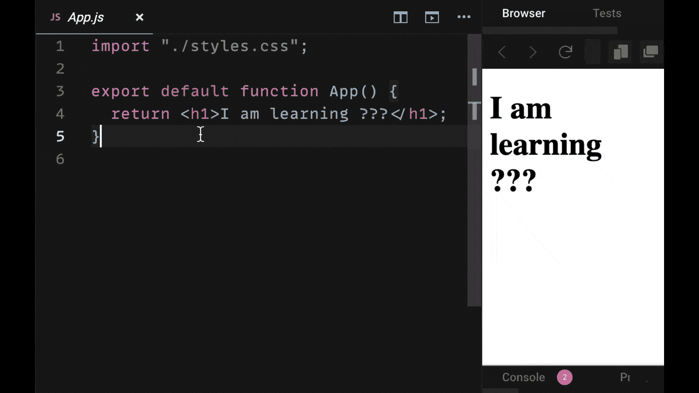

### 更新状态变量

useState 还为我们提供了一个 setter 函数，用于在创建后更新状态。

为了更新我们的状态变量，我们向 setter 函数传递我们希望我们的状态成为的新值。

> 当你声明你的 setter 函数时，大多数情况下你会在它前面加上前缀“set”

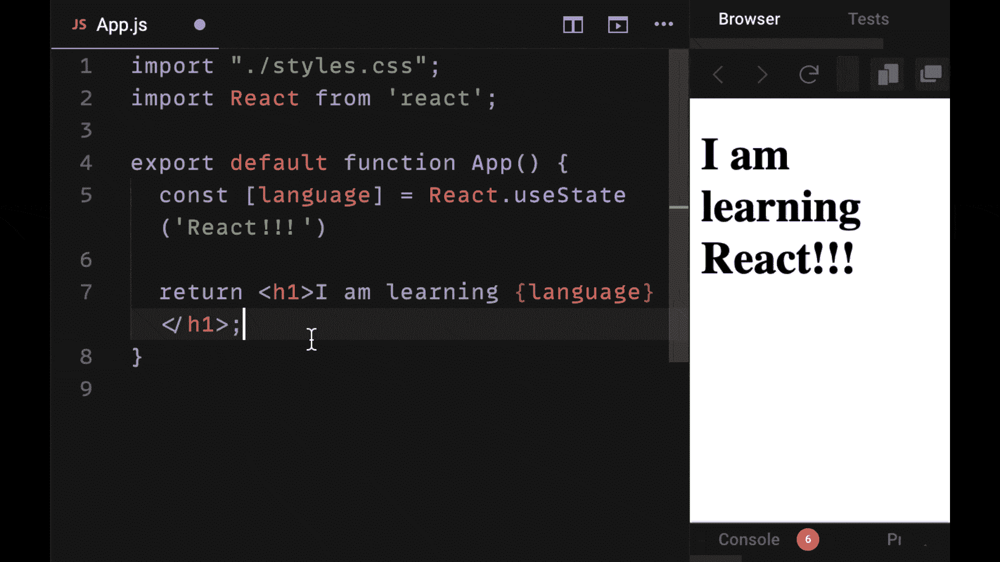

### 可以使用一次或多次

useState 可以在单个组件中使用一次或多次。

有时你会想要创建多个状态变量，而其他时候你可能想要对一个对象使用单个变量(见下文)。

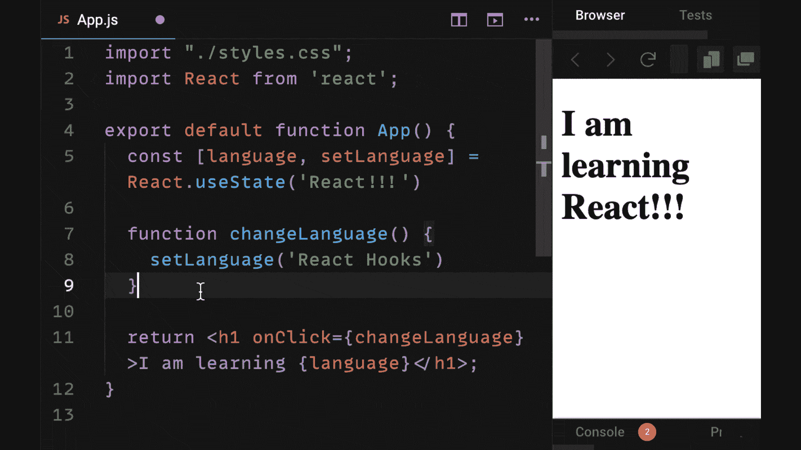

### 基于以前的值更新状态

如果新的状态依赖于先前的状态，我们可以使用先前的状态变量并应用我们想要的任何改变。

例如，如下例所示，将当前的`years`值加 1，使其递增。

为了保证可靠地完成更新，我们可以在 setter 函数中使用一个函数，该函数为我们提供正确的先前状态。

### 管理对象的状态

您可以使用带有 useState 的对象，这允许您将单个值作为键值对进行管理。

如下例所示，当您使用对象更新状态时，您需要在以前的状态中展开。

为什么？因为除了正在更新的属性之外，任何其他属性都不会包含在新状态中。

## 2\. useEffect Hook

### 使用 Effect 执行副作用

useEffect 让我们在函数组件中执行副作用。

> 副作用是当我们需要接触外部世界的时候。比如从 API 获取数据或者使用 DOM。

副作用是能够以不可预测的方式改变我们的组件状态的行为(已经导致了“副作用”)。

useEffect 接受一个回调函数(称为“Effect”函数)，默认情况下，该函数将在组件每次重新呈现时运行。

在下面的例子中，我们与 DOM 交互来改变文档体的样式属性:

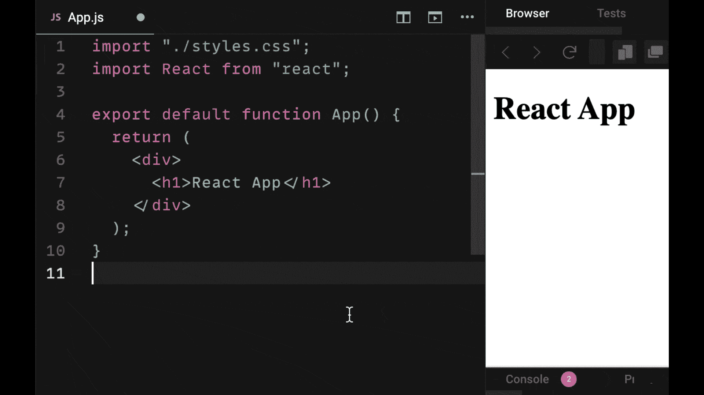

### 值改变时再次运行

useEffect 让我们有条件地使用依赖数组来执行效果。

dependencies 数组是传递给 useEffect 的第二个参数。

如果数组中的任何一个值发生变化，效果函数将再次运行。

如果 dependencies 数组中不包含任何值，useEffect 将只在组件挂载和卸载时运行。

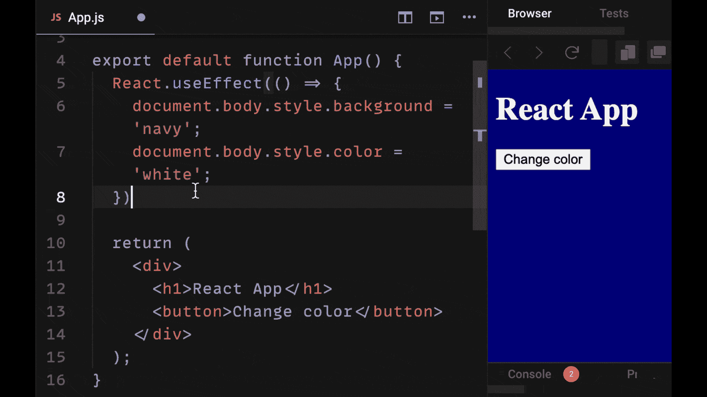

### 通过返回函数取消订阅

useEffect 允许我们取消订阅侦听器，这些侦听器可能是我们通过在末尾返回一个函数而创建的。

我们希望取消订阅某些事件，例如事件侦听器，因为当组件卸载时(即用户转到不同的页面)，React 可能会尝试更新不再存在的状态，从而导致错误。

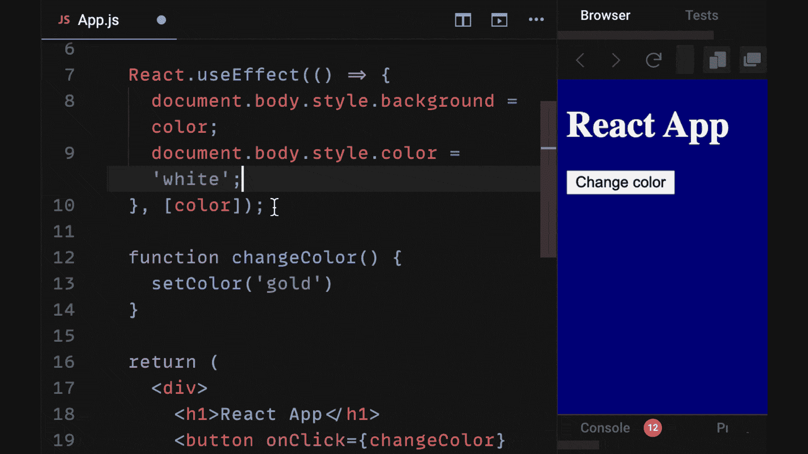

### 从 API 获取数据

useEffect 是当您想要发出 HTTP 请求(即，当组件挂载时发出 GET 请求)时使用的钩子。

注意，用更简洁的`async/await`语法处理承诺需要创建一个单独的函数。

这是因为效果回调函数不能是异步的。

在下面的例子中，我们用一系列的`.then()`回调来解析我们的承诺(从`fetch`返回)以获取我们的数据。

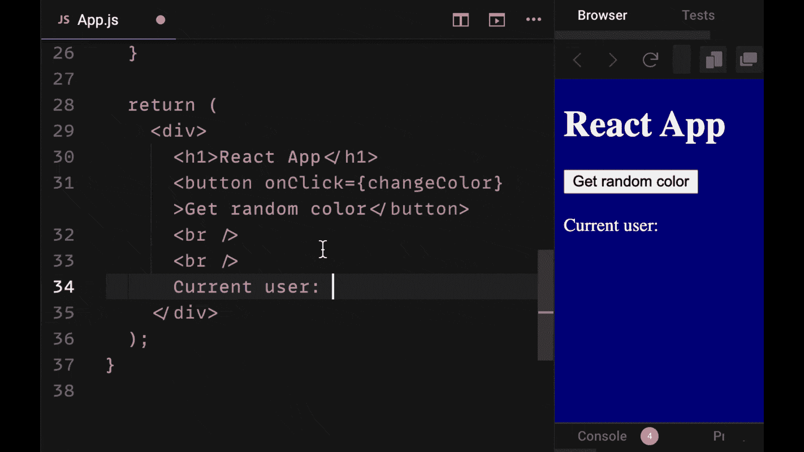

## 3\. useRef Hook

### 引用 React 元素的 useRef

引用是一种特殊属性，可用于所有 React 组件。它们允许我们在安装组件时创建对给定元素/组件的引用。

useRef 允许我们轻松地使用 React refs。当我们想要直接与一个元素交互时，它们是很有帮助的(如下例所示)，比如清除它的值或者聚焦它，就像输入一样。

我们调用 useRef(在组件的顶部)并将返回值附加到元素的 Ref 属性来引用它。

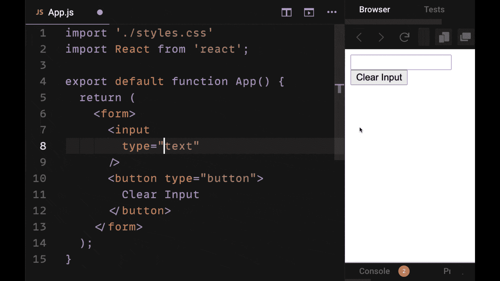

## 4.使用回调挂钩

### useCallback 防止回调被重新创建

useCallback 是一个用于提高组件性能的钩子。

> 回调函数是在父组件中被“回调”的函数的名称。

最常见的用法是拥有一个带有状态变量的父组件，但是您希望从子组件更新该状态。

你是做什么的？您将回调函数从父节点传递给子节点。这允许我们更新父组件中的状态。

useCallback 记忆我们的回调函数，所以它们不会在每次重新渲染时重新创建。正确使用 useCallback 可以提高我们 app 的性能。

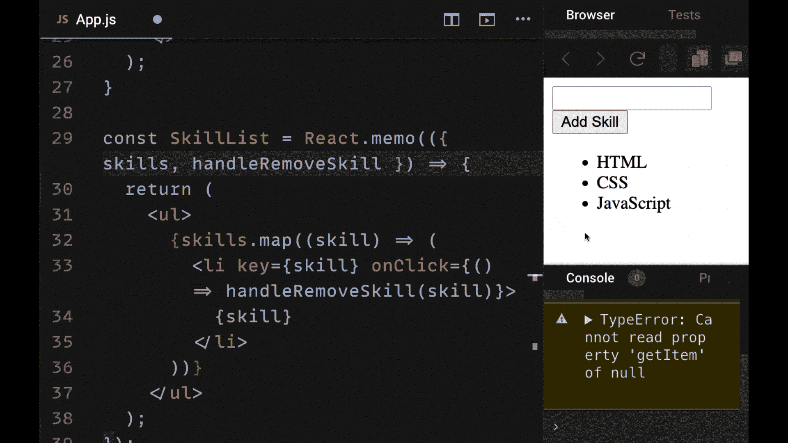

## 5\. useMemo Hook

### useMemo 可以改善昂贵的操作

useMemo 与 useCallback 非常相似，有助于提高性能。但是它不是用于回调，而是用于存储昂贵操作的结果。

> useMemo 允许我们记忆，或记住已经为某些输入进行的昂贵操作的结果。

记忆化意味着如果一个给定的输入已经计算过了，就没有必要再做一次，因为我们已经有了那个操作的存储结果。

useMemo 从计算中返回一个值，然后存储在一个变量中。

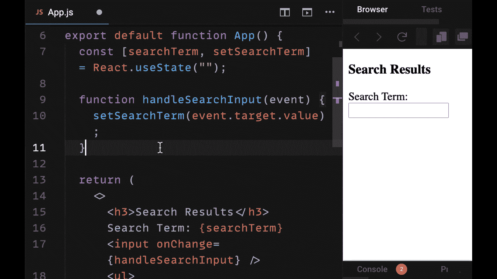

## 6.使用上下文挂钩

### 使用上下文帮助我们避免正确钻探

在 React 中，我们希望避免下面的问题，即创建多个 props 来从父组件向下传递两层或更多层的数据。

> 在某些情况下，通过多个组件传递属性是好的，但是通过不需要它的组件传递属性是多余的。

上下文有助于从父组件向下传递多个级别的子组件，并在我们的应用程序组件树中共享状态。

useContext 挂钩删除了以前在使用 React 上下文时需要的不寻常的呈现道具模式。

相反，useContext 为我们提供了一个简单的函数来访问我们在任何子组件中的上下文提供者的`value` prop 上提供的数据。

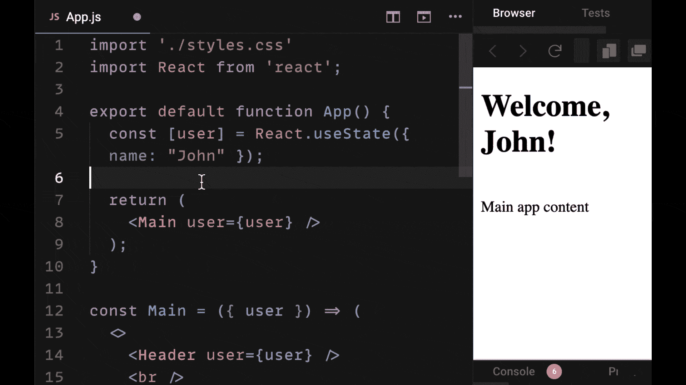

## 7\. useReducer Hook

### useReducer 是(另一个)强大的状态管理工具

useReducer 是一个用于状态管理的钩子，很像 useState，它依赖于一种叫做 Reducer 的函数。

> Reducers 是简单的、可预测的(纯)函数，它接受一个先前的状态对象和一个动作对象，并返回一个新的状态对象。

useReducer 的许多用法与 useState 相同，但对于管理可能涉及不同操作或“动作”的多个组件的状态更有帮助。

你将需要在你的应用程序中使用更少的 useReducer。但是，作为在较小的应用程序中管理状态的强大手段，它是非常有帮助的，而不必使用像 Redux 这样的第三方状态管理库。

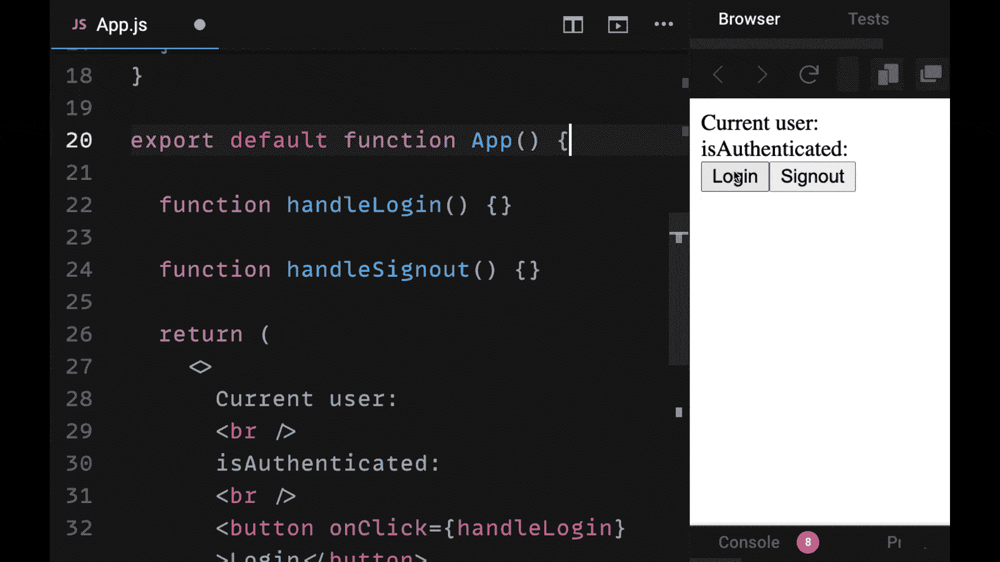

## 想保留此指南以供将来参考吗？

**[点击此处下载此备忘单的完整 PDF 版本。](http://bit.ly/react-hooks-2021)**

尽情享受吧！