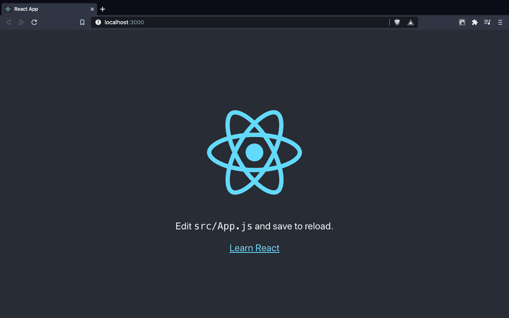
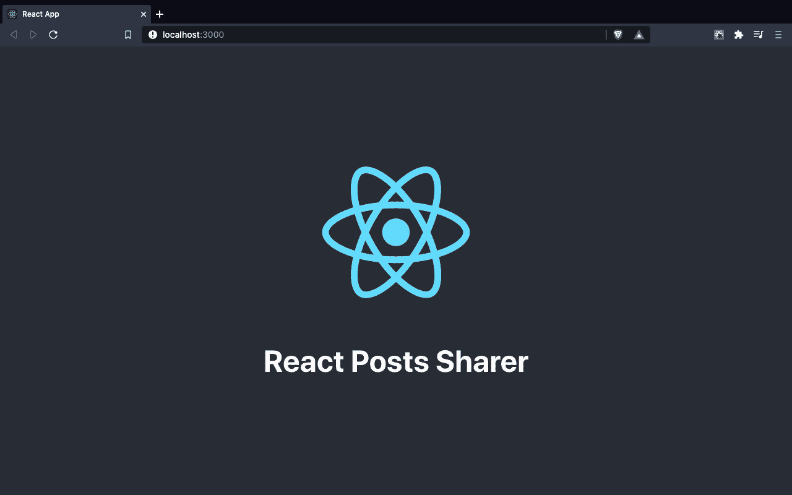
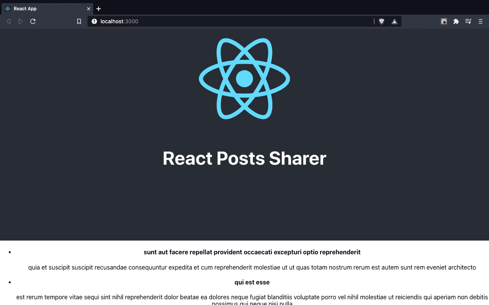
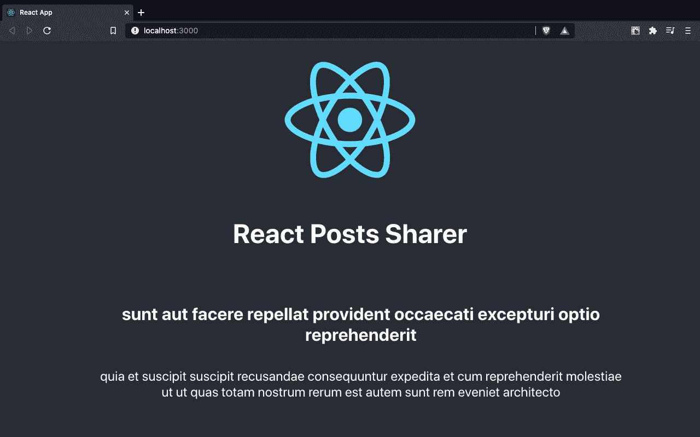

# 如何用 10 个步骤创建一个 React 项目

> 原文：<https://www.freecodecamp.org/news/how-to-build-a-react-project-with-create-react-app-in-10-steps/>

包 Create React 应用程序使创建和开发 React 应用程序变得轻而易举。

这是启动一个新的 React 项目的最简单的方法之一，是用于您自己的个人项目以及大型应用程序的理想选择。

我们将一步一步地介绍如何使用 Create React App 的所有主要功能来快速轻松地构建您自己的 React 项目。

在整个指南中，我还包括了许多有用的技巧，这些技巧是我通过使用 Create React App 构建应用程序来使您的工作流程更加简单而学到的。

让我们开始吧。

> 想了解如何使用 Create React App 创建令人印象深刻的生产就绪型应用程序吗？看看 React 训练营。

### 您将需要的工具:

*   安装在计算机上的节点。你可以在[nodejs.org](https://nodejs.org)下载节点。创建 React 应用程序要求节点版本至少为 10。
*   一个叫做 npm 的包管理器。它会自动包含在 Node 的安装中。您需要 npm 版本至少为 5.2。
*   一个很好的代码编辑器来处理我们的项目文件。我强烈推荐使用编辑器 Visual Studio 代码。你可以在 code.visualstudio.com 买到。

## 第一步。如何安装 Create React App

要使用 Create React App，我们首先需要在电脑上打开终端或命令行。

要创建一个新的 React 项目，我们可以使用工具`npx`，前提是你的 npm 版本至少是 5.2。

> 注意:你可以在你的终端运行`npm -v`来检查你的 npm 版本

npx 给了我们使用`create-react-app`包的能力，而不必先把它安装在我们的电脑上，这非常方便。

使用 npx 还可以确保我们使用最新版本的 Create React App 来创建我们的项目:

```
npx create-react-app my-react-app
```

一旦我们运行这个命令，一个名为“my-react-app”的文件夹将会在我们的计算机上指定的位置创建，并且它需要的所有包将会自动安装。

> 注意:使用 create-react-app 创建一个新的 React 应用程序通常需要 2-3 分钟，有时会更长。

Create React App 还为我们提供了一些模板，用于特定类型的 React 项目。

例如，如果我们想要创建一个使用工具 TypeScript 的 React 项目，我们可以使用一个模板，而不必手动安装 TypeScript。

要创建使用类型脚本的 React 应用程序，我们可以使用创建 React 应用程序类型脚本模板:

```
npx create-react-app my-react-app --template typescript
```

## 第二步。审查项目结构

一旦创建了项目文件并安装了依赖项，我们的项目结构应该如下所示:

```
my-react-app
├── README.md
├── node_modules
├── package.json
├── .gitignore
├── public
└── src
```

这些文件和文件夹是做什么用的？

*   `README.md`是一个 markdown 文件，其中包含许多有用的提示和链接，可以帮助您学习使用 Create React App。
*   `node_modules`是一个文件夹，包含 Create React App 已经安装的所有依赖相关代码。你永远不需要进入这个文件夹。
*   它管理我们的应用程序依赖关系和我们项目的 node_modules 文件夹中包含的内容，以及运行我们的应用程序所需的脚本。
*   `.gitignore`是一个文件，用于排除 Git 跟踪的文件和文件夹。我们不想包含像 node_modules 文件夹这样的大文件夹
*   `public`是一个文件夹，我们可以用它来存储静态资产，比如 React 应用程序的图像、SVG 和字体。
*   `src`是一个包含我们源代码的文件夹。这是我们所有与 React 相关的代码所在的地方，也是我们构建应用程序的主要工作。

> 注意:每当您使用 Create React App 创建一个新项目时，都会创建一个新的 Git 存储库。您可以使用`git add .`和`git commit -m "your commit message"`立即开始保存对应用程序的更改。

## 第三步。如何运行 React 项目

将项目拖到代码编辑器中后，就可以打开终端了(在 VSCode 中，转到 View > Terminal)。

要启动 React 项目，只需运行:

```
npm start
```

当我们运行我们的项目时，一个新的浏览器选项卡将自动在我们计算机的默认浏览器上打开，以查看我们的应用程序。

开发服务器将在 localhost:3000 上启动，我们马上可以看到我们应用程序的起始主页。



我们的 app 内容从哪里来？

它来自 src 文件夹中的 App.js 文件。如果我们去那个文件，我们可以开始修改我们的应用程序代码。

```
// src/App.js

import logo from "./logo.svg";
import "./App.css";

function App() {
  return (
    <div className="App">
      <header className="App-header">
        
        <p>
          Edit <code>src/App.js</code> and save to reload.
        </p>
        <a
          className="App-link"
          href="https://reactjs.org"
          target="_blank"
          rel="noopener noreferrer"
        >
          Learn React
        </a>
      </header>
    </div>
  );
}

export default App;
```

特别是，让我们删除`p`和`a`标签，并添加一个带有我们的应用程序名称“React Posts Sharer”的`h1`元素:

```
// src/App.js

import logo from "./logo.svg";
import "./App.css";

function App() {
  return (
    <div className="App">
      <header className="App-header">
        
        <h1>React Posts Sharer</h1>
      </header>
    </div>
  );
}

export default App;
```

当您使用 Command/Ctrl + S 保存时，您将看到我们的页面立即更新为如下所示:



开发服务器的伟大之处在于它会自动刷新以反映我们的更改。不需要手动刷新浏览器。

> 注意:在使用 Create React 应用程序时，唯一需要刷新浏览器的时候就是出现错误的时候。

## 第四步。如何使用 React 测试库运行测试

创建 React 应用程序使测试 React 应用程序变得非常简单。

它包括使用 React 测试库(`@testing-library/react`)运行测试所需的所有包。

src 中的 App.test.js 文件包含一个基本测试。它测试我们的应用程序组件成功地显示了一个带有文本“learn react”的链接。

我们可以使用以下命令运行我们的测试:

```
npm run test
```

> 注意:当您运行命令`npm run test`时，测试将在所有以. test.js 结尾的文件中运行

然而，如果我们运行这个，我们的测试将会失败。

这是因为我们不再有一个链接元素，而是一个标题元素。为了让我们的测试通过，我们希望获得一个标题元素，其文本为“React Posts Sharer”。

```
// src/App.test.js

import { render, screen } from "@testing-library/react";
import App from "./App";

test("renders app title element", () => {
  render(<App />);
  const titleElement = screen.getByText(/React Posts Sharer/i);
  expect(titleElement).toBeInTheDocument();
});
```

一旦我们再次运行我们的测试，我们看到它通过了:

```
PASS  src/App.test.js

  ✓ renders app title element (54 ms)

Test Suites: 1 passed, 1 total
Tests:       1 passed, 1 total
Snapshots:   0 total
Time:        2.776 s, estimated 3 s
Ran all test suites related to changed files.
```

> 注意:当运行 test 命令时，您不需要手动启动和停止它。如果您有一个失败的测试，您可以跳转到您的应用程序代码，修复您的错误，一旦您点击保存，所有测试将自动重新运行。

## 第五步。如何更改应用程序的元数据

我们的项目是如何运作的？我们可以查看 index.js 文件。

```
// src/index.js

import React from 'react';
import ReactDOM from 'react-dom';
import './index.css';
import App from './App';
import reportWebVitals from './reportWebVitals';

ReactDOM.render(
  <React.StrictMode>
    <App />
  </React.StrictMode>,
  document.getElementById('root')
);
```

ReactDOM 包通过将我们的应用程序(特别是 App 组件和其中的每个组件)附加到一个 id 值为“root”的 HTML 元素来呈现它。

这个元素可以在`public/index.html`里面找到。

```
<!DOCTYPE html>
<html lang="en">
  <head>
    <meta charset="utf-8" />
    <link rel="icon" href="%PUBLIC_URL%/favicon.ico" />
    <meta name="viewport" content="width=device-width, initial-scale=1" />
    <meta name="theme-color" content="#000000" />
    <meta
      name="description"
      content="Web site created using create-react-app"
    />
    <link rel="apple-touch-icon" href="%PUBLIC_URL%/logo192.png" />
    <link rel="manifest" href="%PUBLIC_URL%/manifest.json" />
    <title>React App</title>
  </head>
  <body>
    <noscript>You need to enable JavaScript to run this app.</noscript>
    <div id="root"></div>
  </body>
</html> 
```

使用 div 将整个 React 应用程序附加到这个 HTML 页面，div 的 id 是上面看到的 root。

我们不需要改变`body`标签中的任何东西。然而，改变`head`标签中的元数据，告诉用户和搜索引擎关于我们特定的应用程序是很有用的。

我们可以看到它包含了标题、描述和 favicon 图像(浏览器标签中的小图标)的 meta 标签。

你还会看到其他几个标签，如主题颜色，苹果触摸图标和清单。如果用户想要将您的应用程序添加到他们的设备或电脑的主屏幕上，这些会很有用。

在我们的例子中，我们可以将标题更改为我们的应用程序名称和描述，以适应我们正在制作的应用程序:

```
<!DOCTYPE html>
<html lang="en">
  <head>
    <meta charset="utf-8" />
    <link rel="icon" href="%PUBLIC_URL%/favicon.ico" />
    <meta name="viewport" content="width=device-width, initial-scale=1" />
    <meta name="theme-color" content="#000000" />
    <meta
      name="description"
      content="App for sharing peoples' posts from around the web"
    />
    <link rel="apple-touch-icon" href="%PUBLIC_URL%/logo192.png" />
    <link rel="manifest" href="%PUBLIC_URL%/manifest.json" />
    <title>React Posts Sharer</title>
  </head>
  <body>
    <noscript>You need to enable JavaScript to run this app.</noscript>
    <div id="root"></div>
  </body>
</html> 
```

## 第六步。如何处理图像和其他资源

如果我们看看我们的应用程序组件，我们会看到我们正在使用一个`img`元素。

有趣的是，我们从 src 文件夹中导入一个文件，就好像它是一个从该文件中导出的变量。

```
// src/App.js

import "./App.css";
import logo from "./logo.svg";

function App() {
  return (
    <div className="App">
      <header className="App-header">
        
        <h1>React Posts Sharer</h1>
      </header>
    </div>
  );
}

export default App;
```

我们可以将图像文件和其他静态资产直接导入 React 组件。该功能来自 Create React App 的 webpack 配置。

我们也可以选择将静态资产包含在公共文件夹中，而不是直接包含在 src 文件夹中。

如果我们将 logo.svg 文件从 src 移动到 public，而不是使用 import 语法导入我们的文件，我们可以编写以下代码:

```
// src/App.js

import "./App.css";

function App() {
  return (
    <div className="App">
      <header className="App-header">
        
        <h1>React Posts Sharer</h1>
      </header>
    </div>
  );
}

export default App;
```

放在 public 文件夹中的任何文件都可以在中使用。js 或者。css 文件，语法:`/filename.extension`。

Create React App 的便利之处在于，我们根本不需要使用`img`元素来显示这个 svg。

我们可以使用以下语法将此 svg 作为组件导入:

```
// src/App.js

import { ReactComponent as Logo } from "./logo.svg";
import "./App.css";

function App() {
  return (
    <div className="App">
      <header className="App-header">
        <Logo style={{ height: 200 }} />
        <h1>React Posts Sharer</h1>
      </header>
    </div>
  );
}

export default App;
```

这里发生了什么事？我们可以将 svg 文件作为 ReactComponent 导入，然后使用`as`关键字将其重命名为我们喜欢的任何名称。

换句话说，我们可以像使用常规组件一样使用导入的 svg。

传统上，在 React 中使用 Svg 文件具有挑战性。这种组件语法使它变得非常简单，并允许我们做一些事情，如使用内嵌样式(就像你在上面看到的，我们将徽标的高度设置为 200 像素)。

## 第七步。如何安装依赖项

对于我们正在制作的帖子共享应用程序，让我们从 JSON Placeholder API 获取一些帖子数据显示在我们的应用程序中。

我们可以使用一个名为`axios`的依赖项来请求获取我们的帖子。

要安装 axios，请运行:

```
npm install axios
```

> 注意:使用简写命令`npm i axios`而不是`npm install`可以更容易地安装软件包

当我们安装 axios 时，它将被添加到我们的`node_modules`文件夹中。

我们可以检查直接安装在 package.json 文件中的所有依赖项，并看到 axios 已被添加到“依赖项”部分:

```
{
  "name": "my-react-app",
  "version": "0.1.0",
  "private": true,
  "dependencies": {
    "@testing-library/jest-dom": "^5.11.4",
    "@testing-library/react": "^11.1.0",
    "@testing-library/user-event": "^12.1.10",
    "axios": "^0.21.1",
    "react": "^17.0.1",
    "react-dom": "^17.0.1",
    "react-scripts": "4.0.2",
    "web-vitals": "^1.0.1"
  }
}
```

我们不会将它包含在这个项目中，但是如果您有兴趣将 TypeScript 与您现有的 Create React App 项目一起使用，这个过程非常简单。

您只需要安装`typescript`依赖项和适当的类型定义，用于 React 开发和测试:

```
npm install typescript @types/node @types/react @types/react-dom @types/jest 
```

之后，您可以简单地重启您的开发服务器并重命名任何以。js 到。tsx 和您有一个工作反应和类型脚本项目。

## 第八步。如何导入组件

让我们创建一个单独的组件来获取并显示数据，而不是在 App 组件中编写所有代码。

我们将这个组件称为 Posts，所以让我们在 src 中创建一个文件夹来存放我们所有的组件，并在其中放入一个文件:Posts.js。

我们的组件文件的完整路径是`src/components/Posts.js`。

为了获取我们的文章，我们将从 JSON 占位符中请求它们，将它们放在一个名为 posts 的状态变量中，然后映射它们以显示它们的标题和正文:

```
// src/components/Posts.js

import React from "react";
import axios from "axios";

function Posts() {
  const [posts, setPosts] = React.useState([]);

  React.useEffect(() => {
    axios
      .get("http://jsonplaceholder.typicode.com/posts")
      .then((response) => setPosts(response.data));
  }, []);

  return (
    <ul className="posts">
      {posts.map((post) => (
        <li className="post" key={post.id}>
          <h4>{post.title}</h4>
          <p>{post.body}</p>
        </li>
      ))}
    </ul>
  );
}

export default Posts; 
```

我们从 Posts 组件获取并返回我们的帖子数据，但是要在我们的应用程序中看到它，我们需要将它导入到应用程序组件中。

让我们回到 App.js，通过进入 components 文件夹并从 Posts.js 获取 Posts 组件来导入它。

之后，我们可以将我们的 Posts 组件放在我们的`header`下:

```
// src/App.js

import Posts from "./components/Posts";
import "./App.css";

function App() {
  return (
    <div className="App">
      <header className="App-header">
        
        <h1>React Posts Sharer</h1>
      </header>
      <Posts />
    </div>
  );
}

export default App;
```

我们可以在首页的标题下方看到所有的文章:



## 步骤 9:如何用 CSS 设计我们的应用程序

我们的应用程序可以从一些改进的风格中受益。

Create React App 自带 CSS 支持。如果您转到 App.js，您可以在顶部看到我们正在从 src 导入一个 App.css 文件。

> 注意:可以导入。css 文件到您喜欢的任何组件中，但是这些样式将全局应用于我们的应用程序。它们不局限于。css 文件被导入。

在 App.css 中，我们可以添加一些样式来改善应用程序的外观:

```
/* src/App.css */

.App {
  text-align: center;
  margin: 0 auto;
  max-width: 1000px;
}

.App-logo {
  height: 40vmin;
  pointer-events: none;
}

.App-header {
  margin: 0 auto;
  display: flex;
  flex-direction: column;
  align-items: center;
  justify-content: center;
  font-size: calc(10px + 2vmin);
}

li {
  list-style-type: none;
}

.post {
  margin-bottom: 4em;
}

.post h4 {
  font-size: 2rem;
}
```

还有另一个名为 index.css 的全局样式表，它具有更通用的样式规则。

在其中，我们可以为 body 元素添加一些额外的属性，使我们的背景变暗，文本变白:

```
/* src/index.css */

body {
  background-color: #282c34;
  color: white;
  margin: 0;
  font-family: -apple-system, BlinkMacSystemFont, "Segoe UI", "Roboto", "Oxygen",
    "Ubuntu", "Cantarell", "Fira Sans", "Droid Sans", "Helvetica Neue",
    sans-serif;
  -webkit-font-smoothing: antialiased;
  -moz-osx-font-smoothing: grayscale;
}
```

添加这些风格后，我们有了一个更好看的应用程序:



请注意，添加更高级的 CSS 配置也非常容易，例如，如果您想要向 React 应用程序添加 CSS 模块或 SASS。

您的 README.md 文件中包含了对 CSS 样式更有帮助的资源。

## 第十步。如何构建并发布应用程序

一旦我们对我们的应用程序感到满意并准备好发布它，我们就可以使用以下命令来构建它:

```
npm run build
```

该命令将为我们的项目创建一个优化的生产版本，并将输出它生成了什么文件以及每个文件有多大:

```
Compiled successfully.

File sizes after gzip:

  46.62 KB  build/static/js/2.1500c654.chunk.js
  1.59 KB   build/static/js/3.8022f77f.chunk.js
  1.17 KB   build/static/js/runtime-main.86c7b7c2.js
  649 B     build/static/js/main.ef6580eb.chunk.js
  430 B     build/static/css/main.5ae9c609.chunk.css
```

输出来自构建工具 Webpack。

它帮助我们了解应用程序文件的大小，因为我们的。特别是 js 文件会对我们的应用程序的性能产生很大的影响。

每个块包括一个唯一的字符串或散列，它将在每次构建时更改，以确保浏览器不会保存(缓存)任何新的部署。

如果我们的每个文件都没有这种破坏缓存的哈希，我们可能看不到我们对应用程序所做的任何更改。

最后，我们可以在 npm 包`serve`的帮助下在本地运行我们构建的 React 项目。

这有助于在发布到网上之前发现项目最终版本中的任何错误。

像 create-react-app 一样，我们可以使用 npx 来运行`serve`，而不需要在我们的计算机上全局安装它。

```
npx serve
```

使用`serve`，我们的应用将在不同的开发端口上启动，而不是 3000。在本例中，localhost:5000。

这样，我们就有了一个完整的 React 应用程序，可以在任何部署服务上发布到 web 上，比如 Netlify、Github Pages 或 Heroku！

## 喜欢这篇文章吗？加入 React 训练营

**[React 训练营](http://bit.ly/join-react-bootcamp)** 将你应该知道的关于学习 React 的一切打包成一个全面的包，包括视频、备忘单，外加特殊奖励。

与成千上万的开发人员一起学习如何在创纪录的时间内成为 React pro:

[](http://bit.ly/join-react-bootcamp) 
*打开时点击此处通知*