# 响应式网页设计简史

> 原文：<https://www.freecodecamp.org/news/a-brief-history-of-responsive-web-design/>

如今，响应式网页设计是我们都认为理所当然的事情。当我们访问一个网站时，我们希望它能在我们所有的设备上正常运行，无论屏幕大小如何。

但是我们花了很长时间才做到这一点，开发人员想出了许多技术来使网站适应不同的屏幕尺寸，然后才决定采用响应式 web 设计。

在这篇文章中，我们将看看早期的网络，不同的方式开发人员将适应不同的屏幕尺寸的网站，以及现代的响应式设计。

## 第一个网站

1991 年 8 月 6 日，第一个网站上线。该网站由蒂姆·伯纳斯·李创建，详细介绍了万维网(W3)项目。它最初是由欧洲核子研究中心的一台计算机运行的。

尽管最初的网站已经离线，CERN [在 2013 年启动了一个项目](https://first-website.web.cern.ch/first-website/)来“保存一些与网络诞生相关的数字资产”从最初的机器名称、IP 地址和第一个网站的 URL 的一切都被尽可能地恢复了。

虽然该网站 1991 年的原始版本丢失了，但他们能够恢复 1992 年的版本。如果你想亲自去看看，它现在住在 http://info.cern.ch/hypertext/WWW/TheProject.html。

## 早期网页设计

自从伯纳斯-李的第一个网站上线以来，网络变化很快。每年都有成千上万的网站推出，新的设计技术和网络技术本身一样发展迅速。

在 90 年代早期，网页设计非常简单。大多数网站使用简单的标题、段落和早期列表标签来组织信息，如`<dl>`、`<dt>`和`<dd>`标签。

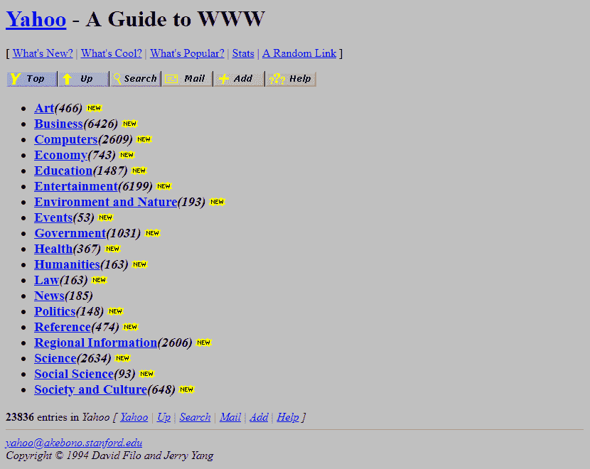

Yahoo in 1994 ([Source](https://www.webdesignmuseum.org/web-design-history/yahoo-1994))

更复杂的网站必须使用表格来控制页面的布局，并创建像导航和侧边栏这样的东西，这在今天很常见。

尽管设计网站的方法以这样或那样的形式存在，kon Wium Lie 在 1994 年在 CERN 工作时首次提出了 CSS。然后在 1996 年，同样由 Berners-Lee 创建的万维网联盟(W3C)发布了第一个级联样式表的正式规范，level 1 (CSS1)。

有了 CSS 和其他技术，如 JavaScript 和 Flash，web 开发人员可以在他们的设计中变得更有创造性和趣味性。


Internet Archive in 1997 ([Source](https://www.webdesignmuseum.org/web-design-history/internet-archive-1996))

到 90 年代末到 21 世纪初，网页设计和用户体验的模式已经出现，网站开始看起来像我们今天使用的网站:

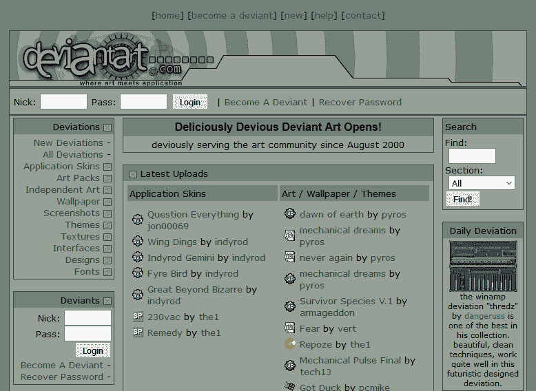

DeviantArt in 2000 ([Source](https://www.webdesignmuseum.org/web-design-history/deviantart-2000))

## 早期响应设计方法

随着 CSS 的广泛采用，开发人员不得不花更多的时间在布局、设计和排版上。但有一件事他们不用太担心，那就是适应不同的屏幕尺寸。当时大多数人的显示器要么是 640x480，要么是 800x600，要么是 1024×768。

尽管如此，开发人员还是找到了一些不同的方法来处理这些显示器或浏览器窗口大小，最终导致了我们今天所知的响应式 web 设计。让我们来看看其中的几个。

### 液体布局

据 MDN 称，开发人员早期有两个主要布局选项，一个是固定宽度，内容被设置为精确到像素的宽度，另一个是流动宽度，内容使用百分比来调整大小。

MDN 有一些固定宽度和液体布局的好例子。

由 Glenn Davis 首创并推广的 Liquid layouts 在当时是革命性的，可以被认为是响应式网页设计的第一个主要方法之一。

如果你的显示器分辨率与网站设计分辨率不同，固定宽度的布局可能会中断，而流动布局则更加灵活，可以适应不同的显示器分辨率或浏览器大小。

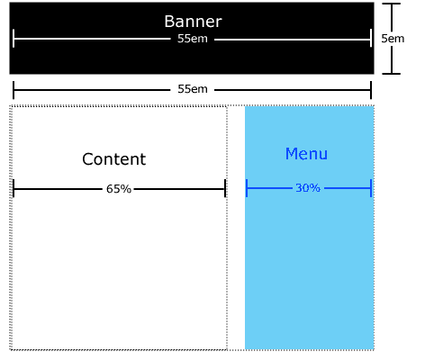

An example of liquid design ([Source](https://thehistoryoftheweb.com/mostly-complete-history-layout-web-part-1-liquid-cool/))

但它并不完美。在流动布局网站上，内容可能会溢出，文本可能会在较小的屏幕上断开，在较大的屏幕上可能会有许多不必要的空白。

### 分辨率相关布局

2004 年，卡梅伦·亚当斯写了一篇博文，详细介绍了一种使用 JavaScript 根据浏览器窗口大小交换不同样式表的方法。

这种技术被称为分辨率相关布局，以 Adams 的博客文章命名。尽管这在当时对开发人员来说是一点额外的工作，但它允许对网站的布局进行更细粒度的控制，并在 CSS 断点出现之前作为 CSS 断点的早期版本。

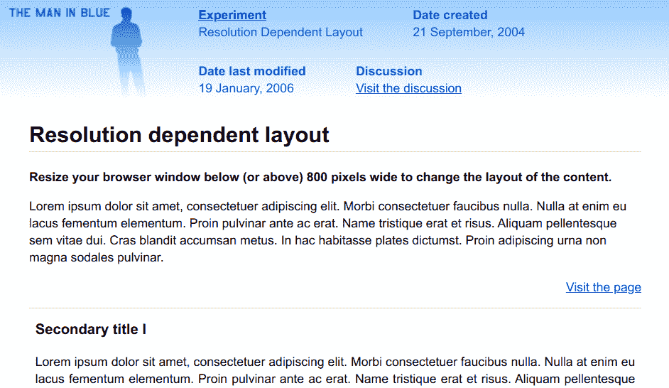

Adams' example of a resolution dependent layout ([Source](https://www.themaninblue.com/experiment/ResolutionLayout/))

这种方法的缺点是，开发人员必须为每个目标分辨率创建不同的样式表，并确保样式和 JavaScript 能够在所有主流浏览器上工作。

当时有很多浏览器，有时它们处理 HTML、CSS 和 JavaScript 的方式不同。事实上，这也是 jQuery 最初如此受欢迎的主要原因之一——它抽象出了许多浏览器差异，因此您只需编写一次代码。

### 移动子域

所有这些都发生在越来越多的移动设备上网的时候。诺基亚、黑莓，最终还有 iPhone，都有了自己的浏览器。突然之间，开发者不得不想出不同的方法来为不同的屏幕尺寸定制在线体验。

开发人员想出的处理所有这些新设备的一个聪明的方法是创建一个只针对移动设备的网站版本，并使其在一个子域上可用。

移动子域名，有时被称为 m-dots 或 m 子域名，就是——一个网站的移动特定版本，托管在一个子域名上，通常是`m`。

例如，脸书的桌面版本在`facebook.com`，或者更具体地说，在`www`子域，`www.facebook.com`:


The desktop version of Facebook

但是手机版的脸书现在处于`m.facebook.com`:

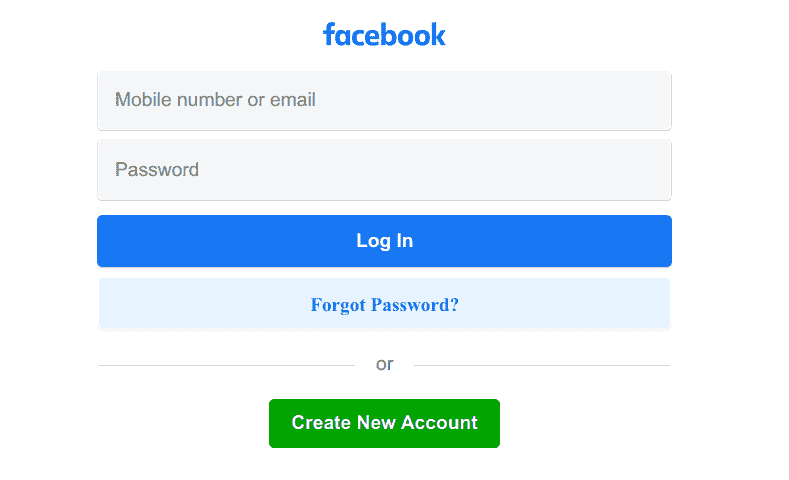

The mobile version of Facebook

如果你同时登录这两个应用程序并并排查看，它们看起来非常相似。但实际上，它们是两个独立的应用程序——移动版本要轻得多，并且针对小屏幕和大多数移动浏览器进行了优化。

移动子域今天仍然存在，这种方法有一些明确的优势。有了移动子域上的独立版本的网站，开发者可以确保网站快速加载，并使用更少的移动数据。

此外，拥有移动子域可以让开发者真正为移动设备量身定制 SEO(搜索引擎优化),并为网站的移动版本带来更多流量。

但是也有一些明显的缺点。使用移动子域名意味着开发者必须维护两个，有时非常不同的网站，而不是一个。

移动子域有时会令人沮丧。我敢肯定，你们中的许多人都知道，试图访问一个网站的桌面版本，却被重定向到移动版本的痛苦。

不仅如此，开发人员还必须弄清楚要重定向哪些设备，以及在什么条件下重定向。

传统上，这是通过检查访问者浏览器的用户代理来完成的，但随着当时设备数量的增加，这是一个不断移动的目标。最终，开发人员开始用 JavaScript 检查浏览器窗口的宽度，并基于此进行重定向。

现在你可能会想，这听起来很像今天的响应式网页设计。这是真的——在许多方面，现代响应式网页设计是对过去技术的回应。它吸收了开发人员想出的许多好主意，并以此为基础进行构建。

## 响应式网页设计

到 2000 年代末，设计一个在不同屏幕尺寸上工作的网站迅速成为规范。但是要做到这一点，开发者必须想出很多花招。

即使对于简单的布局，开发人员也不得不使用类似于`max-width: 100%`技巧的东西来获得灵活的图像，使用`float`和 [clearfixes](https://developer.mozilla.org/en-US/docs/Learn/CSS/CSS_layout/Floats#the_clearfix_hack) 来防止出现问题。

然后在 2010 年，一位名叫 Ethan Marcotte 的开发人员在[发表了一篇文章，他在文章中概述了一种思考灵活网页设计的新方法。在这篇文章中，马科特列出了创建一个响应式网站的三个重要组成部分:流体网格、灵活的图像和媒体查询。](https://alistapart.com/)

除了概述响应式网页设计的主要组成部分，马科特还创造了这个术语，这个术语是以 2010 年的文章标题命名的。

### 流体网格

流体网格的想法是，网站应该采用不同数量的灵活栏，这些栏可以根据当前的屏幕大小而增长或收缩。在移动设备上，应该有一到两个灵活的内容栏，在桌面上可以有更多:

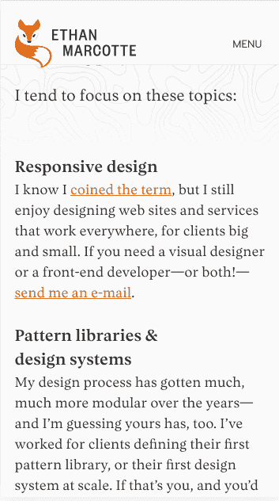

Ethan Marcott's website on a mobile device ([Source](https://ethanmarcotte.com/work/))


The same page on a desktop ([Source](https://ethanmarcotte.com/work/))

你可以在这篇[更早的文章](https://alistapart.com/article/fluidgrids/)中读到更多 Marcott 关于流体网格的想法。

### 灵活的图像

灵活图像的理念是图像应该随着其所在的流体网格而增长或收缩:

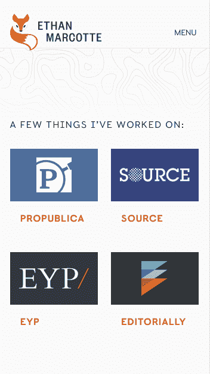

Smaller photos on a mobile device ([Source](https://ethanmarcotte.com/work/))

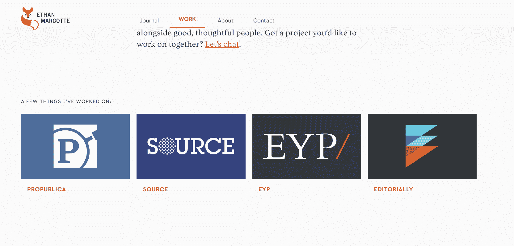

Larger photos on a desktop ([Source](https://ethanmarcotte.com/work/))

一种常见的方法是使用上面提到的`max-width`技巧。

如果容器中有一个图像，它可能会溢出，特别是当容器有响应时。例如，如果有以下情况，图像可能会像这样溢出:

```
<style>
  .container {
    width: 250px;
    outline: solid;
    text-align: center;
  }
</style>
<body>
  <div class="container">
    
    <p>Example image</p>
  </div>
</body> 
```

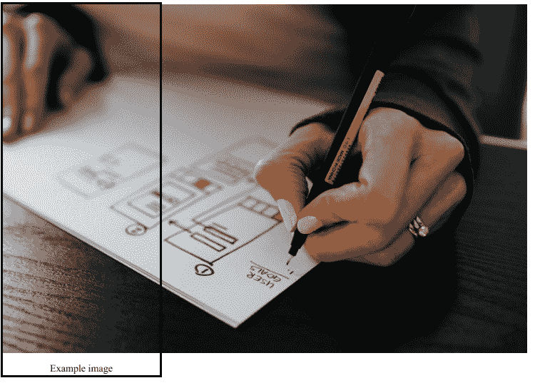

但是如果将它的`max-width`设置为`100%`，图像不会溢出:

```
<style>
  .container {
    width: 250px;
    outline: solid;
    text-align: center;
  }

  .my-image {
    max-width: 100%;
  }
</style>
<body>
  <div class="container">
    
    <p>Example image</p>
  </div>
</body> 
```

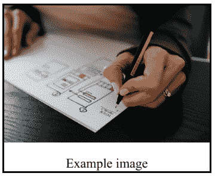

甚至会随父容器调整大小:

```
<style>
  .container {
    width: 600px;
    outline: solid;
    text-align: center;
  }

  .my-image {
    max-width: 100%;
  }
</style>
<body>
  <div class="container">
    
    <p>Example image</p>
  </div>
</body> 
```

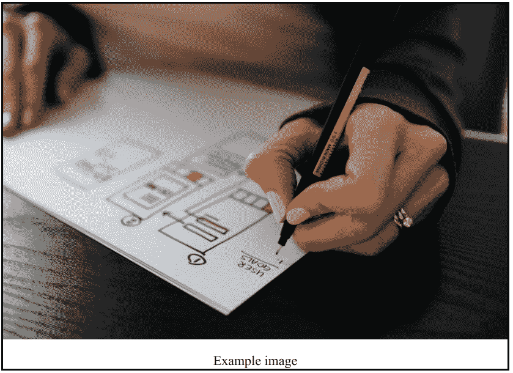

### 媒体查询

媒体查询指的是 CSS 媒体查询，它在 2010 年可用，但直到 2012 年作为 W3 推荐标准正式发布才被广泛采用。

媒体查询只是一个 CSS 规则，它是基于媒体类型(`screen`、`print`等选项触发的。)和媒体特征(`width`、`height`等):

```
@media screen and (min-width: 500px) {
  background-color: red;
}
```

尽管那时它们稍微简单一些，媒体查询允许开发人员实现断点，这在今天的响应式 web 设计中仍在使用。

断点就是网站根据设备或浏览器窗口的宽度改变布局或其他样式。例如，下面是上面代码片段的完整代码:

```
<!DOCTYPE html>
<html lang="en">
  <head>
    <meta charset="UTF-8" />
    <meta http-equiv="X-UA-Compatible" content="IE=edge" />
    <meta name="viewport" content="width=device-width, initial-scale=1.0" />
  </head>
  <style>
    .container {
      width: 250px;
      outline: solid;
      text-align: center;
    }

    .my-image {
      max-width: 100%;
    }

    @media screen and (max-width: 500px) {
      .container {
        background-color: red;
      }
    }
  </style>
  <body>
    <div class="container">
      
      <p>Example image</p>
    </div>
  </body>
</html> 
```

注意，使用[视口元标签](https://developer.mozilla.org/en-US/docs/Web/HTML/Viewport_meta_tag)让媒体查询按照您期望的方式工作很重要。这在大多数情况下都有效:

```
<meta name="viewport" content="width=device-width, initial-scale=1.0" />
```

对于上面的媒体查询，下面是分辨率为 500 像素或更低时容器的样子:

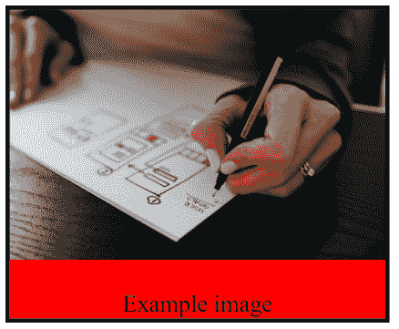

这是分辨率为 501 像素或更高时的样子:

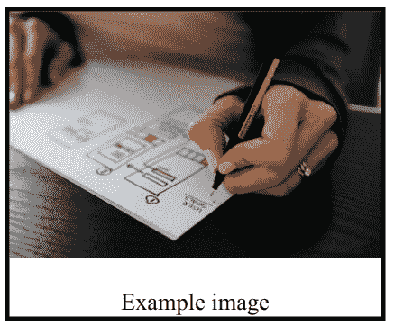

### 移动优先与桌面优先

最近，响应式网站设计有两种主要方法:移动优先或桌面优先。两者都是完全有效的选择，而且各有利弊。

如果你正在从头开始设计一个网站，今天许多开发者认为移动优先是正确的选择——移动设计往往是单列的，而且更容易。

如果你想走移动优先的路线，你应该正常地编写你的风格，然后一旦你开始创建平板电脑和桌面布局，就像上面用`min-width`创建断点。

但也许你正在一个旧的网站上工作，这个网站是为桌面设计的，你需要让它适应更小的移动设备。在这种情况下，您可以使用带有`max-width`的媒体查询来定位那些较低的分辨率。

你可以在本文的[中了解更多关于移动优先和桌面优先的设计理念。](https://www.freecodecamp.org/news/taking-the-right-approach-to-responsive-web-design/)

## 最后

就是这样！现在你对响应式网页设计的历史有了一点了解，以及在我们拥有今天的一切之前，开发人员所经历的各种变化。

如果你想深入了解响应式 web 设计、Flexbox 和其他现代技术，请在我们的 YouTube 频道上查看这个 4 小时的教程:

[https://www.youtube.com/embed/srvUrASNj0s?feature=oembed](https://www.youtube.com/embed/srvUrASNj0s?feature=oembed)

如果你想了解 CSS Grid，这种创建复杂、灵活布局的新方法，请查看我们的书面教程[这里](https://www.freecodecamp.org/news/search/?query=css%20grid)。

你对响应式网页设计有什么看法？我错过了什么吗？在推特上让我知道。