# 通过这 8 个最常见的使用案例了解 Flexbox

> 原文：<https://www.freecodecamp.org/news/learn-flexbox-common-use-cases/>

在构建响应式网站时，Flexbox 让创建灵活、响应性强的布局变得非常容易。所以学习 Flexbox 对于前端开发者来说是必须的。

但是许多教程试图一次教会你所有的东西，却忘了告诉你何时以及为什么要使用每个概念。

在本教程中，我将通过一起解决八个任务向您展示 Flexbox 最常见的使用案例。到最后，您将准备好在您的下一个项目中使用 Flexbox。

你可以在这里下载启动器:[Flexbox-教程-启动器](https://bit.ly/3eNPw2T)

如果你想补充这篇文章，你可以看一个视频:

[https://www.youtube.com/embed/3G4MfMAeamg?feature=oembed](https://www.youtube.com/embed/3G4MfMAeamg?feature=oembed)

### 设置

如果您下载并打开 index.html 文件，您将看到总共 8 个任务。对于每个任务，你会发现里面的容器和物品。项目是具有`width`和`40px`的`height`的`div`元素。

## 任务 1:在 Flexbox 中水平对齐块元素

对于第一项任务，我们希望水平对齐块元素。默认情况下，块元素相互堆叠。但是如果我们把它们放在一个 flex 容器中:

```
.container {
  display: flex;
} 
```

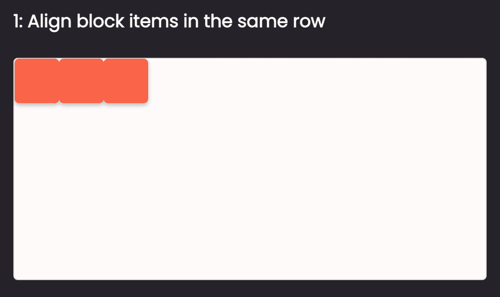

所有块元素将在水平轴上对齐。很简单，对吧？😉这就是第一项任务。

## 任务 2:将物件放在 Flexbox 容器的中间

对于下一个任务，我们需要将一些项目放在容器的中间。我们可以通过设置 flex 容器的`justify-content: center;`和`align-items: center;`来做到这一点:

```
.container {
  display: flex;
  justify-content: center;
  align-items: center;
} 
```

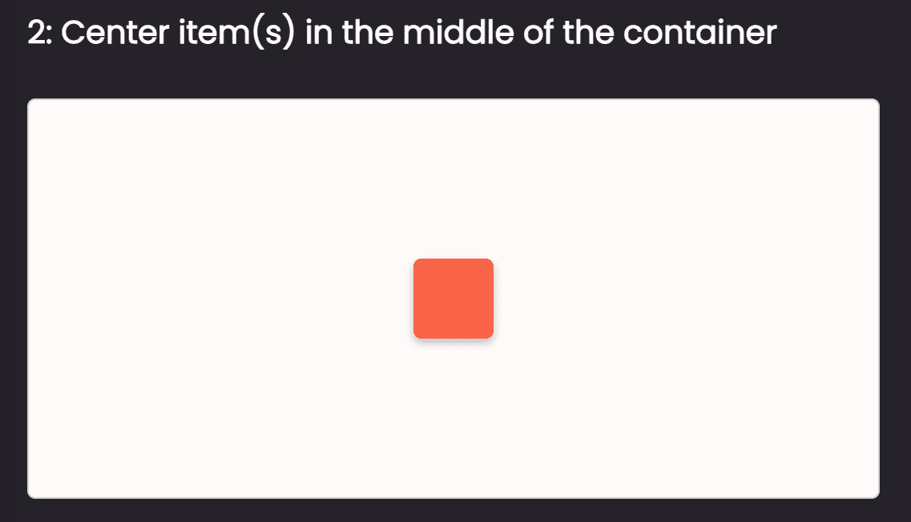

任务 2 到此结束。但是在我们继续之前，让我们仔细看看`justify-content`和`align-items`属性。

### 1.对齐内容属性

使用`justify-content`，我们可以在水平轴上对齐项目。

例如，如果我们想要在水平轴上从容器的**开始**对齐项目，我们将这样做:

```
.container {
  display: flex;
  justify-content: flex-start;
} 
```

在容器的**端**，我们将这样做:

```
.container {
  display: flex;
  justify-content: flex-end;
} 
```

在容器的中间位置，我们将这样做:

```
.container {
  display: flex;
  justify-content: center;
} 
```

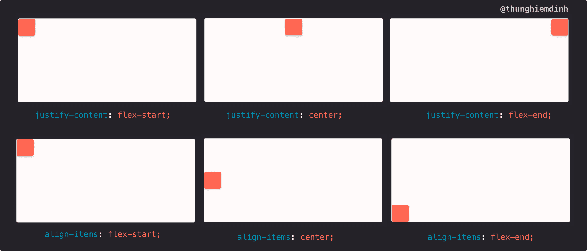

### 2.对齐项目属性

这个属性类似于`justify-content`，但是在纵轴上。使用`align-items`，我们可以在容器的**开始处**对齐纵轴上的项目，如下所示:

```
.container {
  display: flex;
  align-items: flex-start;
} 
```

在容器的**端**像这样:

```
.container {
  display: flex;
  align-items: flex-end;
} 
```

*   在容器的中间**像这样:**

```
.container {
  display: flex;
  align-items: center;
} 
```

现在，如果我们组合`justify-content`和`align-items`，我们可以在容器的中间、右下角、右上角等位置对齐项目。

## 任务 3:在 Flexbox 中的项目之间分配空间

对于第三个任务，我们需要在项目之间添加相等的空间。要做到这一点，相当简单。我们所要做的就是给 flex 容器`justify-content: space-between;`。

```
.container {
  display: flex;
  justify-content: space-between;
} 
```

给我们项目之间相等的空间。

这在导航中非常有用，例如，我们需要在项目之间放置相等的空间:

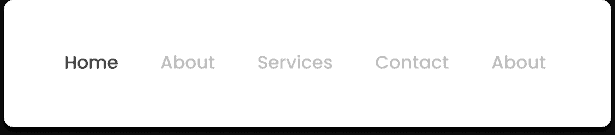

因为我们在看`space-between`，用`justify-content`我们也可以给它`space-evenly`和`space-around`值。

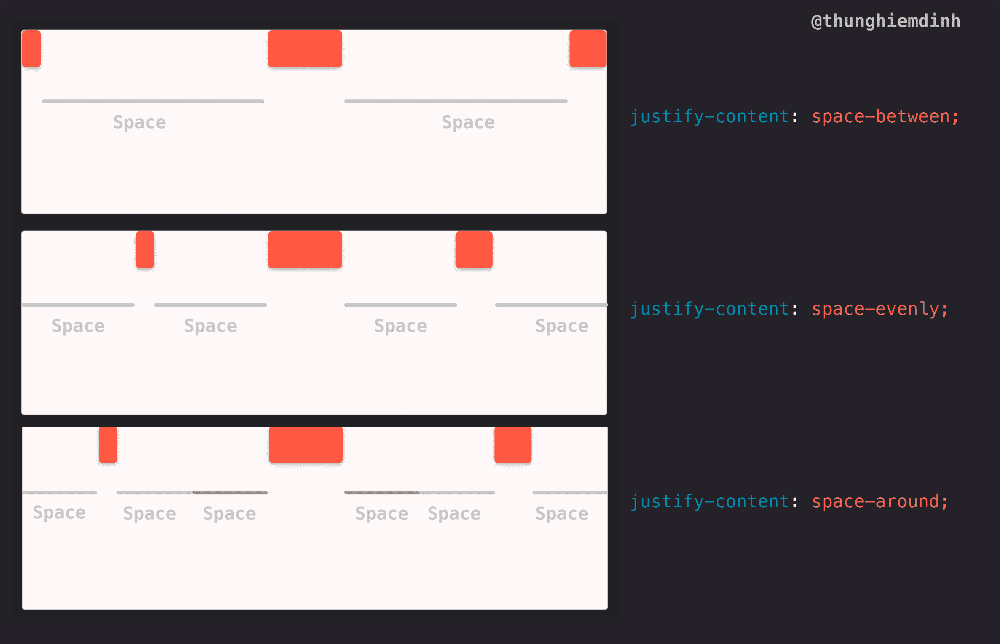

#### `justify-content: space-evenly;`

如果我们给`justify-content`一个值`space-evenly`，空格不仅会添加到项目之间，还会添加到第一个项目之前和最后一个项目之后。

#### `justify-content: space-evenly;`

如果我们给`justify-content`一个值`space-around`，那么在项目周围会添加相等的空格。

## 任务 4:将物件推到 Flexbox 中容器的末端

对于任务 4，我们需要将最后一个项目推到水平轴上容器的末端。我将展示使用 Flexbox 的 3 个选项。

#### 选项 1:使用`justify-content: space-between;`

容器内有两个项目，我们可以使用`justify-content: space-between;`。它会将第一个项目推到容器的开头，将最后一个项目推到容器的结尾。

```
.container {
  display: flex;
  justify-content: space-between;
} 
```

您可以在示例中看到，我们只有徽标和按钮:


或者徽标和导航项目:

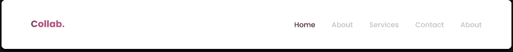

#### 选项 2:使用空的`div`和`flex-grow`

超过 3 个项目时，我喜欢在项目之间添加一个空的`div`和`flex-grow: 1`。

例如，如果我在第二个项目和最后一个项目(第三个项目)之间放置一个带有`flex-grow: 1`的`div`，空的`div`将尽可能地扩展，并将最后一个项目推到容器的末尾:

```
 <div class="option-2">
     <div class="container">
        <div class="item sm"></div>

        <div class="item"></div>

        <div class="space"></div>

        <div class="item"></div>
        </div>
  </div> 
```

```
 .option-2 .space {
    flex-grow: 1;
  } 
```

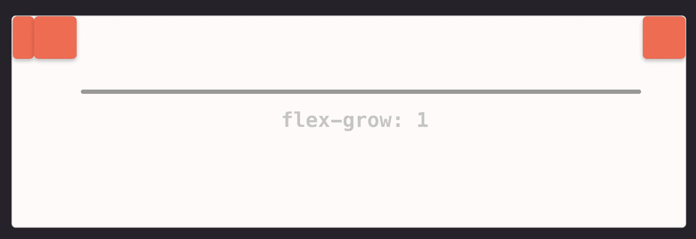

您可能会在更复杂的导航中看到它，如:


#### 选项 3:对一个项目使用`flex-grow`

例如，如果我们有 2 个项目，我们可以给出第一个项目`flex-grow: 1;`。通过这样做，第一个项目将尽可能地扩展，因此它将最后一个项目推到容器的末尾。

```
 .option-3 .item:first-child {
    flex-grow: 1;
  } 
```

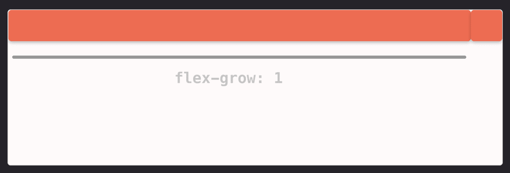

输入组件的几个例子:

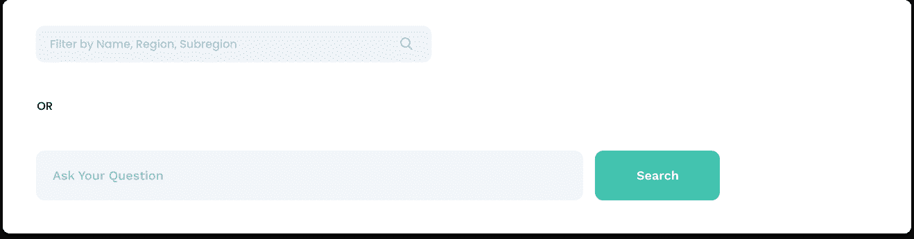

#### 奖金

我们还可以使用`margin-left: auto`将最后一项推到容器的末尾。例如，在选项 1 中，我们可以给最后一个项目`margin-left: auto;`，它将同样工作。

```
.task-4 .option-1 .container {
  display: flex;
}

.task-4 .option-1 .item:last-child {
  margin-left: auto;
} 
```

`margin: auto`超级有用，但让我们在另一篇文章和视频中深入探讨。

## 任务 5:在 Flexbox 中构建相对大小的列布局

通过给该项赋予一个 flex 值`flex: {number}`，我们可以控制该项相对于其他项的大小。例如，使用以下代码:

```
.task-5 .item-1 {
  flex: 3;
}

.task-5 .item-2 {
  flex: 1;
}

.task-5 .item-3 {
  flex: 1;
}

.task-5 .item-4 {
  flex: 1;
} 
```

我们刚刚创建了一个总共有 6 列的布局。项目 1 占用 3 列，而其他 3 个项目将占用 1 列:

例如，这在表格布局中很有用:

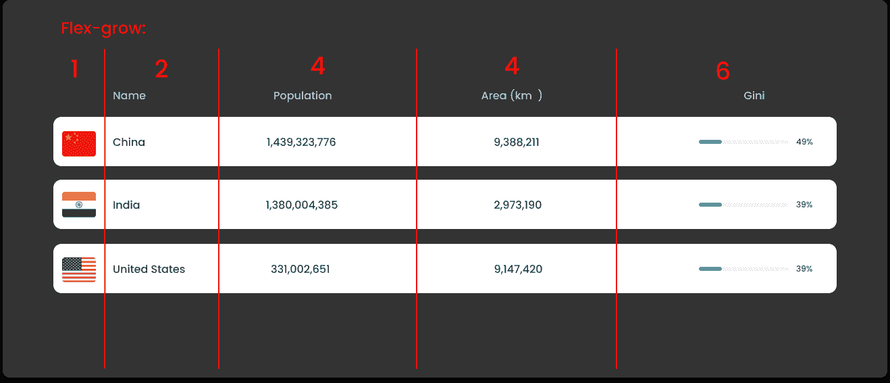

这个布局取自另一个教程，在那里我从头到尾展示了如何构建一个 React + Next.js 应用程序。如果你想观看并编码，这里是 YouTube 的链接。

## 任务 6:使用和不使用媒体查询在 Flexbox 中构建响应布局

### 1.无媒体查询的响应式布局

如果我们给一个 flex 容器`flex-wrap: wrap`:

```
.task-6 .container {
  display: flex;
  flex-wrap: wrap;
} 
```

我们将有一个响应式布局，其中物品不会试图在容器内收缩:

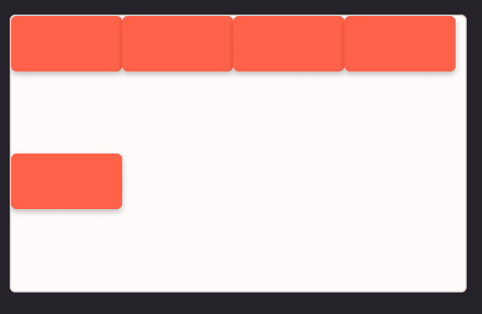

### 2.具有媒体查询的响应布局

通过媒体查询，我们将对项目的大小有更多的控制。假设在一个`flex-wrap`容器中，我们希望有两列。我们可以通过以下方式做到这一点:

```
.task-6 .container {
  display: flex;
  flex-wrap: wrap;
}

.task-6 .item {
  flex-basis: 50%;
} 
```

现在，项目将被排列成两列布局，其中每列占容器的一半。

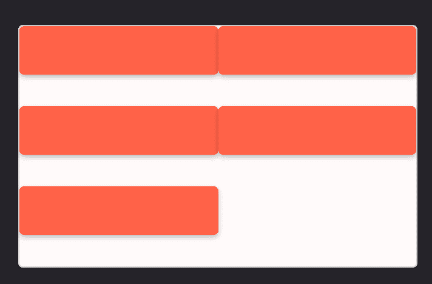

同样的逻辑，假设当屏幕比`375px`宽时，我们希望有一个 4 列布局，我们可以给每个项目`flex-basis: 25%`:

```
@media (min-width: 375px) {
  .task-6 .item {
    display: flex;
    flex-basis: 25%;
  }
} 
```

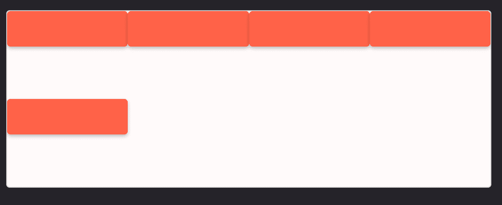

## 任务 7:更改 Flexbox 中的项目顺序(不常见)

使用 Flexbox，我们可以更改项目的顺序。例如，在一个 flex 容器中，如果我们有 4 个项目，我们希望将第一个项目放在该行的末尾。我们要做的就是给出物品`order: 1`。

```
.task-7 .item-1 {
  order: 1;
} 
```

默认情况下，`order`属性的值等于 0，并且可以是负数。


## 任务 8:更改 flex 容器内项目的位置(不常见)

flex 内的项目可以通过使用`align-self`自行改变位置。

```
align-self: auto | flex-start | flex-end | center | baseline | stretch; 
```

例如，假设我们希望在纵轴上的容器末尾放置第 3 项。我们可以这样做:

```
.task-8 .container {
  display: flex;
}

.task-8 .item-3 {
  align-self: flex-end;
} 
```

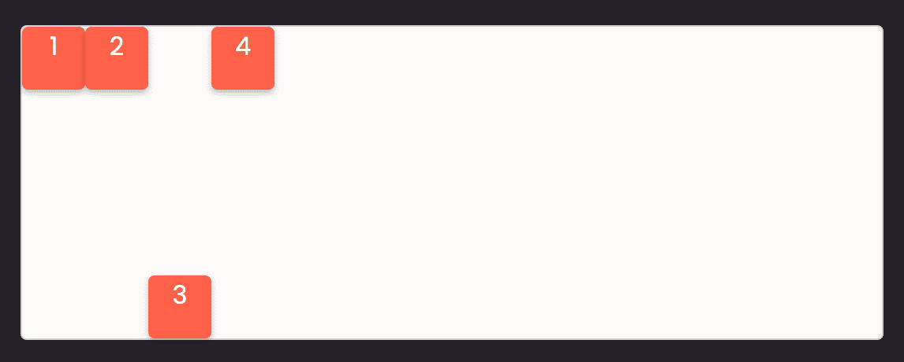

## `flex-direction`属性

默认情况下，Flexbox 有一个`flex-direction`属性。`flex-direction`的值为`row`，这意味着项目在水平轴上对齐。

如果我们希望项目在垂直轴上对齐，我们可以使用`flex-direction: column;`。

例如，在任务 3 中，如果我们给 flex 容器`flex-direction: column;`:

```
.task-3 .container {
  display: flex;

  justify-content: space-between;
  flex-direction: column;
} 
```

我们将拥有:

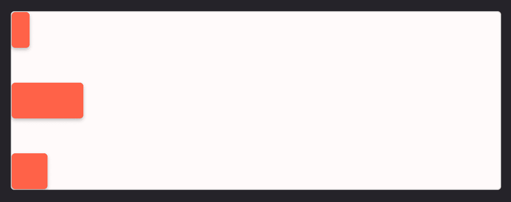

我们刚刚学习了 flex-direction:row；对于 flex-direction: column 仍然有效；，但不是水平轴，而是垂直轴。

## 结论

现在你已经了解了 Flexbox 和 [CSS Grid](https://www.freecodecamp.org/news/learn-css-grid-by-building-5-layouts/) ，你可以继续构建响应式网站。你可以在 [devchallenges.io](https://devchallenges.io/) 上找到要做的项目列表，或者你可以加入我下面的视频教程，我们将从头到尾建立一个专业网站:

[https://www.youtube.com/embed/CrryRvjYsgc?feature=oembed](https://www.youtube.com/embed/CrryRvjYsgc?feature=oembed)

感谢您阅读这篇文章。这个话题属于我将在 [Learn 上更新的系列视频。DevChallenges.io](https://learn.devchallenges.io/) 。所以说更新，在社交媒体上关注我或者订阅我的 [Youtube 频道](https://www.youtube.com/channel/UCmSmLukBF--YrKZ2g4akYAQ?sub_confirmation=1)。否则，祝您编码愉快，在接下来的视频和文章中再见👋。

**_ _ _ _ _ _ _ _ _ _ _ _ _🐣关于我 _ _ _ _ _ _ _ _ _ _ _ _**

我是一名全栈开发人员、UX/UI 设计师和内容创作者。你可以在这个短视频中更多地了解我:

[https://www.youtube.com/embed/qCkmFd-72JY?feature=oembed](https://www.youtube.com/embed/qCkmFd-72JY?feature=oembed)

*   我是[发展挑战](https://devchallenges.io/)的创始人
*   订阅我的 [Youtube 频道](https://www.youtube.com/channel/UCmSmLukBF--YrKZ2g4akYAQ?sub_confirmation=1)
*   关注我的[推特](https://twitter.com/thunghiemdinh)
*   加入[不和](https://discord.com/invite/3R6vFeM)