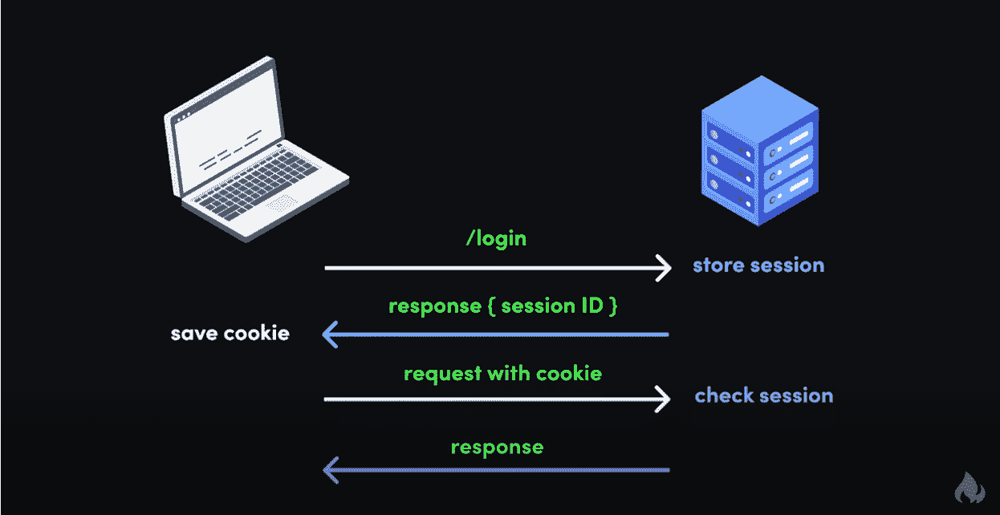
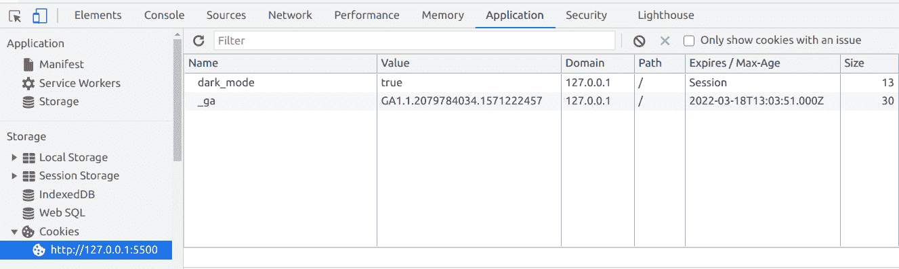
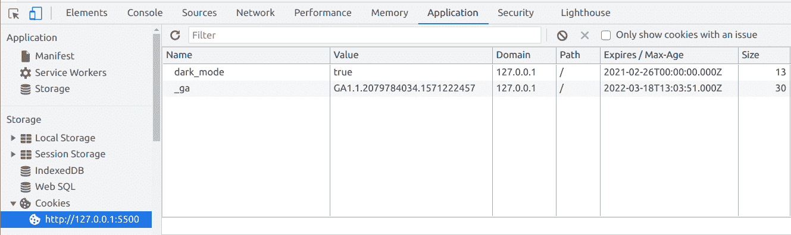
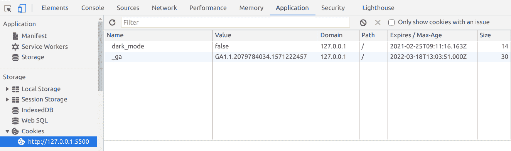
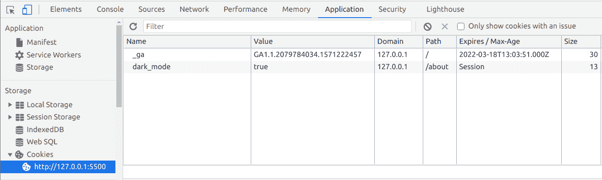
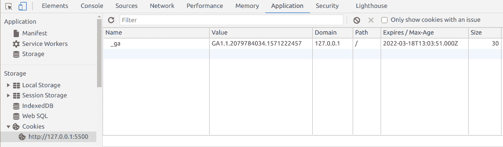
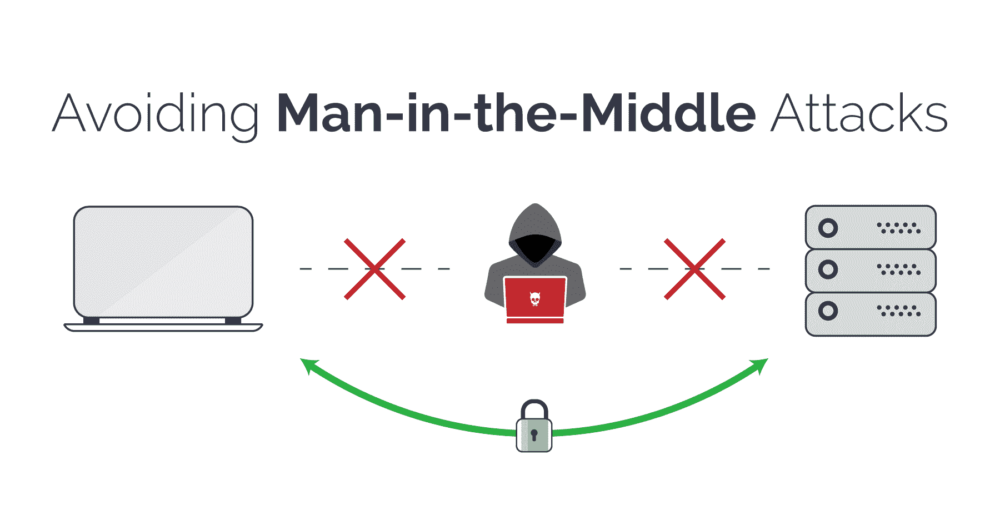

# 你需要知道的关于网络开发 Cookies 的一切

> 原文：<https://www.freecodecamp.org/news/everything-you-need-to-know-about-cookies-for-web-development/>

您是否曾想过如何登录一个网站，即使关闭浏览器也能保持登录状态？或者在没有登录的情况下向您的购物车中添加了一件商品？

不管你知不知道，cookies 无处不在，不管是好是坏，它们完全改变了我们使用网络的方式。

在本文中，我们将回顾 cookies 的历史，它们是如何工作的，如何在 JavaScript 中使用它们，以及一些需要记住的安全问题。

## 饼干的简史

HTTP 或超文本传输协议是一种无状态协议。根据维基百科，这是一个无状态协议，因为它“不要求 HTTP 服务器在多次请求期间保留每个用户的信息或状态。”

今天，你仍然可以在简单的网站上看到这种情况——你输入浏览器的 URL，浏览器向某处的服务器发出请求，服务器返回文件以呈现页面，然后连接关闭。

现在想象一下，你需要登录一个网站才能看到某些内容，就像 LinkedIn 一样。这个过程基本上和上面的一样，但是你会看到一个输入你的电子邮件地址和密码的表单。

您在中输入该信息，然后浏览器将它发送到服务器。服务器检查您的登录信息，如果一切正常，它会将呈现页面所需的数据发送回您的浏览器。

但是如果 LinkedIn 真的是无状态的，一旦你导航到不同的页面，服务器不会记得你刚刚登录。它会要求您再次输入您的电子邮件地址和密码，检查它们，然后发送数据来呈现新页面。

那会非常令人沮丧，不是吗？许多开发人员也这样认为，并找到了在 web 上创建有状态会话的不同方法。

### HTTP cookie 的发明

90 年代早期网景公司的开发人员 Lou Montoulli 遇到了一个问题——他正在为另一家公司 MCI 开发一个在线商店，该商店将把每个顾客购物车中的商品存储在其服务器上。这意味着人们必须先创建一个帐户，这很慢，而且占用大量存储空间。

MCI 要求将所有这些数据存储在每个客户自己的计算机上。此外，他们希望一切都可以正常工作，而无需客户先登录。

为了解决这个问题，Lou 求助于一个在程序员中已经广为人知的想法:神奇饼干。

神奇的 cookie，或简称 cookie，是在两个计算机程序之间传递的一点数据。它们之所以“神奇”,是因为 cookie 中的数据通常是一个随机的密钥或令牌，并且实际上只对使用它的软件有用。

Lou 采用了神奇 cookie 的概念，并将其应用于在线商店，后来又应用于整个浏览器。

现在您已经了解了它们的历史，让我们快速地看一下 cookies 是如何用于在 web 上创建有状态会话的。

## cookies 的工作原理

一种看待饼干的方式是，它们有点像你去游乐园时得到的腕带。

比如你登录一个网站，就像进入了一个游乐园的过程。首先你付钱买票，然后当你进入公园时，工作人员检查你的票并给你一个腕带。

这就像你如何登录一样——服务器检查你的用户名和密码，创建并存储一个会话，生成一个唯一的会话 id，并发回一个带有会话 id 的 cookie。

(注意，会话 id 是*而不是*您的密码，而是完全独立的动态生成的东西。正确的密码处理和认证超出了本文的范围，但是你可以在这里找到一些深入的指导。)

当你在游乐园时，只要出示你的腕带，你就可以乘坐任何游乐设施。

同样，当您向登录的网站发出请求时，您的浏览器会将带有您的会话 id 的 cookie 发送回服务器。服务器使用您的会话 id 检查您的会话，然后为您的请求返回数据。

最后，一旦你离开游乐园，你的腕带就不再工作了——你不能用它回到公园或进行更多的乘坐。

这就像退出一个网站。您的浏览器将您的注销请求和您的 cookie 一起发送到服务器，服务器删除您的会话，并通知您的浏览器删除您的会话 id cookie。

如果你想回到游乐园，你必须再买一张票和一个腕带。换句话说，如果你想继续使用这个网站，你必须重新登录。



Source: [Session vs Token Authentication in 100 Seconds](https://www.youtube.com/watch?v=UBUNrFtufWo) (YouTube)

这只是一个简单的例子，说明如何使用 cookies 来保持您登录网站。它们可以用来记住你的黑暗模式设置，跟踪你在网站上的行为，等等。

## 如何使用 cookies

现在你已经知道了 cookie 的历史以及为什么使用它们，让我们看看使用 cookie 的一些限制，然后深入一些简单的例子。

### Cookie 限制

与一些在浏览器中存储数据的现代替代方法相比，Cookies 是非常有限的，比如`localStorage`或`sessionStorage`。以下是 cookies 与其他技术的比较:

|  | 饼干 | 局部存储器 | 会话存储 |
| --- | --- | --- | --- |
| 容量 | 4KB | 10MB | 5MB |
| 可从以下位置访问 | 任何窗口 | 任何窗口 | 相同的选项卡 |
| 期满 | 手动设置 | 从不 | 标签关闭时 |
| 存储位置 | 浏览器和服务器 | 仅浏览器 | 仅浏览器 |
| 与请求一起发送 | 是 | 不 | 不 |

基于:[cookies vs local storage vs session storage-Beau 教 JavaScript](https://www.youtube.com/watch?v=AwicscsvGLg) (YouTube)

Cookies 是一项非常古老的技术，容量非常有限。尽管如此，你仍然可以用它们做很多事情。并且它们的小尺寸使得浏览器很容易将 cookies 和每个请求一起发送给服务器。

还值得一提的是，出于安全原因，浏览器只允许 cookies 在一个域中工作。

因此，如果您在 ally.com 的银行登录，那么 cookies 将只在该域及其子域内起作用。例如，您的`ally.com` cookie 可以在`ally.com`、`ally.com/about`和子域`www.ally.com`上工作，但不能在`axos.com`上工作。

这意味着，即使你有账户并且在`ally.com`和`axos.com`都登录了，这些网站也不能读取彼此的 cookies。

请记住，您的 cookies 会随您在浏览器中的每个请求一起发送，这一点很重要。这非常方便，但是有一些严重的安全隐患，我们将在后面讨论。

最后，如果您从本文中学到了什么，请记住 cookies 是用来公开读取和发送的，因此您永远不应该在其中存储像密码这样的敏感信息。

### 如何在 JavaScript 中设置 cookie

Cookies 实际上只是具有键/值对的字符串。虽然您可能会在后端更多地使用 cookie，但有时您可能会希望在客户端设置 cookie。

以下是如何用普通 JavaScript 设置 cookie:

```
document.cookie = 'dark_mode=true' 
```

然后当你打开开发者控制台，点击“应用”，然后在网站的“cookie”下，你会看到你刚刚添加的 cookie:



如果您仔细看看您的 cookie，您会看到它的到期日期被设置为`Session`。这意味着当您关闭标签/浏览器时，cookie 将被销毁。

这可能是您想要的行为，比如提供支付信息的在线商店。

但是如果你想让你的饼干保存更久，你需要设定一个过期日期。

### 如何在 JavaScript 中设置 cookie 的截止日期

要设置到期日期，只需设置 cookie 的值，然后添加一个`expires`属性，将日期设置为将来的某个时间:

```
document.cookie = 'dark_mode=true; expires=Fri, 26 Feb 2021 00:00:00 GMT' // expires 1 week from now 
```



JavaScript 的`Date`对象应该使这变得更加容易和灵活。你可以在这里阅读更多关于`Date`物体[的信息](https://www.freecodecamp.org/news/the-ultimate-guide-to-javascript-date-and-moment-js/)。

或者您可以使用`max-age`属性来表示您希望 cookie 持续的秒数:

```
document.cookie = 'dark_mode=true; max-age=604800'; // expires 1 week from now
```

当那个日期到来时，浏览器会自动删除你的 cookie。

### 如何用 JavaScript 更新 cookie

无论您的 cookie 是否有过期日期，更新它都很容易。

只需更改 cookie 的值，浏览器就会自动获取它:

```
document.cookie = "dark_mode=false; max-age=604800"; // expires 1 week from now 
```



### 如何在 JavaScript 中设置 cookie 的路径

有时你会希望你的 cookie 只与你的网站的某些部分一起工作。根据你的网站是如何设置的，一种方法是使用`path`属性。

以下是如何使 cookie 只在`/about`的“关于”页面上起作用:

```
document.cookie = 'dark_mode=true; path=/about';
```

现在你的 cookie 只能在`/about`和其他嵌套子目录下工作，比如`/about/team`，但不能在`/blog`上工作。

然后，当您访问“关于”页面并检查您的 cookies 时，您会看到:



### 如何在 JavaScript 中删除 cookie

要删除 JavaScript 中的 cookie，只需将`expires`属性设置为一个已经过去的日期:

```
document.cookie = 'dark_mode=true; expires=Sun, 14 Feb 2021 00:00:00 GMT'; // 1 week earlier 
```

您也可以使用`max-age`并给它传递一个负值:

```
document.cookie = 'dark_mode=true; max-age=-60'; // 1 minute earlier 
```

然后当你检查你的饼干时，它就不见了:



这应该是关于在 vanilla JS 中使用 cookies 你需要知道的一切。

我们介绍的所有内容都可以在必要时使用，但是如果你打算广泛使用 Cookie，可以看看像 [JavaScript Cookie](https://github.com/js-cookie/js-cookie) 或 [Cookie 解析器](https://github.com/expressjs/cookie-session)这样的库。

## cookies 的安全问题

一般来说，如果正确实施，cookies 是非常安全的。浏览器有很多我们之前提到过的内置限制，部分原因是技术的老化，但也是为了提高安全性。

尽管如此，还是有一些方法可以让一个坏演员偷走你的饼干，然后用它来制造混乱。

我们将回顾发生这种情况的一些常见方式，并研究修复它的不同方法。

另外，请注意，任何代码片段都是普通的 JavaScript。如果您想在服务器上实现这些修复，您需要查找您的语言或框架的确切语法。

### 中间人攻击

中间人(MitM)攻击描述了一大类攻击，攻击者位于客户端和服务器之间，拦截两者之间的数据。



Source: [Man-in-the-Middle Attacks and How To Avoid Them](https://www.netsparker.com/blog/web-security/man-in-the-middle-attack-how-avoid/)

这可以通过很多方式实现:访问或监听不安全的网站，模仿公共 WiFi 路由器，DNS 欺骗，或通过恶意软件/广告软件，如 [SuperFish](https://en.wikipedia.org/wiki/Superfish) 。

这里是对 MitM 攻击的高级概述，以及网站如何保护自己和他们的用户。

警告:视频的开头谈到了苏格兰女王玛丽，并展示了她被斩首的动画描述。这并不太可怕，但如果你想避免它，请跳到[这个时间戳](https://youtu.be/8OR2dDIaIDw?t=57):

[https://www.youtube.com/embed/8OR2dDIaIDw?feature=oembed](https://www.youtube.com/embed/8OR2dDIaIDw?feature=oembed)

作为开发人员，您可以通过确保在服务器上启用 HTTPS、使用来自可信证书颁发机构的 SSL 证书，以及确保您的代码使用 HTTPS 而不是不安全的 HTTP，来大大降低 MitM 攻击的可能性。

就 cookie 而言，您应该将`Secure`属性添加到您的 cookie 中，以便它们只能通过安全的 HTTPS 连接发送:

```
document.cookie = 'dark_mode=false; Secure';
```

请记住,`Secure`属性实际上并不加密 cookie 中的任何数据——它只是确保 cookie 不能通过 HTTP 连接发送。

然而，一个坏演员仍然有可能拦截和操纵 cookie。为了防止这种情况发生，您也可以使用`HttpOnly`参数:

```
document.cookie = 'dark_mode=false; Secure; HttpOnly';
```

带有`HttpOnly`的 Cookies 只能被服务器访问，而不能被浏览器的`Document.cookie` API 访问。这对于像登录会话这样的事情来说是完美的，在这种情况下，只有服务器真正需要知道你是否登录到一个站点，而你不需要客户端的信息。

### XSS 袭击

XSS(跨站脚本)攻击描述了一类恶意行为者向网站注入非故意的、具有潜在危险的代码的攻击。

这些攻击是很成问题的，因为它们可能会影响每个访问该网站的人。


Source: [Cross-site scripting](https://portswigger.net/web-security/cross-site-scripting)

例如，如果一个站点有一个评论部分，并且有人能够将恶意代码作为评论，那么每个访问该站点并阅读该评论的人都有可能受到影响。

就 cookies 而言，如果一个坏演员在一个网站上成功地实施了 XSS 攻击，他们就可以访问会话 cookies，并以另一个登录用户的身份访问该网站。从那里，他们可以访问另一个用户的设置，以那个用户的身份买东西，然后把东西送到另一个地址，等等。

下面的视频高度概括了不同类型的 XSS——反射型、存储型、基于 DOM 型和突变型:

[https://www.youtube.com/embed/EoaDgUgS6QA?feature=oembed](https://www.youtube.com/embed/EoaDgUgS6QA?feature=oembed)

作为一名开发人员，您会希望确保您的服务器执行相同的源策略，并且您从人们那里收到的任何输入都经过了适当的处理。

就像防止 MitM 攻击一样，您应该为您使用的任何 cookies 设置`Secure`和`HttpOnly`参数:

```
document.cookie = 'dark_mode=false; Secure; HttpOnly';
```

### CSRF 袭击

CSRF(跨站点请求伪造)攻击是指不良行为者诱骗他人执行非故意的、潜在的恶意操作。

例如，如果你登录到一个网站，点击评论中的链接，如果该链接是 CSRF 攻击的一部分，它可能会导致你无意中改变你的登录信息，甚至删除你的帐户。


Source: [Cross-site request forgery](https://portswigger.net/web-security/csrf)

虽然 CSRF 攻击与 XSS 攻击有些相似，特别是在 XSS 攻击中，有人在网站中插入恶意代码，但每种攻击都利用不同类型的信任。

根据维基百科的说法，XSS“利用用户对特定网站的信任，而 CSRF 则利用网站对用户浏览器的信任。”

这里有一个视频解释了 CSRF 的基本知识，并给出了一些有用的例子:

[https://www.youtube.com/embed/eWEgUcHPle0?feature=oembed](https://www.youtube.com/embed/eWEgUcHPle0?feature=oembed)

至于 cookies，防止可能的 CSRF 攻击的一种方法是使用`SameSite`标志:

```
document.cookie = 'dark_mode=false; Secure; HttpOnly; SameSite=Strict'; 
```

您可以为`SameSite`设置一些值:

*   `Lax`:不会为嵌入内容(图像、iframes 等)发送 Cookies。)但是当你点击一个链接或者发送一个请求到 cookie 被设置的源时被发送。例如，如果你在`testing.com`上点击一个链接去`test.com/about`，你的浏览器会发送你的`test.com`的 cookie 请求
*   只有当你点击一个链接或者从 cookie 设置的源发送一个请求时，cookie 才会被发送。例如，你的`test.com` cookie 只会在你在`test.com`附近的时候发送，而不会来自`testing.com`等其他网站
*   无论上下文如何，每次请求都会发送 Cookies。如果将`SameSite`设置为`None`，还必须添加`Secure`属性。如果可能的话，最好避免这个值

主流浏览器处理`SameSite`的方式略有不同。例如，如果 cookie 上没有设置`SameSite`，默认情况下，谷歌 Chrome 会将其设置为`Lax`。

## 饼干的替代品

你可能想知道，如果 cookies 有这么多潜在的安全缺陷，为什么我们还在使用它们？肯定会有更好的选择。

如今，您可以使用`sessionStorage`或`localStorage`来存储最初使用 cookies 的信息。对于有状态会话，有基于令牌的认证，比如 JWT (JSON Web 令牌)。

虽然看起来您必须在基于 cookie 或基于令牌的身份验证之间做出选择，但是两者都可以使用。例如，当有人通过浏览器登录时，您可能希望使用基于 cookie 的身份验证，而当有人通过手机应用程序登录时，您可能希望使用基于令牌的身份验证。

让事情变得更复杂一点的是，像 Auth0 这样的身份验证即服务提供商允许你进行两种类型的身份验证。

如果您想了解更多关于 web 令牌和基于令牌的身份验证的信息，请查看我们的一些文章[这里](https://www.freecodecamp.org/news/search/?query=web%20tokens)。

## 当你给开发者一个小甜饼时

就是这样！这应该就是开始使用 cookies 所需要知道的一切，以及在使用过程中需要注意的事项。

你觉得这有用吗？你如何使用饼干？在推特上让我知道。