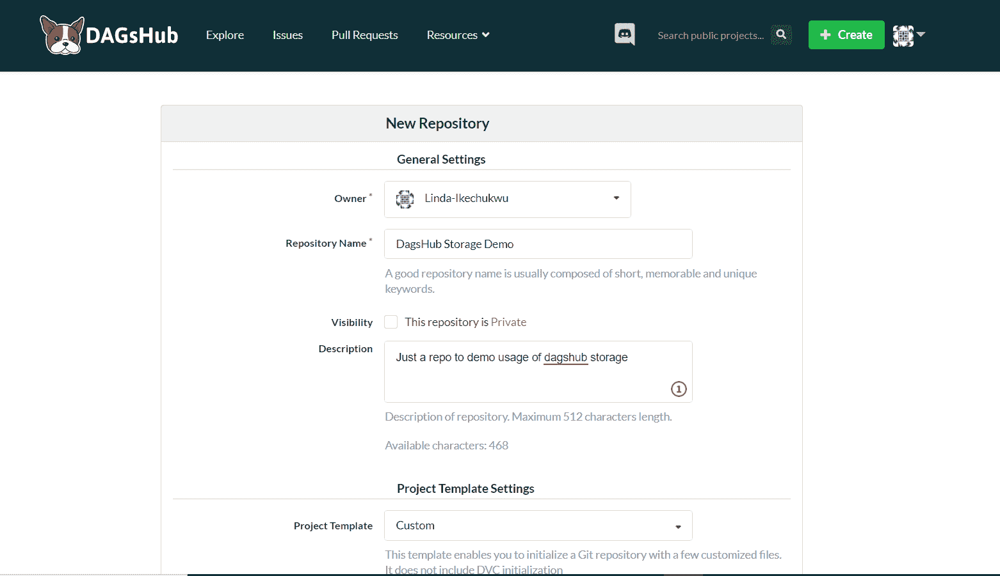
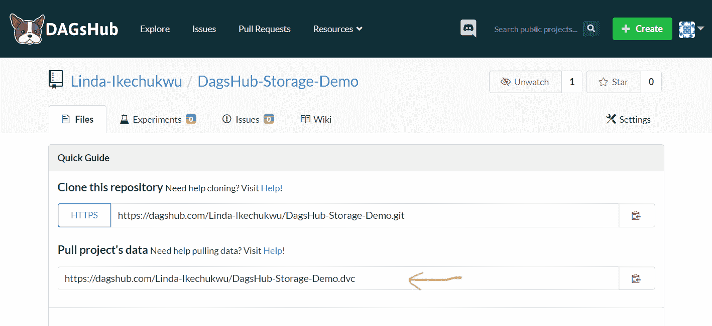

# 如何在数据科学项目上与 DAGsHub 合作

> 原文：<https://www.freecodecamp.org/news/collaborate-on-data-science-projects-with-dagshub/>

对于软件工程团队来说，像 Git 这样的工具和 GitHub、GitLab 和 BitBucket 这样的远程 Git 客户端使得协作变得简单易行。

它们让不同地点的不同开发人员无缝地为同一个项目工作。这种在项目上轻松协作的能力促进了大规模开源软件/库生态系统的发展。

不幸的是，对于数据科学团队来说，情况并非如此。即使是最熟练的数据科学团队也仍然缺乏组织项目和有效协作的最佳实践。

数据科学领域是软件工程和研究的结合，即代码+数据集、训练模型和标签编码。就像用几个 git 命令控制版本历史和远程协作编写代码一样，数据科学家应该能够轻松地浏览、预览、共享、派生和合并数据和模型。

为了帮助远程协作，必须具备两个条件:版本控制和远程中央存储。

正如 Git 允许软件工程师安全地在不同版本的代码之间来回切换一样，数据科学家不仅需要控制不同版本的代码，还需要控制不同版本的数据。

他们还应该能够跟踪他们做了什么来实现特定版本的特定状态，并且能够在需要时再现相同的状态。

那么，有哪些可能的解决方案呢？

## 选项 1:在数据科学项目中使用 Git 进行版本控制

你可能已经在问了——我们不能直接用 Git 吗？问题是 Git 的文件大小限制是 100MB。这对于严肃的数据科学项目来说是不够的，这些项目有时会有几十亿字节的数据文件。

一个解决方案是在组合中加入 [Git LFS](https://www.atlassian.com/git/tutorials/git-lfs) (大文件存储)。

git LFS 是一个 Git 扩展，用于处理 Git 中的文件大小限制。这是通过创建一个指针文件来实现的，指针文件中存储了对大型数据文件的引用。这些大文件将被存储在其他地方——要么在本地 Git LFS 缓存中，要么在像 [GitHub](https://docs.github.com/en/github/managing-large-files/collaboration-with-git-large-file-storage) 或 [Gitlab](https://docs.gitlab.com/ee/topics/git/lfs/) 这样的远程服务器中。

尽管如此，这还不够好。Git LFS 仍然限制文件大小(大约 2GB)，并且不是一个成熟的数据科学解决方案。它没有提供关于大文件版本的有用信息(只有指针文件中基于文本的变化)。您也无法访问之前和之后的可视化效果或图形。

Git LFS 也不支持开箱即用的差异，所以检查一个文件的后续版本之间的差异是相当具有挑战性的。

## 选项 2:在数据科学项目中使用 DVC 进行版本控制

更好的选择是使用 DVC。DVC，代表数据版本控制，本质上类似于 Git，但是是专门为数据开发的。

DVC 的语法类似于 Git！所以，如果你已经知道 Git，学习 DVC 不会很难。DVC 很容易跟踪大文件——这使得可重用性和可再现性易如反掌。

使用 DVC，您可以:

*   像捕获代码一样跟踪并保存数据和机器学习模型
*   轻松创建数据版本和 ML 模型并在它们之间切换
*   理解数据集和 ML 工件最初是如何构建的
*   比较实验中的模型度量
*   在数据科学项目中采用工程工具和最佳实践

但是，DVC 只是在本地帮助版本控制。要设置远程协作，您需要将其连接到[远程存储器](https://dvc.org/doc/command-reference/remote#description)。问题是设置这个云存储太麻烦了。

以亚马逊 S3 为例。您必须提供您的信用卡，安装 AWS CLI 工具，创建一个 IAM 用户，分配正确的权限(大多数人第一次尝试时通常不会正确)，等等。

这太复杂了。这种程度的摩擦会阻碍人们为项目做出贡献——而这正是远程协作的全部目的。

事情应该像创建一个帐户和 Git 推送一样简单。访问控制也应该自动处理。

这就是 DagsHub 存储的用武之地。

## 选项 3:使用 DVC + DAGsHub 存储进行版本控制和远程协作

[DAGsHub Storage](https://dagshub.com/docs/reference/onboard_storage/) 是一款替代的(免费使用的)DVC 遥控器，无需任何配置。它是 DAGsHub 制造商的一个新工具，DAGsHub 是一个为数据科学家和机器学习工程师提供数据版本控制和协作的网络平台(Dag shub 对于 DVC 就像 Github 对于 Git 一样)。

有了 DAGsHub 储物盒，您就不必承受设置任何东西的压力。它的工作方式与添加 Git 遥控器相同。

当您在 DagsHub 上创建存储库时，它会自动为您提供一个 DVC 远程 URL。通过这个 URL，您可以使用现有的 DAGsHub 凭据(通过 HTTPS 基本身份验证)快速推送和提取数据。

这也意味着与非 DVC 用户共享工作更加容易，因为他们不需要云设置。那不是好多了吗？

要将 DAGsHub 存储连接为远程存储，您需要在 DAGsHub 上创建一个帐户并创建一个项目。你可以从头创建一个，或者连接到另一个平台上的现有项目，如 Github 或 Bitbucket，然后[为本地数据版本化](https://dagshub.com/docs/experiment-tutorial/2-data-versioning/)设置 DVC。



*Creating a new repository on DAGsHub.*

当你在 DAGsHub 上创建一个 repo 时，你会得到两个 remote:Git 和 DVC。



要开始使用 DAGsHub storage，请复制 DVC 链接(可在您的 repo 主页上找到)并将其添加为本地项目的远程。

在终端中打开您的项目并添加 DVC 遥控器:

```
dvc remote add <--dvc remote link--> 
```

接下来是为您的本地机器设置 DAGsHub 凭证，就像您为 GitHub 设置一样:

```
dvc remote modify origin --local auth basic
dvc remote modify origin --local user Linda-Ikechukwu
dvc remote modify origin --local ask_password true
```

瞧！现在，您可以使用`dvc push -r origin`或`dvc pull -r origin`无缝地推送或拉取数据集和模型。

如果您想切换到不同版本的数据，就像 git checkout 一样，您只需运行:

```
git checkout <..branch or commit..>
dvc checkout 
```

还有呢？您还可以使用 [DAGsHub pull requests](https://dagshub.com/docs/collaborating_on_dagshub/data_science_pull_requests/) 接收 pull 请求并将其合并到您的项目中。

## 结论

借助 DAGsHub Storage，共享数据和模型变得像共享链接一样简单，为合作者提供项目数据、模型、代码、实验和管道的简单概览。

所有这些为数据科学团队提供了更好的协作体验，并有望帮助开源数据科学(OSDS)项目的大规模开发和接受。

寻找更多这样的文章？

我叫琳达，是一名前端开发人员。我开了一个博客: [codewithlinda](https://www.codewithlinda.com/blog/) ，目标是成长中的前端开发人员，在这里我写下如何获得并度过你的第一份技术工作，以及帮助你提升的技术技巧。你也可以通过@ T2 _ ms Linda 在 twitter 上找到我。