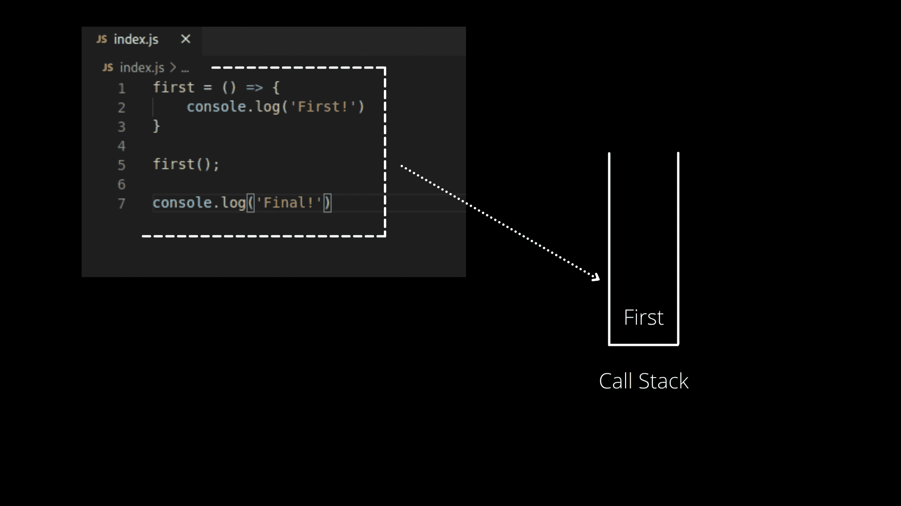
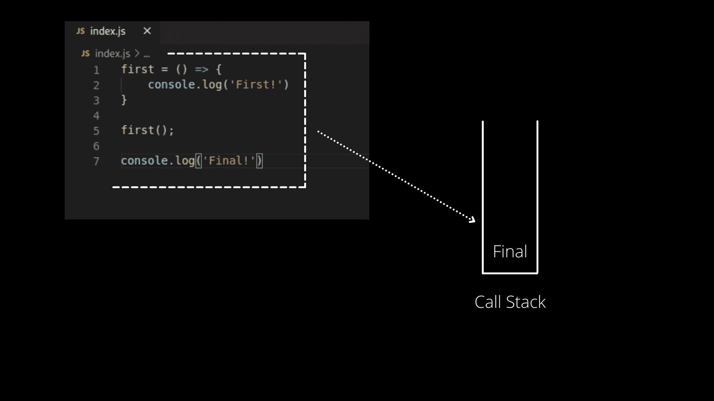
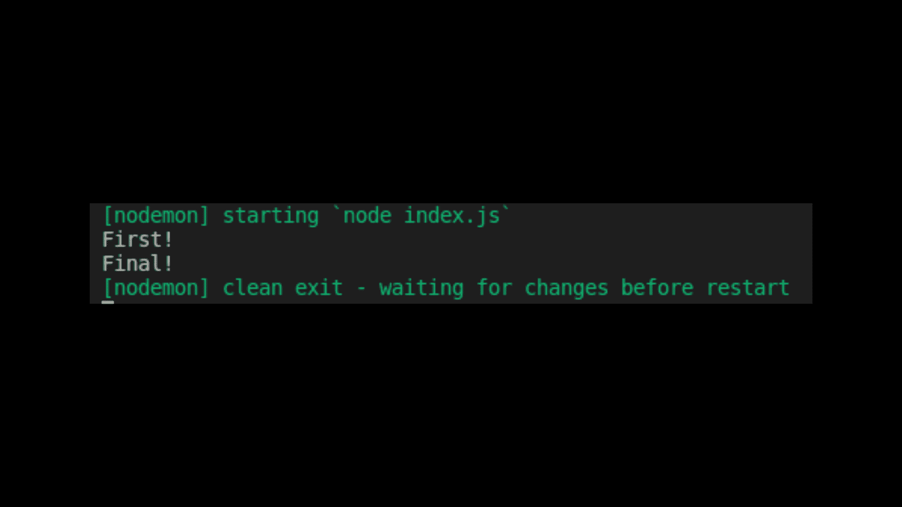
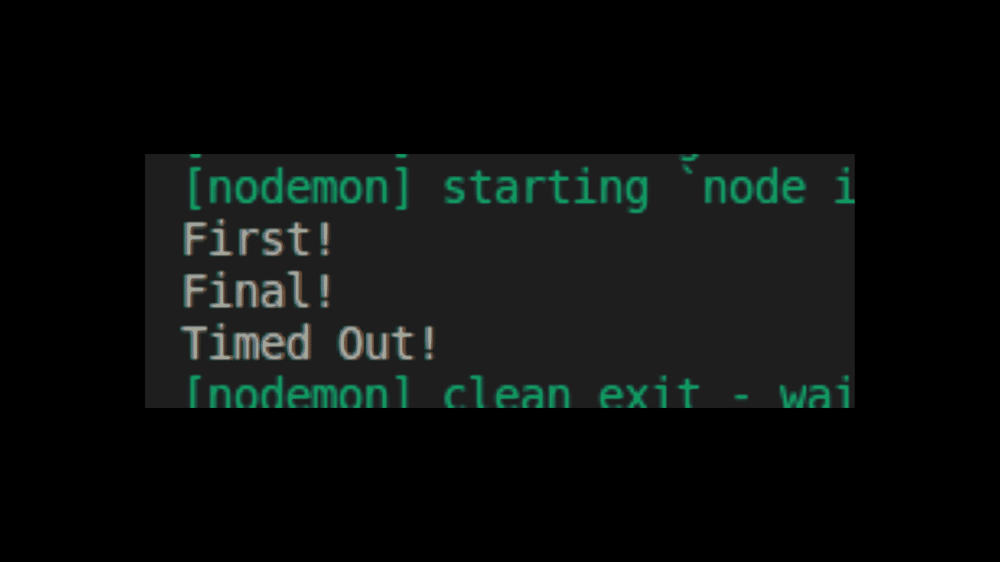
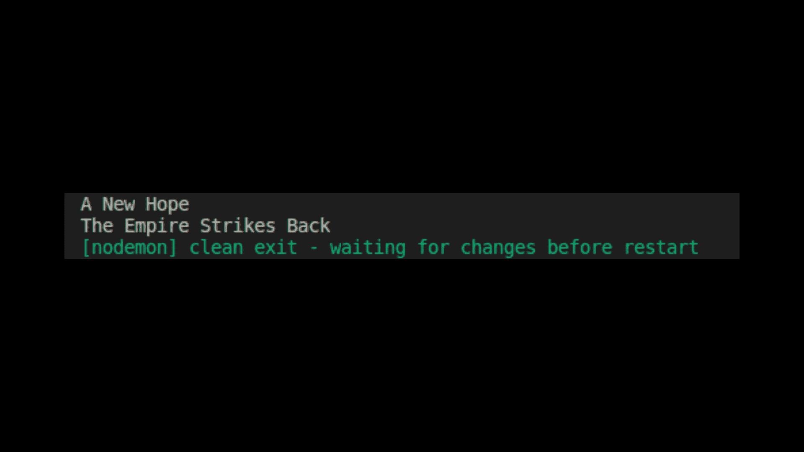
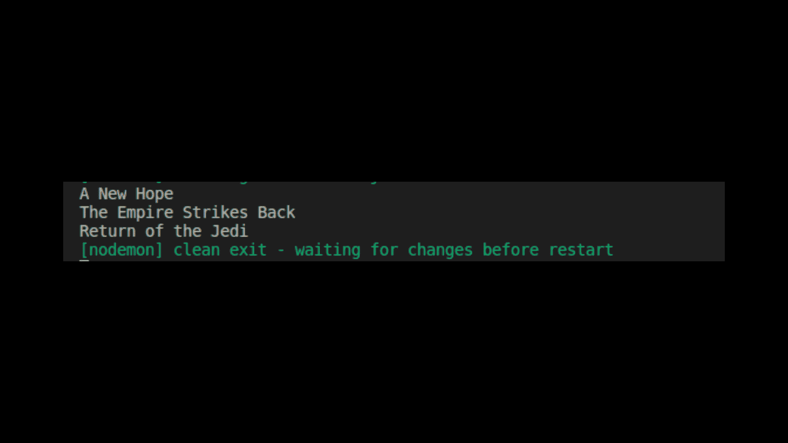

# 如何在 JavaScript 中使用 Async/Await 和示例 JS 代码

> 原文：<https://www.freecodecamp.org/news/async-await-in-javascript/>

在本教程中，我们将学习如何在 JavaScript 中使用 Async/Await。

但在此之前，我们应该了解一些主题，如:

1.  事件循环
2.  回收
3.  承诺

## JavaScript 中的事件循环是什么？

事件循环是 JavaScript 最重要的方面之一。

JavaScript 是一种单线程编程语言，这意味着一次只能运行一个任务。它有一个调用栈，所有的代码都在这个调用栈中执行。我们用一个例子来理解。



在上面的例子中，我们可以看到我们在控制台中记录了两个值。

当`First()`完成执行时，它将被弹出调用堆栈，事件循环将进入下一行。下一行将存储在调用堆栈中，并将被标记为执行。



我们的控制台将打印以下结果:



为了更好地理解事情，我们来看另一个例子。

```
console.log('First!');

setTimeout(function second(){
    console.log('Timed Out!')
}, 0000)

console.log('Final!');
```

像往常一样，我们的代码将移入调用堆栈，事件循环将逐行循环。

我们会得到“第一！”并将它移出调用堆栈。

现在，事件循环将移动到第二行，并将其推入调用堆栈。它会遇到`setTimeout`函数，这是一个宏任务，它会在下一个事件循环中执行。

现在，您可能想知道什么是宏任务。这个任务在事件循环中的所有任务之后运行，或者你可以说，在另一个事件循环中。`SetTimeout`和`SetInterval`函数可以是在所有其他任务完成后运行的宏任务的例子。



最后，将执行最后一行代码。我们将在我们的控制台中获得第一，然后是最终，然后超时。

## JavaScript 中的回调函数是如何工作的？

回调函数是那些作为参数传递给另一个函数的函数。

让我们看一个例子。

```
const movies = [
{ title: `A New Hope`, body:`After Princess Leia, the leader of the Rebel Alliance, is held hostage by Darth Vader, Luke and Han Solo must free her and destroy the powerful weapon created by the Galactic Empire.`},
{ title: `The Empire Strikes Back`, body: `Darth Vader is adamant about turning Luke Skywalker to the dark side. Master Yoda trains Luke to become a Jedi Knight while his friends try to fend off the Imperial fleet.` }]

function getMovies(){
    setTimeout(() => {
        movies.forEach((movie, index) => {
            console.log(movie.title)
        })
    }, 1000);
}

getMovies();
```

我们有一个包含星球大战电影列表的数组和一个获取列表的函数`getMovies()`。



让我们创建另一个名为`createMovie()`的函数。它将用于添加新电影。

```
const movies = [
        { title: `A New Hope`, body:`After Princess Leia, the leader of the Rebel Alliance, is held hostage by Darth Vader, Luke and Han Solo must free her and destroy the powerful weapon created by the Galactic Empire.`},
        { title: `The Empire Strikes Back`, body: `Darth Vader is adamant about turning Luke Skywalker to the dark side. Master Yoda trains Luke to become a Jedi Knight while his friends try to fend off the Imperial fleet.` }
    ]

function getMovies(){
    setTimeout(() => {
        movies.forEach((movie, index) => {
            console.log(movie.title)
        })
    }, 1000);
}

function createMovies(movie){
    setTimeout(() => {
        movies.push(movie)
    }, 2000);
}

getMovies();

createMovies({ title: `Return of the Jedi`, body:`Luke Skywalker attempts to bring his father back to the light side of the Force. At the same time, the rebels hatch a plan to destroy the second Death Star.` });
```


但是这里的问题是我们不能在游戏机上看到第三部电影。这是因为`createMovie()`比`getMovies()`花费的时间更长。`createMovie()`功能需要两秒钟，而`getMovies()`只需要一秒钟。

换句话说，`getMovies()`在`createMovies()`之前运行，电影列表已经显示。

为了解决这个问题，我们可以使用回调 **。**

在`createPost()`中，传递一个函数回调，在新电影推送后立即调用该函数(而不是等待两秒)。

```
const movies = [
        { title: `A New Hope`, body:`After Princess Leia, the leader of the Rebel Alliance, is held hostage by Darth Vader, Luke and Han Solo must free her and destroy the powerful weapon created by the Galactic Empire.`},
        { title: `The Empire Strikes Back`, body: `Darth Vader is adamant about turning Luke Skywalker to the dark side. Master Yoda trains Luke to become a Jedi Knight while his friends try to fend off the Imperial fleet.` }
    ]

function getMovies(){
    setTimeout(() => {
        movies.forEach((movie, index) => {
            console.log(movie.title)
        })
    }, 1000);
}

function createMovies(movie, callback){
    setTimeout(() => {
        movies.push(movie);
        callback();
    }, 2000);
}

createMovies({ title: `Return of the Jedi`, 
                body:`Luke Skywalker attempts to bring his father back to the light side of the Force. 
                At the same time, the rebels hatch a plan to destroy the second Death Star.` }, getMovies);
```



现在我们得到了最新的电影列表。

## JavaScript 中的承诺是如何实现的？

承诺是一种可能在未来产生价值的价值。该值可以是已解决的，也可以是未解决的(在某些错误情况下，如网络故障)。这就像现实生活中的承诺。

它有三种状态:已实现、已拒绝或待定。

*   ****应验:**** `onFulfilled()`会被调用(例如`resolve()`被调用)。
*   ****被拒绝:**** `onRejected()`被调用(例如，`reject()`被调用)。
*   ****待定:**** 尚未履行或拒绝。

让我们看一个例子。

Promise 有两个参数，resolve 和 reject。当出错时，调用 reject，否则调用 resolve。

```
const movies = [
        { title: `A New Hope`, body:`After Princess Leia, the leader of the Rebel Alliance, is held hostage by Darth Vader, Luke and Han Solo must free her and destroy the powerful weapon created by the Galactic Empire.`},
        { title: `The Empire Strikes Back`, body: `Darth Vader is adamant about turning Luke Skywalker to the dark side. Master Yoda trains Luke to become a Jedi Knight while his friends try to fend off the Imperial fleet.` }
    ]

function getMovies(){
    setTimeout(() => {
        movies.forEach((movie, index) => {
            console.log(movie.title)
        })
    }, 1000);
}

function createMovies(movie){
    return new Promise((resolve, reject) => {
        setTimeout(() => {
            movies.push(movie);

            const error = false;

            if(!error){
                resolve();
            }
            else{
                reject('Error: Something went wrong!')
            }
        }, 2000);
    })
}

createMovies({ title: `Return of the Jedi`, body:`Luke Skywalker attempts to bring his father back to the light side of the Force. At the same time, the rebels hatch a plan to destroy the second Death Star.`})
.then(getMovies);
```

如果我们得到一个错误，它将是类似于“错误:出错了！”，如果没有，诺言也会化解。

一旦承诺被解析，它就调用`.then()`关键字和`getMovies()`。

## 最后，Async/Await 在 JavaScript 中是如何工作的

Async 是异步的意思。它允许程序在不冻结整个程序的情况下运行一个功能。这是使用 Async/Await 关键字完成的。

Async/Await 让写承诺变得更容易。函数前的关键字“async”使函数始终返回一个承诺。关键字 await 用在异步函数中，它让程序一直等待，直到 Promise 解析。

```
async function example() {

  let promise = new Promise((resolve, reject) => {
    setTimeout(() => resolve("done!"), 2000)
  });

  let result = await promise; // wait until the promise resolves (*)

  alert(result); // "done!"
}

example();
```

函数执行在`(*)`行“暂停”,并在承诺完成时恢复，而`result`成为其结果。所以上面的代码显示“完成！”两秒钟后。

让我们来看一个实践例子。

```
const movies = [
        { title: `A New Hope`, body:`After Princess Leia, the leader of the Rebel Alliance, is held hostage by Darth Vader, Luke and Han Solo must free her and destroy the powerful weapon created by the Galactic Empire.`},
        { title: `The Empire Strikes Back`, body: `Darth Vader is adamant about turning Luke Skywalker to the dark side. Master Yoda trains Luke to become a Jedi Knight while his friends try to fend off the Imperial fleet.` }
    ]

function getMovies(){
    setTimeout(() => {
        movies.forEach((movie, index) => {
            console.log(movie.title)
        })
    }, 1000);
}

function createMovies(movie){
    return new Promise((resolve, reject) => {
        setTimeout(() => {
            movies.push(movie);

            const error = false;

            if(!error){
                resolve();
            }
            else{
                reject('Error: Something went wrong!')
            }
        }, 2000);
    })
}

async function init(){
    await createMovies({ title: `Return of the Jedi`, body:`Luke Skywalker attempts to bring his father back to the light side of the Force. At the same time, the rebels hatch a plan to destroy the second Death Star.`});

    getMovies(); (*)
}

init();
```

在上面的例子中，(*)行的`getMovies()`正在等待异步函数中的`createMovies()`被执行。

换句话说，`createMovies()`是异步的，所以`getMovies()`只会在`createMovies()`完成后运行。

现在你知道了事件循环、回调、承诺和异步/等待的所有基础知识。ECMAScript 2017 中引入了这些功能，它们使读取和编写 JS 代码变得更加容易和有效。

> **那都是乡亲们！快乐的学习和尝试，**