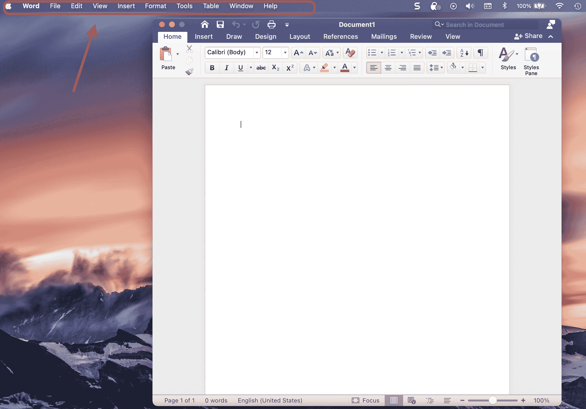
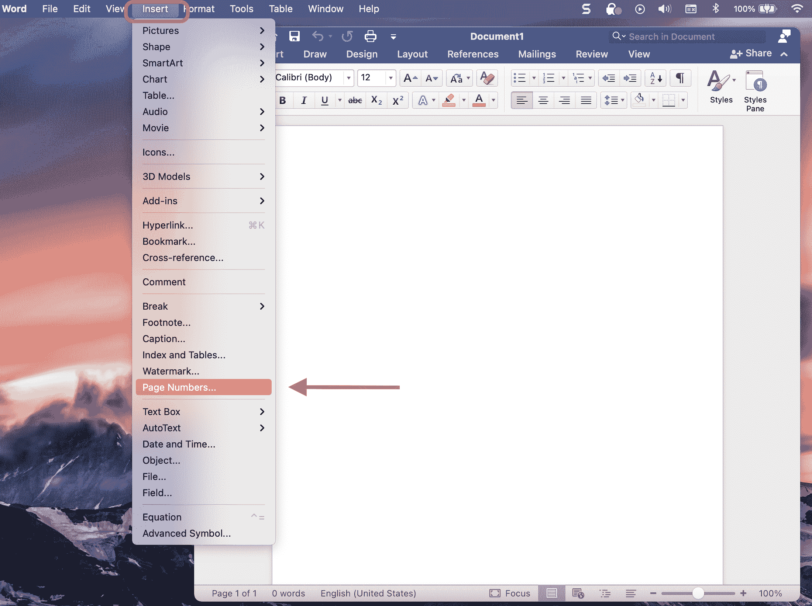
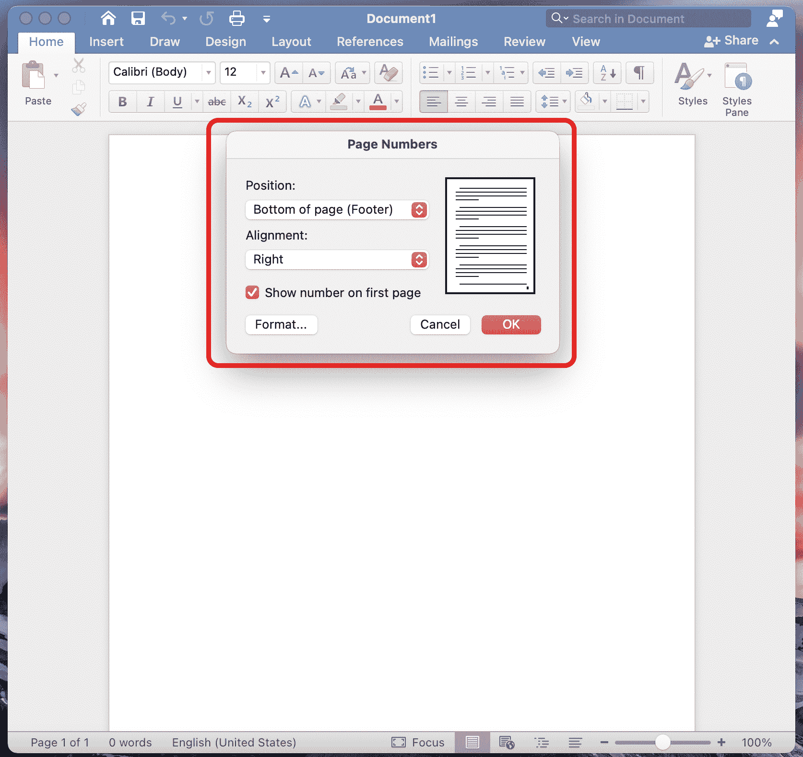
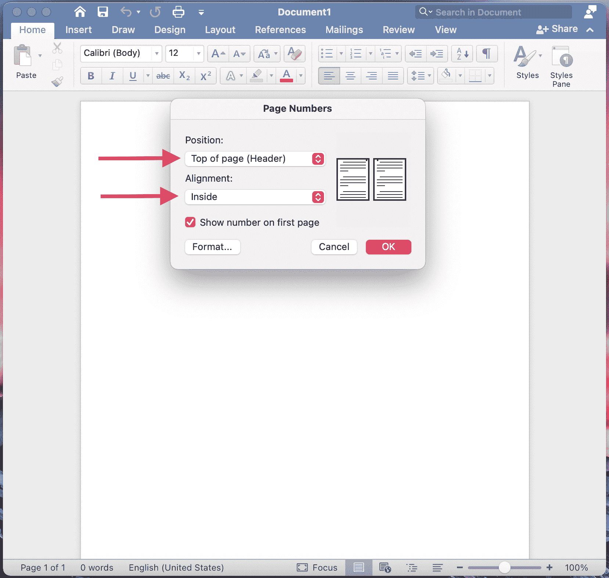
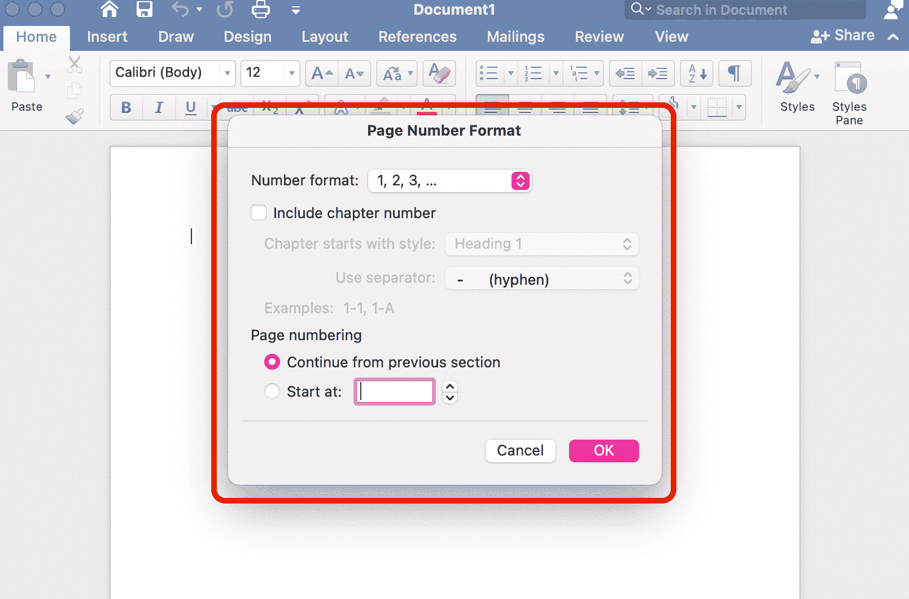
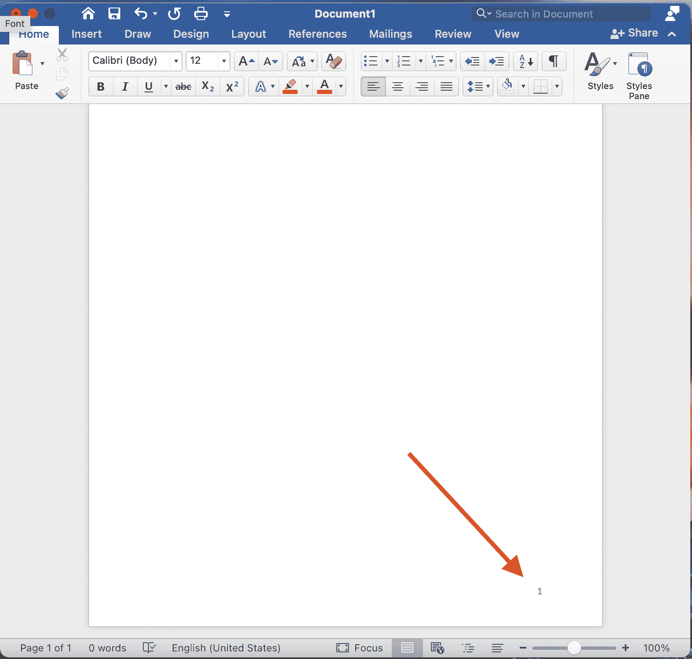
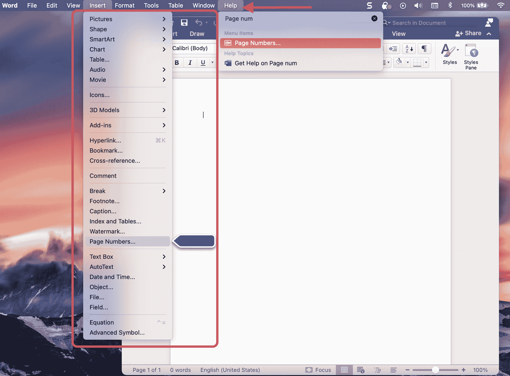

# 如何在 Word-Microsoft Word Number Pages 教程中添加页码

> 原文：<https://www.freecodecamp.org/news/page-numbers-in-word-tutorial-how-to-insert-a-page-number-in-microsoft-word/>

如果你正在为学校写一本书或一篇论文，你可能会想要包括页码。它们将帮助读者了解他们进行了多远，并允许他们引用文本中的特定点。

如果你用 Microsoft Word 写作，有一个简单的方法可以给你的作品添加页码。让我们看看它是什么。

## 如何在 Word 中添加页码

当您打开 Word 文档时，您会在屏幕顶部看到 Word 主菜单，如下所示:

Main Word menu at the top of your screen.

### 第一步:点击 Word 主菜单中的“插入”标签

只需点击“插入”标签，你会得到一个有很多选项的下拉菜单。大约三分之二的地方，你会看到一个“页码”选项，就像这样:

Just click on "Insert" on the main menu and then scroll down to "Page Numbers".

### 第二步:向下滚动，选择“页码”选项

当你点击“页码”时，会弹出一个小框，询问你想如何设置页码的格式。

### 第三步:格式化你的页码

您可以选择要放置数字的位置(“位置”)、它们在页面上的对齐方式(“对齐”)以及其他格式选项。它看起来会像这样:

How you can format your page numbers.

### 步骤 4(可选):自定义页码

如果您只需点击每个选项旁边的下拉菜单，您就可以准确选择您希望数字出现的位置和方式。

例如，如果我想让我的数字出现在右下角，我就把这些选项保留为默认值。但是如果我想要它们，比如说，在每一页的顶部和内部，我可以做如下的调整:

How to customize your page numbering.

您还可以选择是否要在首页显示数字(如果是标题页，可能就不显示了，等等)。

如果您真的想了解页码的详细信息，可以单击“格式...”按钮。在那里你可以选择你的数字的外观(如果你愿意，你可以用罗马数字！)，是否要包含章节编号，以及编号应该如何开始。

More page number options.

瞧，现在你的页面被编号了！

## 如何在 Word 中找到页码选项卡

Word 有一个很酷的地方:如果你去“帮助”选项卡搜索某个功能，它会告诉你在主菜单的什么地方找到它。

我的意思是:

比方说我想找到添加页码的地方(并且没有这个方便的教程)。我只需点击主菜单中的“帮助”标签，输入“页码”即可。

但这还不是最酷的部分——当你输入时，你会看到一个匹配项弹出来(下面用粉色突出显示)。当您将鼠标悬停在该选项上时(先不要单击)，Word 会显示在哪里可以找到该工具或功能(在下面的红色框中)，并使用蓝色脉冲箭头指向您的查询！像这样:

Click "Help", type in "page numbers", hover over "Page Numbers", and the menu will pop up to the left.

然后，如果你真的点击帮助工具中的页码查询，它会直接带你去那里，你会看到“页码”框弹出。

现在您知道如何在 Microsoft Word 中添加页码，并且您可以根据自己的喜好自定义这些页码。快乐写作！