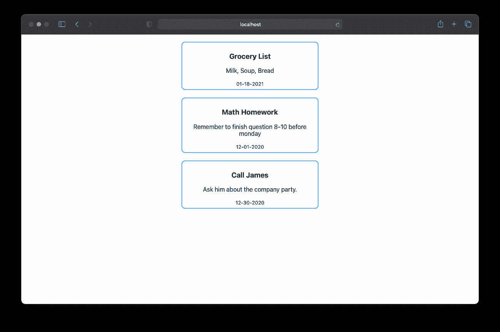
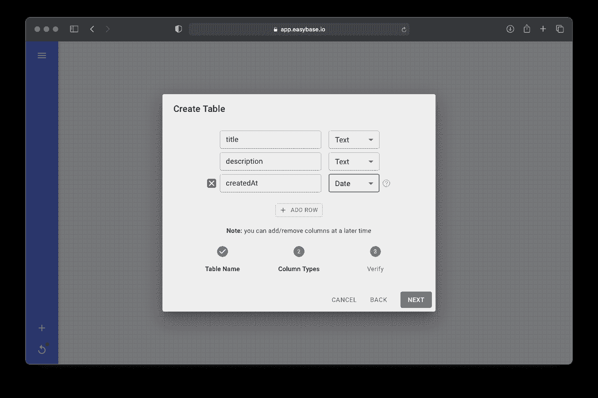
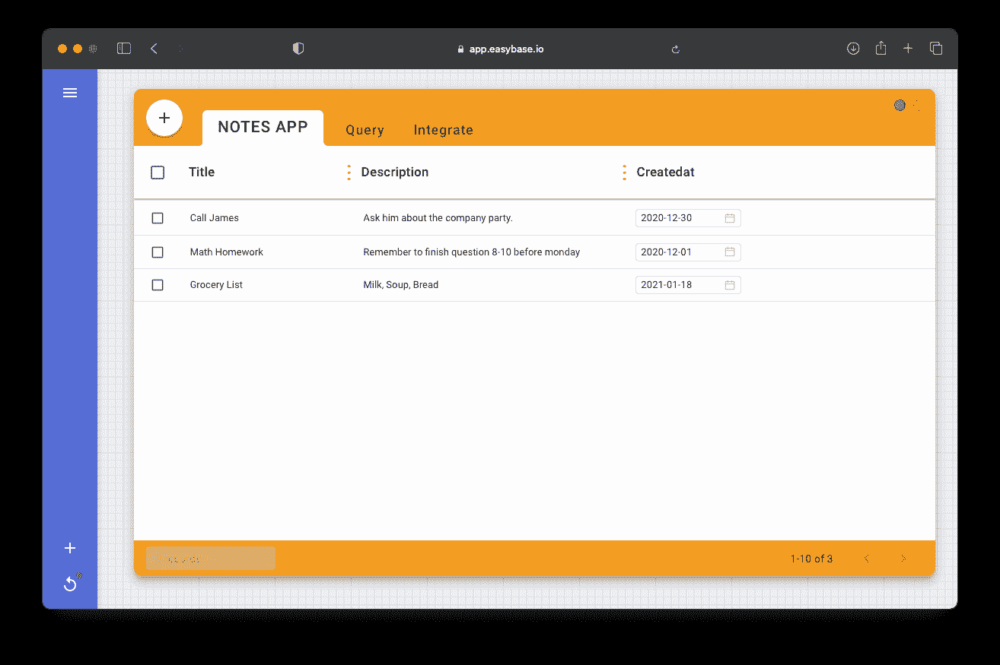
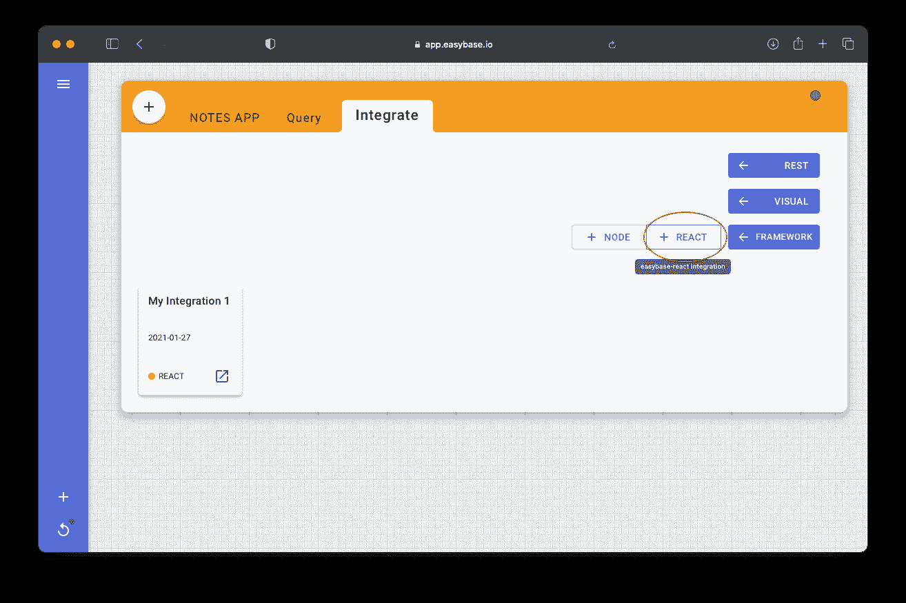
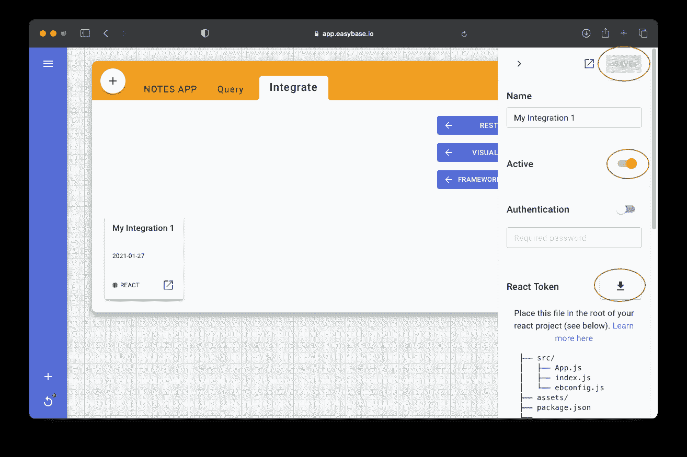
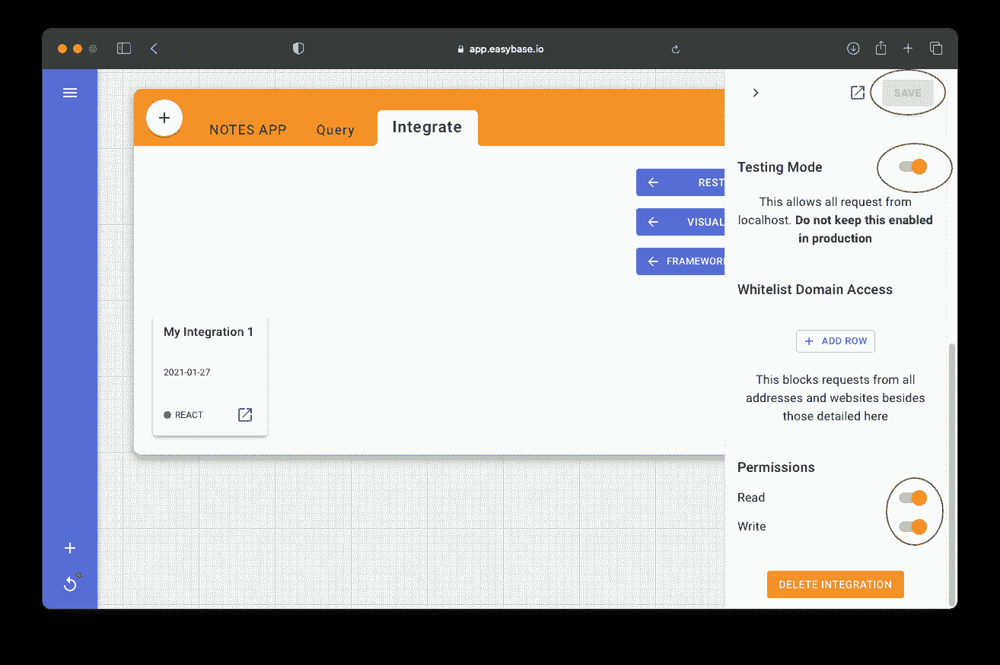
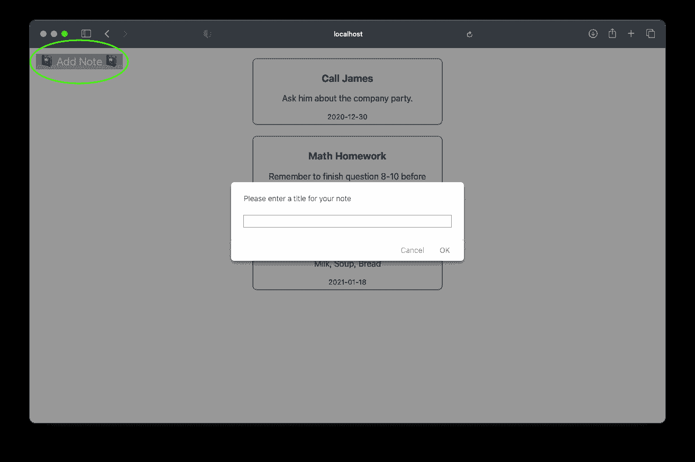
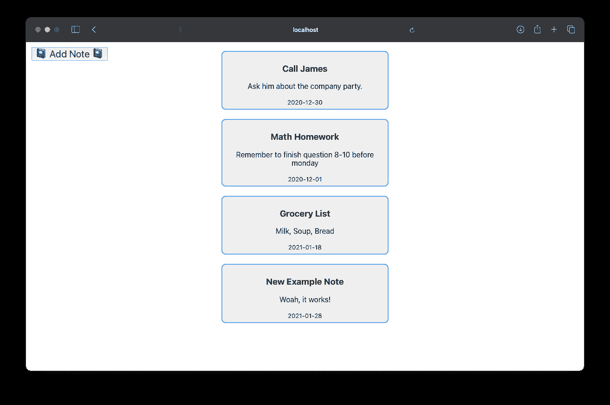
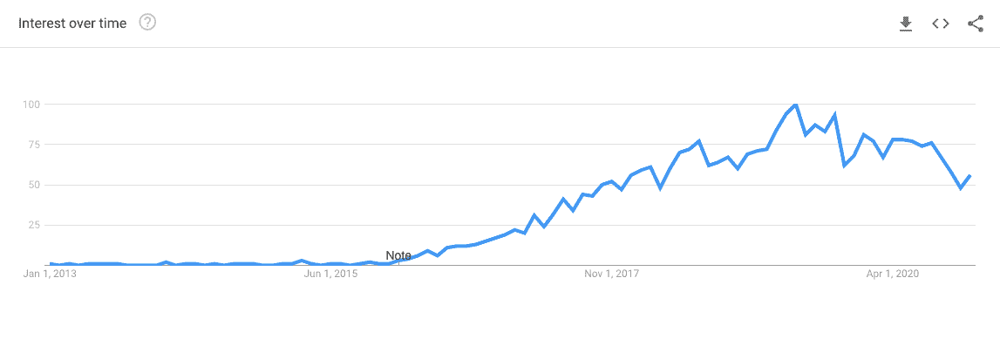

# 如何将无服务器数据库添加到 React 项目中

> 原文：<https://www.freecodecamp.org/news/how-to-add-a-serverless-database-to-react-projects-and-web-apps/>

React 仍然是最受欢迎的前端 Javascript 库之一。根据年度 Stack Overflow 开发者调查， [React 是最受欢迎的构建界面前端库，也是第二受欢迎的 web 框架。](https://insights.stackoverflow.com/survey/2020#technology-web-frameworks)

更令人印象深刻的是，它的受欢迎程度继续逐年增长。

在过去的几年里，如此多的竞争对手试图取代 React，为什么 React 在开发者中仍然如此受欢迎(和受欢迎)？

这个问题的完整答案可能会变得非常专业，所以我会尽我所能让它变得简短而甜蜜。

第一，React 的虚拟 DOM 快速高效。其次，声明式 JSX 语法易于学习，并且具有开发人员熟悉的编程模式。

这些优点使 React 成为各种应用程序类型的理想选择。此外，个人和小型团队继续选择 React 作为他们的 web 应用程序。

现代 web 应用程序的一个常见需求是一个*后端数据库*来提供和查询实时数据。后端数据库的传统实现通常非常不稳定且成本效益低。

令人欣慰的是，在过去的五年中，无服务器技术已经成为现代应用程序开发的前沿。

在这种情况下，*无服务器*意味着开发者不必设置和管理一个实际的服务器来托管他们的数据库和其他后端服务。相反，他们使用一个安全的提供商来托管他们的后端，并从前端应用程序代码直接连接到后端。无需担心可扩展性和系统。

这种应用程序架构相对较新，但它具有成本效益，并且*极大地*提高了生产率。对于那些使用 React 构建现代生产应用程序的人来说，这些好处发挥得很好。另外，像 Easybase 这样的服务已经创建了专门为有状态 React 组件构建的无服务器库。

本文将展示在一个新的 React 项目中使用`[easybase-react](https://github.com/easybase/easybase-react)`库实现一个有状态的、无服务器的数据库是多么容易。下面的例子将是一个简单的笔记应用程序，但是无服务器架构有潜力简化各种应用程序。

## 目录:

*   如何初始化 React 项目和组件
*   如何设置无服务器数据库
*   可变数据库数组

## **如何初始化 React 项目&组件**

为了创建一个新的 React 项目，我将使用流行的`[create-react-app](https://github.com/facebook/create-react-app)`库([确保您的机器上安装了 Node】)。](https://www.npmjs.com/get-npm)

对于那些不熟悉手动设置 React 项目的人，我建议使用这个库，因为它将创建一个空白的、正确配置的项目。

在希望创建新项目的位置执行以下命令:

```
npx create-react-app serverless-database-app
```

完成后，让我们安装无服务器库:

```
cd serverless-database-app && npm install easybase-react
```

最后，我们可以开始这个项目了:

```
npm run start
```

您的应用程序将自动在您的默认浏览器中打开。您看到的根组件在`src/App.js`中，这是将进行主要更改的地方。

在我们进入无服务器提供者之前，我将简化`App.js`中的代码。我们将有两个组件:*应用*和*卡片*。`App.js`现在看起来如下:

```
import './App.css';

function App() {
  return (
    <div className="App" style={{ display: "flex", justifyContent: "center" }}>
      <Notes />
    </div>
  );
}

function Notes() {
  const backendData = [
    { title: "Grocery List", description: "Milk, Soup, Bread", createdat: "01-18-2021" },
    { title: "Math Homework", description: "Remember to finish question 8-10 before monday", createdat: "12-01-2020" },
    { title: "Call James", description: "Ask him about the company party.", createdat: "12-30-2020" }
  ]

  const noteRootStyle = {
    border: "2px #0af solid",
    borderRadius: 9,
    margin: 20,
    backgroundColor: "#efefef",
    padding: 6
  };

  return (
    <div style={{ width: 400 }}>
      {backendData.map(ele => 
        <div style={noteRootStyle}>
          <h3>{ele.title}</h3>
          <p>{ele.description}</p>
          <small>{ele.createdat}</small>
        </div>
      )}
    </div>
  )
}

export default App; 
```

我添加了一些名为*后端数据*的**示例数据**，但是我们将在下一步用一个实时数据库来替换它。下面是我目前实现的截图，供参考:



为了简洁起见，这个应用程序的样式非常简单。但是你绝对应该给你自己的应用程序一个独特的外观和感觉！

## **如何设置无服务器数据库**

周围有很多通用的无服务器后端提供商( [AWS](https://aws.amazon.com/serverless/) 、 [Google Cloud](https://cloud.google.com/) 等等)。这些提供商的*功能*之间存在差异。有些可能更适合移动应用、并行处理或机器学习等等。

我将使用 Easybase，因为他们的平台有一个 **React 专用库**，这是为无服务器应用构建的[。我们将在下面看到这个包是如何快速简单地用代码建立起来的。](https://easybase.io/about/2021/01/30/What-Is-a-Serverless-Application/)

我已经在多个项目中使用了这个平台，到目前为止，`easybase-react`最有价值的方面是*自动会话缓存*和*安全数据获取*。手动实现这些模块是一个很大的麻烦，并且可能是一个完整的项目。

首先，我们将对`App.js`做两处修改。首先，让我们使用之前安装的那个`easybase-react`包，在`App.js`的顶部添加一个导入行。引入 *EasybaseProvider* 和 *useEasybase* 。

其次，将 *Notes* 组件包装在 *EasybaseProvider* 组件中。

`App.js`现在应该如下所示。注意，我还从 React 引入了*使用效果*钩子。

```
import './App.css';
import { EasybaseProvider, useEasybase } from 'easybase-react';
import { useEffect } from 'react';

function App() {
  return (
    <div className="App" style={{ display: "flex", justifyContent: "center" }}>
      <EasybaseProvider>
        <Notes />
      </EasybaseProvider>
    </div>
  );
}

// ...
```

一旦我们传入所需的配置， *EasybaseProvider* 组件将为所有子组件提供对 *useEasybase* 钩子的有效访问。

*EasybaseProvider* 有一个名为`ebconfig`的属性，它是一个单独的文件，用于认证和保护 React 项目中的所有连接。

下面是我们如何获得与自定义数据表相关联的`ebconfig`令牌:

*   [登录 Easybase](https://easybase.io/) 或[创建免费账户](https://app.easybase.io/?view=signup)
*   通过左下角按钮组中的“+”按钮打开**创建表格**对话框
*   为您的表命名，并创建与示例数组 *(title，description，createdat)* 对应的列



我将手动添加来自 *backendData* 数组的示例行作为参考，但是这一步不是必需的。



*   导航到**集成**选项卡并创建一个新的**反应**集成



*   在右边的抽屉里，**使** *激活，检测模式，*和读写*权限*。然后下载 *React* 令牌，点击右上角的**保存**



*   将新下载的 *ebconfig.js* 文件放在项目的`src/`文件夹中

```
├── README.md
├── node_modules/
├── package.json
├── public/
└── src/
    ├── ebconfig.js   <---
    ├── App.css
    ├── App.js
    ├── index.css
    ├── index.js
    └── ...
```

*   最后，**将**该文件导入到`App.js`中，并将其作为 *EasybaseProvider* 的`ebconfig`道具传递，如下所示:

```
import './App.css';
import { EasybaseProvider, useEasybase } from 'easybase-react';
import { useEffect } from 'react';
import ebconfig from './ebconfig';

function App() {
  return (
    <div className="App" style={{ display: "flex", justifyContent: "center" }}>
      <EasybaseProvider ebconfig={ebconfig}>
        <Notes />
      </EasybaseProvider>
    </div>
  );
}

// ...
```

就这样，我们的项目被配置为无服务器功能。剩下要做的就是利用`useEasybase`钩子提供的函数，我们将在下一节中完成。

[查看本演练，了解更多关于在无服务器架构中使用 React 或 React Native 的信息](https://easybase.io/react/)。

如果您的项目是通过安全登录认证来处理单个用户，请使用**项目**选项卡，而不是简单的**反应**集成。

关于 React 用户认证的信息可以在这篇关于 Easybase **项目**工作流程的 freeCodeCamp 文章中找到。

## **可变数据库数组**

既然我们已经正确地设置了后端，那么 *EasybaseProvider* 的子组件就可以访问 *useEasybase* 钩子了。这个钩子提供了访问远程数据所需的基本功能。

让我们从引入三个函数开始；*配置帧*、*同步*和*帧*，在我们的*注释*组件中有`const { Frame, sync, configureFrame } = useEasybase();`。

当我们的组件第一次挂载时，我们希望配置我们的*框架*来获取我们数据库的前 10 个条目， **NOTES APP** 。*帧*充当**有状态数据库数组**，在其中调用 *sync* 将使后端数据库中的任何本地更改正常化。

```
function Notes() {
  const { Frame, sync, configureFrame } = useEasybase();

  useEffect(() => {
    configureFrame({ tableName: "NOTES APP", limit: 10 });
    sync();
  }, []);

  const noteRootStyle = {
    border: "2px #0af solid",
    borderRadius: 9,
    margin: 20,
    backgroundColor: "#efefef",
    padding: 6
  };

  return (
    <div style={{ width: 400 }}>
      {Frame().map(ele => 
        <div style={noteRootStyle}>
          <h3>{ele.title}</h3>
          <p>{ele.description}</p>
          <small>{String(ele.createdat).slice(0, 10)}</small>
        </div>
      )}
    </div>
  )
}
```

*Sync* 会自动处理必要的后端流程。更重要的是，它将使用*帧*中的新数据重新呈现我们的组件。

如果我们重新构建应用程序，显示的新注释将与数据表中的注释相同。恭喜你，你使用的是无服务器数据库！

让我们通过添加一个按钮来获得更多的乐趣，该按钮会将新的便笺推送到 Easybase，并相应地呈现您的应用程序。

创建一个名为 *NewNoteButton* 的新组件。从 *useEasybase* 钩子中获取*同步*和*帧*功能。

我将使用绝对定位将该按钮放置在窗口的左上角。当用户点击这个按钮时，我的组件将从用户那里获得一个新的标题和描述，并使用*帧*和*同步*将其发布到 Easybase。

将这个新创建的组件放在 *EasybaseProvider* 中的 *Notes* 组件下面。

```
 function App() {
  return (
    <div className="App" style={{ display: "flex", justifyContent: "center" }}>
      <EasybaseProvider ebconfig={ebconfig}>
        <Notes />
        <NewNoteButton />
      </EasybaseProvider>
    </div>
  );
}

// ...

function NewNoteButton() {
  const { Frame, sync } = useEasybase();

  const buttonStyle = {
    position: "absolute",
    left: 10,
    top: 10,
    fontSize: 21
  }

  const handleClick = () => {
    const newTitle = prompt("Please enter a title for your note");
    const newDescription = prompt("Please enter your description");

    Frame().push({
      title: newTitle,
      description: newDescription,
      createdat: new Date().toISOString()
    })

    sync();
  }

  return <button style={buttonStyle} onClick={handleClick}>📓 Add Note 📓</button>
}
```

我的实现通过[本机提示函数](https://www.w3schools.com/jsref/met_win_prompt.asp)收集用户想要的标题和描述，但是您的生产应用程序可能需要更健壮的输入解决方案。不过，这对于演示来说还是不错的。



注意屏幕右上角的新按钮。单击此按钮将弹出两个文本框。完成后， *Notes* 组件在显示新条目的 *sync* 调用后重新呈现。



这些更改将立即显示在您的 Easybase 表中，因此也可以随意进行更改！

## 结论

[数字不会说谎](https://github.com/facebook/react/graphs/contributors)–React 健壮、成熟，深受开发人员的喜爱。开源社区真正接受了这个项目，[有超过 1500 名贡献者](https://github.com/facebook/react/graphs/contributors)。

这个库已经被证明是创建漂亮、高性能界面的最佳方式之一。事实上，您甚至可以将 React 项目部署到 Github 页面上。

使用 React with serverless 已经变得很容易了。这种可扩展技术的采用有了很大的发展。看看过去 8 年中“无服务器”一词的谷歌趋势图。



Google Trends for 'serverless'

这项技术使开发人员能够部署可扩展的企业级应用程序，其成本只是常规开销的一小部分。通过释放资源丰富的人传统上可用的工具，*无服务器技术*继续鼓励开发人员将他们的想法变成现实。