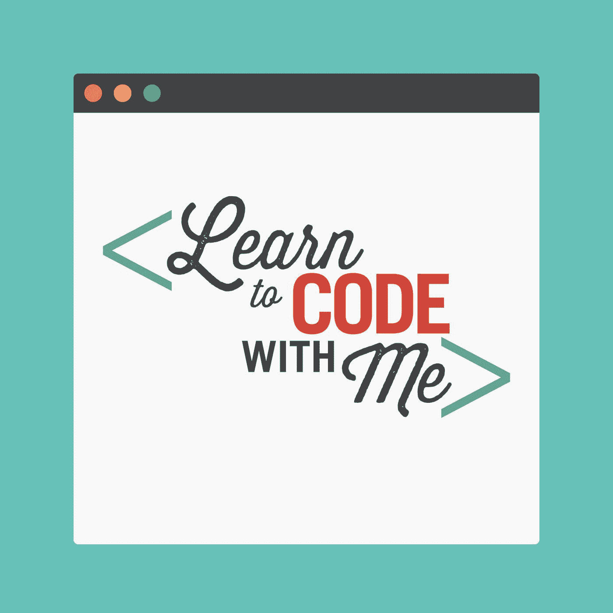
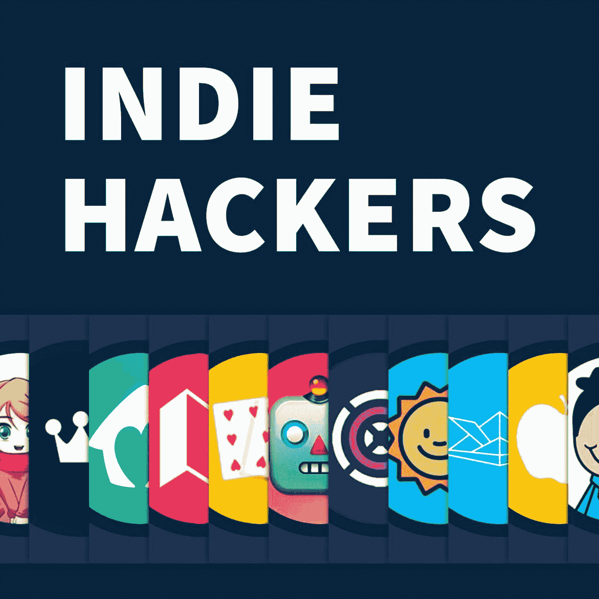
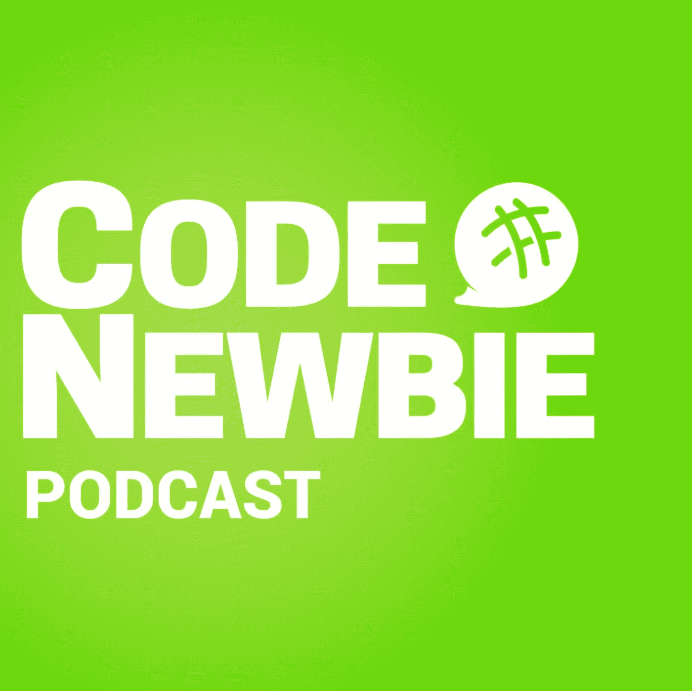
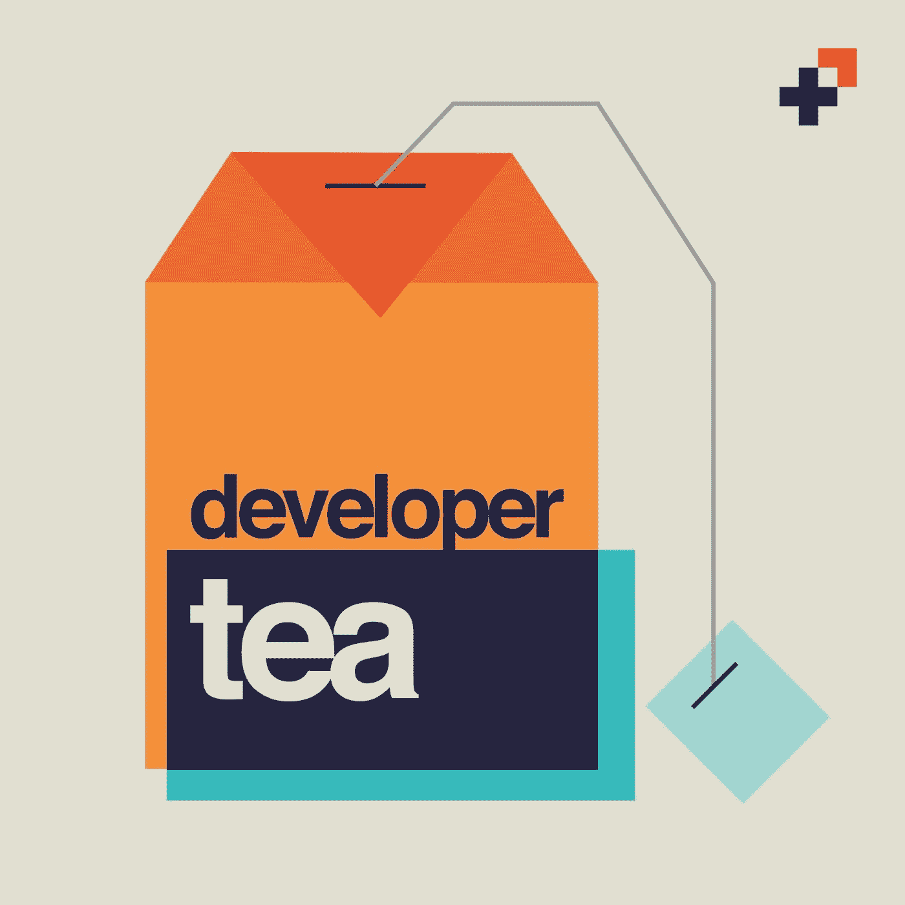
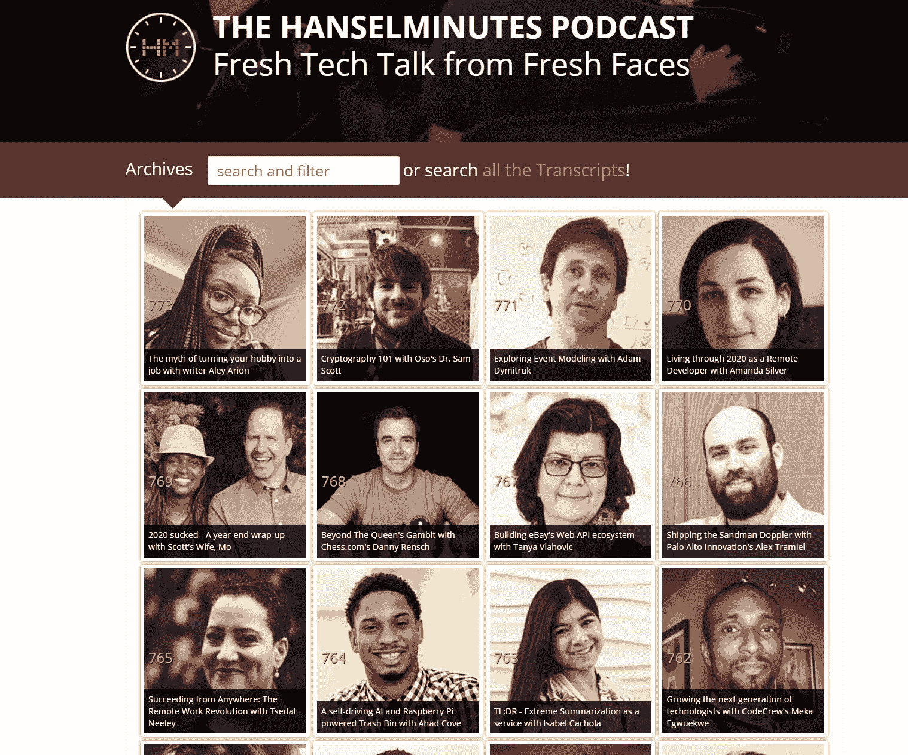
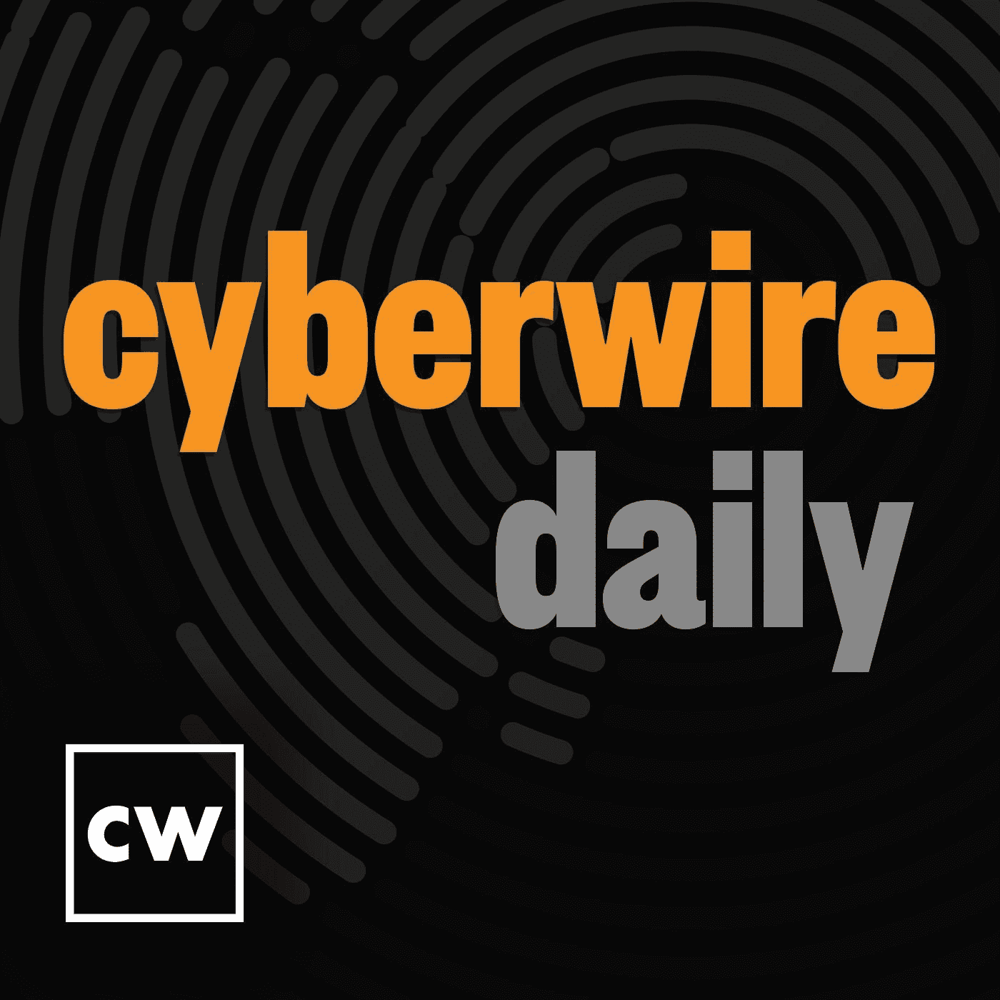
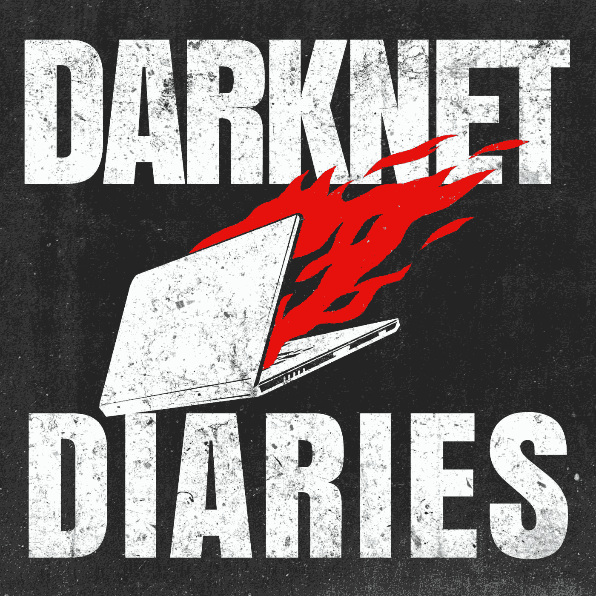
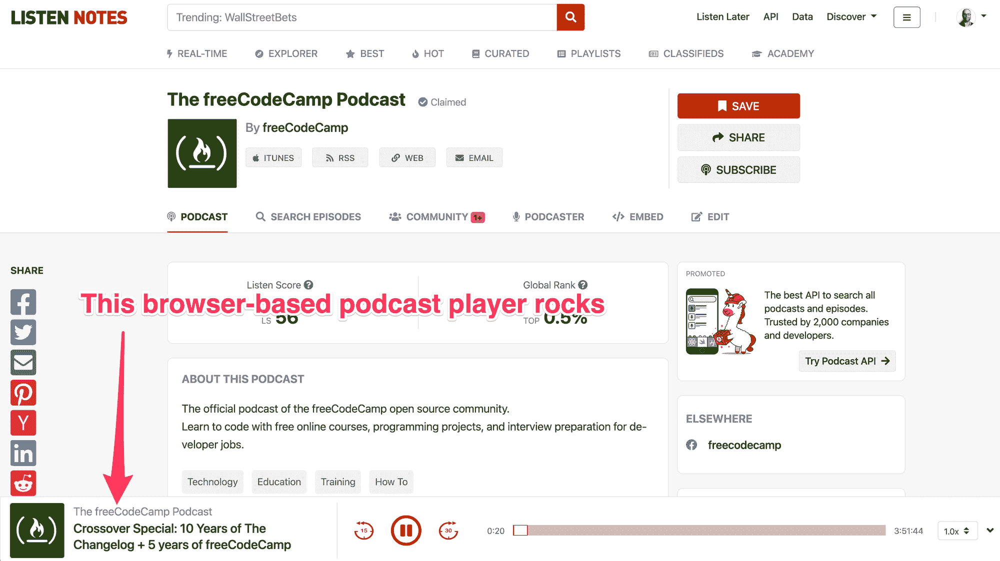

# 2021 年软件开发人员的最佳技术播客

> 原文：<https://www.freecodecamp.org/news/best-tech-podcasts-for-software-developers/>

播客是在旅途中了解技术的好方法。他们可以让你接触到大量的工具和概念。

自从 2012 年开始学习编程以来，我已经听了数千小时的技术播客——通常是在锻炼或通勤时。这些播客中的许多仍然很受欢迎。本文将重点介绍这些经过时间考验的学习资源。

在我们开始之前有一点要注意:在你开始对我发微博说我如何放弃了你最喜欢的播客之前，请注意我故意排除了大多数商业和新闻聚焦的播客。相反，我已经瞄准了由开发者运营的播客，并把开发者作为核心受众。

我可以自信地说，所有这些播客都是可靠的。如果你是一名开发人员，或者有兴趣成为一名开发人员，这些播客将娱乐你，启发你的通勤。享受吧。

## 最佳网络开发播客:SyntaxFM

SyntaxFM logo

我是斯科特·托林斯基和加拿大标志性的开发者 T2·韦斯·博斯的忠实粉丝。这两个人组成了一个魅力四射的组合。他们一起主持了超过 320 集的 SyntaxFM 播客。

每集，Scott 和 Wes 都分享 web 开发工具和技术，并经常采访该领域的一些顶级 web 开发人员。

留意他们的“美味佳肴”CSS 和 JavaScript 技巧，以及他们有益健康的幽默感。

[在此浏览 SyntaxFM 剧集](https://syntax.fm/)。

## 开源的最佳播客:Changelog

The Changelog logo

在这一点上，变更日志是一个机构。在过去的 11 年里，他们采访了各种各样开源项目的创建者。

而主要主持人，[亚当·斯塔科维奇](https://twitter.com/adamstac)和[杰罗德·桑托](https://twitter.com/jerodsanto)本身就是开发者。他们维护着一个最先进的在线社区，并将大量开源工具整合到他们自己的平台中。

我有幸在休斯顿亚当的家里和他们在一起，并在他们的播客十周年纪念日采访了他们。

我建议订阅并浏览他们档案中的 400 多集。(很多甚至有成绩单。)

[在这里浏览变更日志的剧集](https://changelog.com/podcast)。

## 学习编码的最佳播客:跟我学编码

Learn to Code With Me logo

在超过 100 集的节目中，劳伦斯·布拉德福德采访了各种各样自学成才的开发者。以下是她采访的一些人在成为开发人员之前的职业:

*   机场保安
*   全职父母
*   牧师
*   教授
*   更多

她还有几集指导寻找自由职业客户、选择合适的笔记本电脑，以及在抚养孩子的同时学习编程。强烈推荐。

[点击此处](https://learntocodewith.me/podcast/)浏览“跟我学编程”播客的剧集。

## 最佳开发者-企业家聚焦播客:独立黑客播客

Indie Hackers logo

技术世界的许多人认为商业是一系列的风险资本融资，最终导致“退出”。但也有数以千计的成功企业由开发商自己经营——通常根本没有外部资金。

这些是麻省理工学院培养出来的工程师变成的创始人科特兰·艾伦在他的独立黑客播客中关注的“自举”业务。

这些年来，考特兰采访了近 200 名创始人，其中大多数人最初是在其他公司做全职开发，然后兼职做项目。这些副业项目中的许多发展成了有利可图的生意。

在每次采访中，考特兰都让这些开发商与听众分享他们的收入数字，并试图探究他们是如何如此成功的。在这个过程中，他通常会发掘出其他开发者可以用来创业的见解。

[在这里浏览独立黑客播客](https://www.indiehackers.com/podcasts?utm_campaign=Listen%20Notes&utm_medium=website&utm_source=listennotes.com)。

## 最佳 JavaScript 播客:JS 党

JS Party logo

JavaScript 生态系统既庞大又多样。这场播客派对也是如此。

每周，一个由 JavaScript 老手组成的小组都会讨论新的库、新出现的最佳实践以及其他影响开发人员的变化。

一些常见的小组成员包括:

*   JS 开发者兼教师 [Divya Sasidharan](https://twitter.com/shortdiv)
*   斯坦福大学讲师兼开源先锋[费罗斯·阿巴克哈迪贾](https://twitter.com/feross)
*   打字爱好者[尼克·尼斯](https://twitter.com/nicknisi)
*   权力下放倡导者[迈克尔·罗杰斯](https://twitter.com/mikeal)
*   还有软件工程师[阿玛尔·侯赛因](https://twitter.com/nomadtechie)

这是一群热爱乐趣的人，他们不仅对 JavaScript 充满热情，而且在过去的几年里对语言做出了重大贡献。

[在这里浏览 JS 党的剧集](https://changelog.com/jsparty)。

## 最佳 Python 播客:跟我说说 Python

The Talk Python to Me logo

每周，开发者迈克尔·肯尼迪都会探索 Python 生态系统及其众多应用。一路上，他采访了来自各个领域的 Python 爱好者，包括:

*   Web 开发
*   数据科学
*   机器学习
*   和学术界

有 300 多集可以听,“与我谈论 Python”是向您展示 Python 的一些最强大的包的好方法。

[点击此处](https://talkpython.fm/episodes/all)浏览播客《Python 对我说》(Talk Python to Me)的片段。

## 新手开发者的最佳播客:代码新手播客

Code Newbie logo

2014 年 9 月，也就是 freeCodeCamp 上线的前一个月，Saron Yitbarek 推出了 Code Newbie 播客。我记得在一整天的编码会议后，深夜去旧金山跑步时，我愉快地听了前几集。当我听她采访自学成才的软件开发人员时，空气中弥漫着这种电流——有些人甚至比我还新。

当然，Saron 已经基本上成为了学习编码运动的代言人。她创建了 Codeland 开发者大会，最近又创建了优秀的 T2 命令行英雄播客。但她仍然录制了《Code Newbie》的新集，它们和 2014 年一样令人兴奋。

她已经看了 261 集了，而且没有减速的迹象。如果你发现自己在学习编码时处于“绝望的沙漠”中，需要一点积极的能量，这就是为你准备的播客。

[点击此处](https://www.codenewbie.org/podcast)浏览 Code Newbie 播客的剧集。

## 最佳机器学习播客:实用人工智能

Practical AI logo

机器学习在从无人驾驶汽车到医疗诊断的各个领域都有大量有前途的应用。但是这其中有多少是炒作，又有多少是在未来几十年内真正会发生的呢？

实用人工智能播客专注于机器学习工具的现实世界实现。主持人是经验丰富的从业者，他们知道自己在说什么:数据科学家丹尼尔·怀特纳克和软件工程师 T2·克里斯·本森。

在 120 集的节目中，丹尼尔和克里斯采访了处理海量数据集的工程师——信用卡公司、社交网络，甚至政府。而且它们帮助你通过更实用的镜头来看待最新的机器学习发展。

[在这里浏览《实用 AI》剧集](https://changelog.com/practicalai)。

## 最体贴的开发者播客:开发者茶

Developer Tea logo

在过去的 5 年里，PBS 工程总监(也是训练有素的飞机飞行员)乔纳森·卡特雷尔为开发者分享了无数的技巧。

在他的 650 集里，很多都是独白，讲述了他对开发者经历的一个特定方面的思考。其他剧集是与开发人员的亲密访谈，探索目的和工艺的主题。

这是一个很棒的播客，适合较短的听力课程，因为大多数剧集只有 15 或 20 分钟长。这几集会让你精力充沛，准备好完成一些编码工作。

[点击此处](https://spec.fm/podcasts/developer-tea)浏览开发者茶播客。

## 中级开发人员的最佳播客:瓢虫播客

The Ladybug Podcast logo

瓢虫播客由来自各种背景的四位杰出开发人员主持——有些是自学成才，有些是计算机科学学位——他们与各种技术团队合作:[艾玛·博斯提恩](https://twitter.com/EmmaBostian)、[西德尼·巴克纳](https://twitter.com/shidonichan)、[阿里·斯皮特尔](https://twitter.com/ASpittel)和[凯利·沃恩](https://twitter.com/kvlly)。

除了难懂的技术话题，他们还关注职业成长、个人发展，甚至有一种读书俱乐部，在那里他们都阅读同一本书并进行讨论。

他们在 2019 年 6 月开始发布播客，已经发布了超过 65 集，你可以尽情享受。

[在这里浏览瓢虫播客的片段](https://www.ladybug.dev/episodes)。

## 最佳用户界面/ UX 设计播客:购物播客

The Shop Talk Show logo

这是著名开发者的另一个长期运行的播客。CSS 技巧和 CodePen 创造者[克里斯·科伊尔](https://twitter.com/chriscoyier)与开发者和多产播客[戴夫·鲁伯特](https://twitter.com/davatron5000)合作。他们一起谈论网页设计:

*   易接近
*   美学
*   表演
*   人机交互
*   深入到最微小的细节

在 400 多集里，克里斯和戴夫探索了各种新旧工具。从 WordPress 到 JAMstack 的一切。

如果你是一名从事设计的开发人员，或者是一名从事开发的设计师，这是为你准备的播客。

[点击此处](https://shoptalkshow.com/)浏览购物脱口秀的剧集。

## 最佳开发者教育播客:Hanselminutes 播客

Some recent guests from the Hanselminutes Podcast

这是该榜单上迄今为止播放时间最长的播客。这可以追溯到 2006 年，那时大多数人甚至还没有听说过“播客”这个术语。

Scott Hanselman 是一位多产的开发人员和教育家——最著名的是他作为微软开发人员的传道者。

在近 800 集的节目中，Scott 与来自世界各地的软件开发人员进行了交流。他甚至收录了他所有剧集的完整脚本，让非英语母语的人更容易理解。

[在此浏览 Hanselminutes 播客的剧集](https://www.freecodecamp.org/news/best-tech-podcasts-for-software-developers/hanselminutes.com/episodes)。

## 网络安全的 3 个最佳播客(因为这 3 个都是金牌)

依我拙见，这将我们带到了技术播客中最激动人心的领域:信息安全。黑帽子、白帽子和国家级角色的领域——都在竞争看谁能黑谁，谁能最好地保护他们的系统。

### 最佳网络安全播客#1:网络每日新闻

每天收听 Cyberwire 是了解新兴话题的好方法，同时还可以积累您的安全背景知识。

我不是安全专家，但安全是我日常讨论的一个重要部分。它几乎渗透到我们非营利组织作为一个团队所做的每一个决定中。所以我认为这个播客是我继续教育的一个重要部分。

Cyberwire 每天有超过 1500 集的往期节目可供浏览。这是从 2015 年开始的网络安全新闻的活记录。

[点击这里](https://thecyberwire.com/podcasts/daily-podcast)浏览 CyberWire 每日播客。

### 最佳网络安全播客#2:恶意生活

The Malcious Life logo. My personal pick for the most menacing podcast logo in tech.

《恶意生活》是一个叙事驱动的播客，作者是一位神秘的开发者，口音很酷，似乎为一家名为 Cybereason 的安全咨询公司工作。

每一集，播客讲述了网络安全历史上有趣的黑客背后鲜为人知的故事。到目前为止有 110 多集，相当背的目录让你吸收。

[在此浏览《恶意人生》剧集](https://malicious.life/)。

### 最佳网络安全播客#3:暗网日记

Darknet Diaries logo

这就把我们带到了这个列表中的最后一个播客。这可能是目前最受欢迎的非新闻科技播客:Darknet Diaries。

在本期播客中，主持人 [Jack Rhysider](https://twitter.com/JackRhysider) 主要关注技术支持下的罪犯。他用他讲故事的技巧和一流的制作真正吸引了你。

同样值得注意的是:杰克对他的播客指标相当坦率。如果你想开一个自己的科技播客，[一定要看看他的 2020 年回顾报告](https://darknetdiaries.com/stats/)。

当我在 2017 年发现 Darknet Diaries 时，我立即回去，在一次公路旅行中狂听了整个目录。如果你最终做了同样的事情，一定要在 Twitter 上 [@我](https://twitter.com/ossia)，告诉我你最喜欢的一集是哪一集。

[在这里浏览黑暗网络日记](https://darknetdiaries.com/)。

## 我如何听播客

很多人问我怎么听播客。好吧，你可以说我过时了，但我只是在我的 iPhone 上使用默认的播客应用。这是免费的，没有广告，我也不会与第三方分享我的数据。

我以双倍的速度听所有的东西。我积极使用“向前跳过 15 秒”按钮。

苹果播客应用的一个不足之处是它的搜索引擎。所以在搜索方面，我使用了一个很棒的播客搜索引擎工具，它是由 freeCodeCamp 的贡献者方创建的，名为 T1。它快如闪电，有大量有用的功能，包括一个方便的基于 HTML5 的播客播放器。

我非常喜欢 ListenNotes，我很乐意链接到这篇文章的 ListenNotes。它的用户体验就是这么好。

但是我不想剥夺这些了不起的播客创作者的访问者和反向链接。这些播客创作者值得他们的网站获得所有的关注。

另一个很酷的事实:文彬是一个播客狂热者，他想出了一些新颖的方法来排队播客，并在旅途中收听它们。如果你想成为像他一样的播客超级用户，你也可以[试试他的方法](https://www.freecodecamp.org/news/podcasts-are-my-new-wikipedia-the-perfect-informal-learning-resource/#how-exactly-do-i-listen-to-podcasts-and-use-them-as-my-new-wikipedia)。

这就是我的全部。我希望你能从这些播客中学到很多，并利用这些免费的学习资源成为一名更好的开发人员。快乐编码。