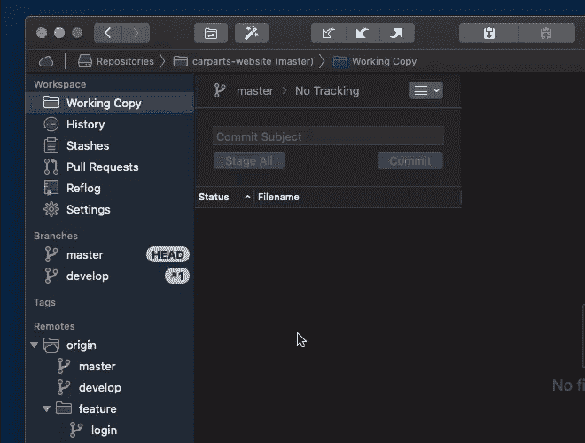
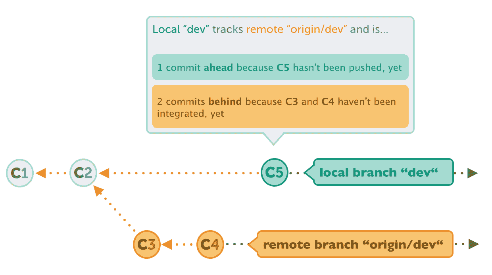
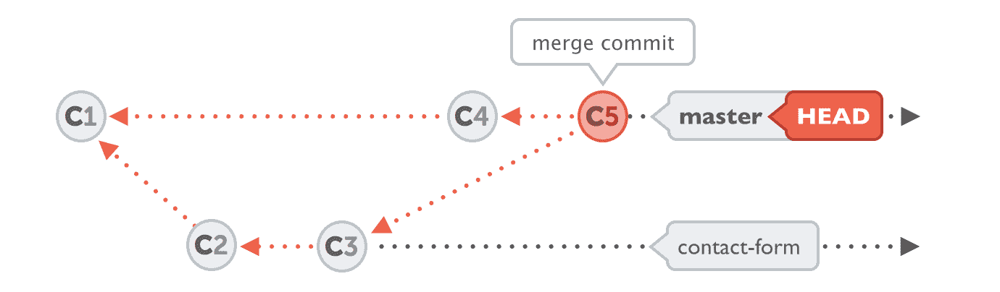
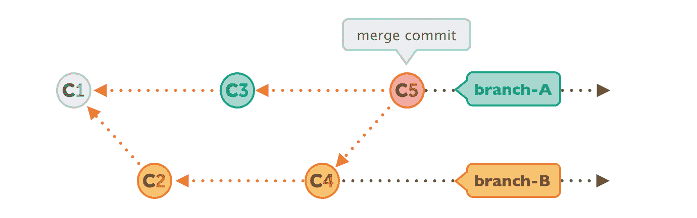

# 如何在 Git 中使用分支——终极备忘单

> 原文：<https://www.freecodecamp.org/news/how-to-use-branches-in-git/>

分支是 Git 的核心概念之一。你可以用它们做无数的事情。您可以创建和删除它们，重命名和发布它们，切换和比较它们...还有更多。

我写这篇文章的目的是对 Git 中分支可以做的事情做一个全面的概述。我不想写一本书那么长的文章，所以我不会详细描述所有的行为。但如果你想了解更多，我会提供链接。

以下是我们将要涵盖的内容的概述:

*   如何创建分支
*   如何重命名分支
*   如何切换分支
*   如何发布分支机构
*   如何跟踪分行
*   如何删除分支
*   如何合并分支
*   如何重定分支的基础
*   如何比较分支

## 如何在 Git 中创建分支

在您可以使用分支之前，您需要在您的存储库中有一些分支。因此，让我们从讨论如何创建分支开始:

```
$ git branch <new-branch-name>
```

当只给`git branch`命令提供一个名称时，Git 将假设您想要基于您当前签出的修订启动您的新分支。如果您希望您的新分支从一个特定的*版本*开始，您可以简单地添加该版本的 SHA-1 散列:

```
$ git branch <new-branch-name> 89a2faad
```

不用说，您只能在本地存储库中创建新的分支。在远程存储库中“创建”分支是通过发布一个现有的本地分支来实现的——我们将在后面讨论。

## 如何在 Git 中重命名分支

打错一个分支机构的名字或者事后改变主意都太容易了。这就是为什么 Git 使得重命名本地分支变得非常容易。如果要重命名当前的 HEAD 分支，可以使用以下命令:

```
$ git branch -m <new-name>
```

如果您想重命名一个不同的本地分支(当前未检出)，您必须提供旧的*和新的*:

```
$ git branch -m <old-name> <new-name>
```

这些命令同样用于本地分支。如果您想重命名远程分支，事情会稍微复杂一点——因为 Git 不允许您重命名远程分支。

实际上，重命名远程分支可以通过删除旧的分支，然后从本地存储库中推出新的分支来完成:

```
# First, delete the current / old branch:
$ git push origin --delete <old-name>

# Then, simply push the new local branch with the correct name:
$ git push -u origin <new-name>
```

如果你使用的是类似 Tower 的 [Git 桌面 GUI，你就不会被这些细节所困扰:你可以简单地从上下文菜单中重命名本地和远程分支(不需要删除和重新推送任何东西):](https://www.git-tower.com/?utm_source=freecodecamp&utm_medium=guestpost&utm_campaign=working-with-branches-in-git)



## 如何在 Git 中切换分支

当前分支(也称为 HEAD 分支)定义了您当前工作的上下文。换句话说:当前的头分支是创建新提交的地方。

话虽如此,*切换*当前活动的分支是任何开发人员在处理分支时最常用的动作之一，这是有道理的。

由于切换分支也被称为“检出”分支，所以当您了解到用于实现这一点的命令时，您不会感到惊讶:

```
$ git checkout <other-branch>
```

然而，因为`git checkout`命令有这么多不同的职责，Git 社区(最近)引入了一个新命令，您现在也可以使用它来改变当前的 HEAD 分支:

```
$ git switch <other-branch>
```

我认为离开`checkout`命令是非常有意义的——因为它被用来执行许多不同的动作——转而使用新的`switch`命令，这对于它做什么是绝对明确的。

## 如何在 Git 中发布分支

正如我在上面关于“创建分支”的部分已经说过的，不可能在远程存储库上*创建*一个新的分支。

然而，我们能做的是*在远程存储库上发布一个现有的本地分支*。我们可以将本地的内容“上传”到远程，从而与我们的团队分享:

```
$ git push -u origin <local-branch>
```

总的来说，这个命令对您来说可能不是什么大惊喜。但是有一个参数`-u`标志值得解释——我将在下一节中介绍。

但是这里给你一个简短的版本:它告诉 Git 建立一个“跟踪连接”,这将使将来的推和拉更加容易。

## 如何在 Git 中跟踪分支

默认情况下，本地和远程分支彼此无关。它们在 Git 中作为独立的对象存储和管理。

但是在现实生活中，当然本地和异地分支往往*做*互相有关系。例如，远程分支通常类似于本地分支的“对应物”。

这种关系可以在 Git 中建模:一个分支(通常是本地分支)可以“跟踪”另一个分支(通常是远程分支)。



一旦建立了这样的跟踪关系，有几件事情将变得容易得多:最值得注意的是，在推或拉时，您可以简单地使用普通命令，而不需要任何其他参数(例如，一个简单的`git push`)。

跟踪连接有助于 Git 填补空白——例如，您希望将数据推送到哪个远程设备上的哪个分支。

您已经了解了建立这种跟踪连接的一种方法:在第一次发布一个本地分支时，使用带有`-u`选项的`git push`就可以做到这一点。之后，您可以简单地使用`git push`,而不用提及远程或目标分支。

反之亦然:当创建一个应该基于远程分支的本地分支时。换句话说，当您想要*跟踪*一个远程分支时:

```
$ git branch --track <new-branch> origin/<base-branch>
```

或者，您也可以使用`git checkout`命令来实现。如果要以远程分支命名本地分支，只需指定远程分支的名称:

```
$ git checkout --track origin/<base-branch>
```

如果你想了解更多关于这个话题的内容，可以看看这篇关于“在 Git 中跟踪关系”的文章。

## 如何在 Git 中删除分支

并不是所有的分支都应该永远存在。事实上，任何存储库中的大多数分支都是短命的。因此，如果你发现自己想做一点小小的清理工作，以下是如何删除一个本地分支机构:

```
$ git branch -d <branch-name>
```

注意，如果您试图删除包含未合并变更的分支，您可能还需要`-f`选项。小心使用这个选项，因为它很容易丢失数据！

要删除远程分支，我们不能使用`git branch`命令。相反，`git push`将使用`--delete`标志来完成这个任务:

```
$ git push origin --delete <branch-name>
```

当删除一个分支时，请记住，您需要检查是否也应该删除它的对应分支。

例如，如果您刚刚删除了一个远程要素分支，也删除其本地追踪分支可能是有意义的。这样，您可以确保不会留下许多过时的分支——以及一个混乱的 Git 库。

## 如何在 Git 中合并分支

合并可能是集成变更最流行的方式。它允许您将来自另一个分支的所有新提交带到当前的 HEAD 分支中。

Git 的一大优点是合并分支非常简单，没有压力。它只需要两步:

```
# (1) Check out the branch that should receive the changes
$ git switch main

# (2) Execute the "merge" command with the name of the branch that contains the desired changes
$ git merge feature/contact-form
```

通常，合并的结果将是一个单独的新提交，即所谓的“合并提交”。这是 Git 合并输入更改的地方。你可以把它想象成一个连接两个分支的结。



当然，关于`git merge`还有很多要说的。以下是一些免费资源，可帮助您了解更多信息:

*   [如何在 Git 中撤销合并](https://www.git-tower.com/learn/git/faq/undo-git-merge/?utm_source=freecodecamp&utm_medium=guestpost&utm_campaign=working-with-branches-in-git)
*   [如何修复和解决合并冲突](https://www.git-tower.com/learn/git/faq/solve-merge-conflicts/?utm_source=freecodecamp&utm_medium=guestpost&utm_campaign=working-with-branches-in-git)
*   [“git 合并”概述](https://www.git-tower.com/learn/git/commands/git-merge/?utm_source=freecodecamp&utm_medium=guestpost&utm_campaign=working-with-branches-in-git)

## 如何在 Git 中改变分支的基础

集成来自另一个分支的提交的另一种方法是使用`rebase`。而且我很小心地称之为“另类”的方式:没有更好或更坏，只是简单的不同。

是否以及何时使用 rebase 主要取决于个人偏好和团队约定。一些团队喜欢 rebase，一些喜欢 merge。

为了说明合并和重设基础之间的区别，请看下图。使用`git merge`，我们将*分支-B* 整合到*分支-A* 的结果如下所示:



另一方面，使用`git rebase`，最终结果看起来会非常不同——特别是因为不会创建单独的合并提交。使用 rebase，看起来好像你的开发历史发生在一条直线上:


开始实际的过程非常简单:

```
# (1) Check out the branch that should receive the changes
$ git switch feature/contact-form

# (2) Execute the "rebase" command with the name of the branch that contains the desired changes
$ git rebase main 
```

为了更深入的理解 rebase，我推荐帖子[“使用 git rebase 代替 git merge”](https://www.git-tower.com/learn/git/faq/rebase/?utm_source=freecodecamp&utm_medium=guestpost&utm_campaign=working-with-branches-in-git)。

## 如何在 Git 中比较分支

在某些情况下，比较两个分支会非常有帮助。例如，在您决定整合或删除一个分支之前，看看它与另一个分支有什么不同是很有趣的。它包含任何新的提交吗？如果是的话:它们有价值吗？

要查看哪些提交在 branch-B 中但不在 branch-A 中，可以使用带有双点语法的`git log`命令:

```
$ git log branch-A..branch-B
```

当然，您也可以通过编写类似于`git log main..origin/main`的代码来比较本地和远程州。

如果您不希望看到*提交*，而是希望看到弥补这些差异的*实际变更*，您可以使用`git diff`命令:

```
$ git diff branch-A..branch-B
```

## 如何使用 Git 提高工作效率

在 Git 中使用分支有很多方面！但是这对 Git 来说是普遍适用的:有许多强大的特性，许多开发人员不知道或者不能有效地使用。

从交互式 Rebase 到子模块，从 Reflog 到文件历史:学习这些高级功能是值得的——通过提高生产率和减少错误。

一个特别有用的话题是学习如何用 Git 撤销错误。如果你想更深入地了解如何避免不可避免的错误，看看[这段关于在 Git](https://www.freecodecamp.org/news/how-to-undo-mistakes-with-git/) 中消除错误的视频。

祝你成为更好的程序员愉快！

## 关于作者

Tobias Günther 是 [Tower](https://www.git-tower.com/?utm_source=freecodecamp&utm_medium=guestpost&utm_campaign=working-with-branches-in-git) 的联合创始人，这是一款流行的 Git 桌面客户端，帮助全球超过 100，000 名开发人员使用 Git 提高工作效率。