# Python 与 JavaScript——这两种流行的编程语言之间的主要区别是什么？

> 原文：<https://www.freecodecamp.org/news/python-vs-javascript-what-are-the-key-differences-between-the-two-popular-programming-languages/>

欢迎光临！如果你想了解 Python 和 JavaScript 的区别，那么这篇文章就是为你准备的。

这两种语言都非常流行和强大，但它们确实有一些关键的区别。我们将在这里详细介绍它们。

**在这篇文章中，你将学到:**

*   Python 和 JavaScript 的不同现实应用。
*   Python 和 JavaScript 在语法和功能上的主要区别。

让我们开始吧！ ✨

## 🔹Python VS JavaScript:现实世界的应用程序

我们将从快速浏览他们的实际应用开始。

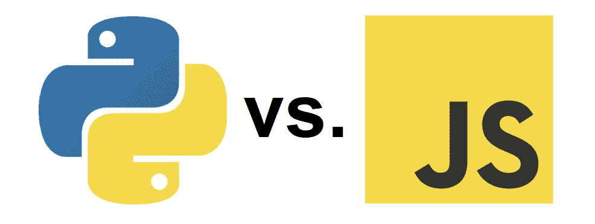

### 计算机编程语言

Python 由于其强大的功能和多功能性，已经成为世界上几乎所有科学应用的基本工具。它是一种通用编程语言，支持不同的编程范式。

它广泛用于科学和专业应用，包括数据科学、人工智能、机器学习、计算机科学教育、计算机视觉和图像处理、医学、生物学，甚至天文学。

它也用于 web 开发。这就是我们可以将它的应用程序与 JavaScript 的应用程序进行比较的地方。Python 用于后端开发，这是负责创建用户看不到的元素的 web 开发领域，例如应用程序的服务器端。

### Java Script 语言

虽然 Python 可以用于开发 web 应用程序的后端部分，但是 JavaScript 可以用于开发应用程序的后端和前端。

前端是用户看到并与之交互的应用程序的一部分。每当你看到一个网站或 web 应用程序或与之交互时，你都在“幕后”使用 JavaScript。

类似地，当你与移动应用程序交互时，你可能会使用 JavaScript，因为像[这样的框架可以让我们编写适应不同平台的应用程序。](https://reactnative.dev/)

JavaScript 在 web 开发中被广泛使用，因为它是一种多功能语言，为我们提供了开发 web 应用程序组件所需的工具。

### Python 和 JavaScript 应用程序之间的差异

简而言之，开发人员将 Python 用于一系列科学应用。他们将 JavaScript 用于 web 开发、面向用户的功能和服务器

## 🔸Python 与 JavaScript:语法

现在你知道了它们的用途，让我们看看它们是如何编写的，以及它们在语法上的区别。

我们将讨论它们主要元素的差异:

*   代码块
*   变量定义
*   变量命名约定
*   常数
*   数据类型和值
*   评论
*   内置数据结构
*   经营者
*   输入/输出
*   条件语句
*   For 循环和 While 循环
*   功能
*   面向对象编程

## Python 和 JavaScript 中的代码块

每种编程语言都有自己定义代码块的风格。让我们看看它们在 Python 和 JavaScript 中的区别:

### Python 如何定义代码块

Python 依靠缩进来定义代码块。当一系列连续的代码行在同一级别缩进时，它们被视为同一代码块的一部分。

我们用它来定义 Python 中的条件、函数、循环以及基本上每一个复合语句。

以下是一些例子:

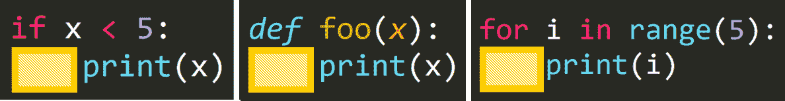

Use of indentation to define code blocks in Python

**💡提示:**我们马上就会看到 Python 和 JavaScript 中这些元素的具体区别。这时，请把注意力集中在缩进上。

### JavaScript 如何定义代码块

相比之下，在 JavaScript 中，我们使用花括号(`**{}**`)对属于同一个代码块的语句进行分组。

以下是一些例子:

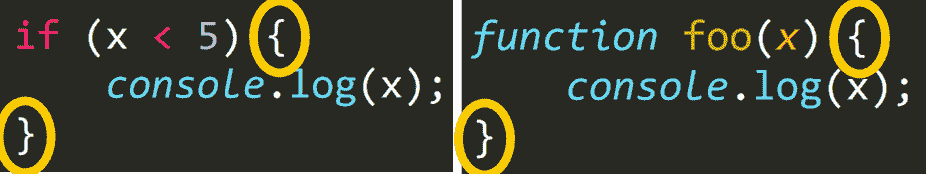

Use of curly braces to define code blocks in JavaScript 

## Python 和 JavaScript 中的变量定义

赋值语句是任何编程语言中最基本的语句之一。让我们看看如何在 Python 和 JavaScript 中定义变量。

### 如何在 Python 中定义变量

为了在 Python 中定义一个变量，我们写下变量的名称，后面跟着一个等号(`**=**`)和将分配给变量的值。

像这样:

```
<variable_name> = <value>
```

例如:

```
x = 5
```

### 如何在 JavaScript 中定义变量

JavaScript 中的语法非常相似，但我们只需要在变量名称前加上关键字`**var**` 或`**let**`，并以分号(`**;**`结束该行。

像这样:

```
var <variable_name> = <value>;
```

**💡提示:**使用`**var**`定义变量时，变量有函数作用域。

例如:

```
var x = 5;
```

我们也可以使用关键字`**let**`:

```
let <variable_name> = <value>;
```

例如:

```
let x = 5;
```

**💡提示:**在这种情况下，当我们使用`**let**`时，变量将具有块范围。它只能在定义它的代码块中被识别。

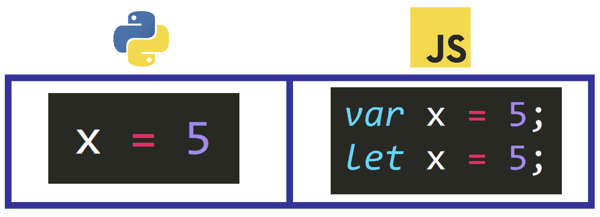

Variable definitions in Python and JavaScript

💡**提示:**在 JavaScript 中，一条语句的结尾用分号(`;`)来标记，但是在 Python 中，我们只需另起一行来标记语句的结尾。

## Python 和 JavaScript 中的变量命名约定

Python 和 JavaScript 遵循两种不同的变量命名约定。

### 如何在 Python 中命名变量

在 Python 中，我们应该使用`**snake_case**`命名风格。

根据 [Python 风格指南](https://www.python.org/dev/peps/pep-0008/#function-and-variable-names):

> 变量名遵循与函数名相同的约定。
> 
> 函数名应该是**小写，必要时用下划线**分隔单词以提高可读性。

因此，Python 中典型的变量名如下所示:

```
first_name
```

💡**提示:**风格指南还提到“`**mixedCase**`只允许在已经流行的风格中使用，以保持向后兼容性。”

### 如何在 JavaScript 中命名变量

相比之下，我们应该使用 JavaScript 中的`**lowerCamelCase**`命名风格。名称以小写字母开头，然后每个新单词都以大写字母开头。

根据 MDN Web Docs 的 [JavaScript 指南](https://developer.mozilla.org/en-US/docs/MDN/Guidelines/Code_guidelines/JavaScript#Variable_naming)文章:

> 对于变量名，使用小写字母，并在适当的地方使用简洁的、人类可读的语义名称。

因此，JavaScript 中典型的变量名应该是这样的:

```
firstName
```

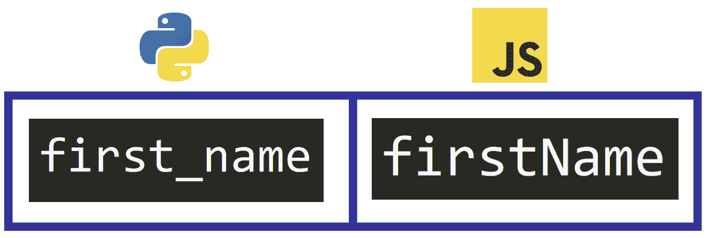

## Python 和 JavaScript 中的常量

太好了。现在你对变量有了更多的了解，所以让我们来谈谈常量。常量是在程序执行期间不能更改的值。

### 如何在 Python 中定义常数

在 Python 中，我们依靠命名约定来定义常量，因为在语言中没有严格的规则来防止常量值的改变。

根据 [Python 风格指南](https://www.python.org/dev/peps/pep-0008/#constants):

> 常量通常在模块级别定义，并且**全部用大写字母书写，下划线分隔单词**。

这是我们在 Python 中定义常量时应该使用的命名方式:

```
CONSTANT_NAME
```

例如:

```
TAX_RATE_PERCENTAGE = 32
```

💡提示:这对我们和其他开发者来说是一个红色的警告，表明这个值不应该在程序中被修改。但从技术上讲，该值仍然可以修改。

### 如何在 JavaScript 中定义常数

相比之下，在 JavaScript 中我们可以定义在程序中不能改变的常量，并且变量标识符不能被重新赋值。

但这并不意味着价值本身不能改变。

根据 [MDN Web Docs](https://developer.mozilla.org/en-US/docs/Web/JavaScript/Reference/Statements/const) 中的文章`**const**`:

> `const` 声明创建一个值的只读引用。它并不**而不是**意味着它保存的值是不可变的——只是变量标识符不能被重新赋值。例如，在内容是对象的情况下，这意味着对象的内容(例如，其属性)可以被改变。

为了在 JavaScript 中定义一个常量，我们在变量名前添加关键字`**const**` :

```
const TAX_RATE_PERCENTAGE = 32;
```

如果我们试图改变常量的值，我们会看到这个错误:

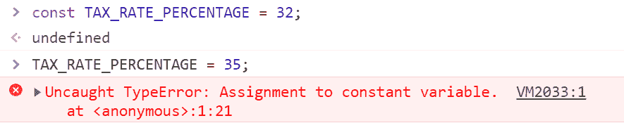

因此，该值不能更改。

**💡提示:**要运行和测试 JavaScript 代码的小代码片段，可以使用 Chrome 开发者工具中的[控制台。](https://developers.google.com/web/tools/chrome-devtools/console)

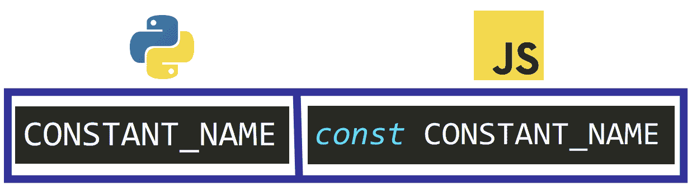

## Python 和 JavaScript 中的数据类型和值

让我们看看 Python 和 JavaScript 数据类型之间的主要区别。

### 数字数据类型

**Python** 有三种数值类型来帮助我们进行科学目的的精确计算。这些数字类型包括:`int`(整数)、`float`(浮点数)和`complex`。它们中的每一种都有自己的属性、特征和应用。

相比之下， **JavaScript** 只有两种数值类型:`**Number**`和`**BigInt**`。整数和浮点数都被认为是`**Number**`类型。

根据 MDN Web Docs 中的文章[编号](https://developer.mozilla.org/en-US/docs/Web/JavaScript/Reference/Global_Objects/Number):

> JavaScript 代码中类似于`37`的数字文字是浮点值，而不是整数。日常使用中没有单独的整数类型。(JavaScript 现在有了一个 [BigInt](https://developer.mozilla.org/en-US/docs/Web/JavaScript/Reference/Global_Objects/BigInt) 类型，但它并不是为了在日常使用中取代 Number 而设计的。`37`还是数字，不是 BigInt。)

### 无与空

在 **Python** 中，有一个叫做`**None**`的特殊值，我们通常用它来表示一个变量在程序中的特定点没有值。

**JavaScript** 中的等价值是`**null**`，它“代表故意没有任何对象值”([来源](https://developer.mozilla.org/en-US/docs/Web/JavaScript/Reference/Global_Objects/null))。

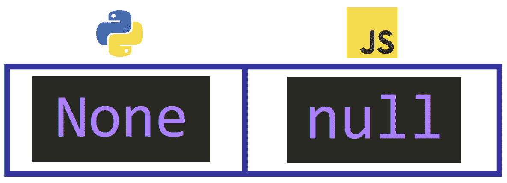

### `undefined`值

在 **JavaScript** 中，我们有一个特殊的值，当我们声明一个变量而没有赋值初始值的时候，这个值会被自动赋值。

这是一个例子:

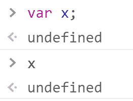

可以看到，变量`**x**`的值是`**undefined**`。

在 **Python** 中，你必须给变量赋一个初始值。没有初始值我们不能声明它。

**💡提示:**你可以在 Python 中把`**None**`赋值为变量的初始值，代表没有值。

### Python 和 JavaScript 中的原始数据类型

原始数据类型代表了我们在编程语言中可以使用的最基本的值。让我们比较一下这两种语言的原始数据类型:

*   **Python** 有四种原始数据类型:整数(`int`)、浮点(`float`)、布尔(`bool`)和字符串(`str`)。
*   **JavaScript** 有七种原始数据类型:`undefined` ****、**** 布尔、字符串、数字、`BigInt`、`Symbol`、`null` ( [源](https://developer.mozilla.org/en-US/docs/Glossary/Primitive))。

## 如何用 Python 和 JavaScript 写注释

注释对于编写干净易读的代码非常重要。让我们看看如何在 Python 和 JavaScript 中使用它们:

### 单行注释

*   在 **Python** 中，我们使用一个标签(`**#**`)来写评论。该符号后同一行中的所有字符都被视为注释的一部分。
*   在 **JavaScript** 中，我们写了两个斜线(`**//**`)来开始单行注释。

这是一个图形示例:

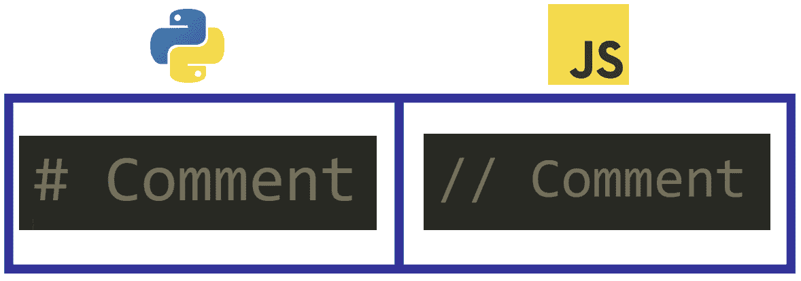

在 Python 中:

```
# Comment
```

在 JavaScript 中:

```
// Comment
```

### 多行注释

*   在 **Python** 中，为了编写多行注释，我们以一个标签开始每一行。
*   在 **JavaScript** 中，多行注释以`**/***`开始，以`***/**`结束。这些符号之间的所有字符都被视为注释的一部分。

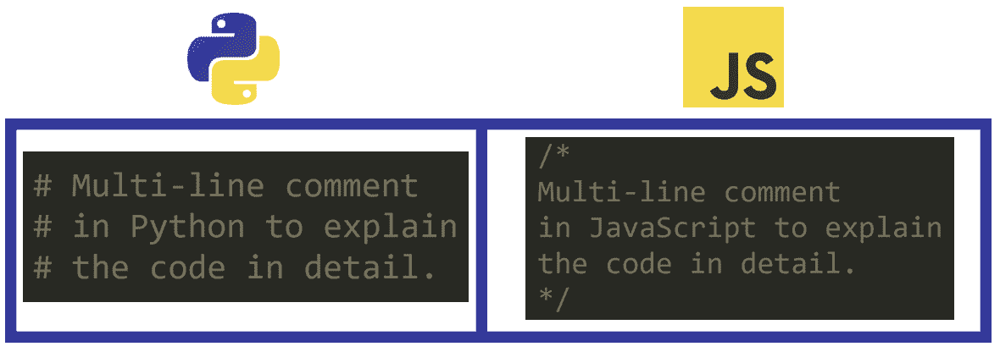

在 Python 中:

```
# Multi-line comment 
# in Python to explain
# the code in detail.
```

在 JavaScript 中:

```
/* 
Multi-line comment 
in JavaScript to explain 
the code in detail.
*/
```

## Python 和 JavaScript 中的内置数据结构

Python 和 JavaScript 中的内置数据结构也有关键区别。

### 元组

*   在 **Python** 中，我们有一个被称为**元组**的内置数据结构，它非常类似于一个列表，但却是不可变的。所以在程序执行过程中不能更改，所以用来存储不应该修改的数据。
*   在 **JavaScript** 中，没有具有这些特征的内置数据结构。尽管您可以用该语言的某些特性实现类似的数据结构。

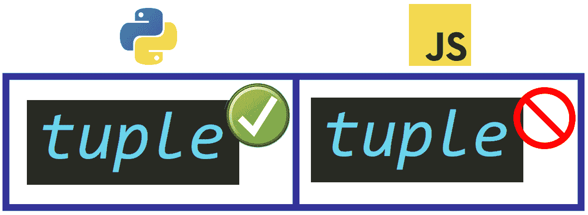

### 列表与数组

*   在 **Python 中，** **列表**用于在同一个数据结构中存储一个值序列。它们可以在程序中被修改、索引、切片和使用。
*   在 **JavaScript** 中，这种数据结构的等效版本被称为**数组**。

这是一个例子:

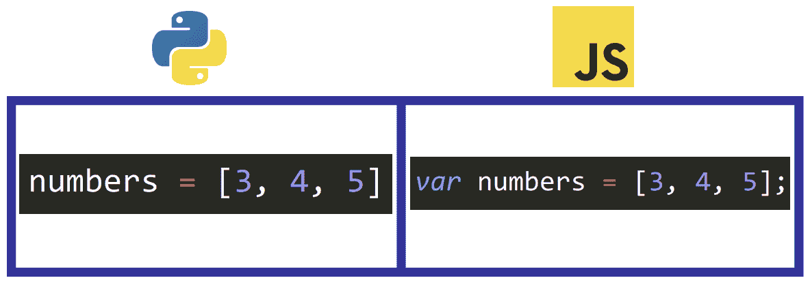

### 散列表

*   在 **Python** 中，有一个内置的数据结构叫做**字典**，帮助我们将某些值映射到其他值，并创建键值对。这相当于一个哈希表。
*   JavaScript 没有这种类型的内置数据结构，但是有一些方法可以用语言的某些元素来重现它的功能。

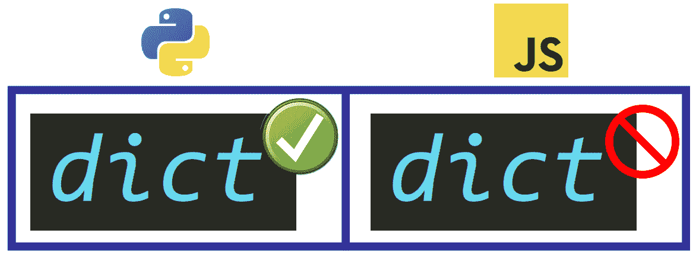

## Python 和 JavaScript 中的运算符

运算符对于用任何编程语言编写表达式都是必不可少的。让我们看看它们在 Python 和 JavaScript 中的主要区别。

### 楼层划分

虽然 Python 和 JavaScript 中的大多数算术运算符的工作方式完全相同，但 floor division 运算符略有不同。

*   在 **Python** 中，地板除法运算(也叫“整数除法”)用双斜杠(`**//**`)表示。
*   在 **JavaScript** 中，我们没有特定的发言权分割操作符。相反，我们调用`**Math.floor()**`方法将结果向下舍入到最接近的整数。

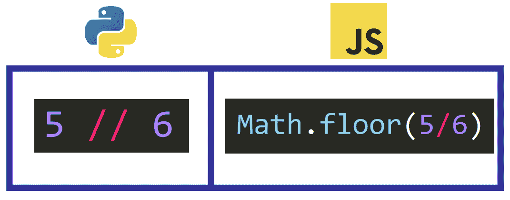

### 比较值和类型

在 **Python** 中，我们使用`**==**`操作符来比较两个值及其数据类型是否相等。

例如:

```
# Comparing Two Integers
>>> 0 == 0     
True
# Comparing Integer to String
>>> 0 == "0"
False
```

在 **JavaScript** 中，我们也有这个操作符，但是它的工作方式略有不同，因为它在实际执行比较之前将两个对象转换为相同的类型。

如果我们使用 JavaScript ( `0 == "0"`)检查上一个示例中“整数与字符串”比较的结果，结果是`**True**`而不是`**False**` ，因为在比较之前，这些值被转换为相同的数据类型:


在 JavaScript 中，为了检查值**和数据类型**是否相等，我们需要使用这个操作符`**===**`(一个三重等号)。

现在我们得到了我们期望的结果:

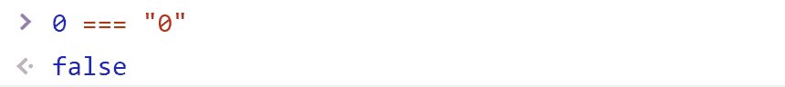

太棒了，对吧？

**💡提示:**Python 中的`**==**`操作符类似于 JavaScript 中的`**===**`操作符。

### 逻辑运算符

*   在 **Python** 中，三个逻辑运算符分别是:`**and**`、`**or**`、`**not**`。
*   在 **JavaScript** 中，这些操作符分别是:`**&&**`、`**||**`、`**!**`、**、**。

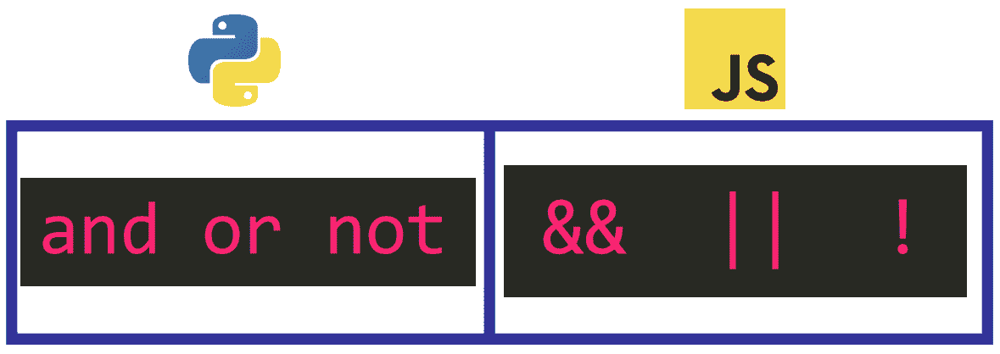

### 类型运算符

*   在 **Python** 中，我们使用`**type()**`函数来检查对象的类型。
*   在 **JavaScript** 中，我们使用`**typeof**`操作符。

这是它们语法的图形描述:

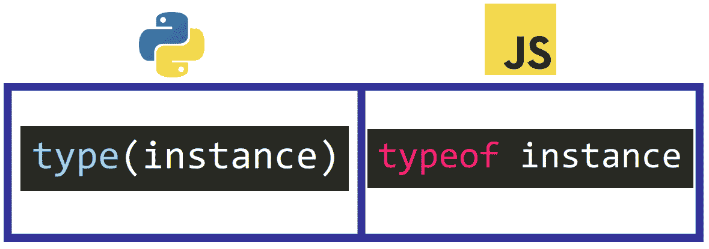

## Python 和 JavaScript 中的输入和输出

要求用户输入和向用户显示值是非常常见的操作。让我们看看如何用 Python 和 JavaScript 实现这一点:

### 投入

*   在 **Python** 中，我们使用`**input()**`函数请求用户输入。我们将消息写在括号内。
*   在 **JavaScript** 中，一种替代方法(如果您在浏览器上运行代码)是显示一个带有`**window.prompt(message)**` 的小提示，并将结果赋给一个变量。

这两种方法的主要区别在于，在 Python 中，用户将被提示在控制台中输入一个值，而在 JavaScript 中，浏览器上将显示一个小提示，并要求用户输入一个值。

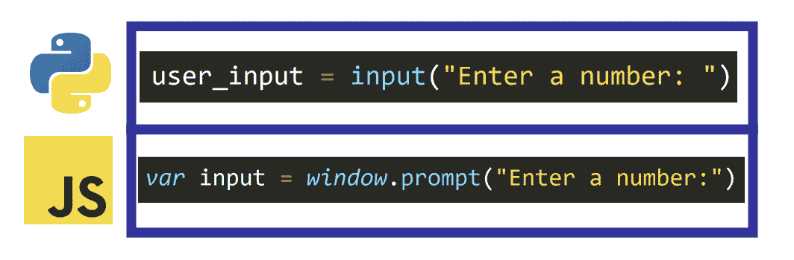

💡**提示:**您将在 Python 控制台中看到输入一个值:

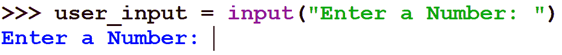

在 JavaScript 中，如果您打开 Chrome 开发人员工具并在控制台中输入这行代码:

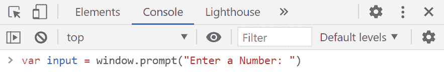

将显示以下提示:


Prompt displayed when window.prompt() is called

### 输出

*   在 **Python** 中，我们用`**print()**`函数将一个值打印到控制台，在括号内传递该值。
*   在 **JavaScript** 中，我们使用`**console.log()**`将一个值打印到控制台，并在括号内传递该值。

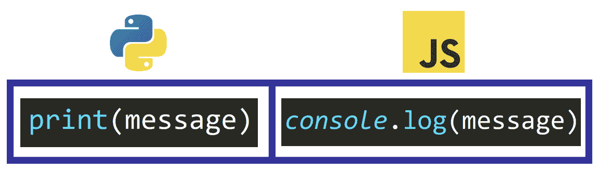

💡**提示:**如果您正在使用浏览器，您还可以调用`**alert()**`来显示一个小提示，括号内是传递的消息(或值)。

## Python 和 JavaScript 中的条件语句

有了条件，我们可以根据特定条件是`**True**`还是`**False**`来选择程序中发生的事情。让我们看看它们在 Python 和 JavaScript 中的区别。

### `if`声明

*   在 **Python** 中，我们依靠缩进来指示哪些代码行属于条件。
*   在 **JavaScript** 中，我们必须用括号将条件括起来，用花括号将代码括起来。代码也应该缩进。

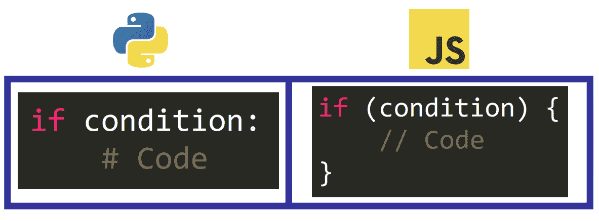

Conditional in Python (left) and JavaScript (right)

### `if/else`声明

两种语言中的 else 子句非常相似。唯一的区别是:

*   在 **Python** 、**中，我们在`**else**`关键字后面写了一个冒号(`**:**`)**
*   在 **JavaScript** ，中，我们将属于这个子句的代码用花括号(`**{}**`)括起来。

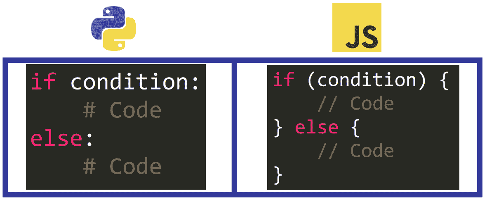

### 多重条件

要编写多个条件:

*   在 **Python** 中，我们编写关键字`**elif**`后跟条件。在条件之后，我们写一个冒号(`:`)，代码缩进到下一行。
*   在 **JavaScript** 中，我们编写关键字`**else if**` 后跟条件(用括号括起来)。在条件之后，我们写花括号，代码缩进在花括号内。

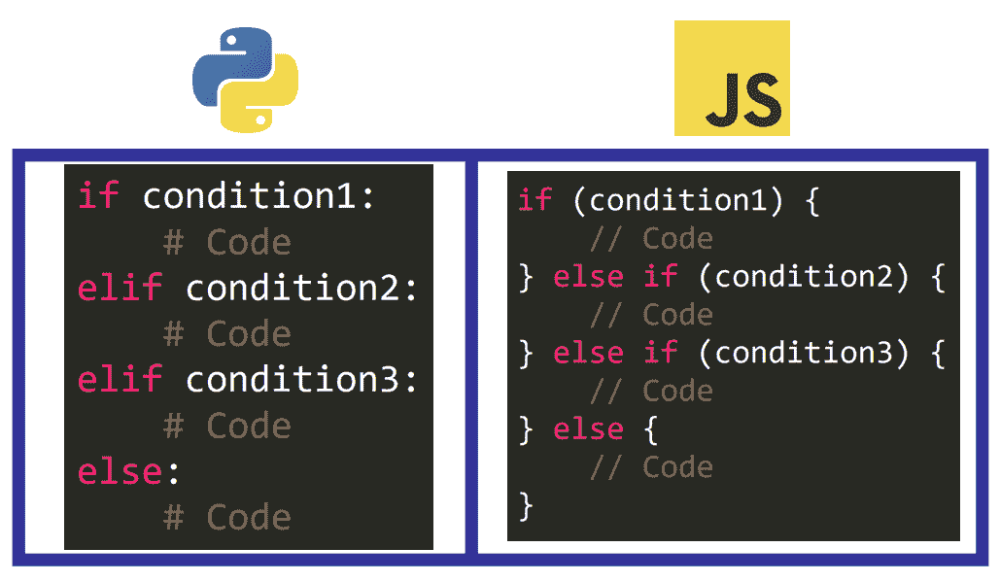

Conditional in Python (left) and JavaScript (right)

### JavaScript 中的切换

*   在 **JavaScript** 中，我们有一个额外的控制结构，可以用来根据表达式的值选择发生什么。这种说法叫做`**switch**`。
*   **Python** 没有这种类型的内置控制结构。

这是该语句的一般语法:

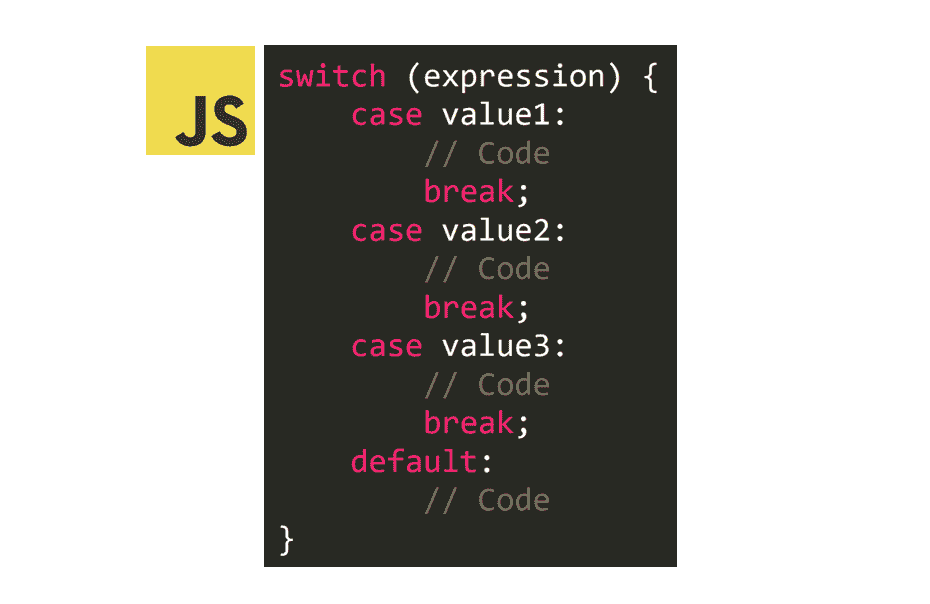

Switch statement in JavaScript

在 JavaScript 中:

```
switch (expression) {
    case value1:
        // Code
        break;
    case value2:
        // Code
        break;
    case value3:
        // Code
        break;
    default:
        // Code
}
```

**💡提示:**我们可以根据需要添加任意多的案例，表达式可以是一个变量。

## Python 和 JavaScript 中的 For 循环和 While 循环

现在让我们看看如何在 Python 和 JavaScript 中定义不同类型的循环以及它们的主要区别。

### 对于循环

Python 中定义 for 循环的语法比 JavaScript 中的语法相对简单。

*   在 **Python** 中，我们编写关键字`for`，后跟循环变量的名称、关键字`in`，以及对指定必要参数的`range()`函数的调用。然后，我们写一个冒号(`:`)，后跟缩进的循环体。
*   在 **JavaScript** 中，我们必须显式指定几个值。我们从关键字`for`开始，后跟括号。在这些括号中，我们定义了循环变量及其初始值，停止循环的条件必须是`False`，以及变量将如何在每次迭代中更新。然后，我们写花括号来创建一个代码块，在花括号内我们写缩进的循环体。

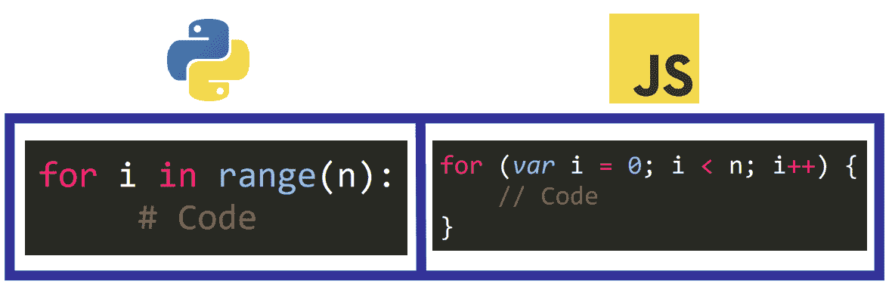

For Loop in Python (left) and JavaScript (right)

### 迭代可迭代对象

我们可以在 Python 和 JavaScript 中使用 for 循环来迭代 iterable 的元素。

*   在 **Python** 中，我们编写关键字`for`，后跟循环变量、`in`关键字和 iterable。然后，我们写一个冒号(`:`)和循环体(缩进)。
*   在 **JavaScript** 中，我们可以使用一个`**for .. of**`循环。我们编写关键字`for`，后跟括号，在括号内，我们编写关键字`var`或`let`，后跟循环变量、关键字`of`和 iterable。我们用花括号把循环体括起来，然后缩进。


For Loop in Python (left) and JavaScript (right)

在 **JavaScript** 中，我们也有`**for .. in**`循环来迭代对象的属性。

根据 [MDN Web 文档](https://developer.mozilla.org/en-US/docs/Web/JavaScript/Reference/Statements/for...in):

> **`for...in`语句**遍历一个对象的所有以字符串为键的可枚举属性(忽略以符号为键的属性)，包括继承的可枚举属性。

这是一个例子:

```
const object = { a: 1, b: 2, c: 3 };

for (const property in object) {
  console.log(property, object[property]);
}
```

当我们在 Chrome Developer Tools 的控制台中运行这段代码时，输出是:

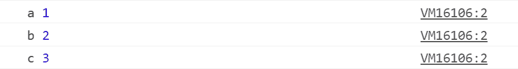

### While 循环

而 Python 和 JavaScript 中的循环非常相似。

*   在 **Python** 中，我们编写关键字`while`，后跟条件、冒号(`:`)，并在新的一行中编写循环体(缩进)。
*   在 **JavaScript** 中，语法非常相似。不同之处在于，我们必须用括号将条件括起来，用花括号将循环体括起来。

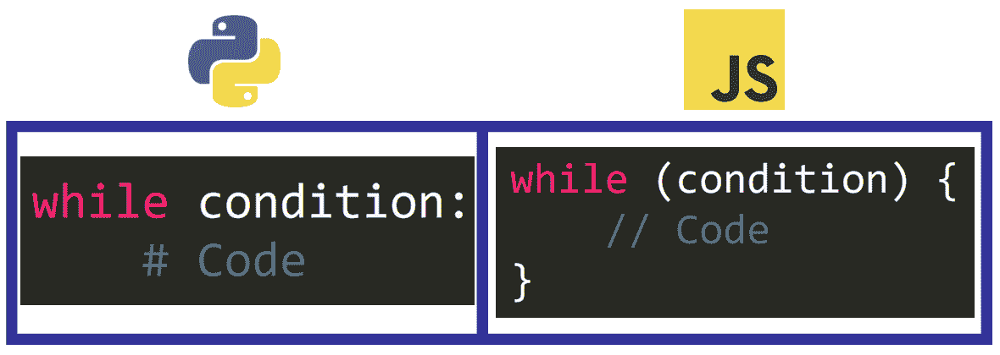

While Loop in Python (left) and JavaScript (right)

### JavaScript 中的循环

在 **JavaScript** 中，我们还有一种 Python 中不存在的循环类型。

这种类型的循环被称为`**do..while**`循环，因为它至少做一次，并且在条件为`True`时继续运行。

这是基本语法:

```
do {
    // Code
} while (condition);
```

💡**提示:**这种类型的循环保证代码至少执行一次。

这在我们要求用户输入时特别有用，因为用户将被提示输入。如果输入有效，我们可以继续程序。但是如果它无效，我们可以提示用户再次输入值，直到它有效。

## Python 和 JavaScript 中的函数

函数对于编写简洁、可维护和可读的程序非常重要。Python 和 JavaScript 的语法非常相似，但是让我们分析一下它们的主要区别:

*   在 **Python** 中，我们编写关键字`**def**`，后跟函数名，括号内是参数列表。在这个列表之后，我们写一个冒号(`:`)和函数体(缩进)。
*   在 **JavaScript** 中，唯一的区别是我们使用`**function**`关键字定义了一个函数，并用花括号将函数体括起来。

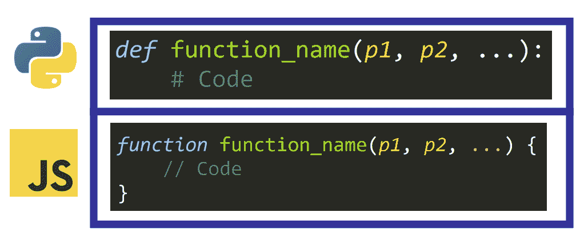

Function in Python (top) and JavaScript (bottom)

此外，Python 和 JavaScript 函数之间还有一个非常重要的区别:

### 函数参数的数量

*   在 **Python** 中，传递给函数调用的参数数量必须与函数定义中定义的参数数量相匹配(除非在函数定义中已经为它们分配了默认值)。如果不是这样，将会发生异常。

这是一个例子:

```
>>> def foo(x, y):
	print(x, y)

>>> foo(3, 4, 5)
Traceback (most recent call last):
  File "<pyshell#3>", line 1, in <module>
    foo(3, 4, 5)
TypeError: foo() takes 2 positional arguments but 3 were given
```

*   在 **JavaScript** 中，这是不必要的，因为参数是可选的。您可以使用比函数定义中定义的参数更少或更多的参数来调用函数。缺省情况下，缺少的参数被赋予值`**undefined**`，多余的参数可以通过`**arguments**`对象访问。

这是 JavaScript 中的一个例子:

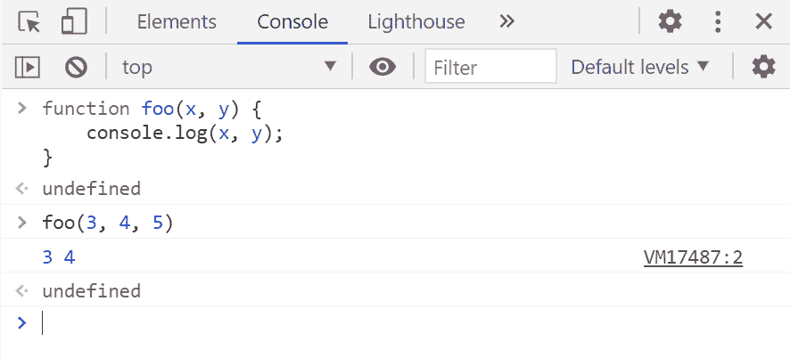

注意这个函数是如何用三个参数调用的，但是在函数定义的参数列表中只包含了两个参数。

💡**提示:**要获得传递给函数的参数个数，可以在函数内使用 **`arguments.length`** 。

## Python 和 JavaScript 中的面向对象编程

Python 和 JavaScript 都支持面向对象编程，所以让我们看看如何创建和使用这种编程范式的主要元素。

### 班级

在 Python 和 JavaScript 中，类定义的第一行非常相似。我们写下关键字`**class**`，后跟类名。

唯一的区别是:

*   在 **Python** 中，在类名后面，我们写一个冒号(`**:**`)
*   在 **JavaScript** 中，我们用花括号(`**{}**`)将类的内容括起来

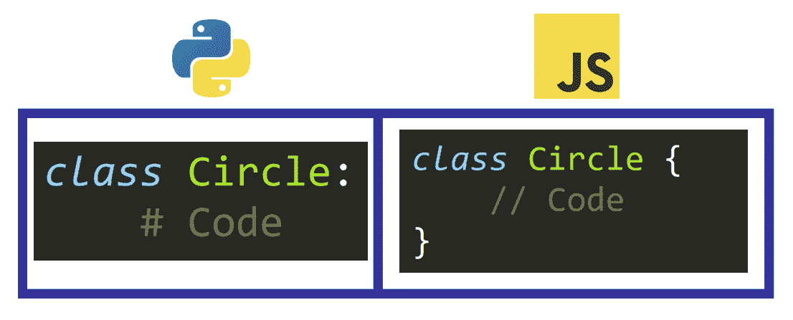

Class definition in Python (left) and JavaScript (right)

**💡提示:**在 Python 和 JavaScript 中，类名应该以大写字母开头，每个单词也应该以大写字母开头。

### 构造函数和属性

构造函数是一种特殊的方法，在创建类的新实例(新对象)时调用。它的主要目的是初始化实例的属性。

*   在 **Python** 中，初始化新实例的构造函数被称为`**init**` (前后有两个下划线)。当创建类的实例以初始化其属性时，会自动调用此方法。它的参数列表定义了创建实例时必须传递的值。这个列表从第一个参数`**self**`开始。
*   在 **JavaScript** 中，构造函数方法被称为`**constructor**`，它也有一个参数列表。

**💡提示:**在 Python 中，我们使用`**self**`来指代实例，而在 JavaScript 中我们使用`**this**`。

为了给 **Python** 中的属性赋值，我们使用以下语法:

```
self.attribute = value
```

相比之下，我们在 **JavaScript** 中使用这个语法:

```
this.attribute = value;
```

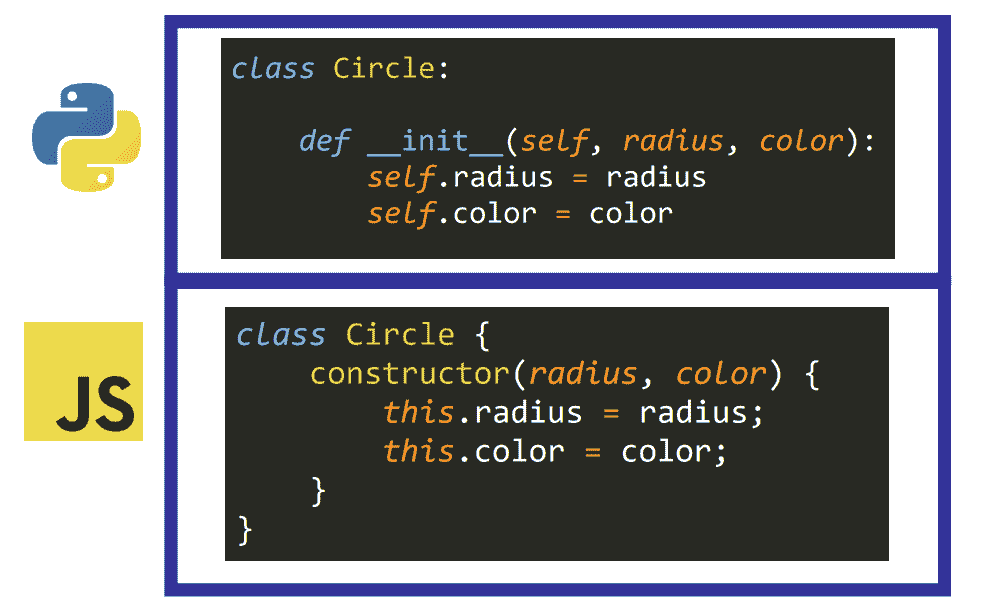

Class Example in Python (left) and JavaScript (right)

## Python 和 JavaScript 中的方法

*   在 **Python** 中，我们用`**def**`关键字定义方法，后跟它们的名称和圆括号内的参数列表。这个参数列表以`**self**`参数开始，引用调用该方法的实例。在这个列表之后，我们写一个冒号(`**:**`)和缩进的方法体。

这是一个例子:

```
class Circle:

	def __init__(self, radius, color):
		self.radius = radius
		self.color = color

	def calc_diameter(self):
		return self.radius * 2
```

Example: Method in a Python Class

*   在 **JavaScript** 中，方法是通过写它们的名字，后跟参数列表和花括号来定义的。在花括号内，我们写方法的主体。

```
class Circle {

    constructor(radius, color) {
        this.radius = radius;
        this.color = color;
    }

    calcDiameter() {
        return this.radius * 2;
    }
}
```

Example: Method in a JavaScript Class

### 例子

要创建类的实例:

*   在 **Python** 中，我们写下类名并传递括号内的参数。

```
my_circle = Circle(5, "Red")
```

*   在 **JavaScript** 中，我们需要在类名前添加`**new**`关键字。

```
my_circle = new Circle(5, "Red");
```

## 🔹总结

Python 和 JavaScript 是非常强大的语言，具有不同的实际应用。

Python 可以用于 web 开发和广泛的应用，包括科学目的。JavaScript 主要用于 web 开发(前端和后端)和移动 app 开发。

它们有重要的区别，但是它们都有相同的基本元素，我们需要这些元素来编写强大的程序。

我希望你喜欢这篇文章，并发现它很有帮助。现在你知道 Python 和 JavaScript 的主要区别了。

⭐ [**订阅我的 YouTube 频道**](https://www.youtube.com/channel/UCng0h8WiHLmT57JJ8At4LfQ) ，关注我的 [**Twitter**](https://twitter.com/EstefaniaCassN) 寻找更多的编码教程和技巧。