# 如何使用 Nodemailer 从 Node.js 服务器发送电子邮件

> 原文：<https://www.freecodecamp.org/news/use-nodemailer-to-send-emails-from-your-node-js-server/>

[Nodemailer](https://nodemailer.com/about/) 是一个 Node.js 模块，可以让你轻松的从你的服务器发送邮件。无论您是想与用户交流，还是想在出现问题时通知自己，其中一个方法就是通过邮件。

有许多文章解释了如何以准系统的形式使用 Nodemailer，但本文不是其中之一。在这里，我将展示使用 Nodemailer 和 Gmail 从 Node.js 后端发送电子邮件的最常见实践。

## 如何开始使用 Nodemailer

首先，我们需要使用 Express 设置 Node.js 样板文件。要确保安装了节点和 npm，您可以运行以下命令:

```
node -v 
npm -v
```

如果这两个命令都显示了一个版本，那么就可以使用了。否则，安装缺少的部分。

为您的项目创建一个目录。我们将使用**节点邮件项目**。

```
mkdir nodemailerProject
```

进入新创建的目录并运行

```
npm init
```

这将用一个**package . JSON**文件初始化我们的项目。

接下来，我们需要使用以下命令安装 Express:

```
npm install express
```

根据您指向哪个文件作为入口点(默认为 index.js)，打开它并粘贴以下代码:

```
const express = require('express')
const app = express()
const port = 3000

app.listen(port, () => {
  console.log(`nodemailerProject is listening at http://localhost:${port}`)
})
```

index.js

以上是使用 Express 启动一个简单服务器所需的内容。通过运行以下命令，您可以看到它工作正常:

```
node index.js
```

### 如何安装 Nodemailer

使用以下命令安装 nodemailer:

```
npm install nodemailer
```

Nodemailer 的 API 非常简单，需要我们做以下事情:

1.  创建一个**传输器**对象
2.  创建一个**邮件选项**对象
3.  使用 **Transporter.sendMail** 方法

要创建 transporter 对象，我们需要执行以下操作:

```
let transporter = nodemailer.createTransport({
      service: 'gmail',
      auth: {
        type: 'OAuth2',
        user: process.env.MAIL_USERNAME,
        pass: process.env.MAIL_PASSWORD,
        clientId: process.env.OAUTH_CLIENTID,
        clientSecret: process.env.OAUTH_CLIENT_SECRET,
        refreshToken: process.env.OAUTH_REFRESH_TOKEN
      }
    });
```

> ✋请注意，除了用户密钥和通行密钥(这是您自己的 gmail 帐户凭证)之外，其他三个密钥需要在设置 OAuth 后检索。

正如我们在本文开头所述，我们将使用 Gmail 来满足我们的邮件发送需求。正如你可能已经猜到的那样，Gmail 对用户帐户发送的邮件有很高的安全性。

我们有很多方法可以克服这个障碍(有些方法比其他方法更好)，我们将选择需要我们在**谷歌云平台**中建立一个项目的方法。我们需要这样做，以便获得由 Gmail 启用的 OAuth 安全性的凭证。

> 如果你想了解更多关于使用 Gmail 和 nodemailer 的复杂性，请点击[这里](https://nodemailer.com/usage/using-gmail/)。

接下来的步骤将需要一些配置而不是编码，所以做好准备。


Photo by [Daniel McCullough](https://unsplash.com/@d_mccullough?utm_source=ghost&utm_medium=referral&utm_campaign=api-credit) / [Unsplash](https://unsplash.com/?utm_source=ghost&utm_medium=referral&utm_campaign=api-credit)

## 谷歌云平台配置

如果你没有[谷歌云平台](https://console.cloud.google.com/home)账号，一定要先设置一个。设置好之后，点击左上角的下拉菜单创建一个新项目。


选择新项目选项:

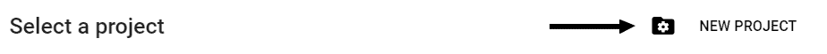

在下一个窗口中，我们必须为我们的项目命名。选择你喜欢的，但我们将继续没有**节点邮件项目**的名称。对于位置属性，您可以将其保留为无组织。

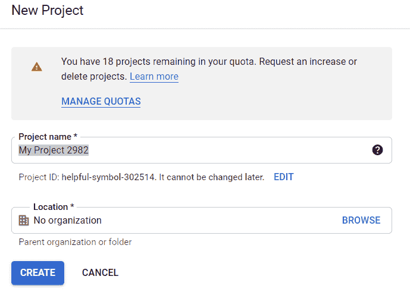

项目的设置可能需要几秒钟的时间，但之后您将能够看到以下屏幕:

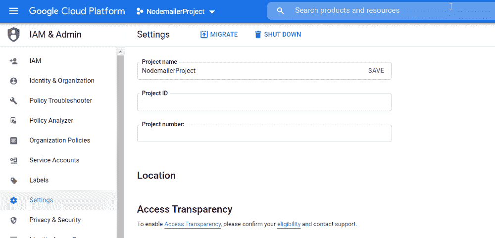

点击左上角的三条虚线打开导航菜单，选择**API 和服务:**

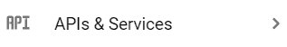

为了能够使用 Nodemailer 和 Gmail，我们必须使用 OAuth2。如果您不熟悉 OAuth，它是一种身份验证协议。因为没有必要，我不会在这里深入讨论细节，但是如果你想了解更多，请点击这里。

首先，我们必须配置 OAuth 同意屏幕:

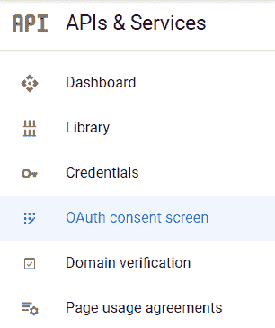

如果您不是 G-Suite 成员，唯一可用的选项将是外部用户类型。

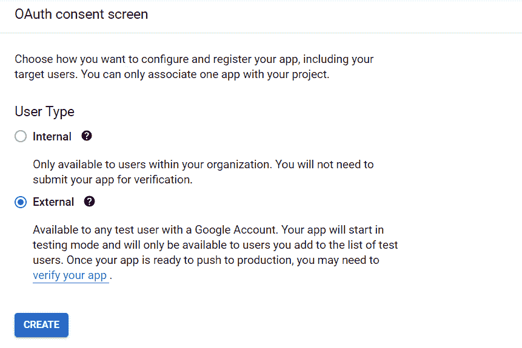

单击 create 后，下一个屏幕要求我们填写应用程序的信息(我们的服务器):

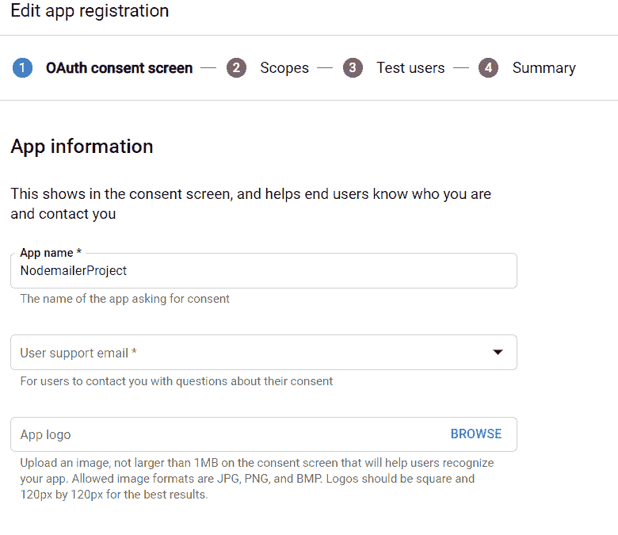

在用户支持电子邮件字段和开发人员联系信息字段中填写您的电子邮件。单击保存并继续会将我们带到此配置的范围阶段。跳过这个阶段，因为它与我们无关，直接进入测试用户阶段。

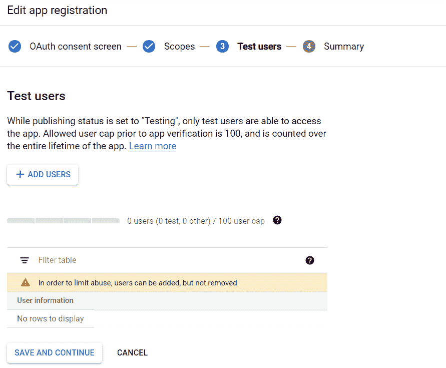

在这里，将您自己添加为用户，然后单击保存并继续。

## 如何配置 OAuth 设置

在此阶段，我们将创建 OAuth 凭据，用于 Nodemailer。转到 OAuth 同意屏幕上方的凭证选项卡。单击带有文本**创建凭证**的加号(➕)并选择 OAuth 客户端 ID。

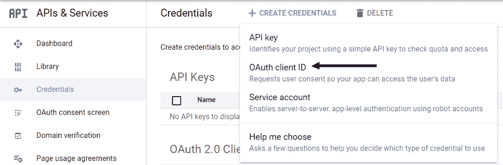

在应用类型下拉菜单中，选择 **Web 应用**:

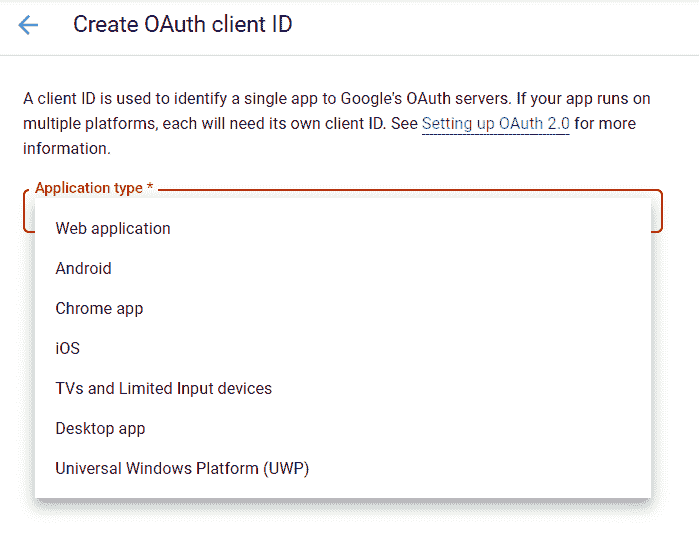

在**授权重定向 URIs** 部分，确保添加 oauth 2 Playground([https://developers.google.com/oauthplayground](https://developers.google.com/oauthplayground/))，因为我们将使用它来获得本文开头提到的密钥之一。

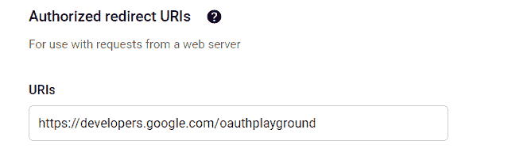

单击创建后，您将看到您的客户端 id 和客户端密码。把这些留给自己，永远不要以任何方式、形状或形式暴露出来。


Photo by [Power Lai](https://unsplash.com/@welipower?utm_source=ghost&utm_medium=referral&utm_campaign=api-credit) / [Unsplash](https://unsplash.com/?utm_source=ghost&utm_medium=referral&utm_campaign=api-credit)

### 获取 OAuth 刷新令牌

为了获得刷新令牌，我们将在 Nodemailer 的 transporter 对象中使用它，我们需要前往 OAuth2 游乐场。我们在早期批准了这种 URI 用于这一特定目的。

1.单击右侧的齿轮图标(这是 OAuth2 配置),并选中复选框以使用您自己的 OAuth2 凭据:

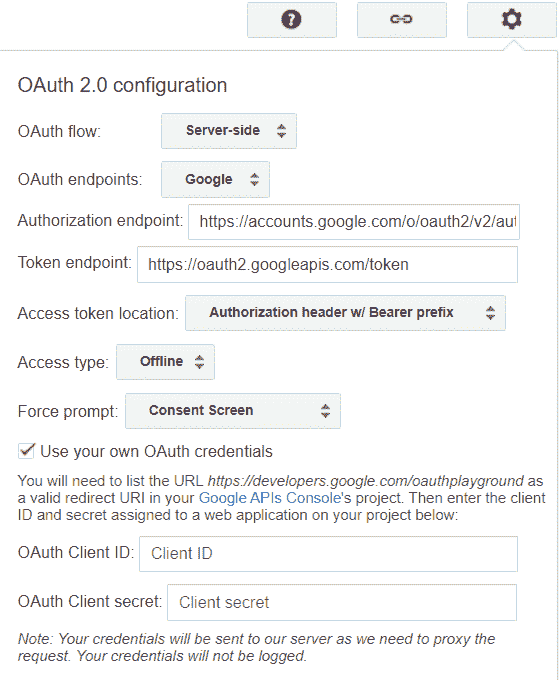

2.看向网站的左侧，你会看到一个服务列表。向下滚动，直到看到 Gmail API v1。

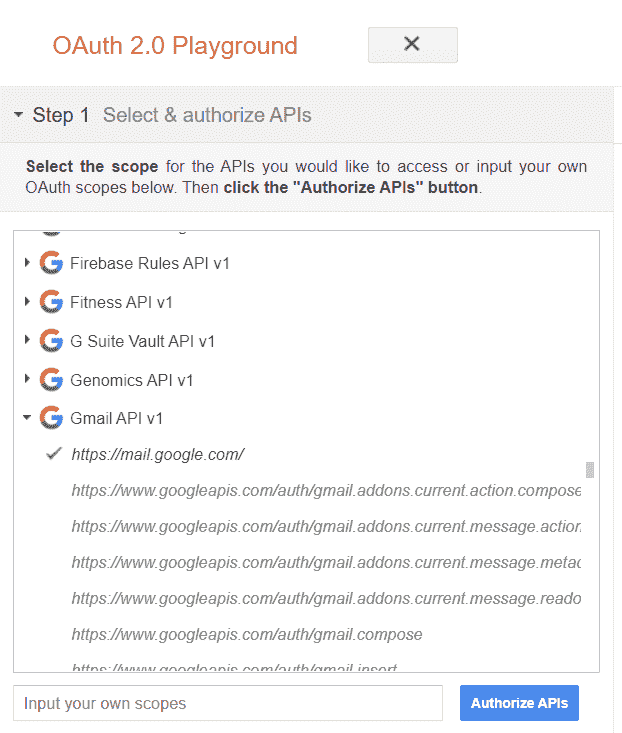

3.点击**授权 API**

您将看到一个登录任何 Gmail 帐户的屏幕。选择您列为测试用户的用户。

4.下一个屏幕会让你知道 Google 仍然没有验证这个应用程序，但是这是可以的，因为我们还没有提交它进行验证。单击继续。

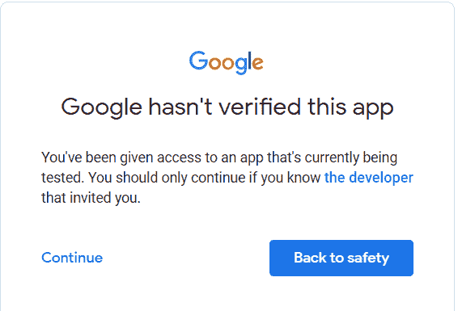

5.在下一个屏幕中，您将被要求授予您的项目与您的 gmail 帐户交互的权限。这样做。

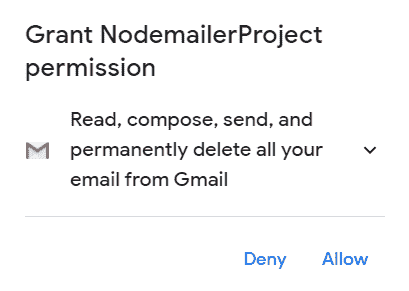

6.完成后，您将被重定向回 OAuth Playground，您可以看到左侧菜单中有一个授权代码。点击标有**的蓝色按钮，用授权码兑换令牌**。

现在将填充刷新令牌和访问令牌的字段。

## 回到服务器

完成所有这些配置后，我们可以返回到我们的应用程序，将所有数据输入到 transporter 创建中。为了保持所有凭证的私密性，您可以使用 [dotenv 包](https://www.npmjs.com/package/dotenv)。不要忘记添加。您将创建到. gitignore 的 env 文件。

所以，现在我们有了这个:

```
let transporter = nodemailer.createTransport({
      service: 'gmail',
      auth: {
        type: 'OAuth2',
        user: process.env.MAIL_USERNAME,
        pass: process.env.MAIL_PASSWORD,
        clientId: process.env.OAUTH_CLIENTID,
        clientSecret: process.env.OAUTH_CLIENT_SECRET,
        refreshToken: process.env.OAUTH_REFRESH_TOKEN
      }
    });
```

接下来，我们将创建 mailOptions 对象，它保存了将电子邮件发送到哪里以及包含哪些数据的详细信息。

```
let mailOptions = {
      from: tomerpacific@gmail.com,
      to: tomerpacific@gmail.com,
      subject: 'Nodemailer Project',
      text: 'Hi from your nodemailer project'
    };
```

这个对象可以有更多的字段，甚至可以有多个接收者，但是我们不会在这里深入讨论。

最后，我们将使用 sendMail 方法:

```
transporter.sendMail(mailOptions, function(err, data) {
      if (err) {
        console.log("Error " + err);
      } else {
        console.log("Email sent successfully");
      }
    });
```

运行您的应用程序，您将看到您的收件箱中有一封新邮件。

本文的灵感来自我创建的一个使用 Nodemailer 的项目。如果你想检查一下，去[这里](https://github.com/TomerPacific/ProjectChecker)。