# 如何用 Flutter 和 Dart 构建聊天 App UI

> 原文：<https://www.freecodecamp.org/news/build-a-chat-app-ui-with-flutter/>

如今，许多人通过智能手机使用聊天应用程序与团队成员、朋友和家人交流。这使得这些消息应用程序成为重要的通信媒介。

对于具有最先进特征的直观和强大的用户界面也有很高的需求。用户界面(或 UI)是整个用户体验中最有影响力的方面，所以做对很重要。

在跨平台移动应用程序开发方面，Flutter app 开发已经风靡全球。您可以使用它来创建像素级完美的 ui，现在许多开发公司都在使用 Flutter。

在本教程中，我将向您介绍两者的结合:我们将完全基于 Flutter/Dart 编码环境构建一个聊天应用程序 UI。除了学习 Flutter 中令人敬畏的聊天 UI 实现，我们还将学习它的编码工作流和结构是如何工作的。

所以，让我们开始吧！

## 如何创建一个新的颤振项目

首先，我们需要创建一个新的 Flutter 项目。为此，请确保您已经安装了 Flutter SDK 和其他与 Flutter 应用程序开发相关的需求。

如果一切都设置妥当，那么为了创建一个项目，我们只需在所需的本地目录中运行以下命令:

```
flutter create ChatApp 
```

设置好项目后，我们可以在项目目录中导航，并在终端中执行以下命令，以便在可用的仿真器或实际设备中运行项目:

```
flutter run 
```

成功构建后，我们将在模拟器屏幕中获得以下结果:

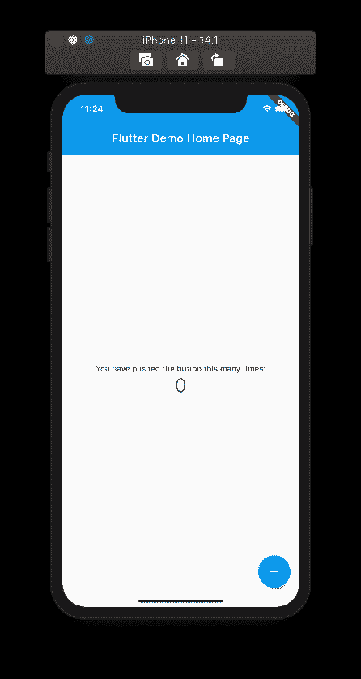

## **如何创建主屏幕 UI**

现在，我们将开始为我们的聊天应用程序构建 UI。主屏幕将包含两个部分:

*   对话屏幕，我们将把它实现为一个单独的页面，以及
*   底部导航栏。

首先，我们需要对 **main.dart** 文件中的默认样板代码进行一些简单的配置。我们将删除一些默认代码，并添加指向空的`Container`的简单的`MaterialApp`作为主页:

```
import 'package:flutter/material.dart';

void main() {
  runApp(MyApp());
}

class MyApp extends StatelessWidget {
  @override
  Widget build(BuildContext context) {
    return MaterialApp(
      title: 'Flutter Demo',
      theme: ThemeData(
        primarySwatch: Colors.blue,
      ),
      debugShowCheckedModeBanner: false,
      home: Container(),
    );
  }
} 
```

现在，我们将调用`HomePage`屏幕小部件来代替空容器小部件。但是首先，我们需要实现屏幕。

### 如何构建主屏幕

在**里面。/lib** 目录下我们的根项目文件夹，我们需要创建一个名为**的文件夹。/屏幕**。该文件夹将保存不同屏幕的所有 dart 文件。

内部**。/lib/screens/** 目录下，我们需要创建一个名为 **homePage.dart** 的文件。在**主页. dart** 文件中，我们需要添加基本的无状态小部件代码，如下面的代码片段所示:

```
import 'package:flutter/material.dart';

class HomePage extends StatelessWidget{
  @override
  Widget build(BuildContext context) {
    return Scaffold(
      body: Container(
        child: Center(child: Text("Chat")),
      ),

    );
  }
} 
```

现在，我们需要调用 **main.dart** 文件中的`HomePage`类小部件，如下面的代码片段所示:

```
class MyApp extends StatelessWidget {
  @override
  Widget build(BuildContext context) {
    return MaterialApp(
      title: 'Flutter Demo',
      theme: ThemeData(
        primarySwatch: Colors.blue,
      ),
      debugShowCheckedModeBanner: false,
      home: HomePage(),
    );
  }
} 
```

现在我们将得到如下模拟器截图所示的结果:

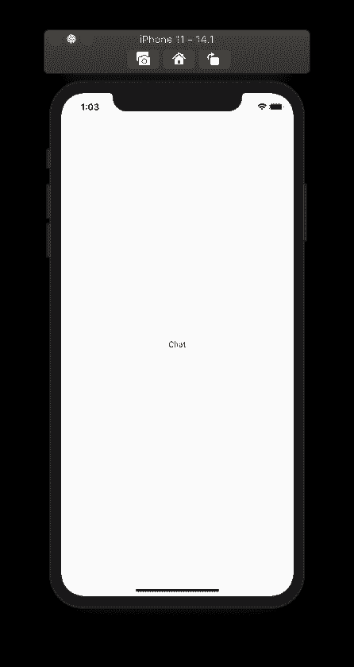

### 如何构建底部的导航条

现在，我们将在`HomePage`屏幕上放置一个底部导航菜单。为此，我们将在由`Scaffold`小部件提供的`bottomNavigationBar`参数中使用`BottomNavigationBar`小部件。

下面是整体代码实现:

```
return Scaffold(
      body: Container(
        child: Center(child: Text("Chat")),
      ),
      bottomNavigationBar: BottomNavigationBar(
        selectedItemColor: Colors.red,
        unselectedItemColor: Colors.grey.shade600,
        selectedLabelStyle: TextStyle(fontWeight: FontWeight.w600),
        unselectedLabelStyle: TextStyle(fontWeight: FontWeight.w600),
        type: BottomNavigationBarType.fixed,
        items: [
          BottomNavigationBarItem(
            icon: Icon(Icons.message),
            title: Text("Chats"),
          ),
          BottomNavigationBarItem(
            icon: Icon(Icons.group_work),
            title: Text("Channels"),
          ),
          BottomNavigationBarItem(
            icon: Icon(Icons.account_box),
            title: Text("Profile"),
          ),
        ],
      ),
    ); 
```

这里，我们用各种样式参数配置了`BottomNavigationBar`,并将导航菜单项保存在`items`参数中。对于`body`参数，我们刚刚使用了一个简单的`Container`和一个`Text`小部件。

现在我们将得到底部的导航条，如下图所示:

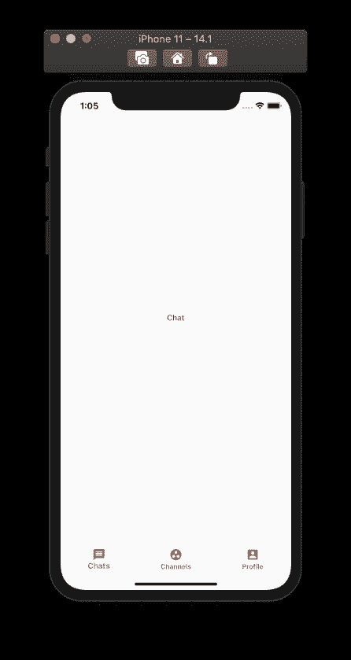

现在底部导航已经完成，我们可以继续实现底部导航栏上方的对话列表部分。

## **如何建立对话列表屏幕**

这里，我们将创建 conversation list 部分，它将包含一个标题部分、一个搜索栏和一个 conversation list 视图。

第一，在**里面。/lib/screens** 文件夹，我们需要创建一个名为 **chatPage.dart** 的新 dart 文件。然后，在其中添加一个简单的有状态小部件类模板，如下面的代码片段所示:

```
import 'package:flutter/material.dart';

class ChatPage extends StatefulWidget {
  @override
  _ChatPageState createState() => _ChatPageState();
}

class _ChatPageState extends State<ChatPage> {
  @override
  Widget build(BuildContext context) {
    return Scaffold(
      body: SingleChildScrollView(
        child: Center(child: Text("Chat")),
      ),
    );
  }
} 
```

现在，我们需要调用`chatPage`类小部件来代替**主页中的`Container`小部件。dart** 如下面的代码片段所示:

```
return Scaffold(
      body: ChatPage(),
      bottomNavigationBar: BottomNavigationBar( 
```

这将为我们提供如下结果，如下面的模拟器所示:

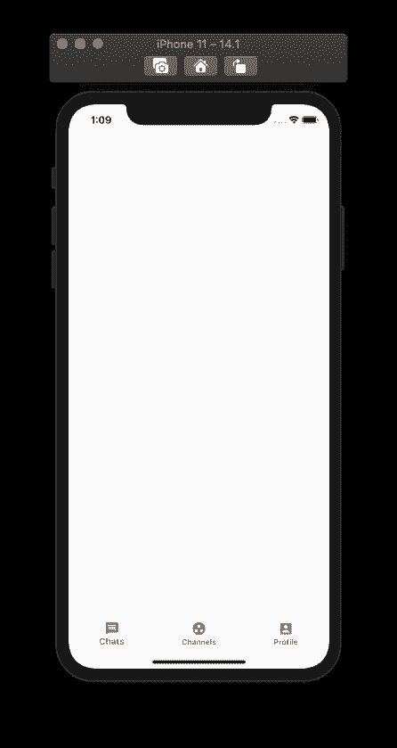

### 如何构建对话列表页眉

现在，我们将标题添加到对话列表部分，该部分将有一个文本标题和一个按钮。下面的代码片段提供了完整的 UI 实现代码:

```
return Scaffold(
      body: SingleChildScrollView(
        physics: BouncingScrollPhysics(),
        child: Column(
          crossAxisAlignment: CrossAxisAlignment.start,
          children: <Widget>[
            SafeArea(
              child: Padding(
                padding: EdgeInsets.only(left: 16,right: 16,top: 10),
                child: Row(
                  mainAxisAlignment: MainAxisAlignment.spaceBetween,
                  children: <Widget>[
                    Text("Conversations",style: TextStyle(fontSize: 32,fontWeight: FontWeight.bold),),
                    Container(
                      padding: EdgeInsets.only(left: 8,right: 8,top: 2,bottom: 2),
                      height: 30,
                      decoration: BoxDecoration(
                        borderRadius: BorderRadius.circular(30),
                        color: Colors.pink[50],
                      ),
                      child: Row(
                        children: <Widget>[
                          Icon(Icons.add,color: Colors.pink,size: 20,),
                          SizedBox(width: 2,),
                          Text("Add New",style: TextStyle(fontSize: 14,fontWeight: FontWeight.bold),),
                        ],
                      ),
                    )
                  ],
                ),
              ),
            ),
          ],
        ),
      ),
    ); 
```

在这里，我们使用了`SingleChildScrollView`，这样 **chatPage.dart** 的主体部分是完全可滚动的。

然后，我们使用了`BouncingScrollPhysics`实例来给出当用户滚动到末尾或开始时的反弹效果。

接下来，我们添加了一个文本小部件和一个容器，以在右侧显示底部。

最后，我们有一个`Column`小部件作为`SingleChildScrollView`小部件的子部件，这样所有的东西都会垂直出现在屏幕上。

这将为我们提供如下结果，如下面的模拟器所示:

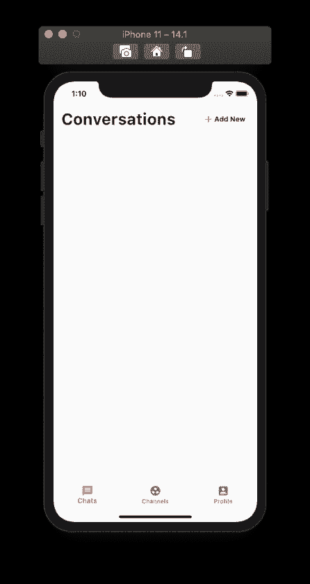

现在，我们将在标题部分的正下方添加一个搜索栏。

### **如何添加搜索栏**

在之前的`Column`小部件中，我们将在标题 UI 部分的正下方添加一个搜索栏小部件。因此，作为`Column`小部件的第二个子部件，我们需要插入下面代码片段中提供的代码:

```
Padding(
  padding: EdgeInsets.only(top: 16,left: 16,right: 16),
  child: TextField(
    decoration: InputDecoration(
      hintText: "Search...",
      hintStyle: TextStyle(color: Colors.grey.shade600),
      prefixIcon: Icon(Icons.search,color: Colors.grey.shade600, size: 20,),
      filled: true,
      fillColor: Colors.grey.shade100,
      contentPadding: EdgeInsets.all(8),
      enabledBorder: OutlineInputBorder(
          borderRadius: BorderRadius.circular(20),
          borderSide: BorderSide(
              color: Colors.grey.shade100
          )
      ),
    ),
  ),
), 
```

这将为我们提供如下结果，如下面的模拟器所示:

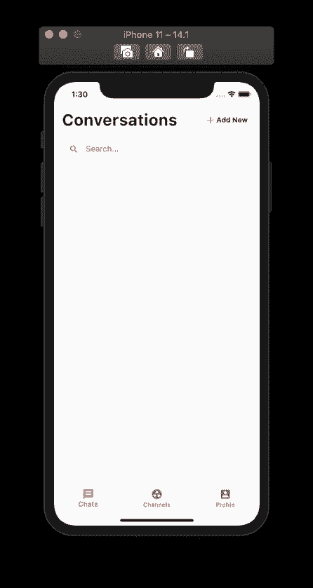

### **如何建立对话列表**

现在我们有了标题部分和搜索栏，我们将实现对话列表部分。

为此，我们需要实现一个类对象模型来存储会话列表的实例。

所以在**里面。/lib** 文件夹，我们需要创建一个名为**的新文件夹。/型号**。在**内部。/models** ，我们需要创建一个名为 **chatUsersModel.dart** 的文件。

在模型文件中，我们需要创建一个模型对象类，如下面的代码片段所示:

```
import 'package:flutter/cupertino.dart';

class ChatUsers{
  String name;
  String messageText;
  String imageURL;
  String time;
  ChatUsers({@required this.name,@required this.messageText,@required this.imageURL,@required this.time});
} 
```

该对象将包含用户名、文本消息、图像 URL 和时间。

接下来，我们需要在 **chatPage.dart** 中创建一个用户列表，如下面的代码片段所示:

```
class _ChatPageState extends State<ChatPage> {
  List<ChatUsers> chatUsers = [
    ChatUsers(text: "Jane Russel", secondaryText: "Awesome Setup", image: "images/userImage1.jpeg", time: "Now"),
    ChatUsers(text: "Glady's Murphy", secondaryText: "That's Great", image: "images/userImage2.jpeg", time: "Yesterday"),
    ChatUsers(text: "Jorge Henry", secondaryText: "Hey where are you?", image: "images/userImage3.jpeg", time: "31 Mar"),
    ChatUsers(text: "Philip Fox", secondaryText: "Busy! Call me in 20 mins", image: "images/userImage4.jpeg", time: "28 Mar"),
    ChatUsers(text: "Debra Hawkins", secondaryText: "Thankyou, It's awesome", image: "images/userImage5.jpeg", time: "23 Mar"),
    ChatUsers(text: "Jacob Pena", secondaryText: "will update you in evening", image: "images/userImage6.jpeg", time: "17 Mar"),
    ChatUsers(text: "Andrey Jones", secondaryText: "Can you please share the file?", image: "images/userImage7.jpeg", time: "24 Feb"),
    ChatUsers(text: "John Wick", secondaryText: "How are you?", image: "images/userImage8.jpeg", time: "18 Feb"),
  ]; 
```

现在我们有了模拟用户的对话列表数据，我们可以将它应用到对话列表中来创建一个列表视图。

### **如何为个人对话制作单独的类部件**

这里，我们将为对话列表视图中的各个项目创建一个单独的组件小部件。

对于这一点，在**里面。/lib** 创建一个名为**的文件夹。/widgets** 。而在**内部。/widgets** 我们需要在新的小部件文件中创建一个名为 **conversationList.dart.** 的文件，我们可以使用以下代码片段中的代码:

```
import 'package:flutter/material.dart';

class ConversationList extends StatefulWidget{
  String name;
  String messageText;
  String imageUrl;
  String time;
  bool isMessageRead;
  ConversationList({@required this.name,@required this.messageText,@required this.imageUrl,@required this.time,@required this.isMessageRead});
  @override
  _ConversationListState createState() => _ConversationListState();
}

class _ConversationListState extends State<ConversationList> {
  @override
  Widget build(BuildContext context) {
    return GestureDetector(
      onTap: (){
      },
      child: Container(
        padding: EdgeInsets.only(left: 16,right: 16,top: 10,bottom: 10),
        child: Row(
          children: <Widget>[
            Expanded(
              child: Row(
                children: <Widget>[
                  CircleAvatar(
                    backgroundImage: NetworkImage(widget.imageUrl),
                    maxRadius: 30,
                  ),
                  SizedBox(width: 16,),
                  Expanded(
                    child: Container(
                      color: Colors.transparent,
                      child: Column(
                        crossAxisAlignment: CrossAxisAlignment.start,
                        children: <Widget>[
                          Text(widget.name, style: TextStyle(fontSize: 16),),
                          SizedBox(height: 6,),
                          Text(widget.messageText,style: TextStyle(fontSize: 13,color: Colors.grey.shade600, fontWeight: widget.isMessageRead?FontWeight.bold:FontWeight.normal),),
                        ],
                      ),
                    ),
                  ),
                ],
              ),
            ),
            Text(widget.time,style: TextStyle(fontSize: 12,fontWeight: widget.isMessageRead?FontWeight.bold:FontWeight.normal),),
          ],
        ),
      ),
    );
  }
} 
```

这个小部件文件将用户名、文本消息、图像 URL、时间和一个布尔消息类型值作为参数。它返回包含这些值的模板。

在 **chatPage.dart、`ListView`小部件内的**中，我们需要通过传递所需的参数来调用`ConversationList`小部件，如下面的代码片段所示:

```
ListView.builder(
  itemCount: chatUsers.length,
  shrinkWrap: true,
  padding: EdgeInsets.only(top: 16),
  physics: NeverScrollableScrollPhysics(),
  itemBuilder: (context, index){
    return ConversationList(
      name: chatUsers[index].name,
      messageText: chatUsers[index].messageText,
      imageUrl: chatUsers[index].imageURL,
      time: chatUsers[index].time,
      isMessageRead: (index == 0 || index == 3)?true:false,
    );
  },
), 
```

注意，这个`ListView`小部件将作为`chatPage`屏幕中`Column`小部件的第一个子部件。

这将为我们提供如下结果，如下面的模拟器所示:

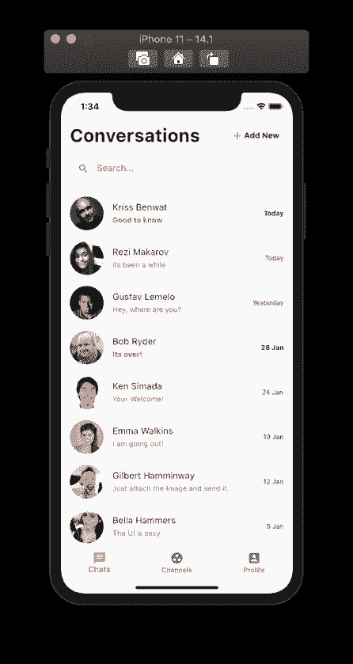

这就完成了我们的对话列表屏幕和主主页屏幕作为一个整体的 UI 实现。现在，我们将继续讨论聊天详细信息屏幕的实现。

## **如何创建聊天详情界面**

现在，我们将创建一个聊天详细信息屏幕。为此，我们需要在**中创建一个名为 **chatDetailPage.dart** 的新文件。/lib/screens/** 文件夹。现在，我们将添加基本代码，如下面的代码片段所示:

```
import 'package:flutter/material.dart';

class ChatDetailPage extends StatefulWidget{
  @override
  _ChatDetailPageState createState() => _ChatDetailPageState();
}

class _ChatDetailPageState extends State<ChatDetailPage> {

  @override
  Widget build(BuildContext context) {
    return Scaffold(
      appBar: AppBar(
        title: Text("Chat Detail"),
      ),
      body: Container()
    );
  }
} 
```

这里，我们返回了一个带有文本和一个空容器的基本`AppBar`，作为`Scaffold`小部件的`body`。

现在，我们将在 **conversationList.dart** 小部件文件中的`GestureHandler`小部件的`onTap`方法上添加对`ChatDetailPage`的导航，如下面的代码片段所示:

```
GestureDetector(
      onTap: (){
        Navigator.push(context, MaterialPageRoute(builder: (context){
          return ChatDetailPage();
        }));
      }, 
```

我们现在可以导航到聊天详细信息屏幕，如下面的模拟器演示所示:

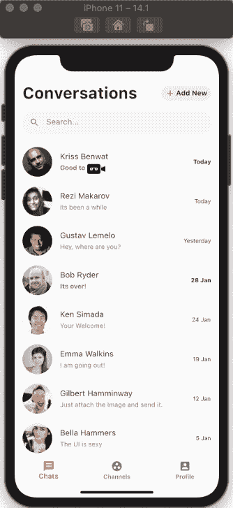

### 如何为聊天详细信息屏幕构建自定义应用程序栏

这里，我们将在聊天详细信息屏幕的顶部添加一个自定义应用程序栏。为此，我们将使用带有各种参数配置的`AppBar`小部件，如下面的代码片段所示:

```
return Scaffold(
      appBar: AppBar(
        elevation: 0,
        automaticallyImplyLeading: false,
        backgroundColor: Colors.white,
        flexibleSpace: SafeArea(
          child: Container(
            padding: EdgeInsets.only(right: 16),
            child: Row(
              children: <Widget>[
                IconButton(
                  onPressed: (){
                    Navigator.pop(context);
                  },
                  icon: Icon(Icons.arrow_back,color: Colors.black,),
                ),
                SizedBox(width: 2,),
                CircleAvatar(
                  backgroundImage: NetworkImage("<https://randomuser.me/api/portraits/men/5.jpg>"),
                  maxRadius: 20,
                ),
                SizedBox(width: 12,),
                Expanded(
                  child: Column(
                    crossAxisAlignment: CrossAxisAlignment.start,
                    mainAxisAlignment: MainAxisAlignment.center,
                    children: <Widget>[
                      Text("Kriss Benwat",style: TextStyle( fontSize: 16 ,fontWeight: FontWeight.w600),),
                      SizedBox(height: 6,),
                      Text("Online",style: TextStyle(color: Colors.grey.shade600, fontSize: 13),),
                    ],
                  ),
                ),
                Icon(Icons.settings,color: Colors.black54,),
              ],
            ),
          ),
        ),
      ),
      body: Container()
    ); 
```

这将为我们提供如下结果，如下面的模拟器所示:

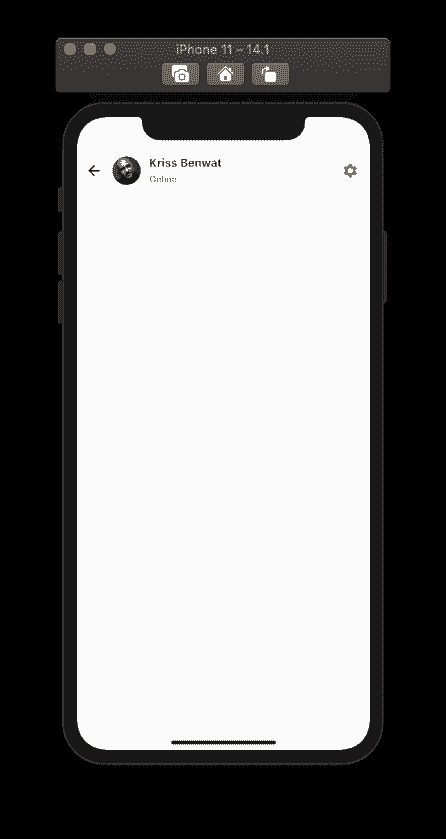

### **如何实现底部文本框**

在聊天详细信息屏幕的底部，我们需要添加一个消息传递部分，该部分将包含一个文本编辑器和一个发送消息的按钮。

为此，我们将使用`Align`小部件，并将小部件内的子部件与屏幕底部对齐。下面的代码片段提供了全部代码:

```
body: Stack(
        children: <Widget>[
          Align(
            alignment: Alignment.bottomLeft,
            child: Container(
              padding: EdgeInsets.only(left: 10,bottom: 10,top: 10),
              height: 60,
              width: double.infinity,
              color: Colors.white,
              child: Row(
                children: <Widget>[
                  GestureDetector(
                    onTap: (){
                    },
                    child: Container(
                      height: 30,
                      width: 30,
                      decoration: BoxDecoration(
                        color: Colors.lightBlue,
                        borderRadius: BorderRadius.circular(30),
                      ),
                      child: Icon(Icons.add, color: Colors.white, size: 20, ),
                    ),
                  ),
                  SizedBox(width: 15,),
                  Expanded(
                    child: TextField(
                      decoration: InputDecoration(
                        hintText: "Write message...",
                        hintStyle: TextStyle(color: Colors.black54),
                        border: InputBorder.none
                      ),
                    ),
                  ),
                  SizedBox(width: 15,),
                  FloatingActionButton(
                    onPressed: (){},
                    child: Icon(Icons.send,color: Colors.white,size: 18,),
                    backgroundColor: Colors.blue,
                    elevation: 0,
                  ),
                ],

              ),
            ),
          ),
        ],
      ), 
```

这将为我们提供一个消息部分，其中有一个文本字段用于键入消息，还有一个按钮用于发送消息:

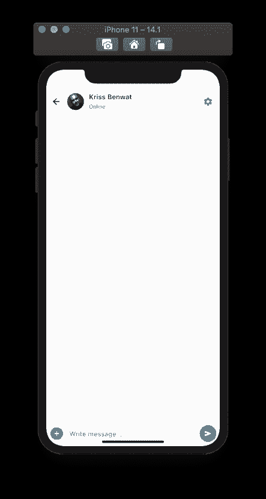

左侧还有一个按钮，我们可以用它来添加其他消息传递菜单选项。

### **如何在聊天屏幕中设置消息列表部分**

现在，我们将为出现在聊天详细信息屏幕中的消息创建 UI。

首先，我们需要创建一个反映消息实例对象的模型。

为此，我们需要在**中创建一个名为 **chatMessageModel.dart** 的文件。/models** 文件夹，定义类对象如下:

```
import 'package:flutter/cupertino.dart';

class ChatMessage{
  String messageContent;
  String messageType;
  ChatMessage({@required this.messageContent, @required this.messageType});
} 
```

类对象接受消息内容和消息类型(无论是发送者还是接收者)作为实例值。

现在，在 **chatDetailPage.dart** 中，我们需要创建一个要显示的消息列表，如下面的代码片段所示:

```
List<ChatMessage> messages = [
    ChatMessage(messageContent: "Hello, Will", messageType: "receiver"),
    ChatMessage(messageContent: "How have you been?", messageType: "receiver"),
    ChatMessage(messageContent: "Hey Kriss, I am doing fine dude. wbu?", messageType: "sender"),
    ChatMessage(messageContent: "ehhhh, doing OK.", messageType: "receiver"),
    ChatMessage(messageContent: "Is there any thing wrong?", messageType: "sender"),
  ]; 
```

接下来，我们将在`Stack`小部件的子部件之上，在`Align`小部件之上，为消息创建一个列表视图，如下面的代码片段所示:

```
body: Stack(
        children: <Widget>[
          ListView.builder(
            itemCount: messages.length,
            shrinkWrap: true,
            padding: EdgeInsets.only(top: 10,bottom: 10),
            physics: NeverScrollableScrollPhysics(),
            itemBuilder: (context, index){
              return Container(
                padding: EdgeInsets.only(left: 16,right: 16,top: 10,bottom: 10),
                child: Text(messages[index].messageContent),
              );
            },
          ),
          Align( 
```

现在，消息将以列表形式出现，如下面的模拟器屏幕截图所示:

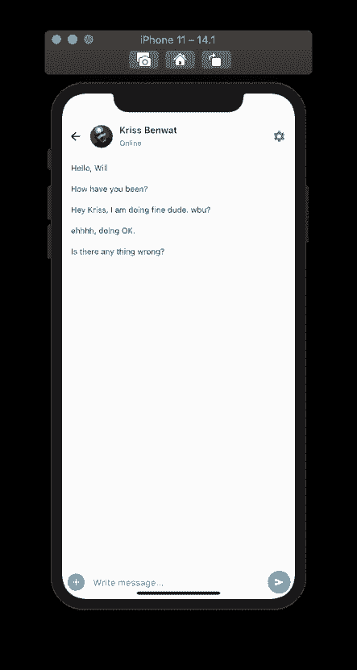

现在，我们有消息出现在屏幕上，但它们在聊天屏幕上的样式不是我们想要的。

### 如何根据发件人和收件人设计邮件的样式和位置

现在，我们将设置消息列表的样式，使其显示为聊天消息气泡。我们还将使用`Align`小部件根据消息类型对它们进行定位，如下面的代码片段所示:

```
ListView.builder(
  itemCount: messages.length,
  shrinkWrap: true,
  padding: EdgeInsets.only(top: 10,bottom: 10),
  physics: NeverScrollableScrollPhysics(),
  itemBuilder: (context, index){
    return Container(
      padding: EdgeInsets.only(left: 14,right: 14,top: 10,bottom: 10),
      child: Align(
        alignment: (messages[index].messageType == "receiver"?Alignment.topLeft:Alignment.topRight),
        child: Container(
          decoration: BoxDecoration(
            borderRadius: BorderRadius.circular(20),
            color: (messages[index].messageType  == "receiver"?Colors.grey.shade200:Colors.blue[200]),
          ),
          padding: EdgeInsets.all(16),
          child: Text(messages[index].messageContent, style: TextStyle(fontSize: 15),),
        ),
      ),
    );
  },
), 
```

这将为我们提供如下结果，如下面的模拟器所示:

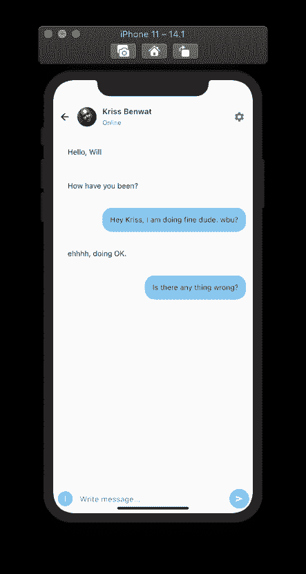

你可以在下面看到该应用整个用户界面的整体演示:

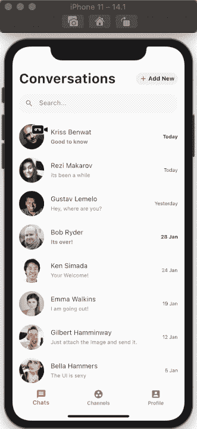

恭喜你。我们完全在 Flutter 和 Dart 生态系统中构建了一个直观的现代聊天应用 UI。

## 概述

如今，社交消息应用是必不可少的通信媒介。这些聊天应用程序配备了最先进的功能强大的聊天界面，包括音频和视频通话、图像和文件附件等等，使沟通更加高效。这些应用程序让我们的世界变小了。

本文的主要目的是向您展示如何在 Flutter 生态系统中使用现代设计为聊天应用程序开发一个简单直观的 UI。一步一步的实现提供了应用程序 UI 的详细展示，并概述了 Flutter 编码环境。

我希望这篇教程能帮助你使用 Flutter 创建下一个聊天应用程序。

您还可以从市场上顶级的 [Flutter 聊天应用](https://www.instaflutter.com/app-templates/flutter-chat-app/)模板中获得聊天应用 UI 和功能开发的灵感。一定要检查他们。