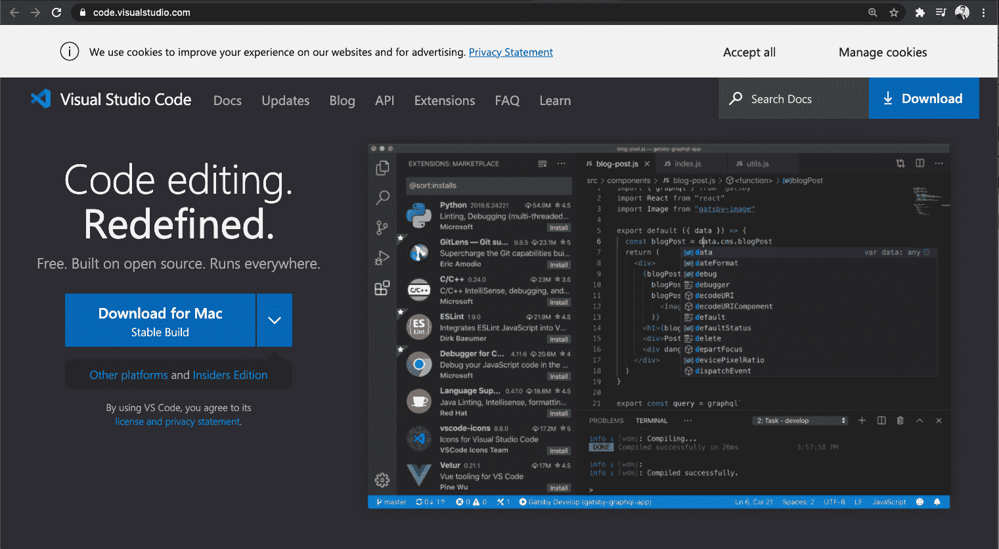
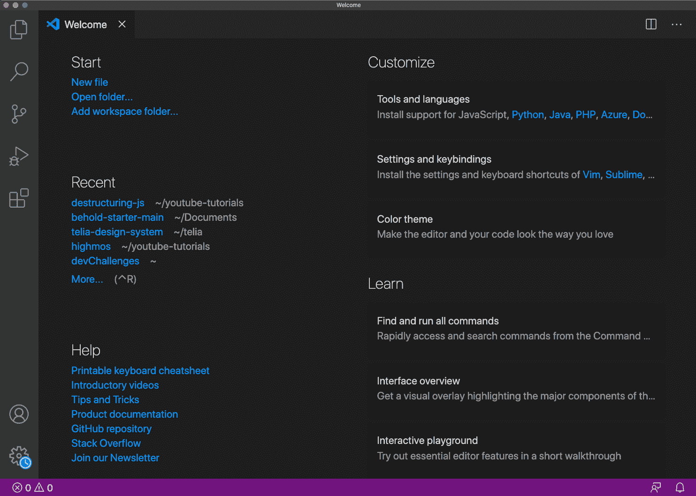
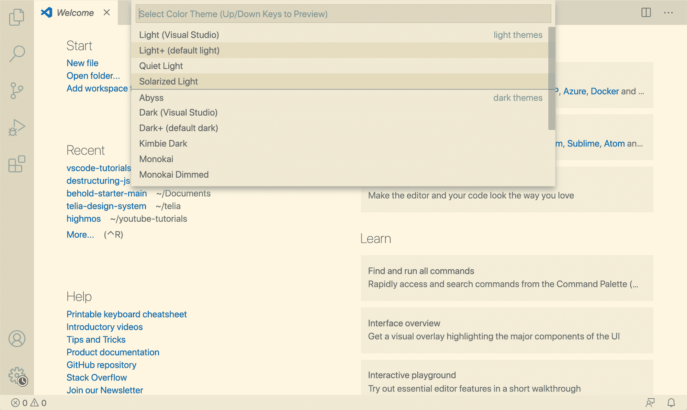
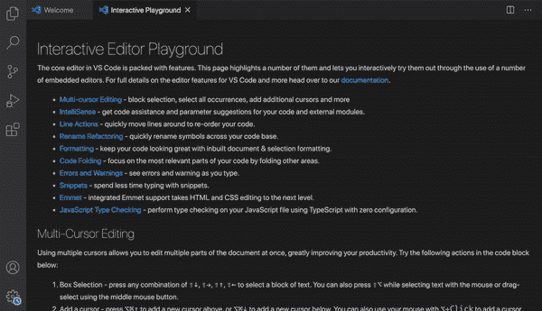
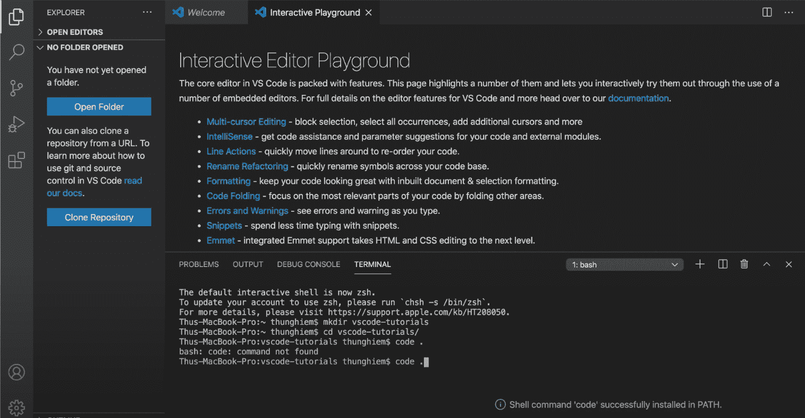
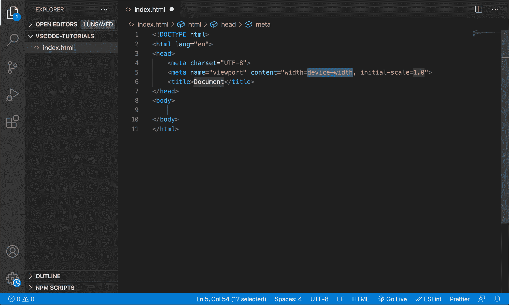
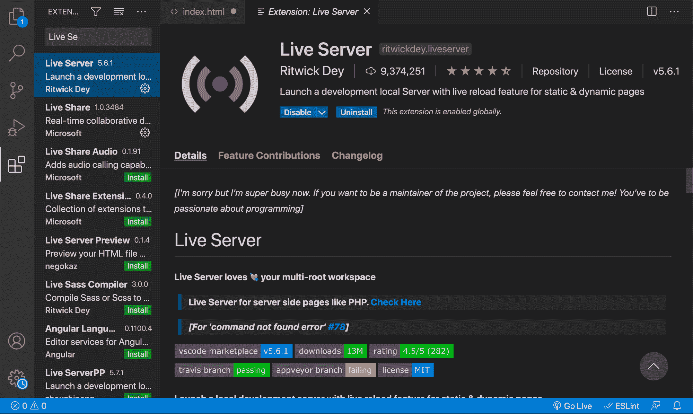

# 如何通过几个简单的步骤为 Web 开发设置 VS 代码

> 原文：<https://www.freecodecamp.org/news/how-to-set-up-vs-code-for-web-development/>

Visual Studio 代码已经成为最流行的源代码编辑器。它很轻便，但功能强大，毫无疑问是我的最爱。

在这篇文章中，我将带您了解如何开始为 Web 开发人员设置 VS 代码。

这里有个视频，想补充本文的可以看看:

[https://www.youtube.com/embed/uovNnCjjfx4?feature=oembed](https://www.youtube.com/embed/uovNnCjjfx4?feature=oembed)

VS Code Setup Video

## VS 代码介绍



Download Visual Studio Code

如果你的电脑上还没有安装 VS 代码，去[code.visualstudio.com](https://code.visualstudio.com/)下载。你可以打开下拉菜单来选择你想要下载的版本，但是通常大按钮就可以了。

## VS 代码欢迎标签

一旦你安装并打开它，首先你会看到一个欢迎标签。在这里，您会发现 5 个部分:



Welcome Tab

**开始**:可以选择新建一个文件，也可以选择打开一个文件夹。

**最近的**:你可以找到任何最近打开的文件夹

**帮助**:你可以找到一些方便的信息。例如，可打印的键盘备忘单或一系列介绍视频。

**自定义**:可以看到可以从 Vim 或者 Atom 之类的其他代码编辑器安装设置和键盘快捷键。因此，如果你现在已经习惯使用这些编辑器，你可以去看看。

但是我们要研究的是**颜色主题**。如果你选择它，你可以看到有一个主题列表可供选择。您也可以使用上下箭头键来预览主题。但我最喜欢的主题是默认的，所以我会坚持使用它。



Color Theme

**学习**:在这里你会找到 3 个选择。列表上的第一个选项是**查找并运行所有命令。**有了这个，我们可以找到并运行所有可用的命令。我们会经常用到这个，所以我建议你记住这个捷径，也就是`Command/Control + Shift + P`。

第二个选择是**界面概述**。如果我们选择它，我们可以在用户界面上看到最常见的元素，还可以看到切换这些元素的快捷方式:


Interface Overview

最后选择的是**互动编辑器游乐场**。在这里，您可以从 VS 代码中找到突出显示的特性以及说明和示例。

比如让我们选择**埃米特**。有了 **Emmet** ，我们可以编写快捷方式，然后将它们扩展成一段代码。

比方说，我们想创建一个无序列表元素，里面有 3 个条目，每个条目都有一个类名“fruit”。我们可以键入`ul>li.fruit*3`并按下`tab`。



Emmet in Interactive Editor Playground

您还可以看到，在现有的示例(`ul>li.item$*5`)中，他们试图创建一个无序列表元素和 5 个项目，其中包含类名`item`。但是类名也带有*编号:*

```
<ul>
    <li class="item1"></li>
    <li class="item2"></li>
    <li class="item3"></li>
    <li class="item4"></li>
    <li class="item5"></li>
</ul>
```

在这个部分，你还可以找到 [Emmet 小抄](https://docs.emmet.io/cheat-sheet/)的链接，超级有用。

好吧，我建议你检查所有这些功能。有很多，现在都不明白也没关系。将来你总是可以回来的。

## VS 代码文件浏览器

接下来，让我们通过选择侧面导航栏上的第一个选项卡或`Command/Control + Shift + E`，进入**文件浏览器**。

在这里，您可以打开一个现有的文件夹，但是让我们创建一个新文件夹和一个新文件。让我们用 VS 代码打开终端，而不是打开一个新窗口。您可以选择状态栏上的**错误和警告**按钮，然后选择`Terminal`选项卡，或者您可以使用快捷键`Control + ``。

现在我在我的主目录中。让我们通过键入`mkdir vscode-tutorials`创建一个新文件夹，然后用`cd vscode-tutorials`进入它。

现在我们想打开这个文件夹，这样我们就可以选择`open folder`按钮并导航到文件夹目录——但是这需要做很多工作。所以相反，在终端中，我们可以说`code .`。现在，你可能会面临一个错误:`bash: code: command not found`。



Terminal In VS Code

为了解决这个问题，我们可以打开**命令面板**，搜索`Shell Command: Install code command in Path`，并选择它。现在，如果我们回到终端并键入`code .`，新的 VS 代码窗口将会打开，并带有创建的文件夹。

好，接下来，我们要创建一个新文件。在文件夹部分，我们可以单击新建文件图标或右键单击并选择`new file`。让我们将文件命名为`index.html`，并在其中键入感叹号(！)并按 tab 或 enter。用 **Emmet** ，会生成一个 HTML 模板。



Generating HTML with Emmet in VS Code

现在让我们再次打开**命令面板**，搜索**格式文件**并选中它。你可以看到，它增加了不同部分之间的间距，并清理了我们的代码。

这是来自 VS 代码的一个超级有用的特性。但是我们不想一直搜索**格式的文档** t，我们希望每次保存文件时都能格式化。

你也注意到这里缩进现在等于 **4 个空格**，在我看来有点多。所以还是改成 2 吧。为此，我们可以进入设置或使用快捷键`Command/Control + ,`。

在**常用的**选项卡中，我们可以将选项卡大小改为 2，在**文本编辑/格式化**下，我们可以在保存时选择**格式。现在每当我们保存时，文件都会被正确格式化。**

## VS 代码扩展

最后我想告诉你如何使用的是**扩展**。您可以从侧面导航栏或使用快捷键`Command/Control + Shift + X`选择扩展选项卡。

在这里，我们可以通过例如**最受欢迎的**或**推荐的**来过滤扩展名。

有很多扩展可供选择。但是我们需要安装的第一个扩展是 [Live Server](https://marketplace.visualstudio.com/items?itemName=ritwickdey.LiveServer) 。这样，我们可以让本地服务器重新加载静态网页。



Live Server Extension

例如，如果我们转到我们的`index.html`，打开命令面板，搜索**Live Server:Open with Live Server**，你可以看到浏览器上的一个新标签被打开。

如果我们在 HTML 上创建一个新元素，例如`<h1>VScode Introduction<h1/>`，在我们保存之后，页面会自动重新加载，我们可以看到变化。在`index.html`中，你也可以通过状态栏上的 **go live** 按钮打开直播服务器。

## 结论

还有许多其他有用的扩展，但我将在另一篇文章和视频中介绍它们。

现在，有了这个介绍和设置指南，我相信您已经准备好开始您的 Web 开发之旅了。

文章到此结束。你可以在社交媒体上关注我的最新动态。否则，祝你编码愉快，在以后的帖子中再见。

_ _ _ _ _ _ _ _ _ _ _ _ _🐣关于我 _ _ _ _ _ _ _ _ _ _ _ _

*   我是[发展挑战](https://devchallenges.io/)的创始人
*   订阅[我的频道](https://www.youtube.com/c/thunghiem)
*   关注我的推特
*   加入[不和](https://discord.com/invite/3R6vFeM)