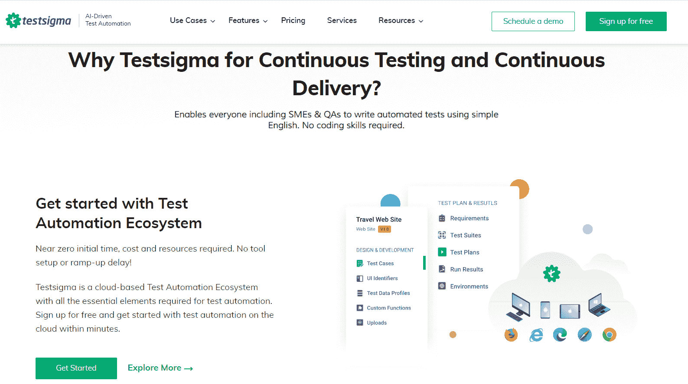
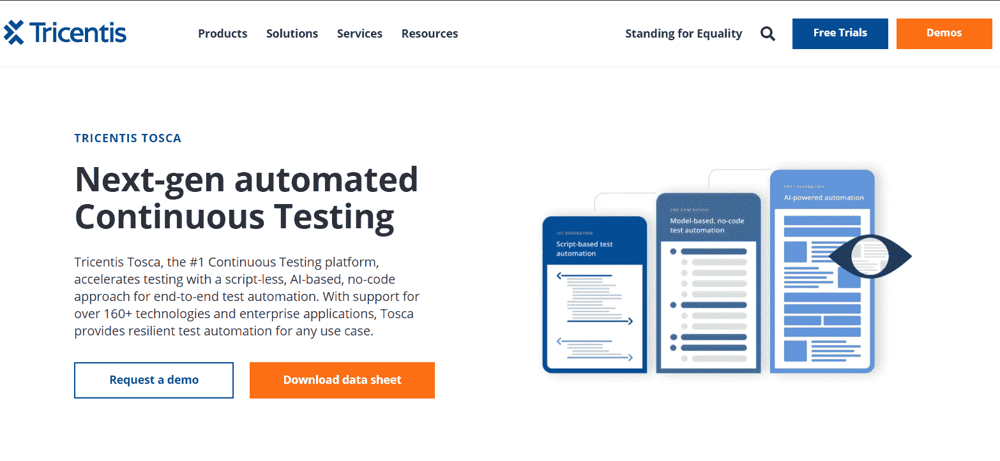
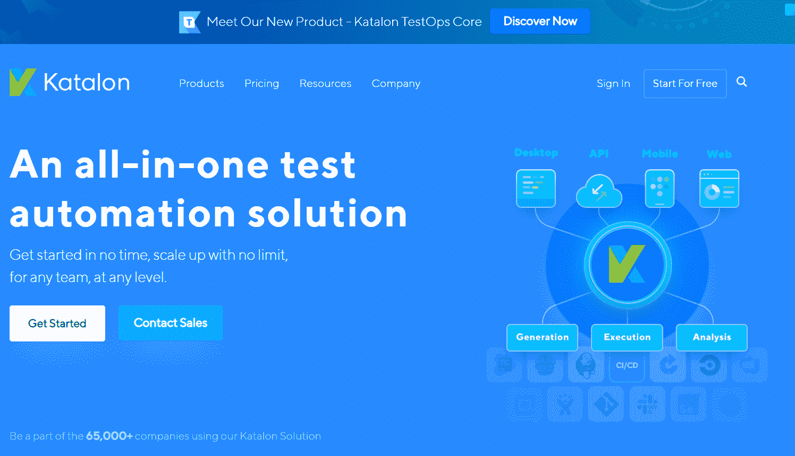
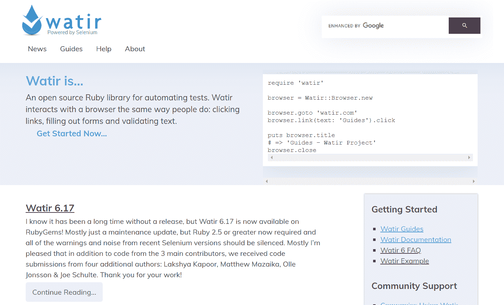

# 持续测试的最佳工具——如何防止代码更新出错

> 原文：<https://www.freecodecamp.org/news/tools-for-continuous-testing/>

如今，应用程序必须随着目标用户需求的增长和变化而发展。这就是为什么工程团队经常采用敏捷软件开发原则(或者任何迭代变化)。

敏捷原则包括持续集成和持续交付(CI/CD)。这意味着开发人员将频繁地对应用程序的现有代码库进行代码更新，以获得新功能。

那么，如何验证最近添加的代码没有破坏应用程序的一部分呢？答案是持续测试。

## 什么是持续测试？

持续测试是 CI/CD 管道的关键部分。它帮助开发团队发现特定的代码提交是否会破坏应用程序的构建，以及是否应该集成。

换句话说，持续测试是将[自动化测试](https://www.perfecto.io/blog/what-is-test-automation)集成到软件交付管道中的实践，以确定与每个代码发布或添加相关的风险。这些自动化测试通常在构建期间或之后触发，并使用自动化测试框架或工具来执行。

现在让我向您介绍四个推荐的自动化工具，您可以使用它们进行连续测试。

## 持续测试的工具

### 1.测试西格玛

[TestSigma](https://testsigma.com/) 是一个基于云的自动化测试工具，用于持续测试。它的学习曲线很低，因为自动化测试可以用简单的英语编写，并且不需要编码技能。测试还可以使用 Selenium 和基于 JS 的定制函数进行扩展，以用于更高级的用例。

TestSigma 可用于 web 应用、原生移动应用、回归、跨浏览器和数据驱动测试。它还内置了与测试管理、错误报告、CI/CD 和通信工具的无缝集成，如 GitHub、Slack、吉拉、BrowserStack、Jenkins、AWS、Bamboo、Azure DevOps、Circle CI 等。

TestSigma 还使用人工智能来减少维护工作，并通过提前识别受影响的测试和潜在故障来提高生产率，从而节省执行时间和成本，以及其他功能。

该平台有一个免费层，但要使用上面提到的所有功能，你需要承诺一个付费计划。

### 2.特里森蒂斯托斯卡

Tosca 是另一个简单易学的无代码连续测试工具。没有脚本知识的 QA 工程师可以使用 GUI 轻松设置自动化测试。

Tosca 适用于企业级应用，并且是通用的，因为它支持 160 多种技术/语言并与之无缝集成。借助 Tosca，您可以在使用 Windows OS 的 web、移动和桌面上运行测试(Mac 和 Linux 只能使用虚拟化工具)。

Tosca 自动创建和提供按需测试数据，以减少为测试自动化提供可靠测试数据所需的时间。

该平台提供有限时间的免费试用和定制价格，由销售团队根据您的具体需求决定。

### 3.加泰罗尼亚工作室

Katalon 是另一个全面的持续测试工具，构建在流行的开源 Selenium 和 Appium 之上。它可以用于测试跨 Windows、macOS 和 Linux 操作系统的 web、API、移动和桌面应用程序。

事实上，使用 Katalon，您可以在所有操作系统、浏览器和设备上执行测试，也可以在云、内部和混合环境上执行测试。

Katalon 还提供了其他有用的功能，如记录测试步骤、执行测试用例、提供基础设施、分析报告以及与最流行的 CI 工具(如 Jenkins、Bamboo、Azure 和 CircleCI)的 CI/CD 集成。

Katalon Studio 很容易上手，因为它为初学者提供了无代码的测试创建。对于高级用法，专家可以使用 Katalon 商店中的插件来扩展自动化功能。

它还拥有大量的文档，包括组织良好的教程库以及图像和视频，如果您遇到困难，可以帮助您解决。它有一个强大的免费层和一个高级使用的企业层。

### 4.瓦特尔

Watir 是另一个由 Selenium 框架支持的连续测试自动化工具，它是开源的。Watir 只能在 Windows 上运行 web 应用程序的测试，并且只能执行简单且易于维护的测试。

它不是无代码的，因为脚本必须用 Ruby、Java 等语言编写。NET 或 Python 使用它的姐妹软件:Watij、WatiN 和 Nerodia。不管怎样，如果你已经熟悉 Ruby，那么入门是很容易的，因为它提供了大量的文档。

Watir 还可以与 Jenkins 和 GitHub 等一些 CI 工具集成。

尽管 Watir 看起来有限，但大多数团队发现它的简单性很有吸引力。它在 Ruby 社区中很流行，甚至被 Slack 和 Oracle 这样的大公司使用。

## 如何选择持续测试工具

除了我上面提到的四种工具之外，还有其他优秀的持续测试工具。我喜欢无代码测试工具，因为它让团队更快地建立和维护自动化测试。

不管怎样，在选择持续测试工具之前，有一些事情需要考虑:

1.  **支持的应用类型:**该工具是否支持您想要的应用类型(例如，移动、web、桌面)？
2.  **学习曲线:**使用起来有多容易/难？你需要学习一门新的脚本语言吗？理想情况下，你应该选择学习曲线低的东西，这样你和你的团队可以在最短的时间内开始学习。
3.  **成本:**从长远来看，该工具的成本对您的预算来说是一个可行的增加吗？
4.  **集成能力:**它能与您现有的 CI/CD 渠道无缝集成吗？
5.  **可伸缩性和可重用性:**该工具是否支持跨多个项目的测试用例的可伸缩性和可重用性？
6.  **文档和社区:**工具的文档有多简洁和丰富？将来你会遇到一些心理障碍，如果没有适当的文档和社区支持，你可能无法通过。

## 结论

使用正确的工具，持续测试通过确保只向最终用户交付高质量的代码，消除了与频繁的代码发布相关的风险。

正如我之前提到的，我上面列出的工具并不是所有持续测试工具选项的详尽列表。它们只是我推荐的，对你来说可能是也可能不是正确的选择。

做一些进一步的研究，检查不同的工具，并满足一个将无缝集成到您当前的设置和满足您的需求。