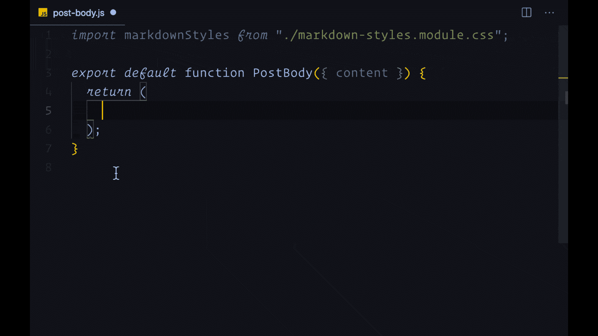
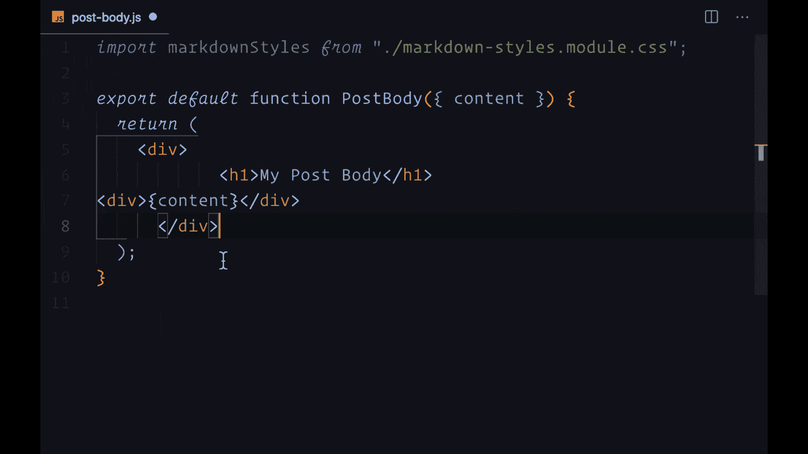
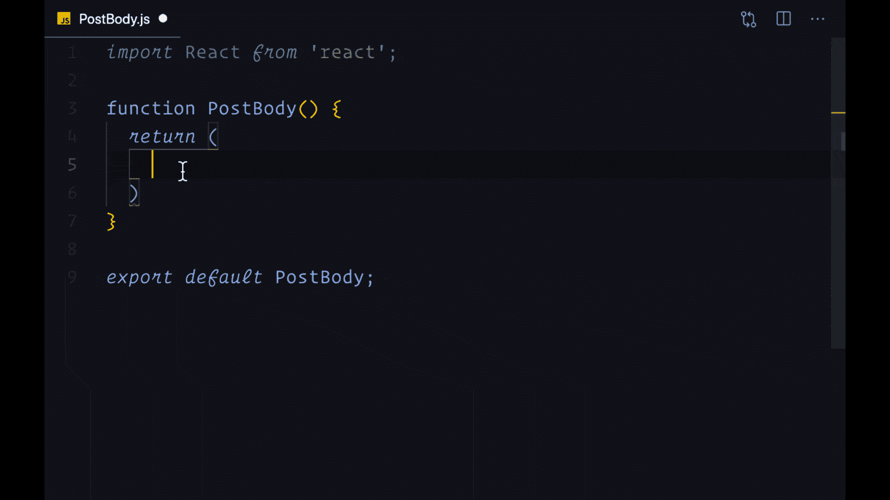

# 5 条快速反应的捷径可以立即提高你的工作效率

> 原文：<https://www.freecodecamp.org/news/react-shortcuts-that-will-instantly-boost-your-productivity/>

要成为一名更好的 React 开发人员，您不必总是学习一种全新的、具有挑战性的技能。通过使用开发工具提供的强大功能，您可以在几分钟内立即改进 React 代码。

作为 React 开发人员，你的工作中一些最大的改进需要最少的时间来学习。今天就努力应用这些技巧，我保证你会在日常编码中节省很多时间的繁琐工作，而且你会更喜欢用 React 编码。

这里有五个快捷方式，你现在可以利用它们成为一个更有效率的 React 程序员。

> 这些技巧主要讲述了如何从代码编辑器中获得更多的功能。我用的代码编辑器是 Visual Studio 代码，在 React 开发者中很流行。如果你想使用 VSCode，可以在[code.visualstudio.com](https://code.visualstudio.com)免费下载。请注意，这些特性几乎在所有代码编辑器中都可用。

## 1.厌倦了为每个 JSX 元素编写结束标记吗？用埃米特。

作为一名 React 开发人员，您需要编写许多 JSX 元素，其中大部分由开始和结束标签组成。

如果您没有用 React 设置 Emmet，您必须为每个元素手动编写这两个标记。一个更好的方法是使用一个叫做 **Emmet，**的工具，每当你创建开始标签时，它会自动创建结束标签。

**在 VSCode 中用 React 设置 Emmet:**

1.  转到**代码**(在屏幕顶部)，然后是 VSCode 中的**首选项**，然后是**设置**
2.  在左侧的选项中，选择**扩展**，然后选择 **Emmet**
3.  滚动到**包含语言**部分，在条目输入中添加***，在值输入中添加 *javascriptreact* ，点击**添加条目*****

****就这样，Emmet 将你的编码速度提高了 100%:****

******

 ***## 2.厌倦了手工格式化代码吗？用漂亮点的。

你能计算出你的代码没有对齐的次数吗？可能是因为你试图自己调整间距。我甚至不想去想我花了多少时间来格式化我自己的代码！

如果你仍然试图手工格式化你的代码，你需要更漂亮的 T2。

漂亮的名字恰如其分:它把你的错位代码变成一个漂亮得多的格式化版本。

prettle 可以作为单独 JavaScript 项目的 devDependency，也可以通过 Prettier VSCode 扩展在所有项目中使用。使用 VSCode 扩展的好处是每次点击 save 时可以自动格式化 JavaScript 代码。

**以下是如何在 VSCode 的所有项目中设置 beautiful:**

1.  进入**代码**，然后**偏好**，然后**扩展**
2.  在搜索输入中搜索*beautiful*并回车(应该是第一个出现的)
3.  选择扩展，然后点击**安装**(可能还有**重新加载**来应用扩展)
4.  进入**代码**，然后**偏好设置**，然后**设置**
5.  在保存时搜索**格式**，并选择保存时格式化选项旁边的复选框

现在，每次保存时，您编写的所有代码都将被完美格式化:

## 3.你会写出你做的每一个组件吗？使用 React 片段。

在 React 和 JavaScript 项目中创建许多东西通常需要大量样板文件。每次你写一个组件的时候，你必须把它的每一部分都打出来——导入 React，创建一个函数，然后从你的文件中导出。

你厌倦了不得不这样做吗？我们都是如此。这就是 React 的片段存在的原因。

为了避免重复编写相同代码的额外工作，使用**React snippet**。代码片段允许您使用键盘快捷键立即编写 React 代码的每一部分，而不是手动键入。

例如，不用写`import React from 'react'`，你可以只写`imr`然后按 Tab 键来立即创建同样的东西。片段可以节省大量时间。

**下面是如何在 VSCode 中使用 React 片段:**

1.  进入**代码**，然后**设置**，然后**扩展**
2.  搜索 *React 片段*。有许多好的代码片段扩展可供选择。
3.  当你安装了一个 snippet 扩展后，看看可用的快捷方式，并把最好的写下来。
4.  当你输入快捷方式时，等待建议出现在你的代码编辑器中，然后点击**标签**(如果你想要一个不同的，你可以在列表中浏览)

现在，您会惊讶于自己制作组件的速度:

## 4.您是否手动导入所有组件？请改用自动导入。

创建 React 应用程序最乏味的事情之一是从其他文件导入包和组件。

这是非常重复的，手工输入每一个东西都要花费大量的精力(当你打错字时还要纠正)。

不需要记住、找到并手动导入您的组件和包，让您的代码编辑器为您做这些。您可以通过按 Tab 键选择想要导入的内容来**自动导入**您喜欢的任何内容。

**下面是如何在 VSCode 中自动导入包和组件:**

1.  进入**代码**，然后**偏好设置**，然后**设置**
2.  搜索*自动导入*并确保选中**启用自动导入**复选框
3.  回到您的项目，写下您想要导入的内容的名称，浏览编辑器建议的选项，并点击 **Tab** 来立即为它创建一个导入语句。

当您使用自动导入时，它使得处理任何规模的项目都更加容易，因为您不再需要花费一半的时间来编写导入语句。

## 5.您是否手动删除未使用的导入？使用组织导入快捷方式。

除了让我们编写的所有代码更漂亮之外，VSCode 还为我们提供了一个名为 **organize imports** 的快捷方式。事实上，它做了两件事:

1.  它按字母顺序组织我们的进口报表
2.  它删除未使用的导入语句(立即修复林挺关于未使用导入的警告)

最重要的是，这种快捷方式不需要设置。**下面是使用方法:**

1.  转到**视图**，然后是**命令面板。**
2.  搜索*组织导入*并选择它。
3.  您的导入现在应该已经组织好了，任何未使用的导入都将被删除。

请注意，您也可以使用键盘快捷键`command/control + shift + o`。

## 喜欢这篇文章吗？加入 React 训练营

**[React 训练营](http://bit.ly/join-react-bootcamp)** 将你应该知道的关于学习 React 的一切打包成一个全面的包，包括视频、备忘单，外加特殊奖励。

获得数百名开发人员已经使用的内部信息，以掌握 React、找到他们梦想的工作并掌控他们的未来:

 
*打开时点击此处通知****