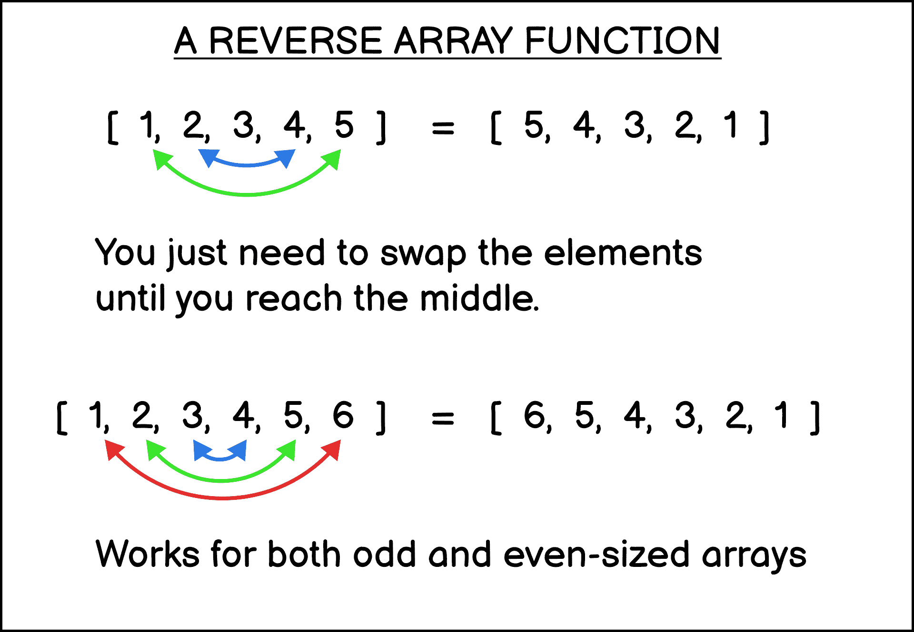

# JavaScript 反向数组——包含示例 JS 代码的教程

> 原文：<https://www.freecodecamp.org/news/javascript-array-reverse-tutorial-with-example-js-code/>

在工作面试和编码测试中，有一定限制的反转数组是最常见的挑战之一。

本教程将向您展示在 JavaScript 中使用和不使用`reverse`方法的五种方法来反转数组，以及您可以使用的代码片段。

## 如何用 Reverse 方法反转 JavaScript 中的数组

当您需要在 JavaScript 中反转一个数组时，您可以使用`reverse`方法，该方法将最后一个元素放在最前面，第一个元素放在最后:

```
let numbers = [1, 2, 3, 4, 5];
let reversedNumbers = numbers.reverse();

console.log(reversedNumbers);
// [5, 4, 3, 2, 1]
```

Reversing an array with JavaScript

但是请记住，`reverse`方法也将修改原始数组:

```
let numbers = [1, 2, 3, 4, 5];
let reversedNumbers = numbers.reverse();

console.log(reversedNumbers);
// [5, 4, 3, 2, 1]

console.log(numbers);
// [5, 4, 3, 2, 1]
```

Reverse method modifies the original array

一些编码挑战可能希望您保留原始数组，所以让我们看看如何在不改变原始数组的情况下反转数组。

## 如何在 JavaScript 中用 Spread 运算符反转数组

您可以结合使用[扩展操作符](https://sebhastian.com/javascript-spread-operator/)和`reverse`方法来反转数组，而不改变原始数组。

首先，通过用方括号`[]`将 spread 语法括起来，将 spread 操作符返回的元素放入一个新数组中:

```
[...numbers]
```

然后，在数组上调用`reverse`方法。这样，`reverse`方法将在新数组而不是原来的数组上执行:

```
let numbers = [1, 2, 3, 4, 5];
let reversedNumbers = [...numbers].reverse();

console.log(reversedNumbers);
// [5, 4, 3, 2, 1]

console.log(numbers);
// [1, 2, 3, 4, 5]
```

Using spread and reverse to reverse the array

注意:`spread`方法是 ES6 语法。当你需要支持旧的浏览器或者你想使用 ES5 语法时，你可以结合使用`slice`和`reverse`方法。现在让我们来看看。

## 如何用 Slice 和 Reverse 方法在 JavaScript 中反转数组

[`slice`方法](https://sebhastian.com/javascript-array-slice/)用于将选中的元素作为一个新数组返回。当您不带任何参数调用该方法时，它将返回一个与原始数组相同的新数组(从第一个元素到最后一个元素)。

接下来，对新返回的数组调用`reverse`方法。这就是为什么原始数组不反转的原因:

```
let numbers = [1, 2, 3, 4, 5];
let reversedNumbers = numbers.slice().reverse();

console.log(reversedNumbers);
// [5, 4, 3, 2, 1]

console.log(numbers);
// [1, 2, 3, 4, 5]
```

Using slice and reverse methods to reverse the array

## 如何在不使用 Reverse 方法的情况下在 JavaScript 中反转数组

有时工作面试会挑战你不用`reverse`方法来反转一个数组。没问题！你可以结合使用[循环`for`循环](https://sebhastian.com/javascript-for-loop/)和数组`push`方法，如下例所示:

```
let numbers = [1, 2, 3, 4, 5];
let reversedNumbers = [];

for(let i = numbers.length -1; i >= 0; i--) {
  reversedNumbers.push(numbers[i]);
}

console.log(reversedNumbers);
```

Reversing an array with for loop and push method

## 如何用 JS 写自己的反函数

最后，假设您的任务是编写自己的反转函数，该函数需要在不创建副本的情况下反转一个数组。这一开始可能看起来很复杂，但是不要担心，因为它实际上很简单。

这里需要做的是交换数组的第一个和最后一个元素，然后是第二个和倒数第二个元素，依此类推，直到交换完所有的元素。



A function to reverse an array

让我们写一个函数来做这件事。

编写函数`customReverse`，将`0`处的第一个索引和使用`array.length - 1`作为变量的最后一个索引存储起来。

```
function customReverse(originalArray) {

  let leftIndex = 0;
  let rightIndex = originalArray.length - 1;
}
```

接下来，创建[一个`while`循环](https://sebhastian.com/javascript-while-loop/)，只要`leftIndex`小于`rightIndex`就会运行。

在这个循环中，交换`leftIndex`和`rightIndex`的值。您可以将其中一个值临时存储在临时变量中:

```
while (leftIndex < rightIndex) {

  // Swap the elements
  let temp = originalArray[leftIndex];
  originalArray[leftIndex] = originalArray[rightIndex];
  originalArray[rightIndex] = temp;
}
```

最后，向上移动`leftIndex`，向下移动`rightIndex`。当`while`循环重复时，它将交换第二个和倒数第二个元素，依此类推:

```
 function customReverse(originalArray) {

  let leftIndex = 0;
  let rightIndex = originalArray.length - 1;

  while (leftIndex < rightIndex) {

    // Swap the elements with temp variable
    let temp = originalArray[leftIndex];
    originalArray[leftIndex] = originalArray[rightIndex];
    originalArray[rightIndex] = temp;

    // Move indices to the middle
    leftIndex++;
    rightIndex--;
  }
}
```

The complete reverse array code

当没有更多元素要反转时，循环将立即停止。对于奇数大小的数组，`leftIndex`和`rightIndex`的值将相等，因此不再交换。对于偶数尺寸，`leftIndex`将大于`rightIndex`。

您可以测试该函数，看看它是否正常工作，如下所示:

```
let myArray = [1, 2, 3, 4, 5];

customReverse(myArray);

console.log(myArray);

// output is [5, 4, 3, 2, 1]
```

Testing reverse array function

## 结论

恭喜你！您不仅学习了如何在 JavaScript 中反转数组，还学习了如何编写自己的反转函数。

这里还有一些您可能感兴趣的 JavaScript 教程:

*   [JavaScript 数组到字符串(带和不带逗号)](https://sebhastian.com/javascript-array-string/)
*   [如何用 JavaScript 过滤数组](https://sebhastian.com/javascript-filter-array/)
*   [了解 JavaScript reduce 方法](https://sebhastian.com/javascript-reduce/)
*   [了解 JavaScript 数组长度](https://sebhastian.com/javascript-array-length/)