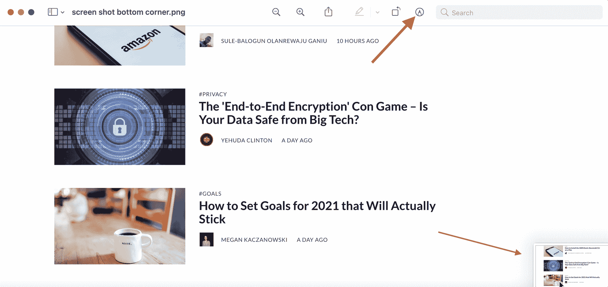
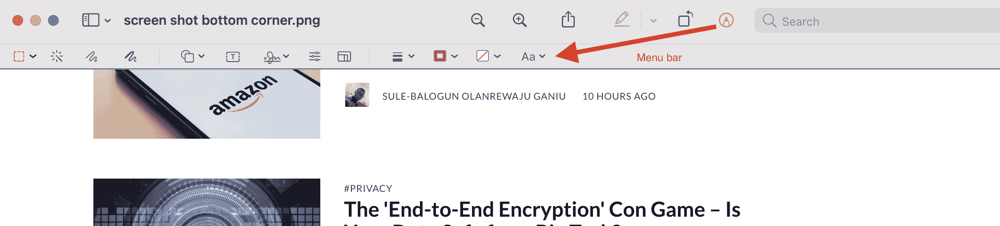
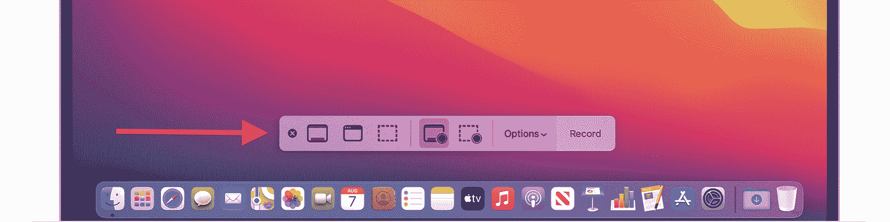

# 如何在 Mac 上截屏——在 MacOS 上截屏的快捷键

> 原文：<https://www.freecodecamp.org/news/how-to-take-a-screenshot-on-a-mac-keyboard-shortcut/>

有时在电脑屏幕上捕捉图像或一些文本很有用。但是如果是不可下载或不可复制的东西呢？

在这种情况下，您可能希望对整个或部分屏幕进行截图。截图就像给屏幕上的东西拍照一样。它会保留您正在查看的任何内容，并将其发送到您的下载中，以便您可以随时访问它。

在本教程中，我们将看到如何只需几个按键就可以在 Mac 上截屏。

## 如何在 Mac 上截屏–屏幕的一部分

最简单的截图方式，在我看来就是使用简单的键盘快捷键:Command+Shift+4。快捷方式为您提供了选择屏幕的一部分或截屏整个屏幕的选项。

如果您只想捕获屏幕的一部分(您选择的)，只需按照下面的说明操作(步骤 1-4)。如果你想捕捉整个屏幕，你会发现之后这样做的指示。

### 步骤 1:按 Command + Shift + 4

如果你只是按下 Command + Shift + 4，你的光标会变成一个十字准线状的图标。

请注意，您想要按住每个键，直到您键入完快捷键，所以按住 command 键(并保持按住)，然后按住 shift 键(同时按住 command 键，也同时按住 Shift 键)，然后按住 4 键(同时按住其他键)。然后你可以释放所有三个键。

Press Command+Shift+4, click where you want the screenshot to start, and hold down your click (don't release it)

### 步骤 2:单击并拖动光标

要截屏，只需在您希望截屏开始的位置单击(不要松开鼠标),然后将光标拖动到您希望截屏结束的位置。

Drag over and down (while still holding the click press) until you cover all the area you want captured

### 步骤 3:释放光标点击

当你已经覆盖了你想要捕捉的所有区域，释放你的点击按钮，你会听到一点点的捕捉声音(如果你的声音是开着的)。图像的缩小形式将出现在屏幕的右下角，如下所示:

The screenshot image will go to the bottom right corner of your screen

### 第四步:编辑并保存你的截图

你可以点击这个小图片，它会在一个编辑器中打开。在那里你可以标记它，添加文字和箭头(就像我上面做的那样)，然后把它发送到你电脑上你喜欢的任何地方。只需点击右上角看起来像笔尖的图标，编辑器菜单就会打开:

Click the pen tip icon...

...and the editor menu bar will pop up

一旦你按照自己的意愿标记了你的截图，保存它就行了(Command+s 就可以了)。然后你就可以在你的桌面上，你的“最近”或者你的下载中找到它。

## 如何在 Mac 上截屏——整个屏幕

如果你想捕捉整个屏幕，你可以用同样的方法开始——按 Command+Shift+4。

然后，按下空格键，而不是拖动光标来捕捉您想要的屏幕部分。(键入快捷方式后，您将立即执行此操作。)这会将屏幕截图字段更改为整个屏幕。

光标将变成一个相机图标，整个屏幕将以浅粉红色突出显示。要捕捉截图，只需点击相机图标，瞧，你有一个全屏截图。

## 如何在 Mac 上拍摄屏幕录像

如果静止图像不足以显示您想要显示的内容，该怎么办？如果您想录制自己演示新产品或编写指南的过程，该怎么办？

Mac 也让这变得非常简单。只需输入 Shift+Command+5。您将看到一个弹出菜单，如下所示:

Screen recording menu, courtesy of [Apple Support](https://support.apple.com/en-ca/HT208721) (fun fact - you can't take a screen shot while you're screen recording!).

选择你是想录制整个屏幕还是只录制一部分(菜单上那些看起来像屏幕的图标)，然后，当你准备好了，点击录制。如果您想要声音，只需确保在“选项”下拉菜单中启用您机器的麦克风。

若要停止录制，请按下停止按钮或按下 Command+Control+Esc 键。

好了，现在你知道如何在 Mac 上只需击几下键就能截屏了。