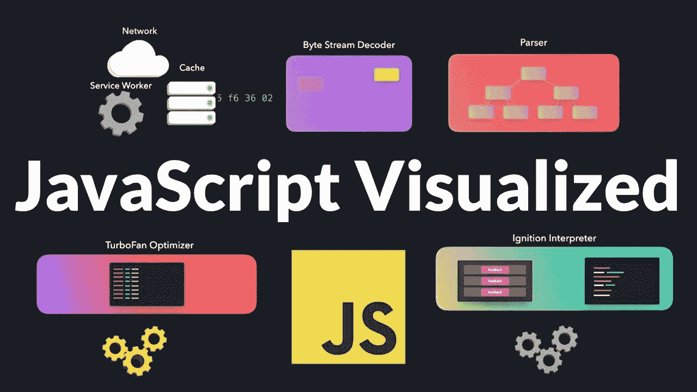
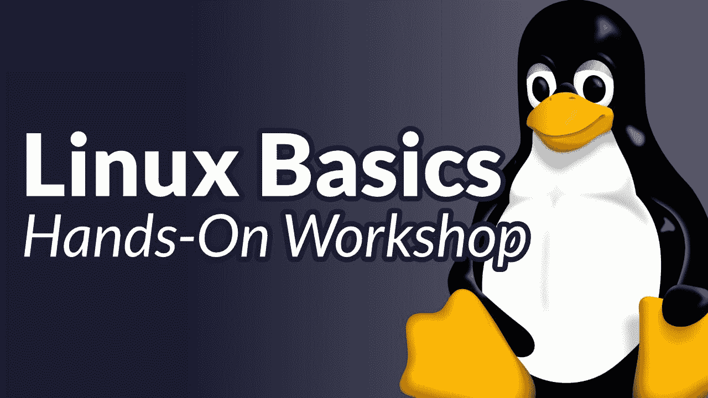
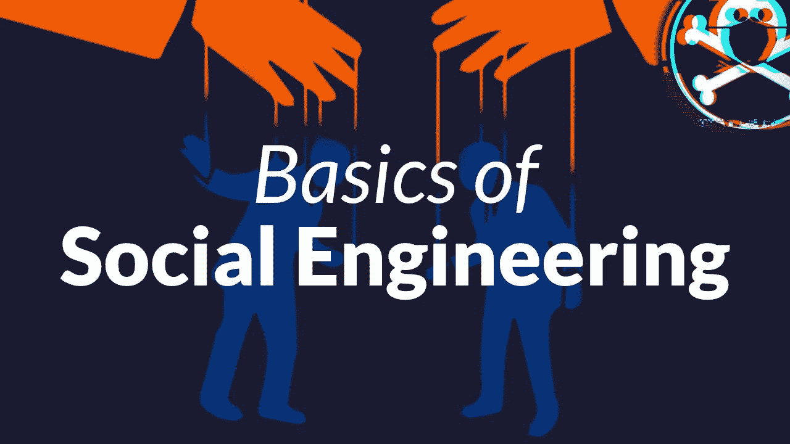

# 10 个值得关注的技术讲座——了解 2021 年新的软件开发概念

> 原文：<https://www.freecodecamp.org/news/tech-talks-software-development-conferences/>

freeCodeCamp 有第二个 YouTube 频道，专门用于技术讨论。我们已经在那里发表了近 100 篇来自世界各地开发者大会的演讲。

你可以[在这里](https://www.youtube.com/freecodecamptalks?sub_confirmation=1)订阅 freeCodeCamp Talks 频道。

我个人将技术讲座作为补充我的开发人员知识的一种方式。其中大多数只有 20 或 30 分钟长，非常适合在午休时观看。

在这篇文章中，我将分享迄今为止我们发表的 10 篇我最喜欢的技术演讲。

### 演讲#1:理解 V8 JavaScript 引擎——一个直观的解释——来自 Reactathon 2020 的 Lydia Hallie

Chrome 浏览器实际上是如何运行 JavaScript 的？在这次演讲中，Lydia 将向您展示在谷歌的 V8 JavaScript 引擎中发生了什么。

Lydia 谈到她的演讲时说:“作为 JavaScript 开发者，我们通常不需要自己与编译器打交道。在这次演讲中，我将使用可视化技术向您展示 JavaScript 引擎如何处理我们对人类友好的代码，并将其编译成机器能够理解的代码。”

你可以在这里观看莉迪亚的演讲(11 分钟)

### 演讲#2:用 CSS 变量构建你自己的设计系统——来自 Reactive Online Meetup 的 Scott Tolinski

本次演讲由斯科特·托林斯基主持，他是流行的 Syntax.fm 播客的主持人，也是 LevelUpTuts YouTube 频道的创建者。

Scott 说:“你可能不需要 CSS 框架。虽然 CSS 框架很棒，而且肯定在开发领域占有一席之地，但它们经常被过度使用来代替定制解决方案。”

在这次演讲中，Scott 将向您展示避免使用 CSS 框架的额外性能成本的方法，以及如何“使用 CSS 变量快速构建一个健壮的组件设计系统”

你可以在这里观看斯科特的演讲(40 分钟)

### 演讲#3:更好地使用 curl——curl 的创造者 Daniel Stenberg 在 FOSS-North 2020 上

curl 是大多数开发人员在某个时候都会用到的开源库之一。这是一个强大而灵活的命令行工具。

除了 curl 的创造者本人，还有谁比他更值得学习呢？

在这次演讲中，丹尼尔·斯滕伯格将带你了解 curl 的历史以及它是如何变得如此普遍的。他还会谈到他在设计时所做的一些决定和权衡。他将向您展示一些使用 HTTP APIs 的 curl 技巧。

你可以在这里观看丹尼尔的演讲(55 分钟)

### 谈话#4:你所知道的关于 MongoDB 的一切都是错误的！–由马克·史密斯在 2020 年欧洲 python 大会上发表

马克·史密斯是 MongoDB 的开发者拥护者。在他为广受欢迎的 NoSQL 数据库做贡献的日常工作中，他听到了很多误解。

“MongoDB 是 webscale 吧？它是一个 JSON 数据库，它最终是一致的，你使用 map-reduce 来查询它。哦，而且不安全。让我澄清一些事情:MongoDB 是一个符合 ACID 的数据库，具有事务、模式和关系。”

“它包括一个强大的聚合查询语言；map-reduce 已被弃用一段时间了。MongoDB 不说话也不存储 JSON，如今它自带相当不错的安全默认(我们认为)。”

在这次演讲中，马克旨在阐明这些神话，并解释它们的来源。

“像任何数据库产品一样，您需要了解它的功能以及如何充分利用它。最重要的是，这些年来产品发生了很大的变化，但是很多信息却没有跟上。我将讲述围绕 MongoDB 的 8 个神话，解释它们是如何错误的，为什么这个神话起源于第一个地方(其中一些最初并不是神话)。”

你可以在这里观看马克的演讲(25 分钟)

### 演讲#5:如何避免成为 10 倍工程师 Ivana Kellyerova 在 2020 年欧洲 python 大会上的演讲

Ivana Kellyerova 是一名来自奥地利的后端开发人员。在这次演讲中，她强调了一些编码建议的荒谬性。

“互联网从来都是一个巨大的宝库，由随机的人就各种各样的事情提供未经请求的建议，编程也不例外。”

她谈到关于成为 10 倍工程师的传统智慧:“想成为更好的程序员吗？学会最大化你的 WPM。永远不要看文档，因为那很尴尬。大声哭出来，改变你的屏幕背景为黑色！这就是你，一个相当不错的程序员，正在寻找方法变得更擅长编码。你是怎么做到的？我自己也不是第 10 号工程师(谢天谢地)，但我确实相信，有一些事情我们可以放心地排除掉。”

你可以在这里观看伊万娜的演讲(30 分钟)

### 演讲#6:用 JavaScript 进行函数式编程 Simon Painter，FOSS-North 2020

函数式编程是面向对象编程和其他编码方法的流行替代方案。还有围绕函数式编程方法设计的编程语言，如 F#、Haskell 和 Erlang。

但是你不需要学习一门新的编程语言。你可以用 JavaScript 练习函数式编程。

Simon Painter 说:“只需使用几个 JavaScript 库，如 RamdaJS，开发人员就可以实现函数式编程世界中一些最强大的模式和技术。”您将得到这样的代码:

*   更加强健
*   更容易阅读
*   更易于维护
*   更具可扩展性

这个演讲推荐给任何想在熟悉 JavaScript 的舒适环境中学习一些函数式编程的人。

你可以在这里观看西蒙的演讲(55 分钟)

### 演讲#7: Linux 基础——一个实践研讨会 Bill Stearns 在狂野西部黑客节上的演讲

这是一个由经验丰富的 Linux 教师组织的完整的 3 小时 Linux 研讨会。它侧重于网络和安全命令。

来自 SANS 研究所的讲师 Bill Stearns 说:“也许你没有用过 Linux，或者你用过，只是不习惯使用命令行。在您亲自尝试命令时，您有机会看到讲师指导您完成命令。您将了解更多关于它们的功能，以及为什么您可能想要使用它们。”

你可以在这里观看比尔的整个工作室(3 小时观看)

### 演讲#8:面向对象编程不是我所想的——作者 Anjana Vakil 在 redev 会议上

Anjana Vakil 做了一些近年来最受关注的技术演讲。这个关于面向对象编程的演讲同样很棒。

我不想描述她的演讲，我只想给你完整的描述，当她把这个演讲提交给 redev 会议时，因为它是金子:

“加入我吧，因为我发现对象和类不是 OOP 最重要的概念:消息和后期绑定才是，这让我的世界为之震动。我们将尝试窥视 Alan Kay 和其他 OOP 创始人在创建 Smalltalk 等语言时的想法，并发现那些“旧”想法在今天似乎有着惊人的相关性。

“当我们意识到面向对象和函数式编程并不像我们想象的那样不同，并且第一种面向对象语言不是在 60 或 70 年代，而是在更早的时候创建的时候，我们可能会惊讶不已……在这个旅程的终点有什么在等着我们呢？

“最糟糕的情况是，我们将经历一场短暂的信任危机，对我们曾经认为自己了解的编程知识失去信心。最好的情况是，我们将改变我们看待这种几乎无处不在但经常被误解的范式的方式，并带着对我们如何架构和理解我们的代码的新见解离开。”

你可以在这里观看 Anjana 的演讲(40 分钟)

### 演讲#9:社会工程的基础(又名我如何闯入赌场和机场)——由克里斯·普里查德在 DEF CON 27 上发表

社会工程是一个用来欺骗人们的时髦词汇。即使是最复杂的安全系统通常也会有人参与其中。而人类是最脆弱的组成部分之一。因此，许多真实世界的大黑客使用社会工程也就不足为奇了。

正如安全风险经理 Chris Pritchard 在传奇的 DEF CON 上向与会者解释的那样:社会工程不仅仅是阅读肢体语言、面部表情和魅力。

“我将把重点放在基础知识上:如何执行侦察，如何搭配着装风格，如何编造一个符合你知识的借口，如何让真正的员工帮助你，如果你真的进去了该怎么办，为什么你应该与员工互动，为什么你应该练习观察。这些是学习和使用的重要工具，可以帮助你在社会工程方面有一个开始。”

没错。你将学会如何欺骗别人。但更重要的是，你将学会*人们是如何欺骗别人的，这样你就能防范于未然。*

你可以在这里观看克里斯的演讲(25 分钟)

### 演讲#10:提升 Web 开发的基础 Byteconf React 2020 上的 Colby Fayock

Colby Fayock's 2020 tech talk: Level Up With the Fundamentals of Web Development

最后，freeCodeCamp 的贡献者 [Colby Fayock](https://www.freecodecamp.org/news/author/colbyfayock) 在这个有趣轻松的演讲中给出了一些网页可访问性设计技巧。

“无论是经验丰富的还是初学者，开发人员都习惯于直接进入一个框架或新技术，这种框架或新技术做出了很多承诺，同时也掩盖了重要的基本原则，否则，往往会阻碍网站或应用程序的潜力。如果没有一些 HTML 的基础知识，你可能会因为网站的可访问性差而无意中阻止人们通过你的网站了解你的公司。”

他还给出一些快速的表演技巧。“缺乏对 CSS 的理解或只是害怕 CSS，你可能更倾向于在库的基础上添加不必要的库，这只会增加页面的重量，影响应用程序的加载速度。”

Colby 涵盖了一些基本的 HTML 和 CSS 策略，您可以立即开始使用这些策略来使您的网站更快、更易访问，并最终对搜索引擎更加 SEO 友好。

你可以在这里观看科尔比的演讲(22 分钟)

## 我们每周都会发布新的技术报告

同样，我们已经与几十个主要的开发者大会合作，在 freeCodeCamp 的 talks 频道上发布他们的技术演讲。

向 PyCon、DEF CON、Reactathon 和许多其他优秀的开发者大会大声疾呼，让这些演讲通过 freeCodeCamp Talks 频道免费提供。

了解最新科技会议讨论的最佳方式是[在这里](https://www.youtube.com/freecodecamptalks?sub_confirmation=1)订阅免费代码营讨论频道。

享受谈话，快乐编码。👍