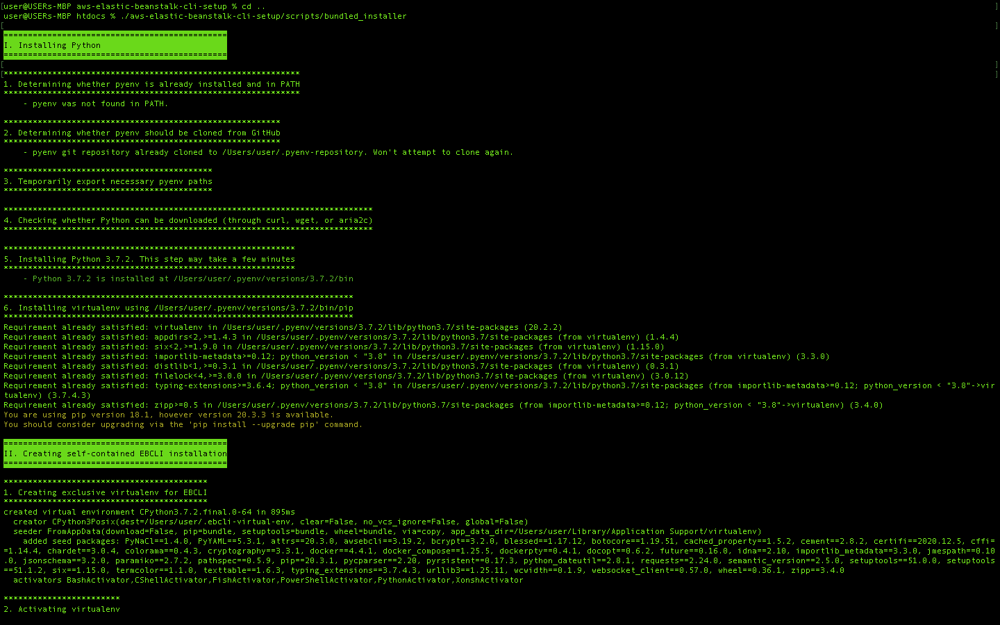
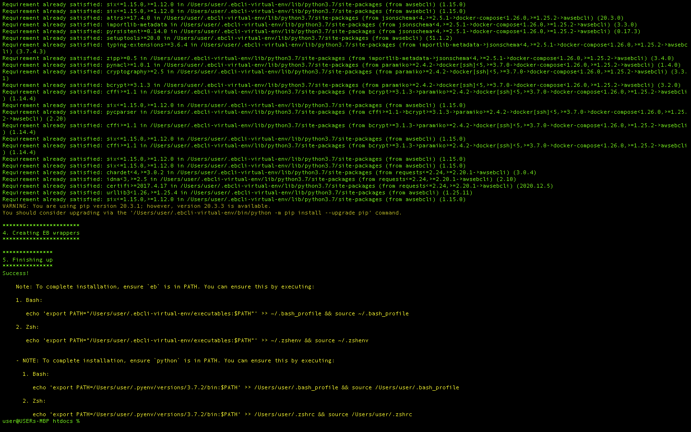
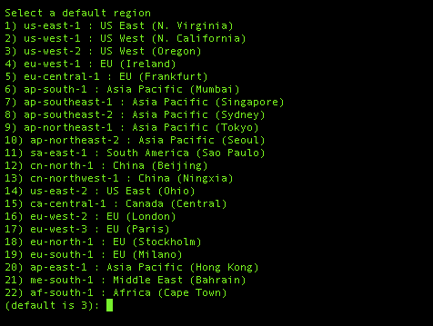

# 如何在 Mac 上安装 AWS Elastic Beanstalk CLI

> 原文：<https://www.freecodecamp.org/news/install-elastic-bean-cli-on-mac/>

Elastic Beanstalk 是一个编排服务，允许 AWS 平台上的用户轻松部署 web 应用程序。它可以满足您在云中运行应用程序可能需要的任何设置。

编排简单地说就是自动化工作流流程，以便在云上以服务的形式交付资源。

在本教程中，我们将通过简单的步骤在本地设置 Elastic Beanstalk。在本地设置它意味着我们将能够从终端直接与 AWS 交互，并通过 EB 提供的命令将我们部署的应用程序推送到云中。

## 弹性豆茎的好处

Elastic Beanstalk 允许您的数据在弹性云计算实例终止后保持不变。存储在卷上的数据仍然可以访问。

此外，它还通过提供高可用性和耐用性来帮助您避免组件故障。

## 如何安装弹性 Beanstalk CLI

Elastic Beanstalk CLI 是一个命令行界面，允许用户在 Elastic Beanstalk 上创建、设置和管理进程。

为了在我们的本地环境中安装 EB，我们需要检查开源的[AWS-elastic-beanstalk-CLI-setup](https://github.com/aws/aws-elastic-beanstalk-cli-setup)项目。在那里，我们将找到安装指南来帮助这个过程。

### 第一步:

将存储库克隆到我们的本地环境中。如果你没有 Github 账号，可以在这里注册[。](https://www.freecodecamp.org/news/p/8ffef46d-0fe6-4768-8ccd-f8743b0008d1/github.com)

```
git clone https://github.com/aws/aws-elastic-beanstalk-cli-setup.git
```

### 第二步:

在本节中，我们必须下载 zlib 并对其进行配置。Zlib 是一个用于压缩和解压缩的库。EB 在需要压缩和解压缩数据(字符串、结构化内存内容或文件)时利用了这一特性。

```
brew install zlib openssl readline
CFLAGS="-I$(brew --prefix openssl)/include -I$(brew --prefix readline)/include -I$(xcrun --show-sdk-path)/usr/include" LDFLAGS="-L$(brew --prefix openssl)/lib -L$(brew --prefix readline)/lib -L$(brew --prefix zlib)/lib"
```

### 第三步:

安装完成后，我们将为 zlib 导出并设置环境变量的路径。在命令行中运行以下命令:

```
$ export LDFLAGS=$LDFLAGS:-L/usr/local/opt/zlib/lib
$ export CPPFLAGS=$CPPFLAGS:-I/usr/local/opt/zlib/include
$ export PKG_CONFIG_PATH=$PKG_CONFIG_PATH:~/usr/local/opt/zlib/lib/pkgconfig
```

要查看路径设置是否正确，请运行以下命令:

```
$ echo $LDFLAGS $CPPFLAGS $PKG_CONFIG_PATH
```

### 第四步:

回到我们提取存储库的终端，我们需要运行捆绑的安装程序，代码如下:

```
$ ./aws-elastic-beanstalk-cli-setup/scripts/bundled_installer
```

一旦该过程完成，您将看到类似如下的输出:



### 第五步:

为了完成安装过程，我们还需要将`eb`和`python`添加到我们的环境路径中。我们可以通过在终端中运行以下代码来做到这一点:

```
$ echo 'export PATH="/Users/user/.ebcli-virtual-env/executables:$PATH"' >> ~/.bash_profile && source ~/.bash_profile
$ echo 'export PATH=/Users/user/.pyenv/versions/3.7.2/bin:$PATH' >> /Users/user/.bash_profile && source /Users/user/.bash_profile
```

一旦我们完成了路径的添加，我们现在可以尝试初始化一个弹性 Beanstalk，看看我们是否得到了一个选定区域的列表。在终端中运行以下命令:

```
$ eb init
```

您应该会看到以下内容:



瞧啊。我们有一个可供选择的地区列表，我们可以从 AWS 上的 S3 存储桶添加凭据。我们还可以运行其他 EB 命令，比如`eb create`、`eb deploy`等等。

### 参考

*   [AWS 弹性豆茎开发者指南](https://docs.amazonaws.cn/en_us/elasticbeanstalk/latest/dg/awseb-dg.pdf)
*   [用 zlib 压缩](https://www.zlib.net/)