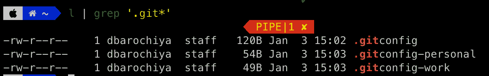

# 如何在一台计算机上使用多个 Git 配置

> 原文：<https://www.freecodecamp.org/news/how-to-handle-multiple-git-configurations-in-one-machine/>

你可能很难管理很多猫，但是对于 Git 档案，你可以做一些事情。

让我们直接进入解决方案——答案就在`.gitconfig`文件中。这是 Git 识别需要使用什么配置的起点。

这个想法是通过分离您想要的配置文件，将您机器上的 repos 分离到多个目录中，然后为每个配置文件定义一个`.gitconfig`文件。

## 步骤 1 →为回购创建单独的目录

根据您要使用的配置文件，将您正在处理的项目组织到单独的文件夹中。

例如，假设您正在使用两个 Git 概要文件。对于我们大多数人来说，这是一个常见的用例:

*   `WORK` →工作相关项目
*   `PERSONAL` →对于开源和附带项目

## 步骤 2 →创建全局 Git 配置

在您的主目录中创建全局`.gitconfig`文件，如果它还不存在的话。然后添加所有的配置文件目录作为一个条目，如下例所示。

其工作方式非常直观——如果您创建 Git 目录的目录路径与`inclideIF`中的路径之一匹配，那么 Git 将使用那个特定的概要文件配置文件。否则，它使用默认配置。

```
[includeIf "gitdir:~/personal/"]
  path = ~/.gitconfig-personal
[includeIf "gitdir:~/work/"]
  path = ~/.gitconfig-work 
```

$HOME/.gitconfig

## 步骤 3 →为概要文件创建单独的 Git 配置

如果你还没有注意到，我们刚刚提到了全局`.gitconfig`文件中的`.gitconfig-personal`和`.gitconfig-work`文件，但是我们还没有创建它们。这些单独的文件可以包含您需要的所有定制，从用户名和电子邮件到提交钩子。

```
[user]
 name = work_user
 email = work_email 
```

$HOME/.gitconfig-work

```
[user]
 name = personal_user
 email = personal_email 
```

$HOME/.gitconfig-personal

## 我们来验证一下

我们都准备好了！现在，您的主目录中将有三个 Git 文件。



现在，我们将在工作和个人目录中创建和启动一个新的 Git repo，并检查配置。

```
$ cd ~/work
$ mkdir work-test-repo
$ cd work-test-repo
$ git init
		*Initialized empty Git repository in /Users/dbarochiya/work/work-test-repo/.git/*
$ git config -l   
		*credential.helper=osxkeychain
		includeif.gitdir:~/personal/.path=~/.gitconfig-personal
		includeif.gitdir:~/work/.path=~/.gitconfig-work
		**user.name=working_me
		user.email = work@work.com**
		core.repositoryformatversion=0
		core.filemode=true
		core.bare=false
		core.logallrefupdates=true
		core.ignorecase=true
		core.precomposeunicode=true*                                                                                                                   1 
```

```
$ cd ~/personal
$ mkdir personal-test-repo
$ git init
	*Initialized empty Git repository in /Users/dbarochiya/personal/.git/*
$ git config -l
	*credential.helper=osxkeychain
	includeif.gitdir:~/personal/.path=~/.gitconfig-personal
	**user.name=me_personal
	user.email=personal@personal.com**
	includeif.gitdir:~/work/.path=~/.gitconfig-work
	core.repositoryformatversion=0
	core.filemode=true
	core.bare=false
	core.logallrefupdates=true
	core.ignorecase=true
	core.precomposeunicode=true* 
```

瞧，正如你所看到的，在这两种情况下，电子邮件和用户名是不同的。根据 Git repo 的路径，它能够使用定制的`.gitconfig`文件。