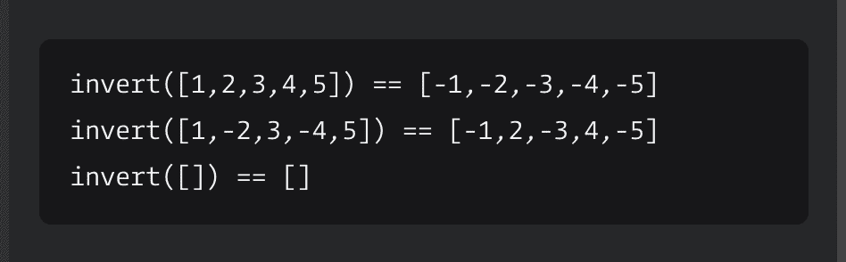

# 如何在 JavaScript 中求每个数的加法逆[CodeWars 挑战赛已解]

> 原文：<https://www.freecodecamp.org/news/find-the-additive-inverse-of-numbers-javascript/>

在本教程中，我们将讨论如何解决 JavaScript 中的 CodeWars [反转值](https://www.codewars.com/kata/5899dc03bc95b1bf1b0000ad/train/javascript)问题。

我们将首先通读问题并确保理解它，而不是一头扎进代码中。接下来，我们将编写伪代码，作为解决问题的指南。最后，我们将编写代码本身。

我们开始吧！

## 首先，通读问题

以下是问题描述:

给定一组数字，返回每个数字的加法逆。每一个积极都变成消极，消极也变成积极。

**你可以假设所有的值都是整数。不要改变输入数组/列表。**

要解决这个问题，首先我们需要确保我们理解它。让我们复习一些我们可以问自己的问题来帮助我们理解这个问题。

## 输入是什么？

这个问题的可能输入是什么？这个函数将接收什么？

问题描述说，‘*给定一组数字。这告诉我们，我们的输入是一组数字。*

这个问题还告诉我们，假设所有这些数字都是整数。

最后，从问题给出的例子中，我们可以看到这组数字将位于数组内部:



收集了这些信息，我们可以说我们的输入将是一个整数数组。

## 输出是什么？

接下来我们可以问自己，输出是什么？这个函数将返回什么？

从问题的例子中我们可以看到，我们的输出是一个数组，每个数字都变成了它的加法逆。

现在我们知道了输入和输出。接下来我们将看几个这个问题的例子。

## 输入和输出的例子有哪些？

我们已经有了上述问题的输入和输出的例子，但有时自己写几个会有帮助，以便更好地理解问题要求你做什么。这里有一个输出和输入的例子:

```
//input
[2, 3, -4]

//ouput
[-2, -3, 4]
```

现在我们知道了我们的输入和输出，并且我们有一些例子。

现在我们准备继续编写伪代码，这是我们编写解决方案之前的最后一步。伪代码是算法步骤的简单语言描述。伪代码将帮助我们创建一个如何解决这一挑战的计划。

要写我们的伪代码，先把问题一步一步分解。

## 如何分解这个问题

我们需要能够查看输入数组中的每个数字并对其进行处理。我们还想返回一个新的数组，每个数字都改变了。

为此，我们可以使用 JavaScript 中的`map`方法，该方法返回一个新数组，其中填充了调用数组中每个元素的函数的结果。

作为第一步，我们将用伪代码写出来:

```
//step one: go through each number in the array using map method
```

对于数组中的每一个数，我们想把它变成它的加法逆。我们需要理解这意味着什么，因此我们将阐明加法逆运算的定义:

在数学中，一个数 a 的**加逆**是当加到 a 上时产生零的数。这里有几个例子:

10 的加法倒数是+10，因为 10 + 10 = 0

2 的加法倒数为+2，因为 2 + 2 = 0

要得到一个数的加法逆，我们可以把它乘以-1。我们可以用一些例子来验证这一点:

`10 * -1 = -10`

`-2 * -1 = 2`

我们现在知道，如果我们将每个数字乘以-1，我们将得到该数字的加法逆。我们可以将它添加到伪代码中:

```
/* 
step one: go through each number in the array using the map method
step two: multiply each number by -1
*/ 
```

最后，我们需要返回我们的新数组。

```
/* 
step one: go through each number in the array using the map method
step two: multiply each number by -1
step three: return new array
*/ 
```

## 如何编码解决方案

既然我们已经写了伪代码，我们可以用它作为指南来编写我们的解决方案。

```
function invert(array) {
   return array.map(num =>   {
     return num * -1
   })
}
```

当我们在 CodeWars 上测试我们的解决方案时，它成功了！我们创建了函数`invert`，它接受一组数字。我们映射数组，对于数组中的每个数字，我们将它乘以-1。然后我们返回新的数组。

我们可以看到它通过了所有的测试。如果我们想让我们的解决方案看起来更整洁一点，我们可以做一个隐式返回，并删除内部的花括号和内部的`return`关键字。

```
function invert(array) {
   return array.map(num => num * -1)
}
```

就是这样！现在我们已经完成了反演值的问题。我们确保首先理解了问题，用伪代码写出了完成问题的步骤，然后编写了解决方案。

要查看这个问题的其他解决方案，你可以在这里看到它们。

### **感谢您的阅读！**

如果你喜欢这篇文章，请注册[我的电子邮件列表](https://madisonkanna.us14.list-manage.com/subscribe/post?u=323fd92759e9e0b8d4083d008&id=033dfeb98f)，在那里我会发送我的最新文章，并宣布我的编码图书俱乐部的会议。

如果你对这篇文章有任何反馈或问题，欢迎发微博给我@ [madisonkanna。](https://twitter.com/Madisonkanna)