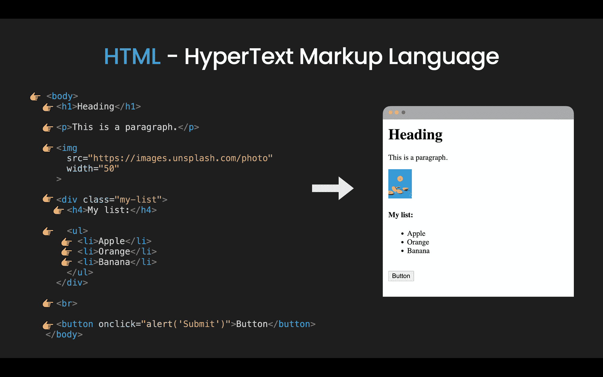
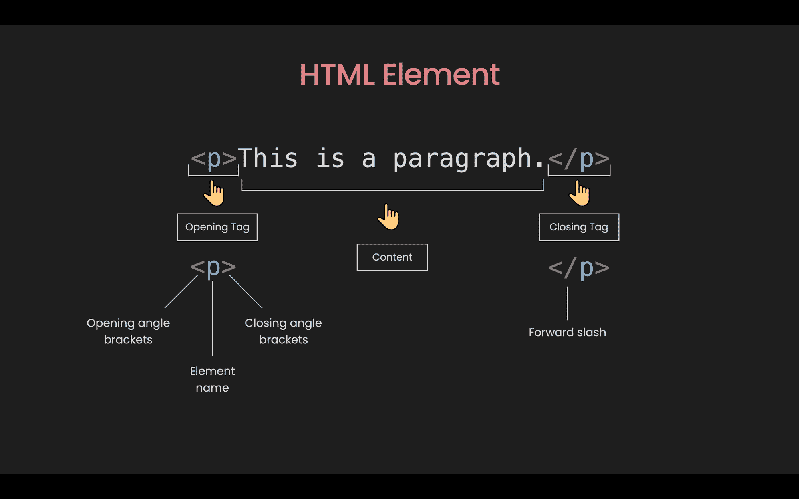
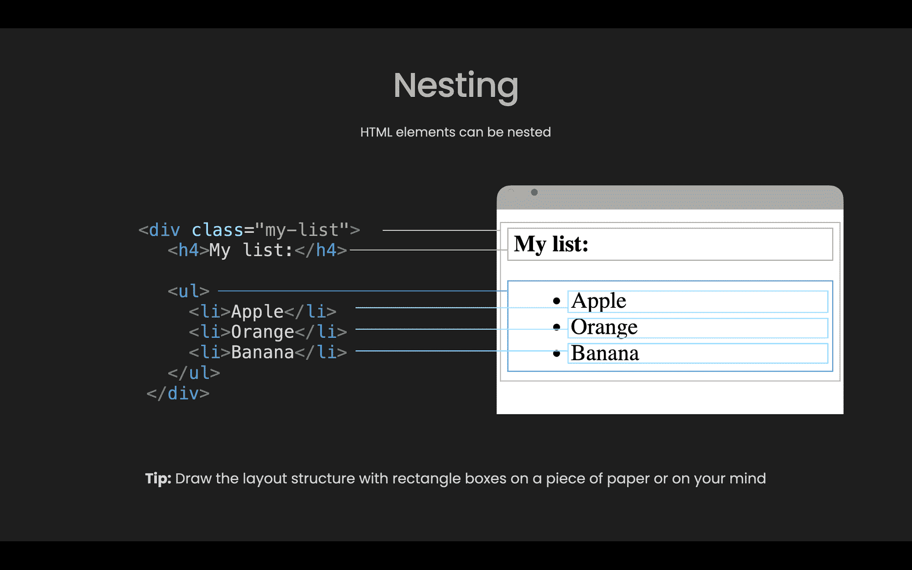
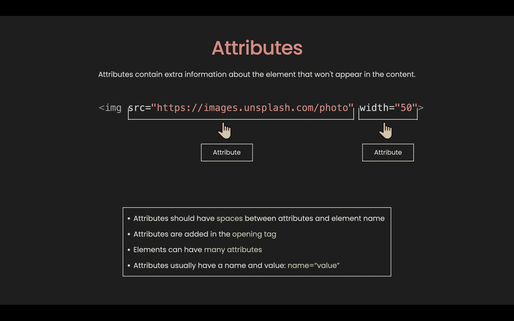

# 只需 15 分钟，初学者就能学会 HTML 基础知识

> 原文：<https://www.freecodecamp.org/news/html-basics-for-beginners/>

如果你想建立一个网站，你需要学习的第一门语言是 HTML。

在这篇文章中，我们将浏览 HTML 的基础知识。最后，我们将建立一个只使用 HTML 的基本网站。

这里有一个视频，想补充本文的可以看:

[https://www.youtube.com/embed/pMJ0NI3OkYA?feature=oembed](https://www.youtube.com/embed/pMJ0NI3OkYA?feature=oembed)

If you prefer video, you can watch it here

## 什么是 HTML？

HTML 代表超文本标记语言，是一种非常简单的语言。它由我们用来构建网页的不同元素组成。



What is HTML?

## 什么是 HTML 元素？



HTML elements

元素通常以开始标记开始，开始标记由元素的名称组成。它被包在左尖括号和右尖括号中。开始标记指示元素开始的位置。

与开始标记类似，结束标记也包含在开始和结束尖括号中。但是它还在元素名称前包含一个正斜杠。

开始和结束标记中的所有内容都是内容。

但是并不是所有的元素都遵循这种模式。我们称之为非空元素。它们只包含一个标签或一个不能包含任何内容的开始标签。这些元素通常用于在文档中插入或嵌入内容。

例如，``元素用于嵌入图像文件，或者`<input>`元素用于在页面上插入输入。

```

```

在上面的例子中，``元素只包含一个没有任何内容的标签。该元素用于在文档中插入来自 [Unsplash](https://unsplash.com/) 的图像文件。

## 如何嵌套 HTML 元素

```
<div class="my-list">
  <h4>My list:</h4>

  <ul>
     <li>Apple</li>
     <li>Orange</li>
     <li>Banana</li>
  </ul>
</div> 
```

元素可以放置在其他元素中。这叫做嵌套。在上面的例子中，在`<div>`元素中我们有一个`<h4>`元素和一个`<ul>`或无序列表元素。类似地，在`<ul>`元素中，有 3 个`<li>`或列表项元素。

基本的嵌套很容易理解。但是当页面变大时，嵌套会变得复杂。

因此，在使用 HTML 之前，考虑一下你想要的布局结构。你可以把它画在纸上或记在心里。会有很大帮助。



## 什么是 HTML 属性？

元素也有属性，属性包含元素的额外信息，这些信息不会出现在内容中。

```

```

在上面的例子中，``元素有两个属性:`src`或 source 来指定图像的路径，`width`以像素为单位指定图像的宽度。



在此示例中，您可以看到属性的以下特征:

*   属性和元素名称之间有一个空格
*   属性被添加到开始标记中
*   元素可以有许多属性
*   属性通常有一个名称和值:name="value "

但不是每个属性都有相同的模式。有些可以没有值而存在，我们称之为布尔属性。

```
<button onclick=“alert('Submit')" disabled>Button</button>
```

在这个例子中，如果我们想禁用按钮，我们所要做的就是传递一个没有任何值的`disabled`属性。这意味着属性的存在代表真值，否则，不存在代表假值。

### 常见 HTML 元素

总共有 100 多个元素。但是 90%的时候你只会使用 20 个左右最常用的。我把他们分成 5 组:

#### 截面元素

```
 <div>, <span>, <header>, <footer>, <nav>, <main>, <section> 
```

这些元素用于将内容组织成不同的部分。它们通常是不言自明的，例如，`<header>`通常表示一组介绍和导航部分，`<nav>`表示包含导航链接的部分，等等。

#### 文本内容

```
 <h1> to <h6>, <p>, <div>, <span>, <ul>, <ol>, <li> 
```

这些元素用于组织内容或文本块。它们对可访问性和 SEO 很重要。它们告诉浏览器内容的目的或结构。

#### 形式

```
 <form>, <input>, <button>, <label>, <textarea> 
```

这些元素可以一起用来创建用户可以填写和提交的表单。表单可能是 HTML 中最棘手的部分。

#### 图像和链接

```
 , <a> 
```

这些元素用于插入图像或创建超链接。

#### 其他人

```
 <br>, <hr> 
```

这些元素用于给网页添加断点。

你可以在 developer.mozilla.org 上找到所有的元素。但是对于初学者来说，只需要知道最常见的几种就可以了。

## 块级与内联 HTML 元素

默认情况下，元素可以是块级的，也可以是行内元素。

块级元素是总是从新行开始并占据整个可用宽度的元素。

行内元素是不从新行开始的元素，它只占用必要的宽度。


Block level vs. Inline HTML elements

分别代表块级和内联元素的两个元素是`<div>`和`<span>`。在这个例子中，您可以看到`<div>`元素占用了 3 行，而`<span>`元素只占用了 1 行。

但问题是:我们如何知道哪些是块级元素，哪些是行内元素？不幸的是，你需要记住它们。最简单的方法是记住哪些是行内元素，其余的是块元素。

如果我们回头看看最常见的 HTML 元素，内联元素包括:`<span>, <input>, <button>, <label>, <textarea>, , <a>, <br>`。

## 如何在 HTML 中注释

```
<p>This is a paragraph.</p>

<!-- <p>I am not showing.</p> --> 
```

注释的目的是在代码中包含注释，以解释您的逻辑或简单地组织您的代码。

HTML 注释包含在特殊标记:`<!-- and -->`中，在浏览器中会被忽略。

## 如何使用 HTML 实体

如果你想显示文本:`the <p> tag defines a paragraph.`，但是浏览器把`<p>`解释为一个新元素的开始标签怎么办？在这种情况下，我们可以使用 HTML 实体，如下例所示:

```
<p>the <p> tag defines a paragraph.</p>

<p>the &lt;p&gt; define a paragraph.</p> 
```

## 如何在 HTML 中使用表情符号

在现代网络中，我们可以很容易地在 HTML 中显示表情符号，就像这样:👻

```
<p>😀 Grinning Face.</p>

<p>🎂 Birthday</p> 
```

## HTML 初学者的常见错误

### 1.标签/元素名称

标签/元素名称不区分大小写。这意味着它们可以用小写或大写来写，但建议你把所有东西都用小写来写:`<button>`而不是`<ButTon>`。

### 2.结束标签

没有包含结束标签是初学者常见的错误。因此，无论何时创建开始标记，都要立即加入结束标记。

### 3.嵌套

这是错误的:

```
<div>Div 1 <span> Span 2 </div></span> 
```

标签必须以一种方式打开和关闭，即它们在另一个的内部或外部。

### 4.单引号和双引号

这是错误的:

```
 
```

不能混合使用单引号和双引号。你应该总是使用双引号，并在需要时使用 HTML 实体。

## 如何用 HTML 建立一个简单的网站

单个 HTML 元素不足以创建一个网站。因此，让我们看看我们还需要什么来从头构建一个简单的网站。

### 如何创建 HTML 文档

首先，我们打开 [Visual Studio 代码](https://code.visualstudio.com/)(或者你喜欢的代码编辑器)。在你选择的文件夹中，创建一个新文件，命名为 index.html。

在 index.html 文件中，键入！(感叹号)并按 enter 键。您将看到类似这样的内容:

```
<!DOCTYPE html>
<html lang="en">
<head>
    <meta charset="UTF-8">
    <meta name="viewport" content="width=device-width, initial-scale=1.0">
    <title>Document</title>
</head>
<body>

</body>
</html> 
```

这是一个 HTML 文档组成一个网站所需的最少代码。这里我们有:

1.  首先我们有 Doctype。由于一些奇怪的历史原因，我们必须在 HTML 中包含 doctype，这样一切才能正常工作。
2.  `<html lang="en"></html>`:`<html>`元素包装页面上的所有内容，也称为根元素。我们应该始终包含`lang`属性来声明页面的语言。
3.  `<head></head>`:`<head>`元素是你想要包含的所有内容的容器，但不是你向用户显示的内容。
4.  `<meta charset="UTF-8" />`:第一个元元素用于设置字符集为 UTF-8，其中包含了绝大部分来自书面语言的字符。
5.  `<meta name="viewport" content="width=device-width, initial-scale=1.0" />`:第二个元元素指定浏览器视口。此设置适用于移动优化网站。
6.  `<title>Document</title>`:这是`<title>`元素。它设置页面的标题。
7.  `<body></body>`:`<body>`元素包含页面上的所有内容。

### 如何建立一个煎饼食谱网页

好了，现在我们有了启动代码，让我们建立一个煎饼食谱页面。我们将使用这个 [AllRecipes 页面](https://www.allrecipes.com/recipe/21014/good-old-fashioned-pancakes/)中的内容。

首先，我们来给出煎饼配方的`<title>`元素含量。您将看到网页选项卡上的文本发生了变化。在`<body>`元素中，我们创建 3 个元素:`<header>`、`<main>`和`<footer>`，分别代表 3 个部分。

#### 1.构建标题部分

在标题中，我们希望有标志和导航。因此，让我们为徽标创建一个内容为`ALL RECIPE`的`div`。

对于导航，让我们使用`<nav>`元素。在`<nav>`元素中，我们可以使用`<ul>`来创建一个无序列表。我们希望 3 个链接有 3 个`<li>`元素:配料、步骤和订阅。标题代码如下所示:

```
...
    <header>
      <div>ALL RECIPE</div>
      <nav>
        <ul>
          <li><a href="#ingredients">Ingredients</a></li>
          <li><a href="#steps">Steps</a></li>
          <li><a href="#subsribe">Subscribe</a></li>
        </ul>
      </nav>
    </header>
... 
```

#### 2.构建主要部分

在主要部分，首先，我们要有一个标题和一个图像。我们可以使用`h1`作为标题，使用``作为图片(我们可以免费使用来自 [Unsplash](https://images.unsplash.com/) 的图片):

```
...
    <main>
      <h1>Good Old Fashioned Pancakes</h1>
      
    </main>
... 
```

接下来，我们要列出所有的成分。我们可以使用`<ol>`创建一个有序列表，使用`<input type="checkbox" />`创建一个复选框。

但在此之前，我们可以使用`<h2>`开始一个新的内容块。我们还想为`<h2>`添加`id`属性，以便导航中的链接知道去哪里:

```
...
    <main>
    ...
      <h2 id="ingredients">Ingredients</h2>
      <ol>
        <li><input type="checkbox" /> 1 ½ cups all-purpose flour</li>
        <li><input type="checkbox" /> 3 ½ teaspoons baking powder</li>
        <li><input type="checkbox" /> 1 teaspoon salt</li>
        <li><input type="checkbox" /> 1 tablespoon white sugar</li>
        <li><input type="checkbox" /> 1 ¼ cups milk</li>
        <li><input type="checkbox" /> 1 egg</li>
      </ol>
    </main>
... 
```

配料之后，我们要列出所有的步骤。我们可以使用`<h4>`作为步骤标题，使用`<p>`作为步骤内容:

```
...
    <main>
    ...
      <h2 id="steps">Steps</h2>

      <h4>Step 1</h4>
      <p>
        In a large bowl, sift together the flour, baking powder, salt and sugar.
        Make a well in the center and pour in the milk, egg and melted butter;
        mix until smooth.
      </p>

      <h4>Step 2</h4>
      <p>
        Heat a lightly oiled griddle or frying pan over medium-high heat. Pour
        or scoop the batter onto the griddle, using approximately 1/4 cup for
        each pancake. Brown on both sides and serve hot.
      </p>
    </main>
... 
```

好了，现在我们已经完成了主要部分，让我们继续到页脚部分。

#### 3.构建页脚部分

在页脚，我们希望有一个订阅形式和版权文本。

对于订阅表单，我们可以使用`<form>`元素。在它里面，我们可以有一个用于文本输入的`<input type="text">`和一个用于提交按钮的`<button>`。

对于版权文本，我们可以简单地使用一个`<div>`。注意这里，我们可以使用 HTML 实体`$copy;`作为版权符号。

我们可以添加`<br>`在订阅表单和版权文本之间添加一些空间:

```
...
    <footer>
      <h6 id="subscribe">Subscribe</h6>
      <form onsubmit="alert('Subscribed')">
        <input type="text" placeholder="Enter Email Address" />
        <button>Submit</button>
      </form>
      <br />
      <div>&copy; dakota kelly at Allrecipe.com</div>
    </footer>
... 
```

好了，现在我们完成了！以下是完整代码供参考:

```
<!DOCTYPE html>
<html lang="en">
  <head>
    <meta charset="UTF-8" />
    <meta name="viewport" content="width=device-width, initial-scale=1.0" />
    <title>Pancake Recipe</title>
  </head>
  <body>
    <header>
      <div>ALL RECIPE</div>
      <nav>
        <ul>
          <li><a href="#ingredients">Ingredients</a></li>
          <li><a href="#steps">Steps</a></li>
          <li><a href="#subsribe">Subscribe</a></li>
        </ul>
      </nav>
    </header>
    <main>
      <h1>Good Old Fashioned Pancakes</h1>
      
      <h2 id="ingredients">Ingredients</h2>
      <ol>
        <li><input type="checkbox" /> 1 ½ cups all-purpose flour</li>
        <li><input type="checkbox" /> 3 ½ teaspoons baking powder</li>
        <li><input type="checkbox" /> 1 teaspoon salt</li>
        <li><input type="checkbox" /> 1 tablespoon white sugar</li>
        <li><input type="checkbox" /> 1 ¼ cups milk</li>
        <li><input type="checkbox" /> 1 egg</li>
      </ol>
      <h2 id="steps">Steps</h2>
      <h4>Step 1</h4>
      <p>
        In a large bowl, sift together the flour, baking powder, salt and sugar.
        Make a well in the center and pour in the milk, egg and melted butter;
        mix until smooth.
      </p>
      <h4>Step 2</h4>
      <p>
        Heat a lightly oiled griddle or frying pan over medium-high heat. Pour
        or scoop the batter onto the griddle, using approximately 1/4 cup for
        each pancake. Brown on both sides and serve hot.
      </p>
    </main>
    <hr />
    <footer>
      <h6 id="subscribe">Subscribe</h6>
      <form onsubmit="alert('Subscribed')">
        <input type="text" placeholder="Enter Email Address" />
        <button>Submit</button>
      </form>
      <br />
      <div>&copy; dakota kelly at Allrecipe.com</div>
    </footer>
  </body>
</html> 
```

## 结论

你可以只用 HTML 建立一个简单的网站。但是为了能够建立美观实用的网站，你需要学习 CSS 和 JavaScript。

你可以在社交媒体或 Youtube 上关注我，了解这些主题的未来更新。但与此同时，你可以查看 [freeCodeCamp 课程](https://www.freecodecamp.org/learn)通过解决小任务来练习 HTML。

否则，祝你编码愉快，在以后的帖子中再见👋。

_ _ _ _ _ _ _ _ _ _ _ _ _🐣关于我 _ _ _ _ _ _ _ _ _ _ _ _

*   我是[发展挑战](https://devchallenges.io/)的创始人
*   订阅[我的频道](https://www.youtube.com/c/thunghiem)
*   关注我的推特
*   加入[不和](https://discord.com/invite/3R6vFeM)