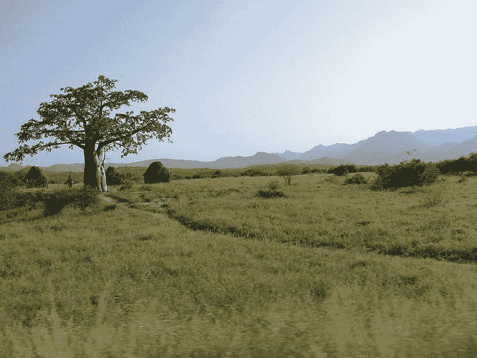

# 我是如何从土木工程师到网络开发人员，使用 freeCodeCamp 学习编码的

> 原文：<https://www.freecodecamp.org/news/from-civil-engineer-to-web-developer-with-freecodecamp/>

嘿大家好！👋

2020 年是非常艰难的一年。

新冠肺炎疫情仍然强劲。一些人生病或正在从病毒中恢复，一些人是悲痛的家人或朋友，一些人失去了工作，还有一些人看到他们的业务分崩离析。

在这种时候，我们会在从未想象过的情况下接受考验。这总是意味着有成长的机会。

让我和你们分享一下我是如何学习编码的故事，这个故事在这个时间点上对我来说是有意义的。

## 我作为土木工程师的生活

那是 2015 年 1 月，我开车旅行，从万博到库巴尔(两个安哥拉城镇)开始一个新项目:我们正在修建一条 100 公里长的公路，以便在两个相距遥远的城市库巴尔和 Chongoroi 之间建立一条捷径。

我旁边是佩德罗，一位经验丰富的土壤和混凝土实验室技术员。他是我的副驾驶，我的朋友，也是一个伟大的专业人士，帮助我确保建设的所有技术方面都在控制之下。我本人作为一名高级土木工程师，忙于管理和跟踪政府与承包商之间的合同。

两个葡萄牙侨民在荒郊野外。我们刚刚离开万博，已经出城很远了，这时我们在一个平交道口停下来，等着一辆火车经过。

收音机正在播放《非洲融合》的热门歌曲，我突然告诉他:

> “又是一月了...新的一年开始了，你知道，我的生活完全颠倒了，就像我从未想象过的那样。一塌糊涂。我的感情已经死亡，几乎没有钱，我的女儿(长子)离我很远，最重要的是，**我完全厌倦了这份工作**。

我们都被迫去国外工作，逃离 GFC(2007-2008 年的全球金融危机)和随后的葡萄牙金融危机。它淹没了建筑市场，使其陷入严重衰退，我们很快在 2015 年陷入安哥拉石油危机。

这是我人生中一个重大转变的开始，我后来才意识到这一点。

我们住在库巴尔，一个被 1975-2002 年独立和内战摧毁的前殖民地小镇。除了白天工作，晚上喝啤酒，在田野里的猴面包树间游荡，没有别的事可做。

Baobab tree near Cubal

与此同时，我开始管理其他合同，旅行变得像一项激烈的运动。我一个月差不多走 10，000 公里，几乎是从东海岸到西海岸，从本格拉的海滩到非洲的内陆，靠近赞比亚西部边境的库伊托库阿那瓦尔。

这段时间很宝贵，它帮助我激发了改变的欲望。日复一日，我和佩德罗的冲突开始在我脑海中交织，我改变生活的需求越来越强烈。

## 改变的需要

我的第一个改变是更好地用刺激大脑的活动来占据我的时间。我开始大量阅读，在电脑上看电影，设计将永远改变我生活的总体规划。

四月，我回到了葡萄牙，与我共度了 13 年时光的终身伴侣分开了。此后不久，我回到安哥拉继续工作。

但是我一直在进步。我开始做大量的运动来让我的生活充满好习惯。

过了一会儿，我遇到了我未来的妻子。她是古巴的一名银行会计，我们开始约会的时间比我预想的要早。

我继续改善我的生活，总是阅读，总是寻找各种各样的知识。后来事情开始发生变化。

一年过去了，已经是 2016 年 9 月，突然事情变得糟糕了很多。经济石油危机与日俱增，每桶石油价格暴跌至 40 美元以下。宽扎(安哥拉的货币)以美元计跌至其典型值的五分之一左右。

一些工资被拖欠了，我们的钱也快用完了。那时，除了我的长子玛丽亚，我已经有了我的新伴侣(现在的妻子)本文达，我的继女特蕾莎，以及我们的小宝宝贝尼迪塔。

我必须改变我们生活中的一些东西。我的妻子正在努力保住她的工作(银行每天都在关闭分行)，不可能从安哥拉向葡萄牙汇款，因为宽扎变得非常不稳定，而且是一种被封锁的货币(在该国境外不可兑换)。

2016 年圣诞节到了，我去了葡萄牙旅行。

我已经厌倦了如何摆脱目前的处境。我坐在电脑前，试图建立一个小网站来帮助我管理我在安哥拉的团队和工作费用。

我一直喜欢电脑，很久很久以前，我就一头扎进了 HTML、CSS 和 LAMP stack。这很难，但我知道不可能学到更多。这将有助于我不再去想当时我们的处境有多艰难，我们的钱是如何用完的。

很快我发现我所知道的编程知识不足以做我想做的事情。所以，作为一种爱好，我开始学习一点。我试图解决每一个我需要让事情运转起来的问题。

我找到了一些网站和一些教程，但我有点困惑。我不知道先学什么。该不该学 MySQL？PHP？Ruby on Rails？

## 寻找免费代码营

2017 年初我发现了 freeCodeCamp，并立即开始调查它([此处](https://forum.freecodecamp.org/top))。我读了很多关于人们用 freeCodeCamp 做什么，关于职业改变，编程，工作面试和薪水。我不敢相信我所看到的。这可以解决我的工作问题。

1 月 3 日，我开始全力以赴地学习 freeCodeCamp 的课程。

那时，我发现亚历克斯·卡拉威的#100DaysOfCode 非常鼓舞人心，我立即感到我的生活需要这种能量。

通过 freeCodeCamp 社区，我很快认识了 joo Henri que，他也“只是为了好玩”而创办了 freeCodeCamp。joo 住在我家附近(60 公里)，很快我们就成了学习伙伴，并开始互相支持。没有他，要站起来会困难得多。

我们一起开始了我们的第一次免费代码营当地聚会(免费代码营阿尔加维诞生)！我们一开始不知道，也只有我们。很快我们就会聚集 10-20 个人和我们聊天和编码(但那是另一个故事了)。

我很快超越了第一个障碍，到达了 JavaScript 部分。与此同时，我开始阅读大量关于编程的书籍，并很快开始钻研。

一种古老的激情被唤醒了。freeCodeCamp 路线图帮了大忙。我们只是遵循提出的挑战，而没有质疑过程。

不知何故，我看到了未来，看到了变化，看到了我和家人生活的改善。我一直在阅读 freeCodeCamp 论坛上的帖子，因为这是我最大的信仰来源。每天都有人发布“找到了我的第一份工作！”贴吧。

我在安哥拉工作了一段时间。二月份，我回到那里，向我的妻子解释了这将如何改变我们的生活。一旦我找到一份程序员的工作，我们就可以住在葡萄牙。白天做土木工程师，晚上学习，我已经完成了前端认证。

西蒙游戏几乎要了我的命，但我最终还是做到了！

多亏了 Miguel Coquet(我以前的导师，后来的第一个雇主)指导我理解 JavaScript 的异步本质的复杂性，我才能够做到这一点。感觉棒极了。这是一个伟大的胜利，在深夜，在我临时工作和生活的那个工地上。

我已经做了决定。无论如何，我都要成为一名程序员。

## 回到葡萄牙的生活

2017 年 5 月，我离开安哥拉，住在父母的房子里，带着我和妻子仅有的一点积蓄，夜以继日地学习。当我再也睁不开眼睛的时候，我会睡上几个小时。这并不容易。但这是可能的，我对我所做的事情充满热情。

我的妻子和孩子在安哥拉呆了一段时间。很痛苦。一个月又一个月，我们都在想我们什么时候能再在一起。这对我们来说是一个很大的教训:要有耐心，并相信我们很快就会在一起，很好。我们不知道是什么时候，但我们全心全意地相信它。

当你真正致力于某事时，你就能实现它。相信它是可能的，这是实现它并实现它的首要因素。

在葡萄牙，我比在安哥拉有更多的机会。有一个当地社区- [极客会议](https://geeksessions.io/) -和一些 kewl 家伙组织活动，如讲座和研讨会(如 nodeschool)。

我开始接触并了解这个社区。

我第一次见到了与编程息息相关的人——真正的开发人员——并得到了三位伟大的官方导师:[米盖尔·科凯特](https://twitter.com/mcoquet)、[尼尔森·内维斯](https://twitter.com/botdream)和[安德烈·乔纳斯](https://twitter.com/andrezzoid)。再次感谢各位为我所做的一切。

我的学习速度提高了很多。我很快就进入了 Node.js 和 MongoDB。在几个月内，我能够构建一个最小的全栈应用程序(一个前端，一个后端和一个数据库)。

## 得到我的第一份开发工作

然后*瞧*时刻发生了。freeCodeCamp 为我提供了成为入门级全栈开发人员的所有要素。

2017 年 9 月，我被 Miguel Coquet 聘用。我从没想到会发生得这么快。他开始经营自己的咨询公司，并在我身上看到了一些东西。脆弱，勇气，力量，以及将我一生都押在这份工作上的能力，这份工作是我如此渴望和需要的。

我的第一份工作已经很遥远了——在他的指导和指引下——在阿姆斯特丹的一家中型公司工作。

我不敢相信我作为一名程序员在赚钱。我活了下来！！

计算机和编程一直是我的爱好，突然之间我就用它来买食物了。一开始是非常不错的薪水，帮助我很快与葡萄牙的家人团聚。

就在 2018 年夏天之前，我的妻子、孩子和我一起在葡萄牙庆祝 Benedita 的第二个生日。

## 作为开发人员的生活

从那以后，我一直在快速学习和阅读。成为一名程序员让你成为一名终身学习者，这是做 freeCodeCamp 最大的隐藏价值之一。

你很快学会了自主。但是它也为你提供了你所需要的来自它的社区的所有支持。一般的经验法则是“阅读、搜索、询问”。

现在，我是一家瑞典公司的远程前端开发人员，为广播公司开发敏捷的远程协作和制作解决方案。我赚的钱比 95%的葡萄牙人都多，而且不用离开家。

如果你在 2015 年告诉我这些，我是不会相信这是可能的。五年过去了，这是一段很长的时间。但是事情发生的比你想象的要快。

我的职业生涯重启非常快(8 个月，其中 3 个月我白天工作)。要是我以前知道 freeCodeCamp 就好了！🙈

因此...

## 采取接下来的步骤

也许你现在的感觉和 2015 年的我一样，没有希望，没有动力，没有力量，没有信仰。

如果你找到了这篇文章，也许你正在寻找一些东西，但你不知道到底是什么。

也许生活在向你传递一个信息，那就是你还有希望，有一条路，有一个解决方案。

也许你不知道改变的最佳时机就是现在。

只要相信，投入所有的努力，投入时间，夜以继日地工作，与人交谈，找到一个“旅行伴侣”，找到一个导师，学习，成长，诚实地暴露你的弱点，失败，问你所有的问题(没有愚蠢的问题)，并让它发生。❤️

## 为什么你应该开始[免费代码营](https://www.freecodecamp.org/)

在我看来，这些是 freeCodeCamp 的主要优势:

*   是**完全免费**。当你没钱的时候，这一点非常重要。相信我，付费训练营并不比免费训练营好。你所需要的就是努力，成为你学习的动力。在付费训练营，你必须做完全一样的事情。
*   它为初学者提供了一个**用户友好的**环境，采用婴儿学步的方式编写代码。
*   它为你提供了一个很棒的**路线图**:你不必为应该先学什么而感到困惑。如果你想在网络上工作，这是它。
*   它为你提供了一个简单的规则:**“阅读、搜索、提问”**，如果你正确应用，它将帮助你真正擅长在谷歌上搜索你需要的东西。最后，如果你仍然停滞不前，社区会支持你。相信我，这是你可以期望学习如何编码的最好的社区。
*   它为你提供了**个具有挑战性的项目**。最终我们想要的是**通过做**来学习。这将使你仔细阅读挑战，研究如何解决它们，学习技术，并**与其他学生或导师**讨论。通过这个过程，你会发现成功“工作”所需的一切。
*   freeCodeCamp 是一件**严肃的事情**。不要认为你需要一个昂贵的付费训练营或大学的证书。我做过几十次采访，人们已经知道了 freeCodeCamp。我已经被一个做过 freeCodeCamp 的人采访过了。每个人都认识一个在 kewl 公司做 freeCodeCamp 的优秀开发人员。此外，公司知道你是一个自我激励的人，一个终身学习者，在一个问题中，拥有努力解决这些问题的工具。而这正是企业想要的。推动他们成功的人，提出解决方案而不是问题的人。

不要觉得自己年纪太大，或者觉得现在的工作和代码无关。我重启的时候 37 岁，带了很多软技能。每个有工作经验的人都会带来一套非常有用和令人钦佩的技能。

如果你对计算机、编程、网络和书呆子气的东西充满热情，你一点也不会后悔。它一定会让你的生活变得更好。

为大家干杯，新年快乐，别忘了编码，编码，编码。

嘿，总有一天你会在推特上联系我，告诉我你过得怎么样！♥️