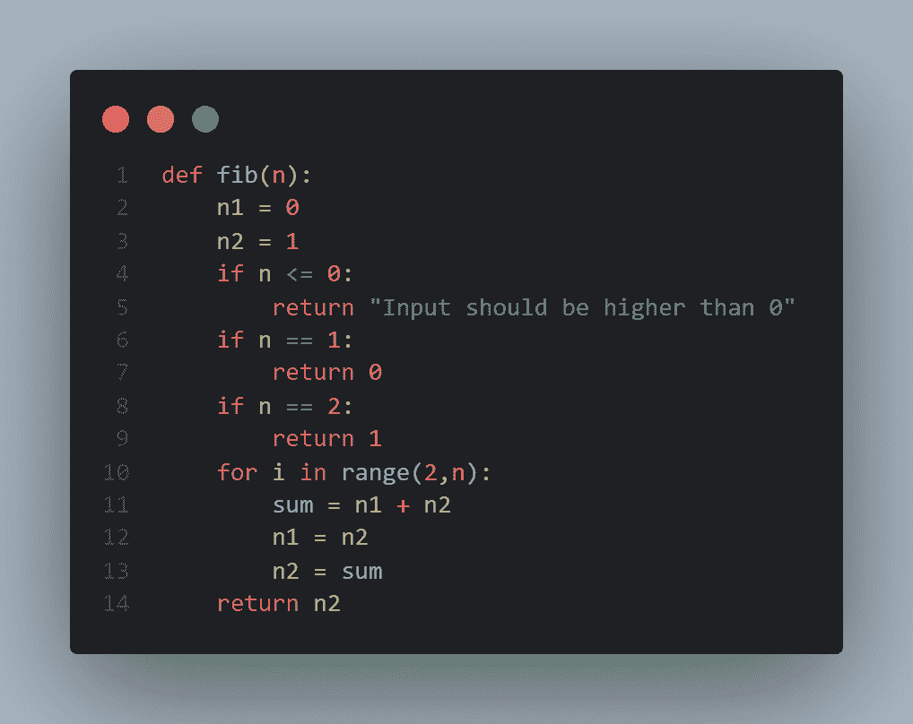
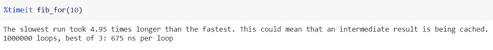
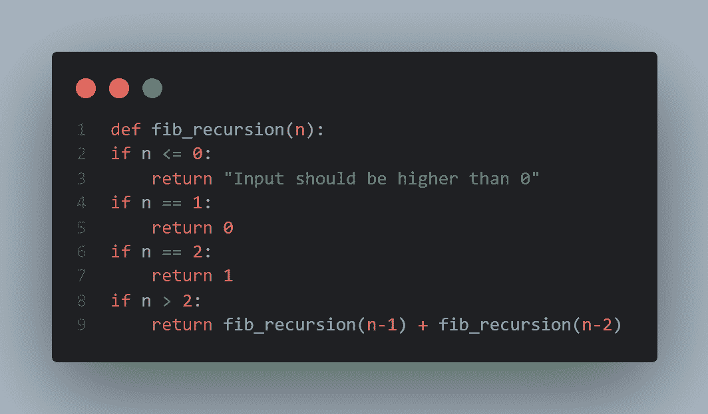
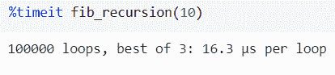
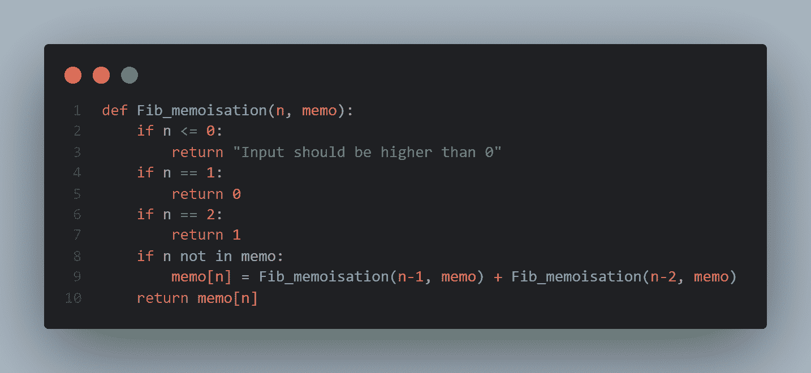
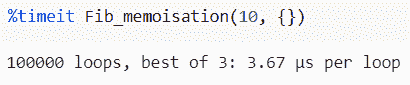

# Python 中的记忆、递归和 For 循环解释

> 原文：<https://www.freecodecamp.org/news/python-memoization-recursion-for-loop/>

> 做事的方法不止一种。总是有不同的观点和风格。~ *****迪姆哈德森*****

在本文中，我们将使用 Python 中的三种不同技术来编写一个基本的 Fibonacci 程序，它将给出序列的总和作为结果。斐波纳契数列是 0，1，1，2，3，5，8...

您可能已经注意到，我们将第一个和第二个数字 0 和 1 相加，得到序列中的第三个数字(1) -> 0+1=1。然后，我们将第二个和第三个数字相加，1+1=2，得到序列中的第四个数字...诸如此类。

您可以在 Jupyter、Colab 或任何您喜欢的 IDE 或文本编辑器中实现这些代码。

## 如何使用 Python 中的 For 循环对斐波那契数列进行编码

在这里，我用 Python 写了一个使用 for 循环的基本 Fibonacci 程序。这背后的逻辑很简单，我们已经在上面讨论过了。

时间复杂度为 O(N ),空间复杂度为 O(1)或常数。但是，它实际上比这种复杂性所暗示的更复杂。

> “如果你的数字小于 *N < 94* ，并且你使用一个 64 位整数，那么该算法作为一个线性复杂度。然而，对于 *N > 94* ，它开始表现得像一个二次复杂度算法。”~ [迈克尔维克斯列尔](https://qr.ae/pNxAka)

Printing a Fibonacci result using a For Loop

我将使用 Python 的`%timeit`模块来运行它。这避免了许多测量执行时间的常见陷阱。你可以在这里看到更多的用途。

It took 675 nanoSec per loop for 10

## 如何用 Python 递归编码斐波那契数列

这里，我们将使用递归实现序列。递归函数倾向于重复调用它们自己，直到它们到达基本情况。因此，递归创建了一个树形结构。

如果我们取一个 5 的斐波纳契数列，这就是通过递归创建的树。

空间复杂度是 O(N ),时间复杂度是 O(2^N ),因为根节点有 2 个孩子和 4 个孙子。如您所见，每个节点都有两个子节点。

现在深度是 N，这意味着我们要这样做 N 次。此外，您可能已经注意到，右边的子树比左边的子树小，所以真正的运行时大约是 O(1.6^ *N* 。

基本情况:*斐波那契(2)*=*Fib(1)*+*Fib(0)*=*1+0 = 1*

Printing Fibonacci result using Recursion

递归 Fibonacci 例子肯定比 for 循环快。

## 如何在 Python 中使用 Memoisation 编码斐波那契数列

内存优化是一种通过减少计算负担来显著提高递归函数性能的技术。

它[将昂贵的函数调用的结果存储在数组](https://en.wikipedia.org/wiki/Memoization)或字典中，并在调用相同的输入时返回缓存的结果。

您可以参考上面的树，以及每次调用某些输入时，它们是如何被重新计算的。

Printing Fibonacci result using Memoisation

时间复杂度为 O(nlogn)。

## 递归、for 循环和内存化哪个更好？

现在，这些技术不应该比另一个更好。你只需要知道什么时候需要使用哪一个。这当然取决于你的要求。

迭代将比递归更快，因为递归必须处理递归调用堆栈帧。但是，如果递归是用优化尾部调用的语言编写的，那么它就消除了开销，几乎与 for 循环不相上下。

最后，当状态空间稀疏时，记忆更好，也就是说，不是所有更小的子问题都需要解决，而只是其中的一些。

*感谢阅读！如果你喜欢这篇文章，你可以在这里 **[阅读我的其他文章](https://medium.com/@divadugar)。**你可以**通过分享来表达你对这篇文章**的欣赏。你也可以 **[在 LinkedIn](https://www.linkedin.com/in/divadugar) 上和我联系。***