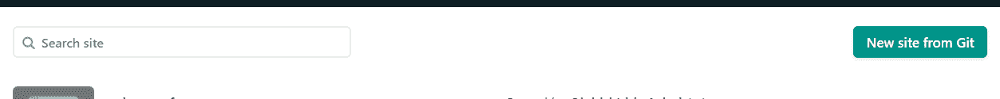
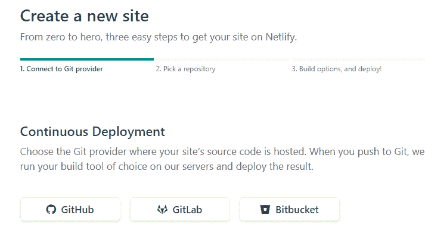
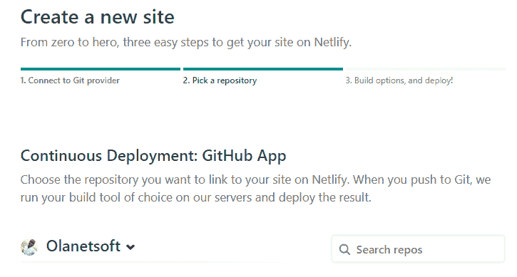
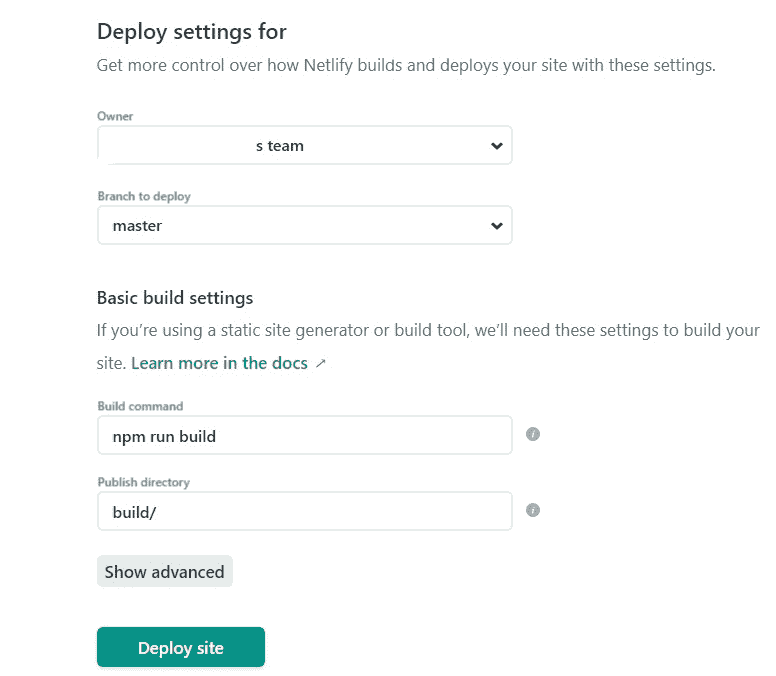
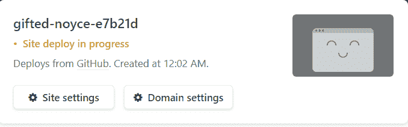
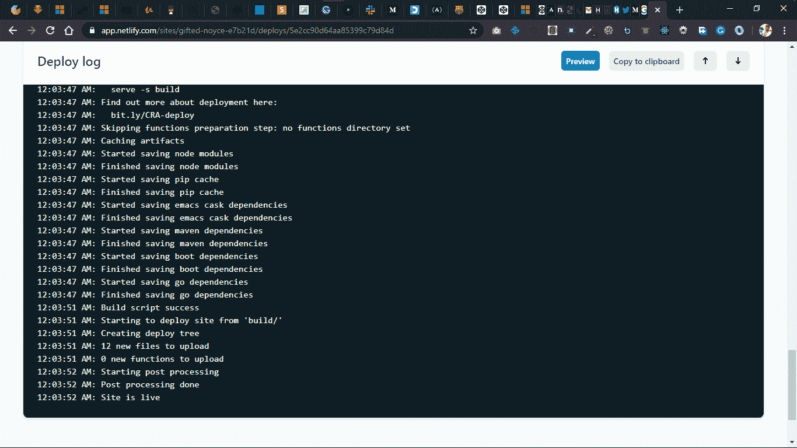
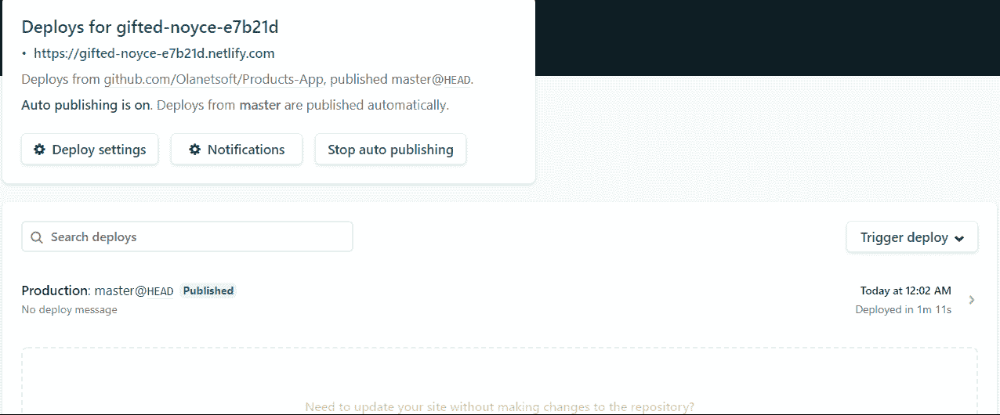
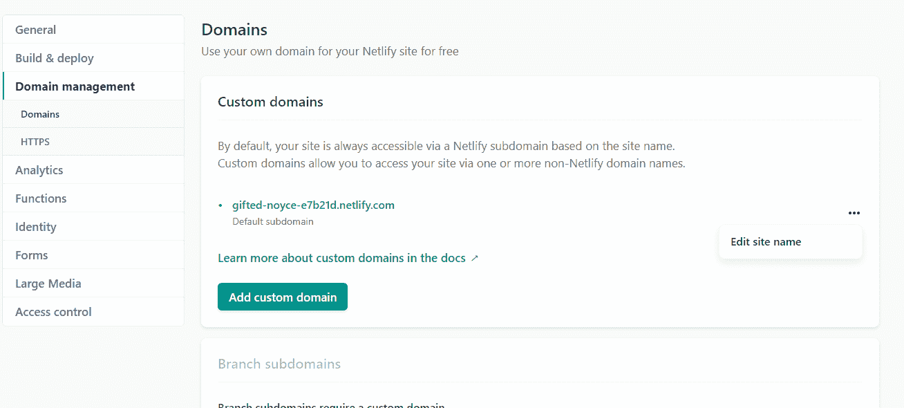

# 如何使用 Netlify 部署前端应用程序

> 原文：<https://www.freecodecamp.org/news/how-to-deploy-your-front-end-app/>

大家好！在本文中，我将讨论如何部署您构建的应用程序。

应用程序部署过程可能看起来很复杂，这可能会阻止一些开发人员在开发完应用程序后部署它们。

因此，在这里，我将带你通过一个无缝的过程来旋转你的应用程序，然后可以在世界上任何地方通过一个网址访问。

### 目录

*   为什么需要部署前端应用程序？
*   什么是 Netlify？
*   你能用网络生活做什么
*   如何部署您的站点
*   资源

## 为什么需要部署前端应用程序？

部署应用程序有很多好处。当然，您不希望您漂亮的应用程序永远驻留在您的本地主机上。

部署您的应用程序可以更容易地与潜在投资者或未来雇主分享您的项目、兼职或创业。如果他们能看到这些项目，这有助于他们评估你的技能。它也让你向世界炫耀你的进步。

在本文中，我们将使用令人惊叹的 [Netlify](https://www.netlify.com "Netlify Homepage") 平台来部署我们的应用程序。

这个名字听起来很熟悉，对吧？但是如果您还没有使用它来部署 web 应用程序，请相信我，我了解您的感受。

我将带您完成在不到 4 分钟的时间内将您的站点部署到网络的步骤。我们还将看到 Netlify 开箱即可完成的一些其他功能。

## 什么是 Netlify？

Netlify 是一个让开发者自动化现代网络项目的平台，在这里你可以部署你的应用，而不用担心令人沮丧的配置。

您还可以在 Netlify 上集成很酷的特性和动态功能，如无服务器功能和表单处理。听起来不错，对吧？

## 网络功能

### 配置版本

Netlify 帮助您在每次向存储库推送更新时运行 build 命令。

除了其他有用的部署设置之外，您还可以配置其他设置，如自动部署。

### 现场部署[(原子部署)](https://docs.netlify.com/site-deploys/overview/)

Netlify 的一个很棒的特性是站点部署。它确保您的站点得到部署并始终保持一致。

您还可以启用部署通知，在 Netlify 将新部署与现有部署进行比较时运行测试，然后只更新已更改的文件。

### 监控站点[(网络分析)](https://docs.netlify.com/monitor-sites/analytics/)

如果没有合适的基础设施，监控您的站点可能会变得很困难。

在这个平台上，您可以很容易地监控您站点的活动，您可以跟踪团队的构建使用的每个日志。

#### 域名和 HTTPS [(注册新域名)](https://docs.netlify.com/domains-https/netlify-dns/domain-registration)

简单来说，域名就是任何人在浏览器中输入的访问你网站的 URL。如果您已经购买了一个自定义域或从 Netlify 获得了一个域，您可以分配一个自定义域。

无论哪种方式，域名系统管理都是由 Netlify 处理的。他们还在所有网站上提供免费的自动 HTTPS。酷吧？

#### 路由[(了解路由)](https://docs.netlify.com/routing/redirects/)

当您的站点部署在 Netlify 上时，路由、重定向、代理等等都变得容易多了。

### 访客访问

这是我喜欢的另一个很酷的功能:每当你需要向团队中添加某人时，你可以设置基于角色的访问控制，允许管理员/高级开发人员控制并向团队中的个人授予访问权限，以避免升级。

### 表单[(网络表单)](https://docs.netlify.com/forms/setup/)

当您需要从部署在 Netlify 上的站点的用户那里收集数据时，您可以使用 Netlify 表单来完成。这也不会在您的站点上添加 API 调用或额外的 JavaScript。

构建机器人通过在部署时直接解析 HTML 文件来处理表单提交。您还可以配置接收者、组和通知。

### 功能[(部署无服务器功能)](https://docs.netlify.com/functions/overview/)

无服务器功能可以被称为托管在托管基础设施上的单一用途的编程功能。

Netlify 允许您部署无服务器 Lambda 功能，管理直接在 Netlify 中处理，而它们是与您的其余站点一起构建和部署的。

### Netlify CLI [(Netlify 命令行界面)](https://docs.netlify.com/cli/get-started)

你可能想知道是否所有的活动都是在 Netlify UI 上单独进行的——不，它们不是。

还有一个很棒的特性，允许开发人员从他们的终端部署站点或进行一些配置。Netlify CLI 可用于运行可共享的本地开发服务器，包括插件。

### 网络生命 API [(网络生命 API)](https://docs.netlify.com/api/get-started/#authentication)

Netlify 的 API 可以用来处理站点的部署、脚本注入等等。它使用 JSON 进行序列化，符合 REST 标准。

### 账户和账单

了解[管理团队成员](https://docs.netlify.com/accounts-and-billing/team-management/manage-team-members)以及如何在团队之间转移站点。

> 我希望你现在能看到网络生活有多强大。但是看有时会有欺骗性，所以让我们自己来试试吧。

从这篇文章的标题可以看出，我将只向您展示如何将您的站点部署到 netlify.com。但是要探索其他功能[请点击此处阅读更多内容](https://docs.netlify.com/)，练习并探索。

## 如何将站点部署到网络

### 第一步

如果您是新用户，请登录或注册 netlify.com。免费的:)

### 第二步

如下所示，你需要做的就是点击名为“来自 Git 的新站点”的按钮，从 Git 中选择一个站点。

### 第三步

您将看到下面的界面，您可以在其中选择托管站点源代码的 Git 提供程序。

### 第四步

选择您要链接到 Netlify 网站的存储库。

### 第五步

我们快到了:)

本节允许您通过下面显示的设置选项，更好地控制 Netlify 如何构建和部署您的站点:

### 第六步

等等，Netlify 在为你准备东西。:)

### 第七步

恭喜你的网站上线了！

单击标题为“deployment for”下方带有. netlify.com 扩展名的生成的 URL。

**最后:你也可以建立一个新的域名，或者点击嵌入了“编辑网站名称”的“…”，将生成的域名更改为更好的域名，但域名将以. netlify.com 结尾。[点击此处阅读更多信息](https://docs.netlify.com/domains-https/custom-domains/)**

我希望你觉得这个指南有用:)

注意:Netlify URL 扩展名现在是 netlify.app。所有 netlify.com URL 现在都将被重定向到 netlify.app

请不要忘记看看我的其他文章，这给了我快乐:)还有写更多东西的感觉。

你也可以在推特上联系我。