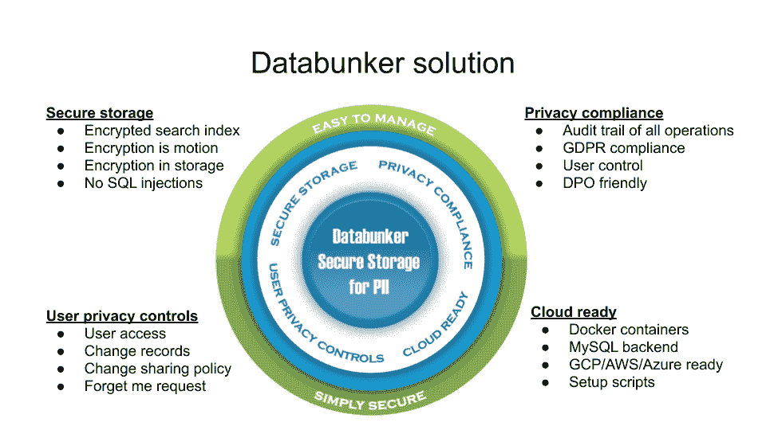

# 如何保持 GDPR 符合访问日志

> 原文：<https://www.freecodecamp.org/news/how-to-stay-gdpr-compliant-with-access-logs/>

隐私是一个复杂的话题。一种众所周知的保存应用程序日志的方法被新的隐私条例证明是棘手的。事实上，新法规将 IP 地址定义为个人标识符。像其他用户标识符一样，应该谨慎对待它。

在这篇文章中，我将介绍一些让你的日志保护隐私的方法。

首先，我会教你基本的 **GDPR 术语**:**和**勿忘我用户权限**。之后，我们将介绍使 web 或应用服务器日志 GDPR 就绪的方法。**

**然后，我将谈谈我正在开发的一款名为 **[Databunker](http://databunker.org/)** 的开源产品，以及它是如何发挥作用的。 **Databunker** 是一款存储个人记录的瑞士军刀工具。**

## **一些与 GDPR 相关的术语**

### **什么是个人身份信息？**

**GDPR 定义了 **PII** 或**个人身份信息**的概念。这可以是任何有助于识别一个人的信息。**

**例如，它可以是用户名、地址、电话号码、电子邮件地址或 SSN。它也可以是弱身份，如浏览器信息、IP 地址、会话 cookie 名称。**

**像在三角测量中一样，弱身份的组合可以引导我们找到用户。强弱用户身份都被认为是 **PII** 。**

**GDPR 引入了个人数据被删除的权利。您的用户或客户可以向您发送电子邮件，要求您删除他们的记录。你有一个月的时间来回应这个请求。**

### **“勿忘我”请求对日志文件意味着什么？**

**从数据库中删除用户数据很容易。你有 SQL 来做这个。从日志文件中删除用户 PII 是棘手的部分。**

**您可能有不同的服务器生成日志，并且您可能将日志提供给不同的云服务。这可能会使执行记录删除变得复杂。**

**在这篇文章中，我将介绍更智能的方法，使您的日志隐私兼容。**

### **Databunker 简介**

**但是首先，让我给你一些关于什么是 **Databunker** 以及它如何工作的信息，因为我们将在下面的一些方法中讨论它。**

****

****Databunker** 是一款符合 GDPR 标准的网络和移动应用用户商店服务。它作为一个后端应用服务。这个产品是几个软件概念的结合。它通过开箱即用的设计提供安全的 PII 存储和隐私保护:**

*   **个人身份信息(PII)存储和保管库**
*   **web 应用程序的安全会话存储**
*   **客户隐私门户**
*   **应用后端服务器**
*   **DPO 管理工具**
*   **令牌化服务**
*   **秘密武器**

**项目网站:[https://databunker.org/](https://databunker.org/)**

**Passport.js 的完整工作 Node.js 示例如下:[https://github.com/securitybunker/databunker-nodejs-example](https://github.com/securitybunker/databunker-nodejs-example)**

## **方法 1:使用自动日志保留期**

**你有**一个月**的时间来回复**用户的勿忘我请求**。这实际上意味着您有一个月的时间从所有与用户相关的记录中过滤日志文件，例如，过滤掉用户 IP 地址。**

**或者，您可以将日志保留期限制为一个月。所有旧的日志条目都将被删除。这样，除了一次性配置日志保留期之外，您不需要做任何事情。**

## **方法 2:使用假名化来解决任何日志合规性问题**

**GDPR 讨论了**假名化**的概念。这种方法将基于假名化术语的使用。[摘自《GDPR》第四卷第五期](https://gdpr-info.eu/art-4-gdpr/):**

> ***“假名化”是指在不使用额外信息的情况下，对个人数据进行处理，使个人数据不再属于特定的数据主体，前提是这些额外信息单独保存，并采取技术和组织措施以确保个人数据不属于已识别或可识别的自然人...***

**您可以将个人数据保存在单独的数据库中，例如保存在 **Databunker** 中。当您收到用户的**勿忘我请求**时，您将从**数据库**、**中删除用户的个人数据，而不改变日志文件**。**

**为了让我们的生活更加轻松，我们可以在每个日志行中打印一个用户会话和用户令牌。**

**可以看一下[这个例子](https://github.com/securitybunker/databunker-nodejs-example)供参考:**

> *** ffff:141 . 226 . 198 . 55--[02/Jan/2021:18:42:54+0000]" GET/user/me HTTP/1.1 " 304--" HTTP://my-dev-site/user/log in " " Mozilla/5.0(Windows NT 10.0；Win64x64) AppleWebKit/537.36 (KHTML，像壁虎一样)Chrome/87 . 0 . 4280 . 66 Safari/537.36 "**" b 994 fdbf-694 e-4289-b8db-04d 8049 da 2e 8 " " 1 f 587 EB 7-eaaa-1629-c108-b 707d 99798 da "****

**这与常规的 web 服务器日志不同，它在日志行的末尾添加了两个自定义变量。**

****“b 994 fdbf-694 e-4289-b8db-04d 8049 da 2e 8**”是 Databunker 会话库生成的会话令牌。**

****“1f 587 EB 7-eaaa-1629-c108-b 707d 99798 da”**是登录用户的用户令牌。它是在 Databunker 中创建用户时生成的用户令牌。**

## **方法 3:高安全性环境的解决方案**

**这种方法包括日志事件的部分加密。PII 将日志中发现的事件分组在一起并加密。初始设置将包括为每个用户生成一次登录密码。例如，该密码可以保存在**数据块**中存储的用户配置文件中。**

**因为我们需要知道记录的所有者是谁(来解密记录)，所以我们需要保存用户 id 和加密的 PII。因此，另一层加密将与通用密码一起使用。**

**对于用户识别的日志事件，PII 将被加密两次。第一次使用用户的登录密码加密数据。第二次，它将使用默认密码加密，以隐藏已识别的用户 id。**

**对于已识别的用户:**

```
`const piiPayload = JSON.stringify({ClientIP, BrowserUserAgent, SessionID});
coast piiEncrypted = Encrypt(UserPassword, piiPayload);
const linePayload = JSON.stringify({UserToken, data: btoa(piiEncrypted)});
const encrypted = Encrypt(GenericPassword, linePayload);` 
```

 **如果用户未知，则只能使用一个级别的加密:

```
const piiPayload = JSON.stringify({ClientIP, BrowserUserAgent, SessionID});
const encrypted = Encrypt(GenericPassword, piiPayload); 
```

当您收到用户的“勿忘我”请求时，您可以删除存储在 **[数据库](http://databunker.org/)** 中的用户登录密码和个人资料。这将使用户日志条目不可恢复。这完全可以满足 GDPR 的要求。因此不需要额外的操作来删除日志文件中的任何内容。

## 摘要

有了正确的架构，您可以让您的日志隐私合规。这并不复杂。您可以使用 **Databunker** 或推出自己的解决方案。

无论您选择什么，都比完全忽略这个问题并手动从日志文件中删除用户记录要好得多。

### 免费外卖

我为初创公司的创始人和架构师举办了一个隐私培训。这里完全免费。

### 关于作者

Yuli Stremovsky 是世界级的软件和安全架构师。 [PrivacyBunker.io](https://privacybunker.io/) 和【DataBunker.org】T2 隐私产品的创始人。前检查站，RSA 安全雇员。将技术解决方案与隐私相结合的专家。**