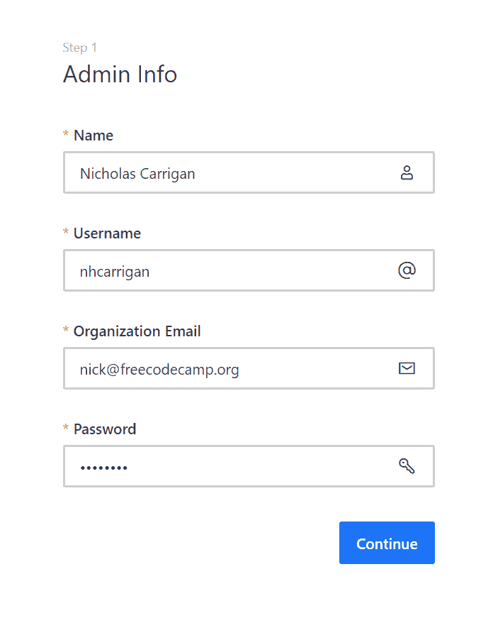
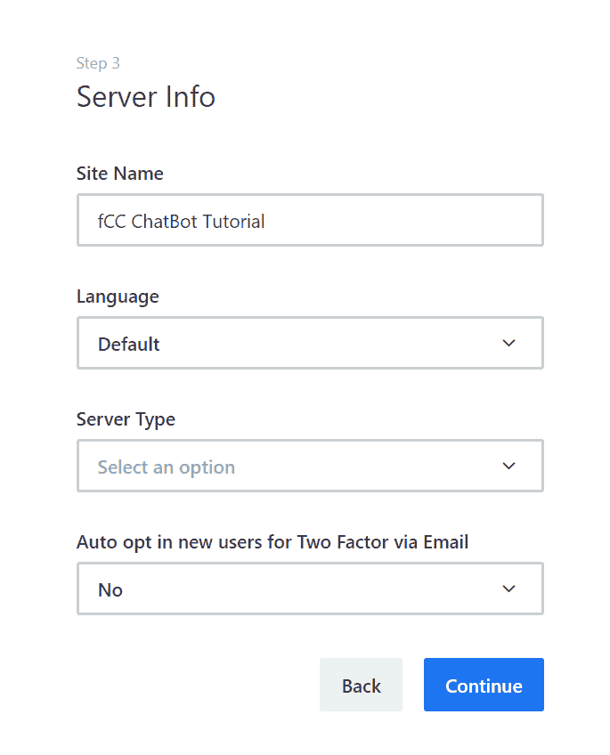
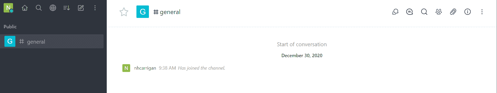
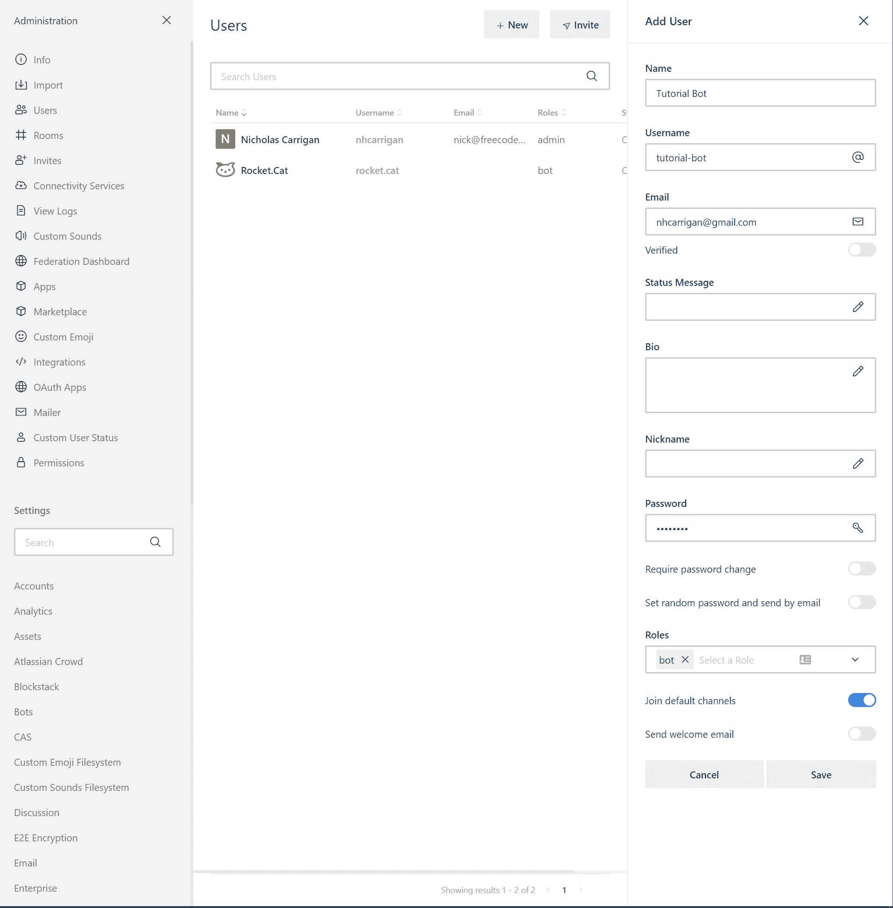
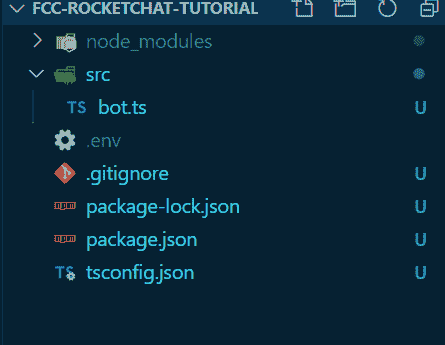
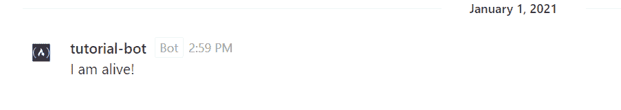
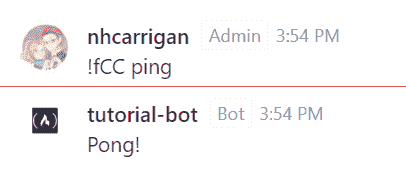
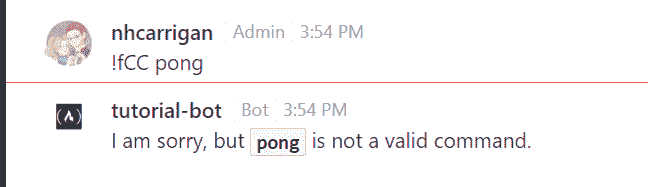

# 如何用 TypeScript 构建 RocketChat 聊天机器人

> 原文：<https://www.freecodecamp.org/news/how-to-build-a-rocketchat-bot-with-typescript/>

今天我将向你展示如何建造你自己的火箭。聊天机器人，在本地测试。

这与我为我们社区的自托管聊天服务器构建 freeCodeCamp 的 [moderation 聊天机器人](https://github.com/nhcarrigan/rocketchat-bot)的过程相同。这段代码现在已经在生产中运行了，很多人都在使用它。

## 如何设置火箭？聊天服务器

您的第一步是获得 Rocket 的一个实例。本地聊天运行-你将需要这个来测试机器人的功能。

你可以使用 freeCodeCamp 的 [docker 文件](https://github.com/freeCodeCamp/chat-config/blob/main/docker-compose.dev.yml)，它会让两个火箭都旋转起来。聊天和 MongoDB 自动为一个开发环境。这会节省你很多时间。

您可以克隆这个库或者基于我们的配置手动创建您自己的 docker 文件。本教程将假设您正在使用我们现有的 docker 文件。

> 注意:如果您没有安装 docker，您将需要安装它。每个操作系统的安装过程都不同。我个人使用 Windows 10，所以我安装了[Docker 桌面客户端](https://www.docker.com/products/docker-desktop)，并且必须在我的 BIOS 中启用`hardware virtualisation`。

在你的火箭里。聊天目录，创建一个`.env`文件，插入以下内容:

```
COMPOSE_FILE=docker-compose.dev.yml
PORT=3000
ROOT_URL=http://localhost:3000
ROCKETCHAT_VERSION=latest
```

The `docker-compose.dev.yml` filename is specific to our repository.

然后打开指向同一目录的终端并运行:

```
docker-compose up -d
```

If you are using Docker desktop, this only needs to be run once. The instance can be switched on and off through the desktop GUI.

您应该在终端中看到三条成功消息:


Image showing the console output for the `docker-compose up -d` command. Three docker images were created, and each shows `done`.

现在，如果你打开浏览器，导航到`localhost:3000`，你应该会看到你的本地火箭。聊天实例。您看到的第一个屏幕是设置向导，它将引导您创建管理员帐户。

大多数开发人员使用管理员帐户进行根级别访问来配置他们的聊天。因为这是一个本地实例，所以您的凭证的安全性不如在实时实例中重要。

填写您的信息以创建管理员帐户:



Image showing the Admin Info modal, with inputs for `Name` set to Nicholas Carrigan, `Username` set to nhcarrigan, `Organization Email` set to nick@freecodecamp.org, and `Password` which is obfuscated. Below the input fields is a button labelled `Continue`.

下一个屏幕是组织信息屏幕。此信息是可选的。对于本教程，我们将这些信息留空。

点击`Continue`将进入服务器信息页面。在这里，您可以设置聊天服务器的名称(将出现在`title`元数据中)、默认语言、服务器类型和 2FA 设置。

确保关闭本地实例的自动 2FA 设置，否则您可能会被自己的服务器锁定。



Image showing Server Info modal, with inputs for `Site Name` set to fCC ChatBot tutorial, `Language` set to Default, `Server Type` with no selection made, and `Auto opt in new users for Two Factor via Email` set to No. Below the input fields are buttons labelled "Back" and "Continue".

最后一步是注册你的服务器并获得访问 Rocket 的权限。聊天服务，如推送通知。注意，这些都是付费服务。

出于本教程的目的，您可以选择`Keep standalone`选项。然后你可以决定以后是否需要付费服务。

点击`Continue`后，您将看到一个模式，表明您的工作区已经可以使用了。那你应该看看你的新聊天室。设置向导创建的默认通道是`general`。



Image showing Rocket.Chat after completing the setup wizard. Sidebar on the left shows a `general` channel, and primary windows shows a system message that "nhcarrigan has joined the channel".

如果你看到这个，恭喜你。您已经完成了一半，现在有了一个功能正常的聊天服务器。

## 如何在 Rocket 中设置一个 Bot 帐号？闲谈

现在，我们需要在本地聊天服务器中创建一个 bot 用户，以便我们的代码可以连接到这个用户。

选择侧边栏顶部的三个点，然后选择`Administration`。然后从出现的新侧边栏中选择`Users`，并点击右上角的`+New`按钮。这将打开一个用于创建新用户帐户的窗格。

填写您的 bot 帐户的信息和凭据。

需要注意几个关键事项:

*   将`Require password change`和`Set random password and send by email`设置为关闭。
*   将`Send welcome email`设置为关闭。
*   从`Roles`下拉菜单中选择`bot`。



Image showing the Rocket.Chat settings screen. The left sidebar shows the list of settings - `Users` has been selected. The center screen shows a list of user accounts - nhcarrigan and Rocket.Cat. The right sidebar shows the Add User interface, with inputs for `Name` set to Tutorial Bot, `Username` set to tutorial-bot, `Email` set to nhcarrigan@gmail.com, `Verified` toggled off, `Status Message` with no value, `Bio` with no value, `Nickname` with no value, `Password` which is obfuscated, `Require Password Change` which is toggled off, `Set random password and send by email` which is toggled off, `Roles` with "bot" selected, `Join default channels` which is toggled on, and `Send Welcome Email` which is toggled off.

> Rocket.cat 是一个用于系统通知的内置账户(即 Rocket。聊天更新)。

保存更改，您的 bot 帐户现在应该已经创建好了！记下用户名和密码，因为我们将需要这些代码。

## 如何给你的火箭编码？聊天机器人

现在是创建代码的时候了。为您的项目创建一个新的空文件夹。

### 初始火箭。聊天聊天机器人项目设置

我们将从初始化一个`node.js`项目开始。欢迎使用`npm init`生成一个`package.json`，也可以手工创建一个。

无论哪种方式，您都需要向`scripts`部分添加一些特定的值:

```
 "scripts": {
    "prebuild": "rm -rf ./prod",
    "build": "tsc",
    "start": "node ./prod/bot.js"
  },
```

The `prebuild` script will remove the existing compiled JavaScript files, to avoid conflicts. NOTE: If you are developing on Windows, you will need to use a Unix based terminal (such as Git Bash) for this command to work. Command Prompt will not recognise the `rm` command - PowerShell *will,* but errors out on the `-rf` flag.

接下来，您将安装必要的依赖项。首先，安装开发依赖项:

```
npm install --save-dev typescript @types/node
```

The `--save-dev` flag saves these as *development* dependencies, so Heroku will uninstall them after building the project.

然后，安装您的主要依赖项:

```
npm install @rocket.chat/sdk dotenv
```

`dotenv` can be installed as a development dependency and dynamically `import`ed based on the environment, but for the sake of this tutorial that isn't necessary.

下一步是设置 TypeScript 配置。

如果您已经全局安装了 TypeScript，您将能够调用`tsc --init`并自动生成一个配置文件。否则，您需要在项目的根目录中手动创建一个`tsconfig.json`文件。

无论哪种方式，这些都是您在这个项目中需要的设置:

```
{
  "compilerOptions": {
    "target": "ES5",
    "module": "CommonJS",
    "rootDir": "./src",
    "outDir": "./prod",
    "strict": true,
    "esModuleInterop": true,
    "skipLibCheck": true,
    "forceConsistentCasingInFileNames": true,
    "resolveJsonModule": true,
    "noImplicitAny": false,
  }
}
```

如果您使用`git`进行版本控制，您将需要创建一个`.gitignore`文件。这个文件告诉`git`忽略哪些文件/文件夹。在这种情况下，您希望忽略:

*   `prod`中编译好的 JavaScript
*   您的节点模块
*   你的`.env`秘密。

将这些添加到您的`.gitignore`:

```
/node_modules/
/prod/
.env
```

说到秘密，你应该现在就开始。创建一个`.env`文件，并添加以下值:

```
ROCKETCHAT_URL="localhost:3000"
ROCKETCHAT_USER="tutorial-bot"
ROCKETCHAT_PASSWORD="********"
ROCKETCHAT_USE_SSL=""
```

Note that you should replace `tutorial-bot` with your bot account's username, and `********` with your bot account's password.

[查看此时的代码](https://github.com/nhcarrigan/fcc-rocketchat-tutorial/tree/9cd28ab2adea2c4ce9294c0c35682031cf343b5f)。

### 初级火箭怎么写？聊天聊天机器人代码

现在是编写初始 bot 代码的时候了。在你的项目目录中创建一个`src`文件夹，在这个`src`文件夹中创建一个`bot.ts`文件。您的文件结构现在应该如下所示:



Image showing a file tree. From top to bottom: A `node_modules` folder, which is collapsed, a `src` folder which contains a `bot.ts` file, a `.env` file, a `.gitignore` file, a `.package-lock.json` file, a `package.json` file, and a `tsconfig.json` file. The files show they are being tracked by `git`, except the `node_modules` folder and `.env` file.

> 每当您运行`install`时，`npm`就会创建/更新`package-lock.json`文件。这也应该提交到您的存储库中，因为这是`npm ci`命令所需要的。

在您的`bot.ts`文件中，您将编写驱动您的机器人的基本代码。从必要的导入开始:

```
import { api, driver } from "@rocket.chat/sdk";
import dotenv from "dotenv";
```

`api` and `driver` are exported functions within the Rocket.Chat SDK. We will use them in our code.

因为`node`不会自动加载环境变量，所以您需要调用`dotenv`的`config()`方法将您的`.env`值带入节点流程:

```
dotenv.config();
```

This is necessary when working in local development. Some hosting providers, such as Heroku and repl.it, handle loading the environment variables within their infrastructure and `dotenv` is not needed.

现在，您可以从节点环境中提取这些变量。使用析构来获取值:

```
const {
  ROCKETCHAT_URL,
  ROCKETCHAT_USER,
  ROCKETCHAT_PASSWORD,
  ROCKETCHAT_USE_SSL,
} = process.env;
```

除了`ROCKETCHAT_USE_SSH`，这些环境值是*所必需的。*缺少一个将导致您编写的代码出错，因此您需要添加一个步骤来验证所有这些值都存在。

```
if (!ROCKETCHAT_URL || !ROCKETCHAT_USER || ROCKETCHAT_PASSWORD) {
  console.error("Missing required environment variables.");
  process.exit(1);
}
```

`process.exit(1)` terminates the node process and stops our code from continuing. Providing a `1` exit code indicates that the process exited through an error.

现在你可以用火箭了。Chat SDK 将您的机器人连接到您创建的帐户。

因为 SDK 中的方法是异步的，所以您将使用匿名的立即调用函数表达式(IIFE)来启用`async/await`特性。

```
(async () => {
  // Nothing here yet
})();
```

> 接下来的这些步骤将写在这个函数中。

首先，确定您的机器人是否应该使用 SSL 连接到聊天服务器。如果您的聊天服务器使用`HTTPS://`，这应该设置为`true`。因为您是在本地开发，所以它被设置为`false`，因为`localhost`没有 HTTPS 协议。

为了确保您的代码也能在生产环境中工作，您可以根据您的环境变量动态设置该值:

```
const ssl = !!ROCKETCHAT_USE_SSL;
```

The `!!` operator converts the value into its matching Boolean - if we are missing that environment variable, it would result in `undefined`, which the operator converts to `false`. In our case, the environment variable is an empty string, which also converts to `false`.

接下来，使用 SDK `driver`与您的聊天服务器进行交互。将`driver`连接到您的服务器:

```
await driver.connect({ host: ROCKETCHAT_URL, useSsl: ssl });
```

以 bot 帐户身份登录:

```
await driver.login({
    username: ROCKETCHAT_USER,
    password: ROCKETCHAT_PASSWORD,
  });
await api.login({ username: ROCKETCHAT_USER, password: ROCKETCHAT_PASSWORD });
```

`driver.login` connects your code to the bot account, and `api.login` generates an API authorization token. The SDK `driver` does not have full functionality, so some features may require an API call. The `api` method serves as a wrapper for that call.

让机器人加入你的`general`房间，处理机器人不在房间里的情况。还告诉机器人用`subscribeToMessages()`方法监听消息。

```
 await driver.joinRooms(["general"]);
  await driver.subscribeToMessages();
```

最后，让 bot 在上线时发送一条消息(这样您就可以确认连接状态)。

```
 await driver.sendToRoom("I am alive!", "general");
```

现在，构建并运行代码。在您的终端中调用这些必要的脚本:

```
npm run build
npm run start
```

在 SDK 的一些内置日志之后，您应该会看到 bot 在您的聊天服务器中发送它的在线消息。



Image depicting a Rocket.Chat message. The message was sent by `tutorial-bot`, which has the `bot` role by its name. The message text reads `I am alive!`.

[查看此时的代码](https://github.com/nhcarrigan/fcc-rocketchat-tutorial/tree/216a9a20a4872670d838a475c0140fa1110638d3)。

### 如何编写命令处理程序

您的机器人现在将连接到聊天服务器并监听消息，但它没有任何功能。

在添加命令之前，您需要构建处理这些命令的基础结构。

首先，告诉机器人处理消息。就在您的`subscribeToMessages()`呼叫之后，添加一条线路来处理对消息的回复:

```
driver.reactToMessages();
```

您将在智能感知中看到一个错误，因为`reactToMessages()`方法需要一个回调函数。

您可以直接在这个方法中编写回调函数，但是您将模块化您的代码并创建一个导出的处理程序。这使您的代码更干净，更易于维护。

在你的`src`文件夹中创建一个名为`commands`的文件夹，并添加两个文件:`CommandHandler.ts`和`CommandList.ts`。在`CommandList.ts`文件中，我们现在要添加一行:

```
export const CommandList = [];
```

当您构建命令时，您将把它们添加到这个数组中，以便能够在我们的处理程序中遍历它们。

现在您需要在`CommandHandler.ts`文件中编写处理程序的逻辑。

从所需的导入开始:

```
import { driver } from "@rocket.chat/sdk";
import { IMessage } from "@rocket.chat/sdk/dist/config/messageInterfaces";
import { CommandList } from "./CommandList";
```

`IMessage` is used for our type definitions.

定义命令处理函数:

```
export const CommandHandler = async (
    err: unknown,
    messages: IMessage[]
): Promise<void> => {
    // Code will go here.
}
```

The SDK does not currently have a type declaration for the `err` object.

添加一些错误处理。

```
 if (err) {
    console.error(err);
    return;
  }
  const message = messages[0];
  if (!message.msg || !message.rid) {
    return;
  }
```

如果你在`err`参数中看到一个错误，你需要尽早`return`。

`messages`参数接受一个消息数组，但是您希望对*的第一个*消息做出反应，所以我们将其从该数组中提取为`message`。

然后，对于 TypeScript 的断言处理，如果某些属性丢失或未定义，您需要提前退出。在这种情况下，`message.msg`是消息的文本内容，`message.rid`是接收消息的房间的 ID。

为了使代码更清晰/更易读，您可以从消息对象中析构一些值。从`rid`值中获取房间的名称 SDK 包含了一个这样做的方法。还要获取前缀和调用的命令。

```
 const roomName = await driver.getRoomName(message.rid);
  const [prefix, commandName] = message.msg.split(" ");
```

添加逻辑来遍历我们的命令数组。TypeScript 将识别由于缺少结构而导致的一些错误，但是您现在可以忽略这些错误，因为您还没有编写命令。

```
 if (prefix === "!fCC") {
    for (const Command of CommandList) {
      if (commandName === Command.name) {
        await Command.command(message, roomName);
        return;
      }
    }
    await driver.sendToRoom(
      `I am sorry, but \`${commandName}\` is not a valid command.`,
      roomName
    );
  }
```

You can select whichever prefix value you would like. If you are feeling ambitious, you could even make this a configurable setting through your `.env` file.

这段代码可能有点混乱，因为我们还没有确定命令是如何工作的。

首先，机器人确定消息是否以正确的前缀开头。如果没有，机器人将忽略该消息。

然后机器人遍历命令列表，如果发现一个命令的`name`值与消息中发送的命令名匹配，它将运行该命令。

如果它没有找到*任何*匹配的命令，它将在房间中发送一个响应，表明该命令无效。

在继续执行命令之前，返回到`bot.ts`文件中的`reactToMessages()`调用，并将您的新处理程序作为回调函数传递:

```
 driver.reactToMessages(CommandHandler);
```

您可能需要手动导入它:

```
import { CommandHandler } from "./commands/CommandHandler";
```

[查看此时的代码](https://github.com/nhcarrigan/fcc-rocketchat-tutorial/tree/b3e62ec3ad4215f4081293077774b3e81f67a52c)。

### 如何编写命令

TypeScript 提供了一个`interface`特性，可以用来定义一个对象结构。

在你的`src`文件夹中，创建一个`interfaces`文件夹，并创建一个`CommandInt.ts`文件。

在该文件中，您将定义您的命令类型。首先，再次导入消息类型。

```
import { IMessage } from "@rocket.chat/sdk/dist/config/messageInterfaces";
```

现在为命令定义构建导出的接口。

```
export interface CommandInt {
    name: string;
    description: string;
    command: (message: IMessage, room: string) => Promise<void>
}
```

The `name` is used to call the command, the `command` function runs the command, and the `description` is used to document usage (this is great for using in a `help` command). The return type is a `Promise` to allow commands to run asynchronously.

恭喜你！您现在已经准备好构建`ping`命令了。

在您的`src/commands`文件夹中，创建一个`ping.ts`文件。从你的必需品开始:火箭。聊天驱动和你的新命令界面。

```
import { driver } from "@rocket.chat/sdk";
import { CommandInt } from "../interfaces/CommandInt";
```

定义并导出命令:

```
export const ping: CommandInt = {
    name: "ping",
    description: "Pings the bot.",
    command: async (message, room) => {
        // Code will go here.
    }
}
```

Note that the `command` function uses `async`.

让机器人用“乓”来回应当这个命令被调用时。在函数内部，将注释替换为:

```
await driver.sendToRoom("Pong!", room);
```

现在，将这个命令加载到命令列表中。打开`CommandList.ts`文件，在这里您将导入我们的新命令并将其包含在数组中。

```
import { ping } from "./ping";

export const CommandList = [ping]; 
```

这样，您应该会看到`CommandHandler.ts`文件中的错误也消失了，因为 TypeScript 推断出`CommandList`数组包含了`CommandInt`类型。

为了额外的类型安全，并确保您不会意外地将不是正确的`CommandInt`对象的值添加到您的`CommandList`中，显式地键入这个变量。

```
import { CommandInt } from "../interfaces/CommandInt";
import { ping } from "./ping";

export const CommandList: CommandInt[] = [ping];
```

`CommandInt[]` tells TypeScript this variable is an array of `CommandInt` objects.

再次运行您的`build`和`start`脚本来测试这个新特性。

在聊天室中调用您的`ping`命令。您应该看到一个成功的响应:



Image depicting a Rocket.Chat conversation. The first message was sent by `nhcarrigan`, who has the `Admin` role by his name. The first message content reads "!fCC ping". The second message was sent by `tutorial-bot`, which has the `Bot` role by its name. The second message content reads "Pong!".

调用一个`pong`命令。您应该看到 bot 识别出它不是一个有效的命令:



Image depicting a Rocket.Chat conversation. The first message was sent by `nhcarrigan`, who has the `Admin` role by his name. The first message content reads "!fCC pong". The second message was sent by `tutorial-bot`, which has the `Bot` role by its name. The second message content reads "I am sorry, but `pong` is not a valid command".

[查看我们的最终代码](https://github.com/nhcarrigan/fcc-rocketchat-tutorial/tree/df645aa39fbb9f18513128cfb5b55b804719ee78)。

## 进一步探索

恭喜你！你现在已经成功地建造了一个基本的火箭。聊天机器人。

如果你想探索更多的功能和命令实现，请随意浏览我们的 live bot 的代码库。