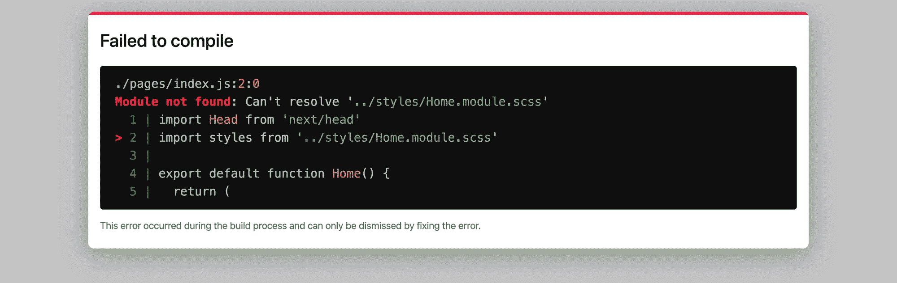
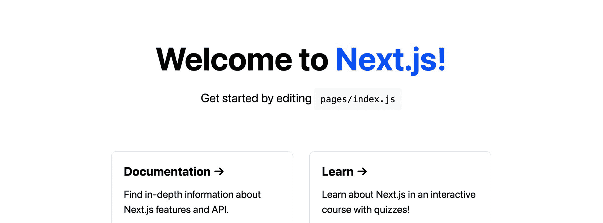
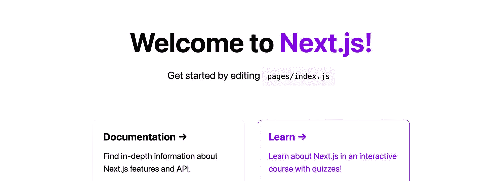
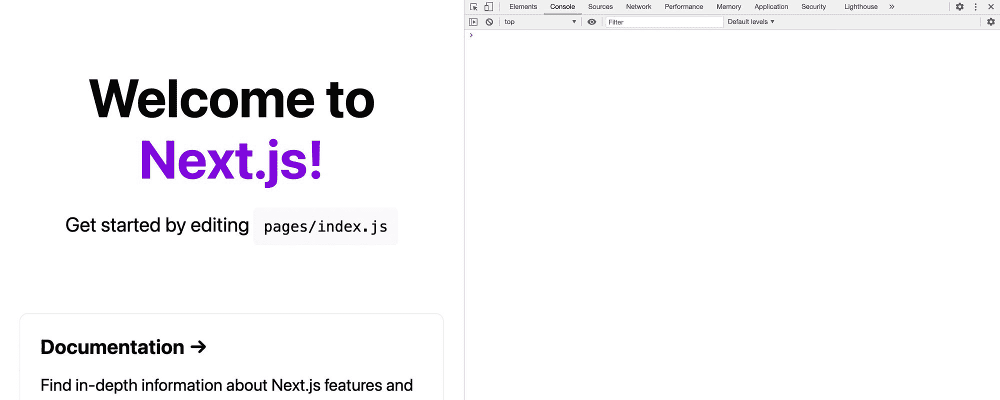

# 如何在 Next.js 中使用带有 CSS 模块的 Sass

> 原文：<https://www.freecodecamp.org/news/how-to-use-sass-with-css-modules-in-next-js/>

默认情况下，Next.js 为我们提供了 CSS 模块，在我们的应用程序中提供了范围样式和集中开发等好处。怎样才能用 Sass 赋予我们的 Next.js CSS 超能力？

*   [什么是 CSS 模块？](#what-are-css-modules)
*   [什么是 Sass？](#what-is-sass)
*   我们要建造什么？
*   [步骤 0:创建新的 Next.js 应用](#step-0-creating-a-new-next-js-app)
*   [第一步:在 Next.js 应用中安装 Sass](#step-1-installing-sass-in-a-next-js-app)
*   [第二步:将 Sass 文件导入 Next.js app](#step-2-importing-sass-files-into-a-next-js-app)
*   [步骤 3:在 Next.js 应用程序中使用 Sass 变量](#step-3-using-sass-variables-in-a-next-js-app)
*   [步骤 4:在 Next.js 中使用带有全局导入的 Sass mixins](#step-4-using-sass-mixins-with-global-imports-in-next-js)

[https://www.youtube.com/embed/C1-hmauMht0?feature=oembed](https://www.youtube.com/embed/C1-hmauMht0?feature=oembed)

## 什么是 CSS 模块？

CSS 模块本质上是 CSS 文件，当导入到 JavaScript 项目中时，默认情况下提供项目特定部分的样式。

当导入模块时，这些类由一个映射了每个类名的对象来表示，从而允许您将该类权限应用到项目中。

例如，如果我的页面标题有一个 CSS 模块:

```
.title {
  color: blueviolet;
}
```

我将它导入我的 React 项目:

```
import styles from './my-styles.css'
```

然后，我可以将标题权限应用于一个元素，就像它是一个字符串一样:

```
<h1 className={styles.title}>My Title</h1>
```

通过确定样式的范围，您不再需要担心级联样式会破坏应用程序的其他部分。管理属于应用程序特定部分的较小代码块也更容易。

## 什么是萨斯？

Sass 是 CSS 语言的一个扩展，它提供了强大的功能，比如变量、函数和其他操作，允许你更容易地在你的项目中构建复杂的功能。

例如，如果我想将上面的颜色存储在一个变量中，以便以后可以轻松地更改它，我可以添加:

```
$color-primary: blueviolet;

.title {
  color: $color-primary;
}
```

如果我想改变这种颜色，但只是在一个点上，我可以使用内置的颜色函数来改变阴影:

```
$color-primary: blueviolet;

.title {
  color: $color-primary;
  border-bottom: solid 2px darken($color-primary, 10);
}
```

一个额外的好处是能够嵌套样式。这使得 CSS 的组织更容易，更符合逻辑。

例如，如果我只想改变嵌套在标题中的`<strong>`元素，我可以添加:

```
$color-primary: blueviolet;
$color-secondary: cyan;

.title {

  color: $color-primary;
  border-bottom: solid 2px darken($color-primary, 10);

  strong {
    color: $color-secondary;
  }

}
```

## 我们要建造什么？

我们将使用 [Next.js](https://nextjs.org/) 创建一个新的 [React](https://reactjs.org/) 应用。

通过我们的新应用程序，我们将了解如何安装和配置 Sass，以便我们可以利用 Next.js 中的特性。

一旦设置了 Sass，我们将逐步介绍如何使用 Sass [变量](https://sass-lang.com/documentation/variables)和 [mixins](https://sass-lang.com/documentation/at-rules/mixin) 来重新创建 Next.js UI 的一些默认元素。

> 想跳过教程，深入研究代码吗？在 GitHub 上查看[next . js Sass Starter](https://github.com/colbyfayock/next-sass-starter):[*https://github.com/colbyfayock/next-sass-starter*](https://github.com/colbyfayock/next-sass-starter)

## 步骤 0:创建新的 Next.js 应用程序

要开始使用新的 Next.js 应用程序，我们可以使用[创建下一个应用程序](https://nextjs.org/docs/api-reference/create-next-app)。

在您的终端中，导航到您想要创建新项目的位置并运行:

```
yarn create next-app my-next-sass-app
```

*注意:对于任何安装和包管理的例子，您都可以使用 npm 来代替 yarn。*

安装完成后，您可以导航到该目录，并启动开发服务器:

```
yarn dev
```

它应该在 [http://localhost:3000](http://localhost:3000) 启动您的新 Next.js 项目！


New Next.js app

如果这是您第一次创建新的 Next.js 应用程序，请四处看看！它有一个基本的主页和两个 CSS 文件:

*   `/styles/globals.css`
*   `/styles/Home.module.css`

在这里，我们将重点关注家庭文件。如果你看一下那里的`pages/index.js,`，你会看到我们正在导入主文件，使那些风格可用。

默认情况下，Next.js 内置了 CSS 模块。这意味着当我们导入我们的 home styles 文件时，CSS 类被添加到 styles 对象中，并且我们将这些类名中的每一个应用于来自该对象的 React 元素，例如:

```
<h1 className={styles.title}>
```

这意味着我们的样式仅限于这一页。

要了解关于 CSS 模块或 Next.js 内置支持的更多信息，您可以查看以下资源:

*   [https://github.com/css-modules/css-modules](https://github.com/css-modules/css-modules)
*   [https://nextjs.org/docs/basic-features/built-in-css-support](https://nextjs.org/docs/basic-features/built-in-css-support)

## 步骤 1:在 Next.js 应用程序中安装 Sass

虽然 Next.js 有一些很好的内置 CSS 支持，但它没有完全内置 Sass。

幸运的是，要在我们的 Next.js 应用程序中启动和运行 Sass，我们需要做的就是从 npm 安装 [Sass 包](https://www.npmjs.com/package/sass)，这将让 Next.js 在其管道中包含这些文件。

要安装 Sass，请在项目中运行以下命令:

```
yarn add sass
```

如果我们开始备份我们的开发服务器并重新加载页面，我们实际上会注意到还没有发生任何事情，这是一件好事！

但是接下来我们将学习如何利用我们的 CSS 超能力。

[跟随提交！](https://github.com/colbyfayock/my-next-sass-app/commit/053b07ccaa1eb30a7d0eff15e2e24470564092f6)

## 步骤 2:将 Sass 文件导入 Next.js 应用程序

既然已经安装了 Sass，我们就可以使用它了。

为了使用任何特定于 Sass 的特性，我们需要使用扩展名为`.sass`或`.scss`的 Sass 文件。对于本演练，我们将使用 SCSS 语法和`.scss`扩展。

首先，在`pages/index.js`中，将页面顶部的样式对象的导入更改为:

```
import styles from '../styles/Home.module.scss'
```

一旦页面重新加载，正如我们可能预料的那样，页面实际上已经损坏。



Next.js failed to compile

要解决此问题，请重命名该文件:

```
/styles/Home.module.css
```

到

```
/styles/Home.module.scss
```

不同之处在于我们将文件扩展名从`.css`改为`.scss`。

一旦页面重新加载，我们将看到我们的 Next.js 站点正在加载并准备就绪！


New.js app loading

*注意:我们不打算在这里讨论全局样式文件——你可以通过重命名全局样式文件并更新`/pages/_app.js`* 中的导入来做同样的事情

接下来，我们将学习如何为我们的 Next.js 应用程序使用 Sass 特性。

[跟随提交！](https://github.com/colbyfayock/my-next-sass-app/commit/cf2a3f56688a728163f2e2d3229565c4efdd6661)

## 步骤 3:在 Next.js 应用程序中使用 Sass 变量

既然我们在项目中使用了 Sass，我们可以开始使用一些基本特性，比如变量。

为了展示这是如何工作的，我们将把应用程序内部的蓝色更新为我最喜欢的颜色，紫色！

在`/styles/Home.module.css`的顶部，添加以下内容:

```
$color-primary: #0070f3; 
```

颜色`#0070f3`是 Next.js 在应用中默认使用的颜色。

接下来，将我们的 home CSS 文件中使用该颜色的每个位置更新为我们的新变量，例如更改:

```
.title a {
  color: #0070f3;
```

到

```
.title a {
  color: $color-primary;
```

如果我们刷新页面，应该没有什么变化。



Unchanged Next.js app

但是现在因为我们使用了一个变量来定义颜色，我们可以很容易地改变它。

在页面顶部，将`$color-primary`变量更改为紫色或任何您喜欢的颜色:

```
$color-primary: blueviolet;
```

当页面重新加载时，我们可以看到我们的颜色现在是紫色的！



Next.js app with purple color

变量只是 Sass 赋予 CSS 的超级能力的开始，但是我们可以看到，它们允许我们在整个应用程序中轻松地管理我们的颜色或其他值。

[跟随提交！](https://github.com/colbyfayock/my-next-sass-app/commit/0a9e72485957154cfc6a9dbe68f2d9d0d056daed)

## 步骤 4:在 Next.js 中使用带有全局导入的 Sass mixins

Sass 的另一个特性是 mixins。它们让我们能够创建类似函数的定义，允许我们配置可以在整个应用程序中重复使用的规则。

在我们的示例中，我们将创建一个新的 mixin，它允许我们在整个应用程序中使用媒体查询来创建响应样式。虽然我们已经可以单独使用媒体查询做到这一点，但使用 mixin 允许我们使用单一定义，保持一致性，并允许我们从一个位置管理响应定义。

因为这个 mixin 是我们希望在整个应用程序中使用的东西，所以我们也可以使用 Sass 的另一个特性，即导入文件的能力。

首先，在`/styles`目录下创建一个新文件:

```
/styles/_mixins.scss
```

我们在文件名前面使用下划线来表示它是部分文件名。

接下来，在我们的`/styles/Home.module.scss`文件中，让我们导入新文件:

```
@import "mixins";
```

一旦页面重新加载，我们会注意到没有任何变化。

如果我们观察一下`Home.module.scss`的底部，我们会看到我们正在使用一个媒体查询来使`.grid`类做出响应。我们将把它作为混音的基础。

在`_mixins.scss`内，添加以下内容:

```
@mixin desktop() {
  @media (max-width: 600px) {
    @content;
  }
}
```

注意:虽然我们可能会为这个 mixin 想出一个比 desktop 更好的名字，但我们将把它作为我们例子的基础。

`@content`意味着任何时候我们使用我们的桌面 mixin，它将在那个位置包含嵌套的内容。

为了测试这一点，回到我们的`Home.module.css`文件，让我们更新我们的`.grid`片段:

```
@include desktop() {
  .grid {
    width: 100%;
    flex-direction: column;
  }
}
```

如果我们打开我们的应用程序，缩小浏览器窗口，我们可以看到我们仍然有我们的响应风格！



Responsive styles in Next.js

我们甚至可以更进一步。Sass 允许您嵌套样式。例如，不写:

```
.footer {
  // Styles
}

.footer img {
  margin-left: 0.5rem;
}
```

我们可以将那个`img`定义包含在原始的`.footer`定义中:

```
.footer {

  // Styles

  img {
    margin-left: 0.5rem;
  }

}
```

该 img 定义将编译成`.footer img`，就像用标准 CSS 编写的一样。

考虑到这一点，我们可以使用相同的概念，将我们的桌面 mixin 移到我们最初的`.grid`类中:

```
.grid {

  @include desktop() {
    width: 100%;
    flex-direction: column;
  }

}
```

如果你注意到了，因为我们已经在`.grid`类中，我们可以从 mixin 中移除它，因为它已经被应用了。

这使得我们的响应风格更容易组织。

最后，如果我们回头看看我们的应用程序，我们会注意到，仍然没有什么变化，这意味着我们正在成功地使用我们的 Sass mixin。


No change in our Next.js app

[跟随提交！](https://github.com/colbyfayock/my-next-sass-app/commit/6781916d8c12225c85dfde96bdab59bfaa14e22b)

## 我们还能用 Sass 和 Next.js 做什么？

我们只是用 Sass 触及了表面。因为我们的 CSS 模块现在有了 Sass 的能力，我们有了大量 CSS 默认没有的功能。

### 颜色函数

Sass 内置了大量的函数，允许我们更容易地操纵颜色、混合和匹配阴影。

我经常使用的两个是[变暗](https://sass-lang.com/documentation/modules/color#darken)和[变亮](https://sass-lang.com/documentation/modules/color#lighten)，它们允许你选择颜色和改变阴影。

了解有关 Sass 中所有可用颜色功能的更多信息。

### 自定义功能

虽然 mixins 看起来像函数，但我们可以在 Sass 中定义真正的函数，允许我们执行复杂的操作并基于输入产生值。

了解有关 Sass 中自定义函数的更多信息。

### 其他值类型

虽然在 CSS 中大多数时候我们使用的是字符串或数字，但我们看到了一个简单的扩展，那就是使用变量的能力。

除了变量，Sass 给了我们更多的值类型，比如[映射](https://sass-lang.com/documentation/values/maps)，它的功能有点像对象，还有[列表](https://sass-lang.com/documentation/values/lists)，有点像数组。

了解有关 Sass 中值类型的更多信息。

### 更大的

Sass 中有大量可用的特性，并且有许多文章涵盖了最常用的特性。花些时间浏览一下文档，看看到底有什么！

[](https://twitter.com/colbyfayock)

*   [🐦在 Twitter 上关注我](https://twitter.com/colbyfayock)
*   [📺订阅我的 Youtube](https://youtube.com/colbyfayock)
*   [📫注册我的简讯](https://www.colbyfayock.com/newsletter/)
*   [💝赞助我](https://github.com/sponsors/colbyfayock)