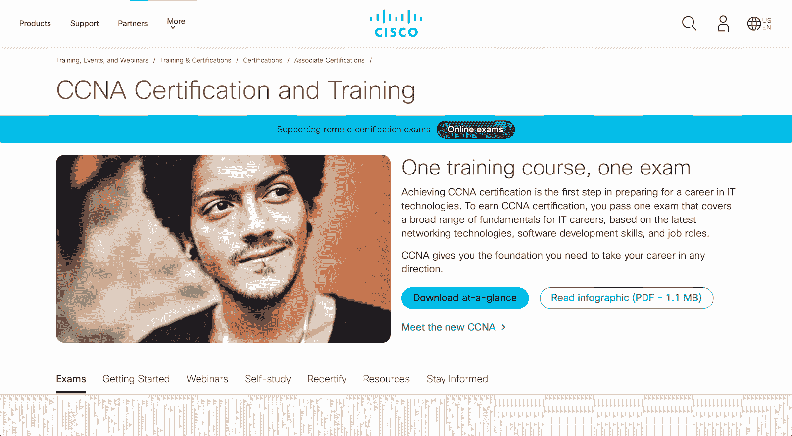
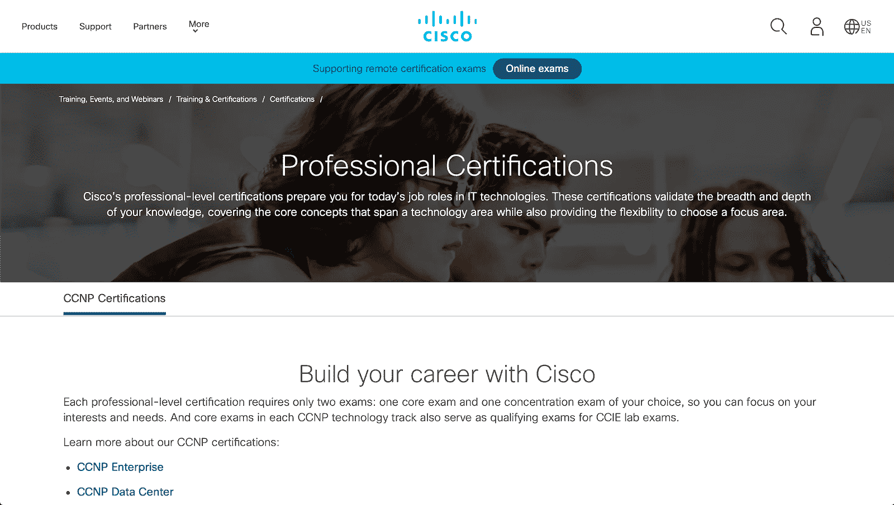
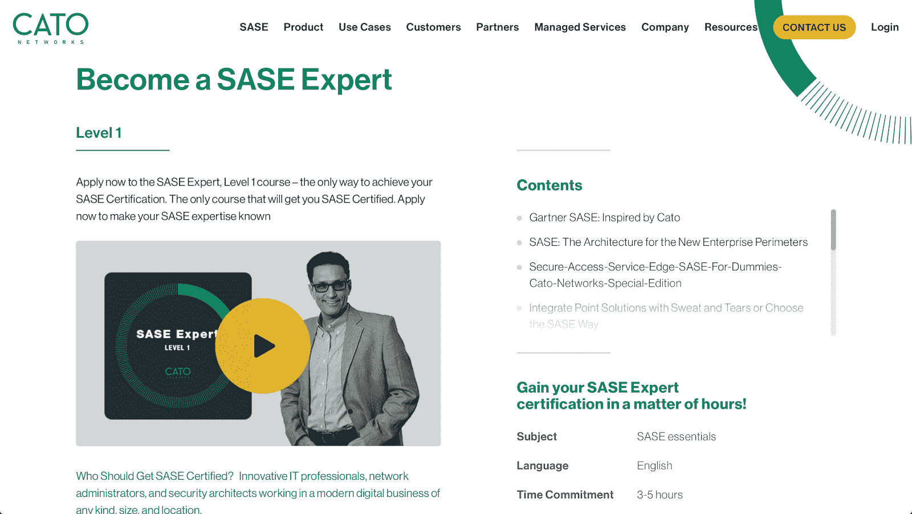
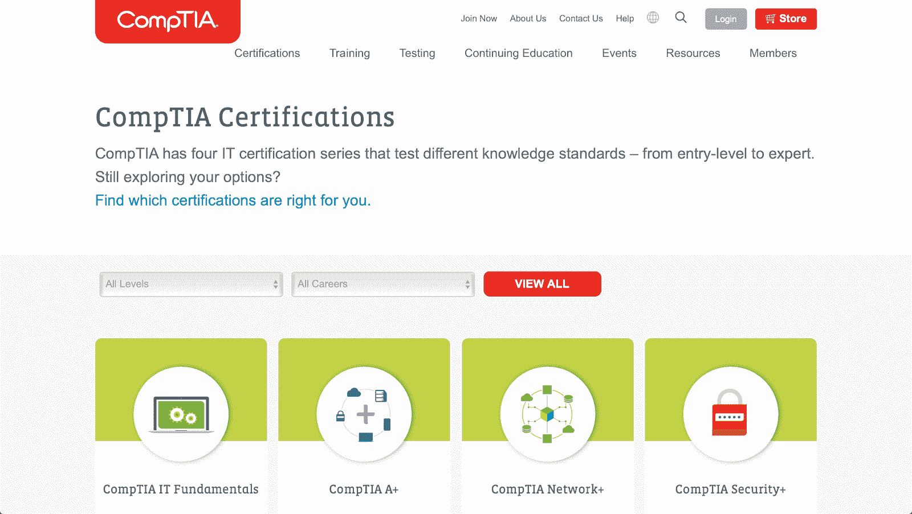
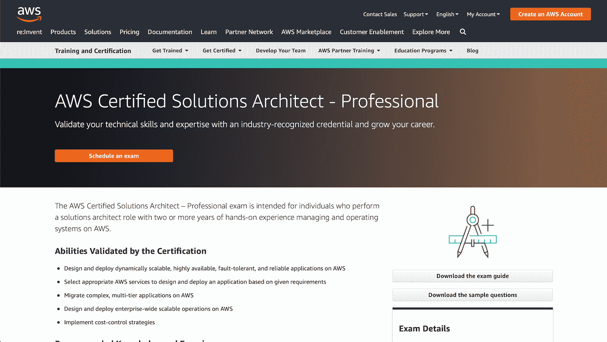
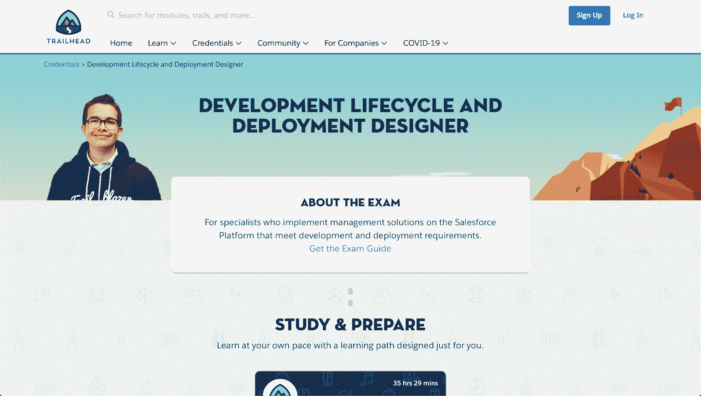

# IT 经理必备的网络认证

> 原文：<https://www.freecodecamp.org/news/must-have-network-certifications-for-it-managers/>

在这个日益数字化的世界中，信息技术职业已经扩展并蓬勃发展，以适应几乎每个人的技能组合。IT 管理就是这样一个利润丰厚的职业。

IT 经理的平均年薪为 91，000 美元。根据 IT 经理的行业不同，这个工资等级[实际上可以从每年 21，000 美元到 180，000 美元不等。不过，在每种情况下，这份工作都需要解决问题和项目管理。](https://www.indeed.com/career-advice/careers/what-does-an-it-manager-do)

具体来说，IT 经理职位有以下工作描述:

*   分析、计划和设计公司的信息系统需求，并执行这些计划和设计。
*   监控和改进此类系统(可能还包括公司的全部电信基础设施),并向最高管理层建议任何必要的升级。
*   管理公司的 IT 政策，包括信息政策、数据/信息访问和法规遵从性。
*   雇佣并领导系统管理员和其他团队成员。
*   确定团队的培训需求，并能够安排此类培训和衡量收益。

正如您将看到的，上面的前三个要求 IT 经理在工作的技术方面非常敏锐。特别是，他们必须能够胜任网络相关领域的工作。如果他们想升到更高的级别，就应该掌握这些技能。

幸运的是，有许多为 IT 管理专业人员设计的培训项目。这些不仅仅是常规的培训项目，而是完全成熟的认证课程。以下是一些热门节目。

## [思科认证网络助理(CCNA)](https://www.cisco.com/c/en/us/training-events/training-certifications/certifications/associate/ccna.html)

思科认证网络助理(CCNA)课程可能是 IT 专业人士最受尊敬的认证。是中级认证课程。CCNA 持有者在配置、操作和排除路由网络故障方面具有很高的能力。

要获得该认证，您必须参加并通过 CCNA 200-301 考试，该考试涉及网络安全、互联网协议、自动化和其他安全相关技能的基础知识。

考试由 120 个问题组成，每个问题都有一个相关的分数。要通过考试，你必须至少有 800 分(最高可达 1000 分)。这次考试的费用是 300 美元。

## [思科认证网络专家(CCNP)](https://www.cisco.com/c/en/us/training-events/training-certifications/certifications/professional.html)

CCNA 涵盖了基础到中级技能水平，而思科认证网络专业人员认证是为那些想达到更高水平的认证。

与要求考生通过一次考试的 CCNA 不同，CCNP 认证要求两次考试:一次核心考试，涵盖基本的网络概念，以及一次专注于任何一个领域(网络设计、自动化等)的集中考试。

在这个行业至少工作三年后，最好能拿到 CCNP 证书。你不需要在 CCNP 考试前参加 CCNA 考试。CCNP 考试的费用从 900 美元到 1200 美元不等。

## [安全接入服务边缘(SASE)](https://www.catonetworks.com/sase/sase-expert-level-1/)

SASE 是一项新技术(如 Gartner 的“[网络安全的未来在云中](https://thehackernews.com/2019/11/network-security-sase.html)”中所述)。这种架构集成了广域网(WAN)和云的一些本地安全协议。

Cato Networks 是一家提供基于云的 SASE 平台的公司，他们还为 SASE 提供认证课程，因此您可以熟悉这项新技术。

对于这种特殊的架构，公司网络访问的中心是其物理数据中心。对 SASE 来说，这个中心转移到了云上。

简而言之，SASE 使 it 经理管理网络更加高效，因为它消除了与传统物理数据中心设置相关的一些复杂性。

要获得 SASE 认证，您需要参加 SASE 专家 1 级课程并通过相关考试(最低分数必须达到 85%)。

## [CompTIA cloud+](https://www.comptia.org/certifications)

CompTIA 的 cloud+认证面向那些希望验证其系统管理、云服务维护以及其他网络相关知识和技能的人。

目前，你可以参加两种这样的考试来获得认证。

CV0-002(2018 年 2 月推出)是为那些任务包括将各种解决方案集成到特定业务系统中的候选人设计的。它最多有 90 个问题，可以在 90 分钟内完成。及格分数(从 100 分到 900 分)是 750。参加这项考试的费用是 329 美元。

CV0-003(仍处于测试模式)旨在让候选人在为其组织创建解决方案时不受供应商限制。它有 110 个问题，可以在 165 分钟内回答。目前，还没有任何最终的及格分数，因为它处于测试阶段，参加这一特定认证的费用仅为 50 美元。

在这两种情况下，建议候选人至少有两年的工作经验。

## [AWS 认证解决方案架构师](https://aws.amazon.com/certification/certified-solutions-architect-professional/)

AWS 认证解决方案架构师认证面向设计涉及 AWS 的网络架构的专业人士。它要求候选人在操作和管理 AWS 应用程序方面至少有两年的经验。

这是更受欢迎的认证之一，因为亚马逊是云计算服务的顶级供应商。因此，越来越多的组织雇佣能够在这个基础设施中导航的专业人员。

花 300 美元参加考试，你应该做好充分的准备。了不起的是，亚马逊为那些有兴趣获得这一珍贵认证的人提供了一些准备材料。而[freeCodeCamp](https://www.freecodecamp.org/news/pass-the-aws-certified-solutions-architect-exam-with-this-free-10-hour-course/)也是如此。

## [Salesforce 认证开发生命周期和部署](https://trailhead.salesforce.com/credentials/developmentlifecycledeploymentdesigner)

由于 Salesforce 是一个关键的企业 CRM 解决方案，组织经常依靠这个 SaaS 平台来管理他们与客户的关系，并为相关部门提供集中访问。

这项考试的价格也很高——400 美元。考试本身有 60 道选择题，要求考生至少答对其中的 60%。没有通过考试的人可以重考，费用为 200 美元。

## 最后

这些证书绝不是唯一可以提高 IT 经理技能(以及职业前景)的证书。还有其他与项目管理相关的。

这里需要注意的是，在不断变化的技术环境中，让自己进入持续学习模式总是至关重要的。